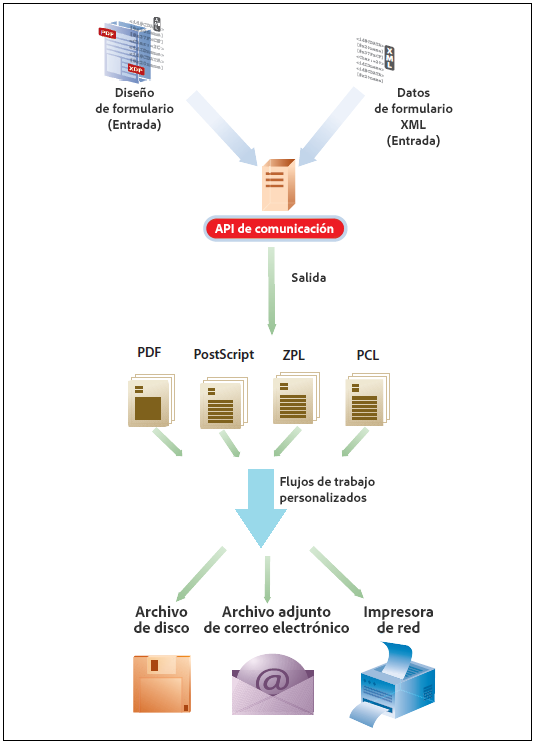
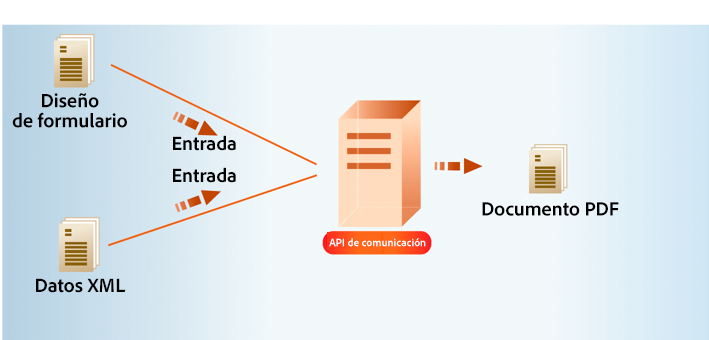
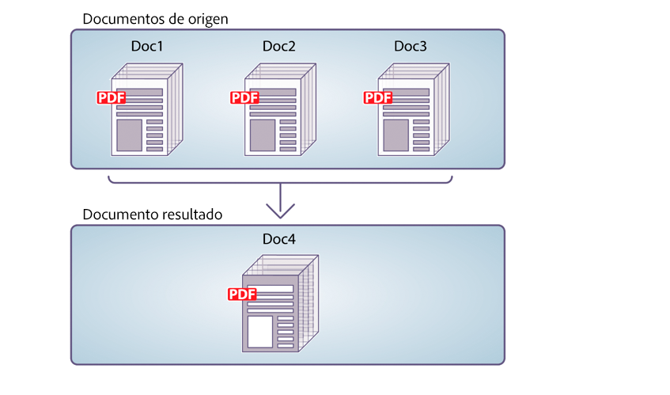
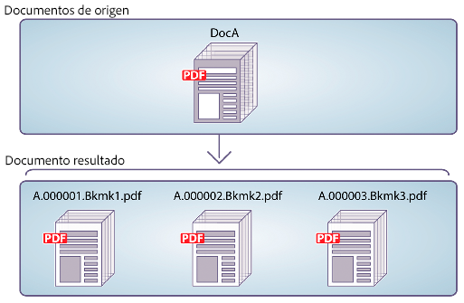
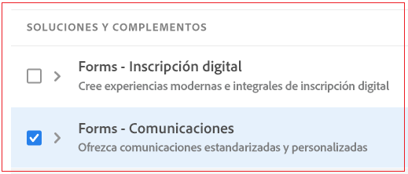
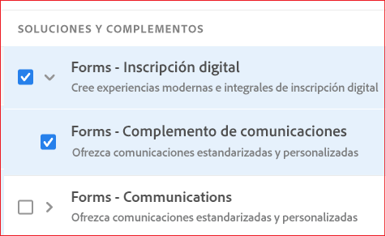

# API de comunicaciones de AEM Forms as a Cloud Service {#communications-apis-overview}

> **Disponibilidad de la versión**
>
> * **AEM 6.5**: [Información general de los servicios de documentos de AEM](https://experienceleague.adobe.com/docs/experience-manager-65/forms/use-document-services/overview-aem-document-services.html?lang=es)
> * **AEM as a Cloud Service**: este artículo

## Introducción

Las API de comunicaciones de AEM Forms as a Cloud Service le ayudan a crear documentos aprobados por la marca, personalizados y estandarizados para sus necesidades empresariales. Estas potentes API le permiten generar, manipular y proteger documentos mediante programación, ya sea bajo demanda o en procesos por lotes de gran volumen.

### Principales ventajas

* **Generación de documentos optimizada**: cree documentos personalizados combinando plantillas con los datos de clientes
* **Potente manipulación de documentos**: combine, reorganice y valide documentos PDF mediante programación
* **Opciones de implementación flexibles**: use las API bajo demanda para las necesidades de baja latencia o las API por lotes para operaciones de alto rendimiento
* **Seguridad mejorada**: aplique firmas digitales, certificación y cifrado para proteger documentos confidenciales
* **Arquitectura nativa en la nube**: aproveche la infraestructura en la nube escalable y segura sin sobrecarga de mantenimiento

## Resumen de las funcionalidades de las API

Las API de comunicaciones ofrecen un conjunto completo de funcionalidades de procesamiento de documentos organizadas en las siguientes áreas funcionales:

| Generación de documentos | Manipulación de documentos | Extracción de documentos | Conversión de documentos | Garantía de documentos |
|---------------------|----------------------|---------------------|---------------------|-------------------|
| Genere documentos personalizados combinando plantillas con datos en varios formatos, incluidos los formatos PDF y de impresión. | Combine, reorganice y valide documentos PDF mediante programación para crear nuevos paquetes de documentos. | Extraiga propiedades, metadatos y contenido de documentos PDF para un procesamiento posterior. | Convierta documentos entre formatos, incluida la validación de la conformidad con PDF/A para las necesidades de archivo. | Aplique firmas digitales, certificación y cifrado para asegurar y proteger documentos. |

La [documentación de referencia de la API](https://developer.adobe.com/experience-cloud/experience-manager-apis/api/experimental/document/) ofrece información detallada sobre todos los parámetros, métodos de autenticación y diversos servicios que ofrecen las API. La documentación de referencia de la API también está disponible en formato YAML. Puede descargar el archivo YAML y cargarlo en Postman para comprobar la funcionalidad de las API.

## Aplicabilidad y casos de uso

### Seguro

## ¿Puede AEM Forms generar documentos de póliza de seguro?

Sí. AEM Forms puede generar documentos relacionados con directivas mediante plantillas y datos estructurados capturados mediante formularios.

## ¿AEM Forms puede gestionar operaciones de seguro a escala?

Sí. Cuando se implementa mediante arquitecturas recomendadas en Adobe Managed Services o en la nube privada, AEM Forms admite envíos de formularios de gran volumen y cargas de trabajo a escala empresarial.

## Generación de documentos

Las API de generación de documentos de comunicaciones combinan una plantilla (XFA o PDF) con datos de clientes (XML) para generar documentos en formatos PDF, AFP (Advanced Function Presentation) y de impresión, como PS, PCL, DPL, IPL y ZPL. Estas API utilizan plantillas PDF y XFA con [datos XML](communications-known-issues-limitations.md#form-data) para generar un solo documento bajo demanda o varios documentos usando un trabajo por lotes.

Normalmente, crea una plantilla mediante [Designer](use-forms-designer.md) y utiliza las API de comunicaciones para combinar los datos con la plantilla. Su aplicación puede enviar el documento de salida a una impresora de red, una impresora local o a un sistema de almacenamiento para su archivo. Los flujos de trabajo personalizados y típicos listos para usarse tienen el siguiente aspecto:

En función del caso de uso, también puede hacer que estos documentos estén disponibles para su descarga mediante su sitio web o un servidor de almacenamiento.

### Principales funcionalidades de la generación de documentos

#### Crear documentos en formatos electrónicos PDF/AFP

Puede utilizar las API de generación de documentos para crear un documento con los formatos PDF o AFP que se basa en un diseño de formulario y datos de formulario XML. El resultado es un documento no interactivo. Es decir, los usuarios no pueden introducir ni modificar los datos del formulario. Un flujo de trabajo básico es combinar los datos del formulario XML con un diseño de formulario para crear un documento. La siguiente ilustración muestra la combinación de un diseño de formulario y datos del formulario XML para producir un documento PDF.

Figura: flujo de trabajo típico para crear un documento

En la siguiente tabla se muestra la diferencia entre los formatos AFP y PDF:

| **Función** | **AFP (Advanced Function Presentation)** | **PDF (Portable Document Format)** |
|---------------------------|--------------------------------------------------------------------|-------------------------------------------------------------|
| **Propósito** | Impresión y producción de gran volumen de documentos transaccionales | Uso compartido y visualización de documentos de uso general |
| **Caso práctico** | Extractos bancarios, facturas, facturas, documentos de seguros | Libros electrónicos, formularios, informes, currículos, manuales |
| **Origen de plataforma** | Desarrollado por IBM | Desarrollado por Adobe |
| **Estructura** | Formato orientado a páginas con campos y objetos estructurados | Orientado a páginas pero con diseño fijo |
| **Editabilidad** | Diseñado para la impresión en producción y que rara vez se edita | Se puede editar con varias herramientas, como, por ejemplo, Adobe Acrobat |
| **Tamaño y rendimiento de archivo** | Optimizado para el rendimiento en entornos de impresión de alta velocidad | Puede ser más grande y estar menos optimizado para la salida masiva |
| **Interactividad** | Mínima a ninguna; páginas estáticas | Admite elementos interactivos como formularios, vínculos, JavaScript |
| **Control de salida** | Control preciso del diseño de las impresoras | Diseño visual optimizado para pantalla e impresión |
| **Fuentes y gráficos** | Utiliza referencias de fuentes y recursos; requiere que los procesadores interpreten | Incrusta fuentes e imágenes directamente en el archivo |

La API de generación de documentos devuelve el documento PDF o el documento AFP generado. Si lo desea, también puede cargar los PDF generados en el almacenamiento del blob de Azure.

 La carga de los PDF generados mediante la API de generación de documentos a la capacidad de Azure Blob Storage se encuentra en [Programa de adopción anticipada](/help/forms/early-access-ea-features.md). Puede enviar un correo electrónico a aem-forms-ea@adobe.com desde su ID de correo electrónico oficial para unirse al programa para primeros usuarios y solicitar acceso a esta funcionalidad. 

>
>
> Las API de generación de documentos incluyen extremos de generación de resultados sincrónicos y por lotes. Estas API admiten la autenticación de servidor a servidor mediante JWT o OAuth, según el extremo. Para obtener más información acerca de las API de generación de documentos, [haga clic aquí](/help/forms/aem-forms-communication-api-overview.md#document-generation-apis).

#### Crear un documento PostScript (PS), Printer Command Language (PCL), Zebra Printing Language (ZPL) {#create-PS-PCL-ZPL-documents}

Puede utilizar las API de generación de documentos para crear un documento PostScript (PS), Printer Command Language (PCL) y Zebra Printing Language (ZPL) basado en un documento PDF o diseño de formulario XDP. Estas API ayudan a combinar un diseño de formulario con datos de formulario para generar un documento. Puede guardar el documento en un archivo y desarrollar un proceso personalizado para enviarlo a una impresora.

#### Procesar datos por lotes para crear varios documentos {#processing-batch-data-to-create-multiple-documents}

Puede utilizar las API de generación de documentos para crear documentos independientes para cada registro dentro de una fuente de datos por lotes XML. Puede generar documentos en modo masivo y asincrónico. Puede configurar varios parámetros para la conversión y luego iniciar el proceso por lotes.

## Manipulación de documentos

Las API de manipulación de documentos de comunicaciones (transformación de documentos) ayudan a combinar y reorganizar documentos PDF. Normalmente, crea un DDX y lo envía a las API de manipulación de documentos para montar o reorganizar un documento. El [documento DDX](https://helpx.adobe.com/content/dam/help/en/experience-manager/forms-cloud-service/ddxRef.pdf) ofrece instrucciones sobre cómo utilizar los documentos de origen para producir un conjunto de documentos necesarios. La documentación de referencia DDX ofrece información detallada sobre todas las operaciones compatibles. 

>
>
> Las API de manipulación de documentos admiten la autenticación de servidor a servidor mediante JWT. Para obtener más información acerca de las API de manipulación de documentos, [haga clic aquí](/help/forms/aem-forms-communication-api-overview.md#document-manipulation-apis).

### Principales funcionalidades de la manipulación de documentos

#### Montar los documentos PDF

Puede utilizar las API de manipulación de documentos para montar dos o más documentos PDF o XDP en un único documento PDF o Portfolio PDF. A continuación se indican algunas formas de montar documentos PDF:

* Montar un documento PDF sencillo
* Crear un Portfolio PDF
* Montar documentos cifrados
* Montar documentos utilizando la numeración Bates
* Acoplar y montar documentos

Figura: Montar un documento PDF sencillo a partir de varios documentos PDF

#### Desmontar los documentos PDF

Puede utilizar las API de manipulación de documentos para desmontar un documento PDF. Las API pueden extraer páginas del documento de origen o dividir un documento fuente en base a marcadores. Normalmente, esta tarea resulta útil si el documento del PDF se creó originalmente a partir de numerosos documentos individuales, como una colección de declaraciones.

* Extraer páginas de un documento fuente
* Dividir un documento fuente basado en marcadores

Figura: Dividir un documento fuente basado en marcadores en varios documentos

>[!NOTE]
>
> AEM Forms ofrece una variedad de fuentes integradas que se integran perfectamente con los archivos de PDF. Para ver la lista de fuentes compatibles, [haga clic aquí](/help/forms/supported-out-of-the-box-fonts.md).

## Extracción de documentos

 La función de Extracción de documentos está incluida en el programa de primeros usuarios. Puede escribir a aem-forms-ea@adobe.com desde su ID de correo electrónico oficial para unirse al programa de primeros usuarios y solicitar acceso a esta funcionalidad. 

El servicio de extracción de documentos le permite obtener las propiedades de un documento PDF, como sus derechos de uso, las propiedades de PDF y los metadatos. Las funciones de extracción de documentos son:

* Obtiene las propiedades de un documento PDF, como si el PDF tuviera datos adjuntos, comentarios, su versión de Acrobat y mucho más.
* Extraer los derechos de uso habilitados en un documento PDF: los usuarios recuperan los derechos de uso habilitados o deshabilitados en un documento PDF para la extensibilidad de Adobe Acrobat Reader.
* Obtener información de metadatos presente en un documento PDF: los metadatos son información sobre el documento (a diferencia del contenido del documento, como texto y gráficos). Extensible Metadata Platform (XMP) de Adobe es un estándar para administrar metadatos de documentos. El servicio Utilidades de XMP puede recuperar metadatos de documentos PDF y exportar los metadatos de XMP a documentos PDF.

>
>
> Las API de extracción de documentos admiten la autenticación de servidor a servidor mediante OAuth. Para obtener más información sobre las API de extracción de documentos, [haga clic aquí](/help/forms/aem-forms-communication-api-overview.md#document-extraction-apis).
>

## Conversión de documentos

### Convertir y validar documentos compatibles con PDF/A

Las API de conversión de documentos de comunicaciones ayudan a convertir un documento PDF en PDF/A. Puede utilizar las API para convertir un documento PDF en un documento compatible con PDF/A, así como para determinar si un documento PDF es compatible con PDF/A. PDF/A es un formato de archivo elaborado para la conservación del contenido del documento a largo plazo. Las fuentes están incrustadas en el documento y el archivo no está comprimido. Como resultado, un documento PDF/A suele ser más grande que un documento PDF estándar. Además, un documento PDF/A no contiene contenido de audio y vídeo.  Los estándares de conformidad de PDF/A admitidos incluyen PDF/A-1a, 1b, 2a, 2b, 3a y 3b.

### Convertir PDF a XDP {#convert-pdf-to-xdp}

 La capacidad Convertir PDF a XDP se encuentra en el programa de primeros usuarios. Puede escribir a aem-forms-ea@adobe.com desde su ID de correo electrónico oficial para unirse al programa de primeros usuarios y solicitar acceso a esta funcionalidad. 

Convierte un documento PDF a un archivo XDP. Para que un documento PDF se convierta correctamente en un archivo XDP, el documento PDF debe contener un flujo XFA en el diccionario.

>
>
> Las API de conversión de documentos admiten la autenticación de servidor a servidor mediante OAuth. Para obtener más información acerca de las API de conversión de documentos, [haga clic aquí](/help/forms/aem-forms-communication-api-overview.md#document-conversion-apiss).

## Garantía de documentos {#doc-assurance}

El servicio DocAssurance incluye las API de firma y de cifrado:

### API de firmas

Las API de firmas permiten a su organización proteger la seguridad y la privacidad de los documentos de Adobe PDF que distribuye y recibe. <!--This service uses digital signatures and certification to ensure that only intended recipients can alter documents. --> Dado que las características de seguridad se aplican al propio documento, éste permanece seguro y controlado durante todo su ciclo de vida. Un documento permanece seguro más allá del cortafuegos mientras se descarga sin conexión y se envía nuevamente a su organización. Puede realizar las siguientes tareas mediante las API de firmas:

* Añada un campo de firma visible a un documento PDF.
* Añada un campo de firma invisible a un documento PDF.
* Firme el campo de firma especificado en un documento PDF.
* Certificar un documento PDF
* Quitar la firma del campo de firma especificado en un documento PDF
* Eliminar el campo de firma especificado de un documento PDF

 Las opciones que permiten quitar la firma del campo de firma especificado y eliminar el campo de firma especificado de un documento PDF están disponibles en el programa para usuarios pioneros. Puede enviar un correo electrónico a aem-forms-ea@adobe.com desde su ID oficial para unirse al programa de usuarios pioneros y solicitar acceso a esta funcionalidad. 

>
>
> Las API de Document Assurance admiten la autenticación de servidor a servidor mediante OAuth. Para obtener más información sobre las API de Document Assurance, [haga clic aquí](/help/forms/aem-forms-communication-api-overview.md#document-assurance-apis).

### Las API de cifrado

Las API de cifrado permiten cifrar y descifrar documentos. Cuando se cifra un documento, su contenido se vuelve ilegible. Un usuario autorizado puede descifrar el documento para obtener acceso a su contenido. Si un documento PDF está cifrado con una contraseña, el usuario debe escribir la contraseña de apertura para poder ver el documento en Adobe Reader o Adobe Acrobat. <!-- Likewise, if a PDF document is encrypted with a certificate, the user must decrypt the PDF document with the public key that corresponds to the certificate (private key) that was used to encrypt the PDF document.-->

Puede realizar estas tareas mediante las API de cifrado:

* Cifrar un documento PDF con una contraseña.
* Quitar el cifrado de contraseña de un documento PDF.
* Recupera el tipo de seguridad aplicada a un documento PDF.
* Devolver el tipo de seguridad aplicado a un documento PDF.

Tanto las API de firma como las de cifrado son [API sincrónicas](#types-of-communications-apis-types).

### Utilidades de documento {#doc-utility}

Las utilidades de documento con API sincrónicas ayudan a convertir los documentos entre los formatos de archivo PDF y XDP. Aplicar derechos de uso a un documento y extraer los derechos de uso habilitados de un documento. Consultar la información sobre un documento PDF. <!-- determines whether a PDF document contains comments or attachments and more, and use document transformation services for XMP utilities--> A continuación se proporcionan detalles de las API de derechos de uso:

#### API de derechos de uso (extensión de Reader)

 La capacidad de derechos de uso (extensión de Reader) está incluida en el programa para primeros usuarios. Puede escribir a aem-forms-ea@adobe.com desde su ID de correo electrónico oficial para unirse al programa de primeros usuarios y solicitar acceso a esta funcionalidad. 

La funcionalidad Derechos de uso permite a su organización compartir fácilmente documentos PDF interactivos, ampliando la funcionalidad de Adobe Reader con derechos de uso adicionales. El servicio funciona con Adobe Reader 7.0 o posterior y añade derechos de uso a un documento PDF. Esta acción activa funciones que normalmente no están disponibles cuando se abre un documento PDF con Adobe Reader, como añadir comentarios a un documento, rellenar formularios y guardar el documento.

Cuando se añaden los derechos de uso correspondientes a los documentos PDF, los destinatarios pueden realizar las siguientes actividades desde Adobe Reader:

* Completar documentos y formularios PDF en línea o sin conexión, lo que permite a los destinatarios guardar copias de forma local para sus registros y mantener intacta la información añadida.
* Guardar los documentos PDF en un disco duro local para conservar el documento original y los comentarios, datos o archivos adjuntos adicionales;
* Adjuntar archivos y clips de medios a documentos PDF.
* Firmar, certificar y autenticar documentos PDF mediante la aplicación de firmas digitales con tecnologías de infraestructura de clave pública (PKI) conformes con los estándares del sector;
* Enviar documentos PDF completados o anotados electrónicamente.
* Utilizar documentos y formularios PDF como un front-end de desarrollo intuitivo para bases de datos y servicios web internos.
* compartir documentos PDF con terceros para que los revisores puedan agregar comentarios mediante herramientas de marcado intuitivas. Entre estas herramientas se incluyen las notas adhesivas electrónicas, los sellos, los resaltados y el tachado de texto. Estas funciones también están disponibles en Acrobat;
* Admitir la descodificación de formularios con códigos de barras.

Estas funciones de uso especiales se activan automáticamente al abrir un documento PDF con los derechos habilitados en Adobe Reader. Cuando el usuario ha terminado de trabajar con un documento con los derechos habilitados, esas funciones vuelven a deshabilitarse en Adobe Reader. Permanecen deshabilitados hasta que el usuario recibe otro documento PDF con los derechos habilitados.

#### Habilitar o deshabilitar los derechos de uso

Las distintas funciones de derechos de uso para ampliar los servicios de Reader PDF son:

* **Descodificación de códigos de barras**: descodificar códigos de barras dentro del documento PDF.

* **Comentarios**: realizar comentarios sin conexión en el documento PDF.

* **Comentarios en línea**: realizar comentarios en línea en el documento PDF.

* **Firma digital**: añadir firmas digitales a un documento PDF.

* **Campos de formulario dinámico**: añadir campos de formulario a un documento PDF.

* **Páginas de formulario dinámico**: añadir páginas de formulario a un documento PDF.

* **Archivos incrustados**: incrustar archivos en un documento PDF.

* **Importación de datos de formulario**: importar datos de formulario a un documento PDF.

* **Exportación de datos de formulario**: importar datos de formulario a un documento PDF.

* **Cumplimentación de formulario**: rellenar campos de formulario dentro de un documento PDF.

* **Formularios en línea**: acceder a un servicio web o a una base de datos desde un documento PDF.

* **Enviar independiente**: enviar datos de formulario sin conexión desde un documento PDF.

#### Otras funciones

* **Mensaje**: mensaje que se muestra en Adobe Acrobat Reader al abrir un documento PDF con uno o más derechos de uso aplicados.
* **Desbloquear contraseña**: la contraseña necesaria para abrir un documento PDF cifrado. Normalmente, es la contraseña de apertura del documento, pero si el documento de PDF está protegido además por una contraseña de permisos, puede utilizar cualquiera de ellas para abrirlo.

## Tipos de API de comunicaciones {#types}

Las comunicaciones ofrecen API HTTP para la generación de documentos por lotes y bajo demanda:

* **[Las API sincrónicas](https://developer.adobe.com/experience-manager-forms-cloud-service-developer-reference/)** son adecuadas para casos de uso de generación de documentos bajo demanda, con baja latencia y de registro único. Estas API son más adecuadas para casos de uso basados en las acciones del usuario. Por ejemplo, generar un documento después de que un usuario termine de rellenar un formulario.

* **[Las API por lotes (API asíncronas)](https://developer.adobe.com/experience-manager-forms-cloud-service-developer-reference/)** son adecuadas para escenarios planificados, de alto rendimiento y de generación de múltiples documentos. Estas API generan documentos por lotes. Por ejemplo, facturas telefónicas, extractos de tarjetas de crédito y declaraciones de beneficios se generan cada mes.

## Incorporación

La funcionalidad de comunicaciones está disponible como módulo independiente y complementario para los usuarios de Forms as a Cloud Service. Póngase en contacto con el equipo de ventas de Adobe o con su representante de Adobe para solicitar acceso. Adobe posibilita el acceso a su organización y otorga los pertinentes privilegios a las personas de su organización designadas como administradores. El administrador puede conceder acceso a los desarrolladores de Forms as a Cloud Service (usuarios) de su organización para que utilicen las API.

Después de la incorporación, para habilitar la capacidad de comunicaciones para su entorno de Forms as a Cloud Service:

1. Inicie sesión en Cloud Manager y abra su instancia de AEM Forms as a Cloud Service.

1. Abra la opción Editar programa, vaya a la pestaña Soluciones y complementos y seleccione la opción **[!UICONTROL Formularios: comunicaciones]**.

   

   Si ya ha habilitado la opción **[!UICONTROL Formularios: inscripción digital]**, a continuación, seleccione **[!UICONTROL Formularios: complemento de comunicaciones]**.

   

1. Haga clic en **[!UICONTROL Actualizar]**.

1. Ejecute la canalización de la versión. Una vez que la canalización de la versión se haya realizado correctamente, las API de comunicaciones se habilitan para su entorno.

>[!NOTE]
>
> Para habilitar y configurar las API de manipulación de documentos, agregue la siguiente regla a la [Configuración de Dispatcher](setup-local-development-environment.md#forms-specific-rules-to-dispatcher):
>
> `# Allow Forms Doc Generation requests`
> `/0062 { /type "allow" /method "POST" /url "/adobe/forms/assembler/*" }`

>[!MORELIKETHIS]
>
>* [Introducción a Comunicaciones de AEM Forms as a Cloud Service](/help/forms/aem-forms-cloud-service-communications-introduction.md)
>* [Arquitectura de AEM Forms as a Cloud Service para Formularios adaptables y API de comunicaciones](/help/forms/aem-forms-cloud-service-architecture.md)
>* [Procesamiento de comunicaciones: API sincrónicas](/help/forms/aem-forms-cloud-service-communications.md)
>* [Procesamiento de comunicaciones: API por lotes](/help/forms/aem-forms-cloud-service-communications-batch-processing.md)
>* [API de comunicaciones Forms - Tutorial](/help/forms/aem-forms-cloud-service-communications-on-demand-processing.md)
>* [Documentación de referencia de API](https://developer.adobe.com/experience-cloud/experience-manager-apis/api/experimental/document/)
>* [Características del programa de adopción anticipada](/help/forms/early-access-ea-features.md)
