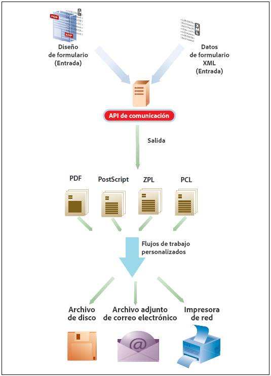
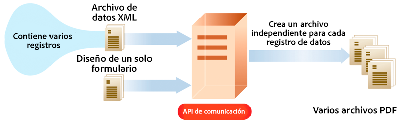

# Usar las API de comunicaciones as a Cloud Service de AEM Forms {#frequently-asked-questions}

**La función Comunicaciones está en versión beta.**

Las API de comunicaciones le ayudan a combinar plantillas XDP, documentos PDF basados en XDP y Acrobat Forms (AcroForm) con datos XML para generar documentos de impresión en varios formatos y le permiten crear aplicaciones que le permitan:

- Genere documentos rellenando archivos de plantilla con datos XML.

- Genere formularios en varios formatos, incluidas las secuencias de impresión de PDF no interactivas.

- Genere PDF de impresión a partir de PDF de formularios XFA.

- Genere documentos de PDF, PostScript, PCL y ZPL de forma masiva combinando varios conjuntos de datos con plantillas de origen.

Imagine un escenario en el que tiene una o más plantillas y varios registros de datos XML para cada plantilla. Puede utilizar las API de comunicaciones para generar un documento de impresión para cada registro. <!-- You can also combine the records into a single document. --> El resultado es un documento PDF no interactivo. Un documento PDF no interactivo no permite a los usuarios introducir datos en sus campos.

La variable [Documentación de referencia de API](https://documentcloud.adobe.com/link/track?uri=urn:aaid:scds:US:b1223732-ae0f-4921-bdc0-c31e48b56044) proporciona información detallada sobre todas las API, parámetros, métodos de autenticación y diversos servicios proporcionados por las API. La documentación de referencia de la API también está disponible en formato .yaml . Puede descargar el .yaml para [API por lotes](assets/batch-api.yaml) o [API no por lotes.yaml](assets/non-batch-api.yaml) y cárguelo en postman para comprobar la funcionalidad de las API.

>[!VIDEO](https://video.tv.adobe.com/v/335771)

Carga del archivo .yaml de API de comunicación a postman para comprobar la funcionalidad de las API.

>[!NOTE]
>
>Solo los miembros del grupo de usuarios de formularios pueden acceder a las API de comunicaciones.

## Habilitar las comunicaciones

Para habilitar las comunicaciones para su entorno as a Cloud Service de Forms:

1. Inicie sesión en Cloud Manager y abra la instancia as a Cloud Service de AEM Forms.

1. Abra la opción Editar programa , vaya a la pestaña Soluciones y complementos y seleccione la opción **[!UICONTROL Forms: comunicaciones]** .

   <!-- 

    If you have already enabled the **[!UICONTROL Forms - Digital Enrollment]** option, then select the **[!UICONTROL Forms - Communications Add-On]** option.  

    <!--  -->

1. Haga clic en **[!UICONTROL Actualizar]**.

1. Ejecute la canalización de compilación.

Una vez que la canalización de compilación se haya realizado correctamente, las API de comunicación se habilitan para su entorno.

## Uso de las API de comunicaciones {#workflows}

Normalmente, se crea una plantilla mediante [Designer](use-forms-designer.md) y utilice las API de comunicaciones para:

- Convierta estas plantillas a varios formatos, incluidos PDF, PostScript, ZPL y PCL.
- Combine datos de formulario XML con un diseño de formulario para generar un documento.
- Genere un documento sin combinar datos de formulario XML en el documento. Sin embargo, el flujo de trabajo principal es combinar datos en el documento.

A continuación, el documento de salida se almacena en un archivo. Puede diseñar flujos de trabajo personalizados para enviar el archivo a una impresora de red, una impresora local o a un sistema de almacenamiento para su archivo. Los flujos de trabajo personalizados y típicos de fuera de la caja tienen el siguiente aspecto:



### Creación de documentos de PDF {#create-pdf-documents}

Puede usar la variable _generatePDFOutput_ API para crear un documento de PDF basado en un diseño de formulario y datos de formulario XML. El resultado es un documento de PDF no interactivo. Es decir, los usuarios no pueden introducir ni modificar datos del formulario. Un flujo de trabajo básico es combinar datos de formulario XML con un diseño de formulario para crear un documento PDF. La siguiente ilustración muestra la combinación de un diseño de formulario y datos de formulario XML para producir un documento PDF.


### Crear documento PostScript (PS), Printer Command Language (PCL), Zebra Printing Language (ZPL) {#create-PS-PCL-ZPL-documents}

Puede utilizar las API de comunicaciones para crear un documento PostScript (PS), Printer Command Language (PCL) y Zebra Printing Language (ZPL) basado en un documento PDF o diseño de formulario XDP. La variable _generatePrintedOutput_ La API combina un diseño de formulario con datos de formulario para generar un documento. Puede guardar el documento en un archivo y desarrollar un proceso personalizado para enviarlo a una impresora.

<!-- ### Processing batch data to create multiple documents

Communications APIs can create separate documents for each record within an XML batch data source. The APIs can also create a single document that contains all records (this functionality is the default). Assume that an XML data source contains ten records and you instruct the APIs to create a separate document for each record (for example, PDF documents). As a result, the APIs generate ten PDF documents.

The following illustration also shows Communications APIs processing an XML data file that contains multiple records. However, assume that you instruct the APIs to create a single PDF document that contains all data records. In this situation, the APIs generate one document that contains all of the records.

The following illustration shows Communications APIs processing an XML data file that contains multiple records. Assume that you instruct the Communications APIs to create a separate PDF document for each data record. In this situation, the APIs generates a separate PDF document for each data record.

 -->

### Procesamiento de datos por lotes para crear varios documentos {#processing-batch-data-to-create-multiple-documents}

Puede crear documentos independientes para cada registro dentro de un origen de datos de lote XML. Puede generar documentos en modo masivo y asincrónico. Puede configurar varios parámetros para la conversión y luego iniciar el proceso por lotes. <!-- You can can also create a single document that contains all records (this functionality is the default).  Assume that an XML data source contains ten records and you have a requirement to create a separate document for each record (for example, PDF documents). You can use the Communication APIs to generate ten PDF documents. -->

<!-- The following illustration shows the Communication APIs processing an XML data file that contains multiple records. However, assume that you instruct the Communication APIs to create a single PDF document that contains all data records. In this situation, the Communication APIs generate one document that contains all of the records.


The following illustration shows the Communication APIs processing an XML data file that contains multiple records. Assume that you instruct the Communication APIs to create a separate PDF document for each data record. In this situation, the Communication APIs generates a separate PDF document for each data record.



For detailed information on using Batch APIs, see Communication APIs: Processing batch data to create multiple documents. -->

### Acoplar documentos PDF interactivos {#flatten-interactive-pdf-documents}

Puede utilizar las API de comunicaciones para transformar un documento PDF interactivo (por ejemplo, un formulario) en un documento PDF no interactivo. Un documento PDF interactivo permite a los usuarios introducir o modificar datos ubicados en los campos del documento PDF. El proceso de transformar un documento de PDF interactivo en un documento de PDF no interactivo se denomina aplanamiento. Cuando se aplana un documento PDF, un usuario no puede modificar los datos ubicados en los campos del documento. Una razón para acoplar un documento PDF es garantizar que no se puedan modificar los datos.

Puede acoplar los siguientes tipos de documentos PDF:

- Documentos de PDF interactivo creados en Designer (que contienen flujos XFA).

- PDF forms de Acrobat

Si intenta acoplar un documento PDF no interactivo, se producirá una excepción.

### Mantener estado del formulario {#retain-form-state}

Un documento PDF interactivo contiene varios elementos que constituyen un formulario. Estos elementos pueden incluir campos (para aceptar o mostrar datos), botones (para realizar sucesos de déclencheur) y secuencias de comandos (comandos para realizar una acción específica). Al hacer clic en un botón, puede generarse un déclencheur con un evento que cambia el estado de un campo. Por ejemplo, si se elige una opción de género, puede cambiar el color de un campo o el aspecto del formulario. Este es un ejemplo de un suceso manual que provoca que cambie el estado del formulario.

Cuando un documento PDF interactivo de este tipo se acopla con las API de comunicaciones, el estado del formulario no se conserva. Para asegurarse de que el estado del formulario se conserva incluso después de que se acopla, defina el valor booleano _keepFormState_ como True para guardar y conservar el estado del formulario.

### Consideraciones para las API de comunicaciones {#considerations-for-communications-apis}

#### Datos de formulario {#form-data}

Las API de comunicaciones aceptan un diseño de formulario que se suele crear en Designer y los datos de formulario XML como entrada. Para rellenar un documento con datos, debe existir un elemento XML en los datos del formulario XML para cada campo de formulario que desee rellenar. El nombre del elemento XML debe coincidir con el nombre del campo. Se ignora un elemento XML si no se corresponde con un campo de formulario o si el nombre del elemento XML no coincide con el nombre del campo. No es necesario coincidir con el orden en que se muestran los elementos XML. El factor importante es que los elementos XML se especifican con los valores correspondientes.

Consideremos el siguiente ejemplo de formulario de solicitud de préstamo:


Para combinar datos en este diseño de formulario, cree un origen de datos XML que corresponda al formulario. El siguiente XML representa un origen de datos XML que corresponde al formulario de aplicación hipotecaria de ejemplo.

```XML
<?xml version="1.0" encoding="UTF-8" ?>
- <xfa:datasets xmlns:xfa="http://www.xfa.org/schema/xfa-data/1.0/">
- <xfa:data>
- <data>
    - <Layer>
        <closeDate>1/26/2007</closeDate>
        <lastName>Johnson</lastName>
        <firstName>Jerry</firstName>
        <mailingAddress>JJohnson@NoMailServer.com</mailingAddress>
        <city>New York</city>
        <zipCode>00501</zipCode>
        <state>NY</state>
        <dateBirth>26/08/1973</dateBirth>
        <middleInitials>D</middleInitials>
        <socialSecurityNumber>(555) 555-5555</socialSecurityNumber>
        <phoneNumber>5555550000</phoneNumber>
    </Layer>
    - <Mortgage>
        <mortgageAmount>295000.00</mortgageAmount>
        <monthlyMortgagePayment>1724.54</monthlyMortgagePayment>
        <purchasePrice>300000</purchasePrice>
        <downPayment>5000</downPayment>
        <term>25</term>
        <interestRate>5.00</interestRate>
    </Mortgage>
</data>
</xfa:data>
</xfa:datasets>
```

#### Tipos de documentos compatibles {#supported-document-types}

Para acceder completamente a las funciones de renderización de las API de comunicaciones, se recomienda utilizar un archivo XDP como entrada. En algunos casos, se puede utilizar un archivo PDF. Sin embargo, el uso de un archivo PDF como entrada tiene las siguientes limitaciones:

- Un documento PDF que no contiene un flujo XFA no se puede representar como PostScript, PCL o ZPL. Las API de comunicaciones pueden procesar documentos PDF con flujos XFA (es decir, formularios creados en Designer) en formatos láser y de etiqueta. Si el documento del PDF está firmado, certificado o contiene derechos de uso (aplicados mediante el servicio AEM Forms Reader Extensions), no se puede procesar en estos formatos de impresión.

<!-- * Run-time options such as PDF version and tagged PDF are not supported for Acrobat forms. They are valid for PDF forms that contain XFA streams; however, these forms cannot be signed or certified. 

#### Email support {#email-support}

For email functionality, you can create a process in AEM Workflows that uses the Email Step. A workflow represents a business process that you are automating. -->

#### Áreas imprimibles {#printable-areas}

El margen no imprimible predeterminado de 0,25 pulgadas no es exacto para impresoras de etiquetas y varía de impresora a impresora y de tamaño de etiqueta a tamaño de etiqueta. Se recomienda mantener el margen de 0,25 pulgadas o reducirlo. Sin embargo, se recomienda no aumentar el margen no imprimible. De lo contrario, la información del área imprimible no se imprime correctamente.

Asegúrese siempre de utilizar el archivo XDC correcto para la impresora. Por ejemplo, evite elegir un archivo XDC para una impresora de 300 ppp y envíe el documento a una impresora de 200 ppp.

#### Scripts {#scripts}

Un diseño de formulario que se utiliza con las API de comunicaciones puede contener secuencias de comandos que se ejecutan en el servidor. Asegúrese de que el diseño de formulario no contenga secuencias de comandos que se ejecuten en el cliente. Para obtener información sobre la creación de secuencias de comandos de diseño de formulario, consulte la Ayuda de Designer.

<!-- #### Working with Fonts
 Document Considerations for Working with Fonts>> -->

#### Asignación de fuentes {#font-mapping}

Si una fuente está instalada en un equipo cliente, está disponible en la lista desplegable de Designer. Si la fuente no está instalada, es necesario especificar el nombre de la fuente manualmente. La opción &quot;Reemplazar permanentemente fuentes no disponibles&quot; de Designer puede estar desactivada. De lo contrario, cuando el archivo XDP se guarda en Designer, el nombre de la fuente de sustitución se escribe en el archivo XDP. Esto significa que no se utiliza la fuente residente en la impresora.

Para diseñar un formulario que utilice fuentes residentes en la impresora, elija un nombre de tipo de letra en Designer que coincida con las fuentes disponibles en la impresora. Una lista de fuentes compatibles con PCL o PostScript se encuentra en los perfiles de dispositivo correspondientes (archivos XDC). Alternativamente, se puede crear una asignación de fuentes para asignar fuentes no residentes en la impresora a fuentes residentes en la impresora con un nombre de tipo de letra diferente. Por ejemplo, en un escenario PostScript, las referencias a la fuente Arial® se pueden asignar a la fuente Helvetica® residente en la impresora.

Existen dos tipos de fuentes OpenType®. Un tipo es una fuente TrueType OpenType® compatible con PCL. El otro es CFF OpenType®. La salida de PDF y PostScript admite fuentes Type-1, TrueType y OpenType® incrustadas. La salida PCL admite fuentes TrueType incrustadas.

Las fuentes Type-1 y OpenType® no están incrustadas en la salida PCL. El contenido con formato Type-1 y OpenType® se rasteriza y genera como imagen de mapa de bits que puede ser grande y lento de generar.

Las fuentes descargadas o incrustadas se sustituyen automáticamente al generar salida PostScript, PCL o PDF. Esto significa que en la salida generada solo se incluye el subconjunto de los glifos de fuente necesarios para procesar correctamente el documento generado.

#### Uso de archivos de perfil de dispositivo (archivo XDC) {#working-with-xdc-files}

Un perfil de dispositivo (archivo XDC) es un archivo de descripción de impresora en formato XML. Este archivo permite que las API de comunicaciones emitan documentos como formatos de impresora láser o de etiquetas. Las API de comunicaciones utilizan los archivos XDC, incluidos los siguientes:

- hppcl5c.xdc

- hppcl5e.xdc

- ps_plain_level3.xdc

- ps_plain.xdc

- zpl300.xdc

- zpl600.xdc

- zpl300.xdc

- ipl300.xdc

- ipl400.xdc

- tpcl600.xdc

- dpl300.xdc

- dpl406.xdc

- dpl600.xdc

No es necesario modificar estos archivos para crear documentos. Sin embargo, puede modificarlas para satisfacer los requisitos empresariales.

Estos archivos son archivos XDC de muestra que admiten las características de impresoras específicas, como fuentes residentes, bandejas de papel y grapadora. El propósito de estos ejemplos es ayudarle a comprender cómo configurar sus propias impresoras mediante perfiles de dispositivo. Las muestras son también un punto de partida para impresoras similares en la misma línea de productos.

#### Uso del archivo de configuración XCI {#working-with-xci-files}

Las API de comunicaciones utilizan un archivo de configuración XCI para realizar tareas, como controlar si la salida es un solo panel o una paginación. Aunque este archivo contiene opciones que se pueden configurar, no es habitual modificar este valor. <!-- The default.xci file is located in the svcdata\XMLFormService folder. -->

Puede pasar un archivo XCI modificado mientras utiliza una API de comunicaciones. Al hacerlo, cree una copia del archivo predeterminado, cambie solo los valores que requieran modificación para satisfacer los requisitos comerciales y utilice el archivo XCI modificado.

Las API de comunicaciones empiezan con el archivo XCI predeterminado (o el archivo modificado). A continuación, aplica los valores especificados mediante las API de comunicaciones. Estos valores anulan la configuración de XCI.

La siguiente tabla especifica las opciones XCI.

| Opción XCI | Descripción |
| ------------------------------------- | ----------------------------------------------------------------------------------------------------------------------------------------------------------------------------------------------------------------------------------------------------------------------------------------------------------------------------------------------------------------------------------------------------------------------------------------------------------------------------------------------------------- |
| config/actual/pdf/creator | Identifica al creador del documento mediante la entrada Creador del diccionario de información del documento. Para obtener información sobre este diccionario, consulte la guía de referencia del PDF. |
| config/actual/pdf/production | Identifica al productor del documento mediante la entrada Producer del diccionario de información del documento. Para obtener información sobre este diccionario, consulte la guía de referencia del PDF. |
| config/current/layout | Controla si la salida es un solo panel o paginado. |
| config/current/pdf/compression/level | Especifica el grado de compresión que se utilizará al generar un documento de PDF. |
| config/current/pdf/scriptModel | Controla si la información específica de XFA se incluye en el documento del PDF de salida. |
| config/current/common/data/adaptData | Controla si la aplicación XFA ajusta los datos después de la combinación. |
| config/actual/pdf/renderPolicy | Controla si la generación del contenido de la página se realiza en el servidor o se diferye al cliente. |
| config/current/common/locale | Especifica la configuración regional predeterminada utilizada en el documento de salida. |
| config/current/destination | Cuando está contenido en un elemento presente, especifica el formato de salida. Cuando está contenido en un elemento openAction, especifica la acción que se debe realizar al abrir el documento en un cliente interactivo. |
| config/current/output/type | Especifica el tipo de compresión que se aplicará a un archivo o el tipo de salida que se producirá. |
| config/current/common/temp/uri | Especifica el URI del formulario. |
| config/current/common/template/base | Proporciona una ubicación base para URIs en el diseño de formulario. Cuando este elemento está ausente o vacío, se utiliza como base la ubicación del diseño de formulario. |
| config/current/common/log/to | Controla la ubicación en la que se escriben los datos de registro o los datos de salida. |
| config/current/output/to | Controla la ubicación en la que se escriben los datos de registro o los datos de salida. |
| config/current/script/currentPage | Especifica la página inicial cuando se abre el documento. |
| config/current/script/exclude | Notifica a las API de servidor/comunicaciones de AEM Forms qué eventos se deben ignorar. |
| config/actual/pdf/linearized | Controla si el documento del PDF de salida está linealizado. |
| config/current/script/runScripts | Controla qué conjunto de secuencias de comandos se ejecuta AEM Forms. |
| config/actual/pdf/tagged | Controla la inclusión de etiquetas en el documento del PDF de salida. Las etiquetas, en el contexto del PDF, son información adicional incluida en un documento para exponer la estructura lógica del documento. Las etiquetas ayudan a facilitar la accesibilidad y a cambiar el formato. Por ejemplo, un número de página puede etiquetarse como un artefacto para que un lector de pantalla no lo enuncie en medio del texto. Aunque las etiquetas hacen que un documento sea más útil, también aumentan el tamaño del documento y el tiempo de procesamiento para crearlo. |
| config/actual/pdf/version | Especifica la versión del documento de PDF que se va a generar. |

### Problemas conocidos

- Asegúrese de que el tamaño de la plantilla y los archivos de configuración XCI sea mayor que 16 KB.

- Asegúrese de que el archivo xml de datos no contenga el encabezado de declaración XML. Por ejemplo, `<?xml version="1.0" encoding="UTF-8"?>`

- Para una configuración por lotes, solo una instancia de combinación de valores de OutputType(PDF, PRINT) y RenderType(PostScript, PCL, IPL, ZPL, etc.) está permitido.

- No modifique la configuración USC de la fuente de datos/configuración de la nube de Azure que se utiliza en una configuración por lotes mientras se ejecuta el lote. Incluso después de la ejecución, si se requiere alguna actualización, cree una copia de la configuración en lugar de actualizar la utilizada en una configuración por lotes existente.

### Prácticas recomendadas  

- Adobe recomienda alojar los archivos de datos en el almacén de contenedores de blob en la región de la nube utilizada por AEM Cloud Service.

<!-- Using API

 There are two main Communications APIs. The _generatePDFOutput_ generates PDFs, while the _generatePrintedOutput_ generates PostScript, ZPL, and PCL formats. These APIs are available as HTTP endpoints on your environment, both on author and publish instances. Since the publish instances are configured to scale faster than the author instances, it is recommended use these APIs via publish instances.

The first parameter of both the operations accept the path and name of the template file (for example ExpenseClaim.xdp). You can specify a fully qualified path, reference path of your AEM Repository, or path of a binary file. The second parameter accepts an XML document that is merged with the template while generating the output document. -->


