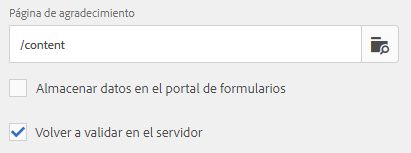
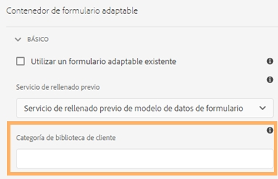

# Acciones de envío compatibles con los formularios adaptables

Los formularios adaptables le permiten crear formularios atractivos, interactivos, dinámicos y adaptables. Ofrecen una interfaz de usuario intuitiva y un conjunto completo de componentes predeterminados para diseñar y administrar formularios adaptables de forma eficiente. Puede configurar varias acciones de envío para enviar datos de formulario a servicios como OneDrive, SharePoint, Workfront Fusion y más.

Se activa una acción de envío cuando un usuario hace clic en el botón **[!UICONTROL Enviar]** en un formulario adaptable. Forms as a Cloud Service proporciona varias acciones de envío listas para usar. Las acciones de envío integradas le permiten lo siguiente:

* Enviar datos de formulario por correo electrónico sin esfuerzo.
* Iniciar flujos de Microsoft® Power Automate o flujos de trabajo de AEM al transmitir los datos.
* Transmitir directamente los datos del formulario al servidor de Microsoft® SharePoint, a Microsoft Azure Blob Storage o a Microsoft® OneDrive.
* Enviar los datos sin problemas a una fuente de datos configurada mediante el modelo de datos de formulario (FDM).
* Enviar cómodamente los datos a un punto final REST.

## Acciones de envío compatibles con los formularios adaptables

Los formularios de AEM ofrecen las siguientes acciones de envío listas para usar:

* [Enviar correo electrónico](/help/forms/configure-submit-action-send-email.md)
* [Invocar un flujo de Power Automate](/help/forms/forms-microsoft-power-automate-integration.md)
* [Enviar a SharePoint](/help/forms/configure-submit-action-sharepoint.md)
* [Invocar un Workfront Fusion](/help/forms/submit-adaptive-form-to-workfront-fusion.md)
* [Enviar mediante el modelo de datos de formulario (FDM)](/help/forms/using-form-data-model.md)
* [Enviar a Azure Blob Storage](/help/forms/configure-submit-action-azure-blob-storage.md)
* [Enviar al punto final REST](/help/forms/configure-submit-action-restpoint.md)
* [Enviar a OneDrive](/help/forms/configure-submit-action-onedrive.md)
* [Invocar un flujo de trabajo de AEM](/help/forms/configure-submit-action-workflow.md)
* [Enviar a Marketo Engage](/help/forms/submit-adaptive-form-to-marketo-engage.md)
* [Enviar a Adobe Experience Platform (AEP)](/help/forms/aem-forms-aep-connector.md)
* [Enviar a hoja de cálculo](/help/forms/forms-submission-service.md)

También puede enviar un formulario adaptable a otras configuraciones de almacenamiento:

* [Conectar un formulario adaptable a la aplicación de Salesforce](/help/forms/aem-forms-salesforce-integration.md)
* [Conexión de un formulario adaptable a Microsoft](/help/forms/ms-dynamics-odata-configuration.md)

## Compatibilidad con acciones de envío entre tipos de creación

La siguiente tabla muestra qué acciones de envío son compatibles en función del método de creación de formularios utilizado en AEM Forms:

| Acción de envío | [Componentes de base](/help/forms/configuring-submit-actions.md) | [Componentes principales](/help/forms/configure-submit-actions-core-components.md) | [Editor universal](/help/forms/configure-submit-action-eds-forms.md#submit-actions-supported-by-adaptive-forms-created-in-universal-editor) | [Formularios basados en documentos](/help/forms/configure-submit-action-eds-forms.md#supported-submit-actions-for-document-based-forms) |
|----------------------------|------------------------|------------------|------------------|------------------------|
| Enviar un correo electrónico | ✅ Compatible | ✅ Compatible | ✅ Compatible |                        |
| Flujo de Power Automate | ✅ Compatible | ✅ Compatible | ✅ Compatible |                        |
| Enviar a SharePoint | ✅ Compatible | ✅ Compatible | ✅ Compatible |                        |
| Workfront Fusion | ✅ Compatible | ✅ Compatible | ✅ Compatible |                        |
| Enviar mediante FDM | ✅ Compatible | ✅ Compatible | ✅ Compatible |                        |
| Enviar a AEP | ✅ Compatible | ✅ Compatible | ✅ Compatible |                        |
| Azure Blob Storage | ✅ Compatible | ✅ Compatible | ✅ Compatible |                        |
| Enviar al punto final REST | ✅ Compatible | ✅ Compatible | ✅ Compatible |                        |
| Enviar a Marketo Engage | ✅ Compatible | ✅ Compatible | ✅ Compatible |                        |
| Enviar a OneDrive | ✅ Compatible | ✅ Compatible | ✅ Compatible |                        |
| Invocar el flujo de trabajo de AEM | ✅ Compatible | ✅ Compatible | ✅ Compatible |                        |
| Enviar a hoja de cálculo |                        |                  | ✅ Compatible | ✅ Compatible |

## Revalidación del lado del servidor en formularios adaptables

Normalmente, en cualquier sistema de captura de datos en línea, los desarrolladores colocan algunas validaciones de JavaScript en el lado del cliente para aplicar algunas reglas empresariales. Sin embargo, en los exploradores modernos, los usuarios finales tienen la forma de evitar esas validaciones y realizar envíos manualmente mediante diversas técnicas, como la consola de desarrolladores del explorador web. Estas técnicas también son válidas para los formularios adaptables. Un desarrollador de formularios puede crear varias lógicas de validación, pero técnicamente, los usuarios finales pueden omitir esas lógicas de validación y enviar datos no válidos al servidor. Los datos no válidos romperían las reglas empresariales que ha impuesto un autor de formularios.

La característica de revalidación del lado del servidor permite ejecutar también las validaciones que ha proporcionado un autor de formularios adaptables al diseñar un formulario adaptable en el servidor. Evita cualquier posible compromiso en el envíos de datos y violaciones de reglas empresariales representadas en términos de validaciones de formularios.

### ¿Qué se debe validar en el servidor?

Todas las validaciones de campo listas para usar (OOTB) de un formulario adaptable que se vuelven a ejecutar en el servidor son las siguientes:

* Necesario
* Cláusula de imagen de validación
* Expresión de validación

Utilice **[!UICONTROL Revalidar en el servidor]** en el contenedor de formularios adaptables en la barra lateral para habilitar o deshabilitar la validación del lado del servidor para el formulario actual.

**Habilitar la validación del lado del servidor**

Si el usuario final omite esas validaciones y envía los formularios, el servidor volverá a realizar la validación. Si la validación falla al final del servidor, se detendrá la transacción del envío. Al usuario se le presenta el formulario original nuevamente. Los datos capturados y enviados se presentarán al usuario como un error.

>[!NOTE]
>
>La validación del lado del servidor valida el modelo de formulario. Se recomienda crear una biblioteca de cliente independiente para las validaciones y no mezclarla con otras cosas como el estilo del HTML y la manipulación DOM en la misma biblioteca de cliente.

<!--### Supporting Custom functions in Validation Expressions {#supporting-custom-functions-in-validation-expressions-br}

At times, if there are **complex validation rules**, the exact validation script reside in custom functions and author calls these custom functions from field validation expression. To make this custom function library known and available while performing server-side validations, the form author can configure the name of AEM client library under the **[!UICONTROL Basic]** tab of Adaptive Form Container properties as shown below.

Supporting Custom functions in Validation Expressions

Author can configure customJavaScript library per Adaptive Form. In the library, only keep the reusable functions, which have dependency on jquery and underscore.js third-party libraries.

Refer to the following articles to learn how to create custom functions for:

* [Adaptive Forms based on Foundation Components](/help/forms/rule-editor.md#custom-functions-in-rule-editor)
* [Adaptive Forms based on Core Components](/help/forms/create-and-use-custom-functions.md)
* [Adaptive Forms authored using Document-Based Authoring](/help/edge/docs/forms/rules-forms.md#create-a-custom-function)
* [Adaptive Forms created using the Universal Editor](/help/edge/docs/forms/universal-editor/rule-editor-universal-editor.md#create-a-custom-function)

## Error handling on Submit Action {#error-handling-on-submit-action}

As a part of AEM security and hardening guidelines, configure custom error pages such as 400.jsp, 404.jsp, and 500.jsp. These handlers are called, when on submitting a form 400, 404, or 500 errors appear. The handlers are also called when these error codes are triggered on the Publish node. You can also create JSP pages for other HTTP error codes.

When you prefill a form data model (FDM), or schema based Adaptive Form with XML or JSON data complaint to a schema that is data does not contain `<afData>`, `<afBoundData>`, and `</afUnboundData>` tags, then the data of unbounded fields of the Adaptive Form is lost. The schema can be an XML schema, JSON schema, or a Form Data Model (FDM). Unbounded fields are Adaptive Form fields without the `bindref` property.-->

## Ver también

{{af-submit-action}}
