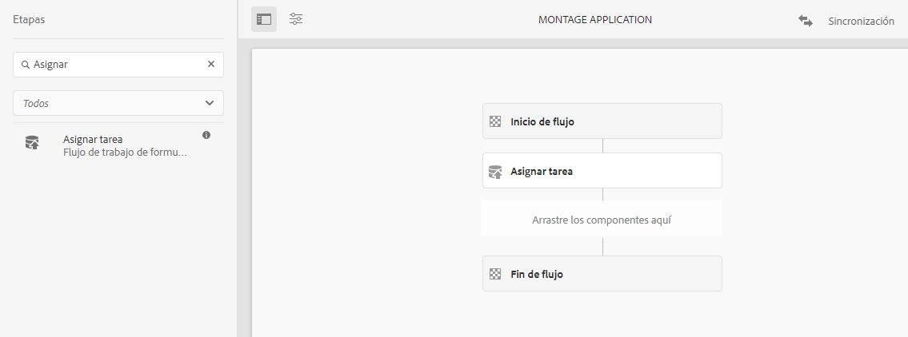
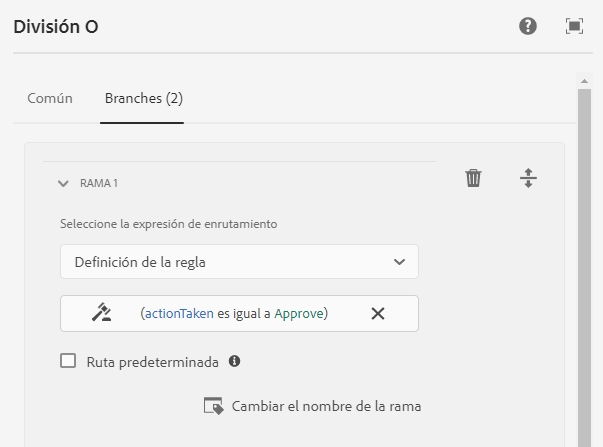
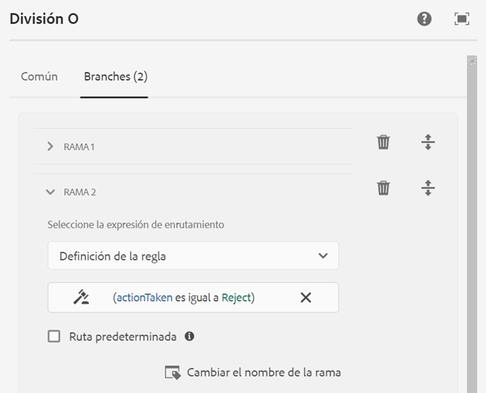
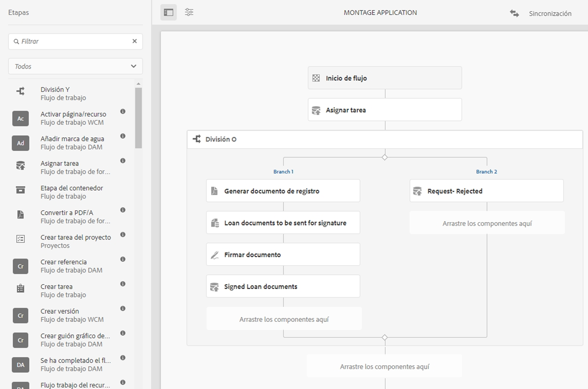

# Flujo de trabajo centrado en Forms en OSGi {#forms-centric-workflow-on-osgi}

Las empresas recopilan datos de cientos y miles de formularios, varios sistemas back-end y fuentes de datos en línea o sin conexión. También tienen un conjunto dinámico de usuarios para tomar decisiones sobre los datos, lo que implica procesos de revisión y aprobación iterativos.

Junto con los flujos de trabajo de revisión y aprobación para audiencias internas y externas, las organizaciones y empresas grandes tienen tareas repetitivas. Por ejemplo, convertir un documento PDF a otro formato. Cuando se realizan manualmente, estas tareas consumen mucho tiempo y recursos. Las empresas también tienen requisitos legales para firmar digitalmente un documento y archivar datos de formulario para su uso posterior en formatos predefinidos.

## Introducción al flujo de trabajo centrado en Forms en OSGi {#introduction-to-forms-centric-workflow-on-osgi}

Puede utilizar flujos de trabajo de AEM para crear rápidamente flujos de trabajo adaptables basados en Forms. Estos flujos de trabajo se pueden utilizar para revisiones y aprobaciones, flujos de procesos empresariales, para iniciar servicios de documento, integrarse con el flujo de trabajo de firmas de Adobe Sign y operaciones similares. Por ejemplo, en el procesamiento de la solicitud de tarjeta de crédito, el empleado deja los flujos de trabajo de aprobación y guarda un formulario como documento de PDF. Además, estos flujos de trabajo se pueden utilizar dentro de una organización o entre firewall de redes.

Con el flujo de trabajo centrado en formularios en OSGi, puede generar e implementar rápidamente flujos de trabajo para diversas tareas en la pila OSGi, sin tener que instalar la funcionalidad de administración de procesos completa en la pila JEE. El desarrollo y la administración de flujos de trabajo utilizan las funciones conocidas de los flujo de trabajo de AEM y la bandeja de entrada AEM. Los flujos de trabajo forman la base de la automatización de los procesos empresariales en el mundo real que abarcan varios sistemas de software, redes, departamentos e incluso organizaciones.

Una vez configurados, estos flujos de trabajo se pueden activar manualmente para completar un proceso definido o ejecutarse programáticamente cuando los usuarios envíen un formulario <!-- or [correspondence management](cm-overview.md) letter-->. <!-- With this enhanced AEM Workflow capabilities, [!DNL AEM Forms] offers two distinct, yet similar, capabilities. As part of your deployment strategy, you need to decide which one works for you. See a [comparison](capabilities-osgi-jee-workflows.md) of the Forms-centric AEM Workflows on OSGi and Process Management on JEE. Moreover, for the deployment topology see, [Architecture and deployment topologies for [!DNL AEM Forms]]((aem-forms-architecture-deployment.md). -->

El flujo de trabajo centrado en Forms en OSGi amplía [la bandeja de entrada AEM](https://experienceleague.adobe.com/docs/experience-manager-cloud-service/sites/authoring/getting-started/inbox.html?lang=es#authoring) y proporciona componentes adicionales (pasos) para el editor de flujos de trabajo de AEM para agregar compatibilidad con flujos de trabajo centrados en [!DNL AEM Forms]. <!-- The extended AEM Inbox has functionalities similar to [[!DNL AEM Forms] Workspace](introduction-html-workspace.md). Along with managing human-centric workflows (Approval, Review, and so on), you can use AEM workflows to automate [document services](https://experienceleague.adobe.com/docs/experience-manager-65/developing/extending-aem/extending-workflows/workflows-step-ref.html?lang=es#extending-aem)-related operations (for example, Generate PDF) and electronically signing (Adobe Sign) documents. -->

Todos [!DNL AEM Forms] los pasos del flujo de trabajo admiten el uso de variables. Las variables permiten realizar pasos en el flujo de trabajo para mantener y pasar metadatos por varios pasos durante la ejecución. Puede crear diferentes tipos de variables para almacenar diferentes tipos de datos. También puede crear colecciones de variables (matriz) para almacenar varias instancias de datos relacionados y del mismo tipo. Normalmente, se utiliza una variable o una colección de variables cuando se necesita tomar una decisión en base al valor que mantiene o para almacenar información que se necesite más adelante en un proceso. Para obtener más información sobre el uso de variables en estos componentes (pasos) del flujo de trabajo centrados en Forms, consulte [Flujo de trabajo centrado en Forms en OSGi: pasos de referencia](aem-forms-workflow-step-reference.md). Para obtener información sobre la creación y la administración de variables, consulte [Variables en flujos de trabajo de AEM](variable-in-aem-workflows.md).

En el siguiente diagrama se describe el procedimiento de extremo a extremo para crear, ejecutar y monitorizar un flujo de trabajo centrado en Forms en OSGi.

## Antes de comenzar {#before-you-start}

* Un flujo de trabajo es una representación de un proceso empresarial real. Tenga preparados su proceso empresarial real y la lista de los participantes del proceso. Además, prepare el material colateral (formularios adaptables, documentos PDF, etc.) antes de empezar a crear un flujo de trabajo.
* Un flujo de trabajo puede tener varias fases. Estas fases se muestran en la bandeja de entrada AEM y ayudan a informar sobre el progreso del flujo de trabajo. Divida el proceso empresarial en fases lógicas.
* Puede configurar el paso Asignar tarea del flujo de trabajo de AEM para enviar notificaciones por correo electrónico a los usuarios o a los usuarios asignados. [habilita las notificaciones por correo electrónico](#configure-email-service).
* Un flujo de trabajo también puede utilizar Adobe Sign para las firmas digitales. Si planea utilizar Adobe Sign en un flujo de trabajo, configure [Adobe Sign para [!DNL AEM Forms]](adobe-sign-integration-adaptive-forms.md) antes de utilizarlo en un flujo de trabajo.

## Cree un modelo del flujo de trabajo {#create-a-workflow-model}

Un modelo del flujo de trabajo consiste en la lógica y el flujo de un proceso empresarial. Se compone de una serie de pasos. Estos pasos son componentes de AEM. Puede ampliar los pasos del flujo de trabajo con parámetros y scripts para proporcionar más funcionalidad y control, según sea necesario. [!DNL AEM Forms] proporciona algunos pasos además de pasos de AEM disponibles de forma predeterminada. Para obtener una lista detallada de AEM y pasos[!DNL AEM Forms], consulte [Pasos de referencia del flujo de trabajo de AEM](https://experienceleague.adobe.com/docs/experience-manager-65/developing/extending-aem/extending-workflows/workflows-step-ref.html?lang=es#extending-aem) y [Flujo de trabajo centrado en Forms en OSGi: pasos de referencia](aem-forms-workflow.md).

AEM proporciona una interfaz de usuario intuitiva para crear un modelo del flujo de trabajo siguiendo los pasos proporcionados. Para obtener instrucciones paso a paso para crear un modelo del flujo de trabajo, consulte [Creación de modelos de flujo de trabajo](https://experienceleague.adobe.com/docs/experience-manager-cloud-service/sites/authoring/workflows/overview.html?lang=es#workflows). El siguiente ejemplo proporciona instrucciones paso a paso para crear un modelo del flujo de trabajo para un flujo de trabajo de aprobación y revisión:

>[!NOTE]
>
>Debe ser miembro del grupo de editor del flujo de trabajo para crear o editar un modelo del flujo de trabajo.

### Creación de un modelo para un flujo de trabajo de aprobación y revisión {#create-a-model-for-an-approval-and-review-workflow}

El flujo de trabajo de aprobación y revisión corresponde a las tareas que requieren intervención humana para tomar decisiones. En el siguiente ejemplo se crea un modelo del flujo de trabajo para una solicitud de préstamo hipotecario que debe rellenar un agente bancario de la oficina principal. Una vez completada la solicitud, se envía para su aprobación. Posteriormente, la solicitud aprobada se envía al solicitante para que la firme mediante Adobe Sign.

A continuación, puede encontrar el ejemplo como paquete adjunto. Importe e instale el ejemplo mediante el administrador de paquetes. También puede realizar los siguientes pasos para crear manualmente el modelo del flujo de trabajo para la solicitud:

En el ejemplo se crea un modelo del flujo de trabajo con una solicitud hipotecaria que rellenará un agente bancario de la oficina principal. Una vez completada, la solicitud se envía para su aprobación. Posteriormente, la solicitud aprobada se envía al cliente para que la firme mediante Adobe Sign. Puede importar e instalar el ejemplo mediante el administrador de paquetes.

[Obtener archivo](assets/example-mortgage-loan-application.zip)

1. Abra la consola Modelos de flujo de trabajo. La URL predeterminada es `https://[server]:[port]/libs/cq/workflow/admin/console/content/models.html/etc/workflow/models`
1. Seleccione **Crear** y, a continuación, **Crear modelo**. Aparecerá el cuadro de diálogo Agregar modelo del flujo de trabajo.
1. Escriba el **Título** y el **Nombre** (opcional). Por ejemplo, una solicitud hipotecaria. Seleccione **Listo**.
1. Seleccione el modelo del flujo de trabajo recién creado y seleccione **Editar**.  Ahora puede agregar pasos al flujo de trabajo para crear lógica empresarial. La primera vez que cree un modelo del flujo de trabajo, contendrá:

   * Los pasos: Inicio del flujo y Fin del flujo. Estos pasos representan el principio y el final del flujo de trabajo. Estos pasos son obligatorios y no se pueden editar ni eliminar.
   * Un ejemplo de paso de participante denominado Paso 1. Este paso está configurado para asignar un elemento de trabajo al administrador. Elimine este paso.

1. Habilitar las notificaciones por correo electrónico. Puede configurar el flujo de trabajo centrado en Forms en OSGi para enviar notificaciones por correo electrónico a los usuarios o a los usuarios asignados. Realice las siguientes configuraciones para habilitar las notificaciones por correo electrónico:

   1. Vaya al administrador de configuración de AEM en `https://[server]:[port]/system/console/configMgr`.
   1. Abra la configuración de **[!UICONTROL Day CQ Mail Service]**. Especifique un valor para el **[!UICONTROL nombre del host del servidor SMTP]**, **[!UICONTROL el puerto del servidor SMTP]** y **[!UICONTROL los campos de la dirección “Desde”]**. Haga clic en **[!UICONTROL Guardar]**.
   1. Abra la configuración de **[!UICONTROL Day CQ Link Externalizer]**. En el campo **[!UICONTROL Dominios]** especifique el nombre del host o la dirección IP real y el número de puerto para las instancias locales, Autor y Publicación. Haga clic en **[!UICONTROL Guardar]**.

1. Crear fases del flujo de trabajo. Un flujo de trabajo puede tener varias fases. Estas fases se muestran en la bandeja de entrada AEM y en el progreso del informe del flujo de trabajo.

   Para definir una fase, seleccione el icono de  para abrir las propiedades del modelo del flujo de trabajo, abra la pestaña **Fases**, agregue fases para el modelo del flujo de trabajo y seleccione **Guardar y cerrar**. Para la solicitud de hipoteca de ejemplo, cree fases: solicitud del préstamo, estado de la solicitud del préstamo, documentos a firmar y documento del préstamo firmado.

1. Arrastre y suelte el explorador de fases **Asignar tarea** al modelo del flujo de trabajo. Conviértalo en el primer paso del modelo.

   El componente Asignar tarea asigna la tarea que ha creado el flujo de trabajo, a un usuario o grupo. Además de asignar la tarea, puede utilizar el componente para especificar un formulario adaptable o un PDF no interactivo para la tarea. El formulario adaptable es necesario para aceptar los datos que han introducido los usuarios y un PDF no interactivo o un formulario adaptable de solo lectura solo se utiliza para revisar los flujos de trabajo.

   También puede utilizar el paso para controlar el comportamiento de la tarea. Por ejemplo, al crear un documento de registro automático, asignar la tarea a un usuario o grupo específico, la ruta de los datos enviados, la ruta de los datos que se van a rellenar previamente y las acciones predeterminadas. Para obtener información detallada sobre las opciones del paso Asignar tarea, consulte el documento [Flujo de trabajo centrado en Forms en OSGi: pasos de referencia](aem-forms-workflow.md).

   

   Para el ejemplo de la solicitud de la hipoteca, configure el paso Asignar tarea para utilizar un formulario adaptable de solo lectura y mostrar el documento PDF una vez que se haya completado la tarea. Además, seleccione el grupo de usuarios autorizado para aprobar la solicitud del préstamo. En la pestaña **Acciones**, deshabilite la opción **Enviar**. Cree una variable **actionTaken** del tipo de datos String y especifíquela como **Variable de ruta**. Por ejemplo, actionTaken. Además, agregue las rutas Aprobar y Rechazar. Las rutas se muestran como acciones independientes (botones) en la bandeja de entrada AEM. El flujo de trabajo selecciona una rama en función de la acción (botón) que pulse un usuario.

   Puede importar el paquete de ejemplo, que está disponible para descargar al principio de la sección, para el conjunto completo de valores de todos los campos del paso Asignar tarea configurado, para el ejemplo de solicitud de hipoteca.

1. Arrastre y suelte el componente OR Split desde el explorador de pasos al modelo del flujo de trabajo. OR Splits crea una división en el flujo de trabajo, tras la cual solo una rama está activa. Este paso le permite introducir rutas de procesamiento condicionales en su flujo de trabajo. Los pasos del flujo de trabajo se agregan a cada rama según sea necesario.

   Puede definir la expresión de enrutamiento para una rama mediante una definición de regla, un script ECMA o un script externo.

   Utilice el editor de expresiones para crear expresiones de enrutamiento para las ramas 1 y 2. Estas expresiones de enrutamiento ayudan a elegir una rama en base a la acción del usuario en la bandeja de entrada AEM.

   **Expresión de enrutamiento para la rama 1**

   Cuando el usuario pulse **Aprobar** en la bandeja de entrada AEM, se activará la rama 1.

   

   **Expresión de enrutamiento para la rama 2**

   Cuando el usuario pulse **Rechazar** en la bandeja de entrada AEM, se activará la rama 2.

   

   Para obtener información sobre la creación de expresiones de enrutamiento mediante variables, consulte [Variables en [!DNL AEM Forms] flujos de trabajo](variable-in-aem-workflows.md).

1. Agregue otros pasos del flujo de trabajo para crear la lógica empresarial.

   Para el ejemplo de la hipoteca, agregue un documento de registro generado, dos pasos de la asignación de tareas y un paso del documento de firma a la rama 1 del modelo, como se muestra en la siguiente imagen. Un paso de la asignación de tareas es mostrar y enviar **documentos de préstamo a firmar al solicitante** y otro componente de asignación de tareas es **mostrar documentos firmados**. Además, agregue un componente de la asignación de tareas a la rama 2. Se activará cuando un usuario pulse Rechazar en la bandeja de entrada AEM.

   Para obtener el conjunto completo de valores de todos los campos de los pasos de la asignación de tareas, el paso Documento de registro y el de documento de firma configurado para, por ejemplo, la solicitud de hipoteca, importe el paquete de ejemplo, disponible para descargar al principio de esta sección.

   El modelo del flujo de trabajo está listo. Puede iniciar el flujo de trabajo mediante varios métodos. Para obtener más información, consulte [Iniciar un flujo de trabajo centrado en Forms en OSGi](#launch).

   

## Crear una solicitud de flujo de trabajo centrada en formularios  {#create-a-forms-centric-workflow-application}

La solicitud es el formulario adaptable asociado al flujo de trabajo. Cuando una solicitud se envía a través de la bandeja de entrada, inicia el flujo de trabajo asociado. Para que un Forms Workflow esté disponible como solicitud en la bandeja de entrada AEM y la aplicación [!DNL AEM Forms], haga lo siguiente para crear una solicitud del flujo de trabajo:

>[!NOTE]
>
>Debe ser miembro del grupo fd-administrator para poder crear y administrar solicitudes de flujo de trabajo.

1. En la instancia de Autor de AEM, vaya a  > **[!UICONTROL Forms]** > **[!UICONTROL Administrar solicitud de flujo de trabajo]** y pulse **[!UICONTROL Crear]**.
1. En la ventana Crear solicitud de flujo de trabajo, introduzca entradas para los siguientes campos y pulse **Crear**. Se creará una solicitud nueva que aparecerá en la pantalla Solicitudes de flujo de trabajo.

<table>
 <tbody>
  <tr>
   <td>Campo</td>
   <td>Descripción</td>
  </tr>
  <tr>
   <td>Título</td>
   <td>El título se ve en la bandeja de entrada AEM y ayuda a los usuarios a elegir una solicitud. Haga que siga siendo descriptivo. Por ejemplo, la solicitud de apertura de una cuenta de ahorros.  </td>
  </tr>
  <tr>
   <td>Nombre </td>
   <td>Especifique el nombre de la solicitud. Todos los caracteres que no sean letras, números, guiones o guiones bajos se sustituirán por guiones. </td>
  </tr>
  <tr>
   <td>Descripción</td>
   <td>La descripción es visible en la bandeja de entrada AEM. Proporcione información detallada sobre la solicitud en los campos de descripción. Por ejemplo, Finalidad de la solicitud.  </td>
  </tr>
  <tr>
   <td>Formulario adaptable</td>
   <td>
Especificar la ruta de un formulario adaptable. Cuando un usuario inicia una solicitud, se muestra el formulario adaptable especificado.
 
<strong>Nota</strong>: Las solicitudes de flujo de trabajo no admiten formularios ni documentos PDF que tengan más de una página o que requieran desplazamiento en Apple iPad. Cuando se abre una solicitud en Apple iPad y el formulario adaptable o el documento PDF es más largo que una página, se pierden los campos y el contenido del formulario de la segunda página.
 </td>
  </tr>
  <tr>
   <td>Grupo de acceso</td>
   <td>
Seleccionar un grupo. La solicitud solo es visible en la bandeja de entrada AEM para los miembros del grupo seleccionado. La opción de grupo de acceso hace que todos los grupos del grupo [!DNL workflow-users]estén disponibles para la selección. 
   </td>
  </tr>
  <tr>
   <td>Servicio de rellenado previo</td>
   <td>Seleccione un <a href="prepopulate-adaptive-form-fields.md#aem-forms-custom-prefill-service" target="_blank">servicio de rellenado previo</a> para el formulario adaptable.  </td>
  </tr>
  <tr>
   <td>Modelo de flujo de trabajo</td>
   <td>Seleccione un <a href="aem-forms-workflow.md#create-a-workflow-model">modelo de flujo de trabajo</a> para la solicitud. Un modelo de flujo de trabajo consiste en la lógica y el flujo del proceso empresarial. </td>
  </tr>
  <tr>
   <td>Ruta del archivo de datos</td>
   <td>Especifique la ruta del archivo de datos en el repositorio crx. La ruta es relativa a la carga útil del formulario adaptable y contiene el nombre del archivo de datos. Incluya siempre el nombre completo del archivo, incluida la extensión, si corresponde. Por ejemplo, [carga útil]/data.xml. </td>
  </tr>
  <tr>
   <td>Ruta de archivos adjuntos</td>
   <td>Especifique la ruta de la carpeta de archivos adjuntos en el repositorio crx. La ruta de acceso de datos adjuntos es relativa a la ubicación de carga útil. Por ejemplo, [carga útil]/data.xml. </td>
  </tr>
  <tr>
   <td>Documento de ruta de registro</td>
   <td>Especifique la ruta del archivo Documento de registro en el repositorio crx. La ruta es relativa a la ubicación de carga útil del formulario adaptable. Incluya siempre el nombre completo del archivo, incluida la extensión, si corresponde. Por ejemplo, [carga útil]/DOR/creditcard.pdf.</td>
  </tr>
 </tbody>
</table>

## Iniciar un flujo de trabajo centrado en Forms en OSGi {#launch}

Puede iniciar o habilitar un flujo de trabajo centrado en Forms mediante:

* [El envío de una solicitud desde la bandeja de entrada AEM](#inbox)
* [El envío de una solicitud desde la [!DNL AEM Forms] Aplicación](#afa)

* [El envío de un formulario adaptable](#af)
* [El uso de la carpeta vigilada](#watched)

* [El envío de una comunicación interactiva o una carta](#letter)

### El envío de una solicitud desde la bandeja de entrada AEM {#inbox}

La solicitud de flujo de trabajo que ha creado está disponible como solicitud en la bandeja de entrada. Los usuarios que sean integrantes del grupo [!DNL workflow-users] pueden rellenar y enviar la solicitud que activa el flujo de trabajo asociado. 

<!-- ### Submitting an application from [!DNL AEM Forms] App {#afa}

The [!DNL AEM Forms] app syncs with an [!DNL AEM Forms] server and lets you change the form data, tasks, workflow applications, and saved information (drafts/templates) in your account. For more information, see [[!DNL AEM Forms] app]((aem-forms-app.md) and related articles.-->

### El envío de un formulario adaptable {#af}

Puede configurar las acciones de envío de un formulario adaptable para iniciar un flujo de trabajo al enviar el formulario adaptable. Los formularios adaptables proporcionan la acción de envío **Invocar un flujo de trabajo de AEM** para iniciar un flujo de trabajo al enviar un formulario adaptable. Para obtener información detallada sobre la acción de envío, consulte [Configurar la acción de envío](configuring-submit-actions.md). Para enviar un formulario adaptable a través de la aplicación [!DNL AEM Forms], habilite Sincronizar con [!DNL AEM Forms] la aplicación en las propiedades del formulario adaptable.

<!-- You can configure an Adaptive Form to sync, submit, and trigger a workflow from [!DNL AEM Forms] app. For details, see [working with a form]((working-with-form.md). -->

<!-- ### Using a watched folder {#watched}

An administrator (a member of fd-administrators group) can configure a network folder to run a pre-configured workflow when a user places a file (such as a PDF file) in the folder. After the workflow completes, it can save the result file to a specified output folder. Such a folder is known as [Watched Folder](watched-folder-in-aem-forms.md). Perform the following procedure to configure a watched folder to launch a workflow:

1. On your AEM author instance, go to  > **[!UICONTROL Forms]** > **[!UICONTROL Configure Watched Folder]**. A list of already configured watched folders is displayed.
1. Select **[!UICONTROL New]**. A list of fields is displayed. Specify a value for the following fields to configure a Watched Folder for a workflow:

<table>
 <tbody>
  <tr>
   <td>Field</td>
   <td>Description</td>
  </tr>
  <tr>
   <td>Name</code></td>
   <td>Specify the name of the Watched Folder. This field support only alphanumeric.</td>
  </tr>
  <tr>
   <td>Path</code></td>
   <td>Specify the physical location of the Watched Folder. In a clustered environment, use a shared network folder that is accessible from AEM cluster node.</td>
  </tr>
  <tr>
   <td>Process Files Using</code></td>
   <td>Select the Workflow </code>option. </td>
  </tr>
  <tr>
   <td>Workflow Model</code></td>
   <td>Select a workflow model.  </td>
  </tr>
  <tr>
   <td>Output File Pattern</code></td>
   <td>Specify the directory structure for output files and directories. </a>.</td>
  </tr>
 </tbody>
</table>

1. Select **Advanced**. Specify a value for the following field and taps **Create**. The Watched Folder is configured to launch a workflow. Now, whenever a file is placed in the input directory of the Watched Folder, the specified workflow is triggered.

   | Field |Description |
   |---|---|
   | Payload Mapper Filter |When you create a watched folder, it creates a folder structure in the crx-repository. The folder structure can serve as a payload to the workflow. You can write a script to map an AEM Workflow to accept inputs from the watched folder structure. An out of the box implementation is available and listed in the Payload Mapper Filter. If you do not have a custom implementation, select the default implementation. |

   The Advanced tab contains more fields. Most of these fields contain a default value. To learn about all the fields, see the [Create or Configure a watched folder]((admin-help/configuring-watched-folder-endpoints.md) article. -->

<!-- ### Submitting an interactive communication or a letter {#letter}

You can associate and execute a Forms-centric workflow on OSGi on submission of an interactive communication or a letter. In correspondence management workflows are used for post processing interactive communications and letters. For example, emailing, printing, faxing, or archiving final letters. For detailed steps, see [Post processing of interactive communications and letters](submit-letter-topostprocess.md).

## Additional Configurations {#additional-configurations}

### Configure email service {#configure-email-service}

You can use the Assign Task and Send Email steps of AEM Workflows to send an email. Perform the following steps to specify email servers and other configurations required to send email:

1. Go to AEM configuration manager at `https://[server]:[port]/system/console/configMgr`.
1. Open the **[!UICONTROL Day CQ Mail Service]** configuration. Specify a value for the **[!UICONTROL SMTP server host name]**, **[!UICONTROL SMTP server port]**, and **[!UICONTROL "From" address]** fields. Click **[!UICONTROL Save]**.
1. Open the **[!UICONTROL Day CQ Link Externalizer]** configuration. In the **[!UICONTROL Domains]** field, specify the actual hostname/IP address and port number for local, author, and publish instances. Click **[!UICONTROL Save]**. -->

### Purgar instancias del flujo de trabajo {#purge-workflow-instances}

Al minimizar el número de instancias del flujo de trabajo, aumenta el rendimiento del motor de flujos de trabajo, por lo que puede depurar con regularidad las instancias del flujo de trabajo completadas o en ejecución desde el repositorio. Para obtener información detallada, consulte [Depuración regular de instancias del flujo de trabajo](https://experienceleague.adobe.com/docs/experience-manager-cloud-service/content/operations/maintenance.html?lang=es) para depurar instancias del flujo de trabajo
