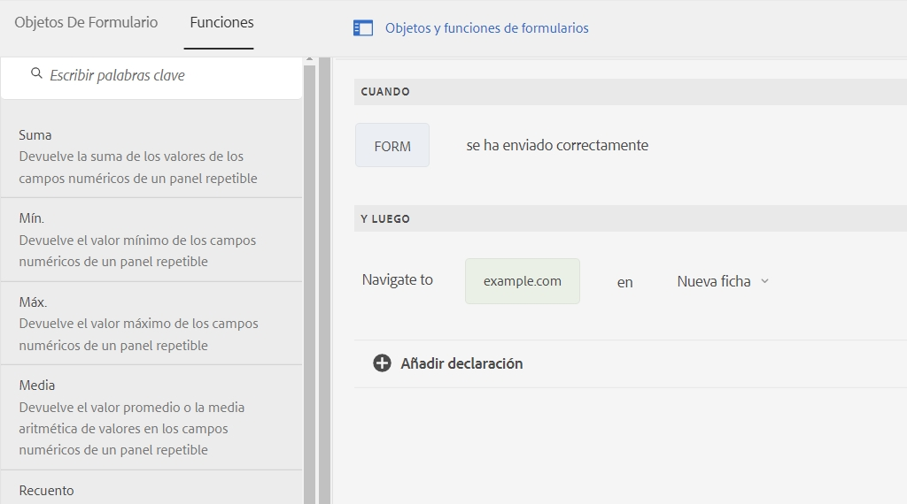

# Envío asincrónico de formularios adaptables {#asynchronous-submission-of-adaptive-forms}


| Versión | Vínculo del artículo |
| -------- | ---------------------------- |
| AEM 6.5 | [Haga clic aquí.](https://experienceleague.adobe.com/docs/experience-manager-65/forms/adaptive-forms-advanced-authoring/asynchronous-submissions-adaptive-forms.html) |
| AEM as a Cloud Service | Este artículo |


Tradicionalmente, los formularios web se configuran para enviarse sincrónicamente. En el envío sincrónico, cuando los usuarios envían un formulario, se les redirige a una página de reconocimiento, a una página de agradecimiento o, en el caso de se produzca un error en el envío, a una página de error. Sin embargo, las experiencias web modernas, como las aplicaciones de una sola página, están ganando popularidad en los casos en los que la página web permanece estática mientras la interacción cliente-servidor se produce en segundo plano. Puede configurar el envío asincrónico para proporcionar esta experiencia en formularios adaptables.

En el caso del envío asincrónico, cuando un usuario envía un formulario, el desarrollador del formulario agrega una experiencia independiente, como redirigir a otro formulario o a una sección independiente del sitio web. El autor también puede añadir servicios independientes, como enviar datos a un almacén de datos diferente o añadir un motor de análisis personalizado. En el caso del envío asincrónico, un formulario adaptable se comporta como una aplicación de una sola página, ya que el formulario no se vuelve a cargar o su URL no cambia cuando los datos del formulario enviados se validan en el servidor.

Siga leyendo para obtener más información sobre el envío asincrónico en formularios adaptables.

## Configuración del envío asincrónico {#configure}

Para configurar el envío asincrónico en un formulario adaptable:

1. En el modo Autor del formulario adaptable, seleccione el objeto Contenedor de formulario y pulse  para abrir sus propiedades.
1. En la sección de propiedades de **[!UICONTROL Envío]**, habilite **[!UICONTROL Usar envío asincrónico]**.
1. En la sección **[!UICONTROL Al enviar]**, seleccione una de las siguientes opciones para realizarla cuando se envíe correctamente del formulario.

   * **[!UICONTROL Redirigir a URL]**: redirige a la URL o página especificada después de enviar el formulario. Puede especificar una URL o examinar y elegir la ruta a una página en el campo **[!UICONTROL URL/ruta de redireccionamiento]**.
   * **[!UICONTROL Mostrar mensaje]**: muestra un mensaje sobre el envío del formulario. Puede escribir un mensaje en el campo de texto debajo de la opción **[!UICONTROL Mostrar mensaje]**. El campo de texto admite el formato de texto enriquecido.

1. Pulse  para guardar las propiedades.

## Funcionamiento del envío asincrónico {#how-asynchronous-submission-works}

[!DNL Experience Manager Forms] proporciona controladores de éxito y de error predeterminados para los envíos de formularios. Los controladores son funciones del lado del cliente que se ejecutan en función de la respuesta del servidor. Cuando se envía un formulario, los datos se transmiten al servidor para su validación, lo que devuelve una respuesta al cliente con información sobre el evento de éxito o error del envío. La información se pasa en forma de parámetros al controlador correspondiente para ejecutar la función.

Además, los autores y desarrolladores de formularios pueden escribir reglas a nivel de formulario para invalidar los controladores predeterminados. Para obtener más información, consulte [Invalidar los controladores predeterminados mediante reglas](#custom).

Primero vamos a revisar la respuesta del servidor para los eventos de éxito y de error.

### Respuesta del servidor para el evento de éxito del envío {#server-response-for-submission-success-event}

La estructura de la respuesta del servidor para el evento de éxito del envío es la siguiente:

```json
{oneOf: [
{  properties : {
     contentType : {"type" : "string",  "enum" : ["xmlschema", "jsonschema"]},
    data : {type : "string", description : "Form data in XML or  JSON  format"},
   thankYouOption : {type : "string"}
   }},
  properties : {
     contentType : {"type" : "string",  "enum" : ["xmlschema", "jsonschema"]},
    data : {type : "string", description : "Form data in XML or  JSON  format"},
   thankYouContent: {type: "string"}
   }
]

}
```

La respuesta del servidor en caso de que el envío del formulario se realice correctamente incluye:

* el tipo de formato de datos del formulario: XML o JSON;
* los datos del formulario en formato XML o JSON;
* la opción seleccionada para redireccionar a una página o mostrar un mensaje como se ha configurado en el formulario;
* la URL de la página o contenido del mensaje, según la configuración del formulario.

El controlador de éxito lee la respuesta del servidor y, en consecuencia, redirige a la URL de la página configurada o muestra un mensaje.

### Respuesta del servidor para el evento de error del envío {#server-response-for-submission-error-event}

La estructura de la respuesta del servidor para el evento de error del envío es la siguiente:

```json
{
   errorCausedBy : "<CAPTCHA_VALIDATION or SERVER_SIDE_VALIDATION>",

   errors : [
               { "somExpression" : "<SOM Expression>",
                 "errorMessage"  : "<Error Message>"
               },
               ...
             ]
 }
```

La respuesta del servidor en caso de que se produzca un error durante el envío del formulario incluye:

* el motivo del error, el error de CAPTCHA o la validación del lado del servidor;
* la lista de objetos de error, que incluye la expresión SOM del campo en el que se ha producido un error al efectuar la validación y el mensaje de error correspondiente.

El controlador de error lee la respuesta del servidor y, en consecuencia, muestra el mensaje de error en el formulario.

## Invalidar los controladores predeterminados mediante reglas {#custom}

Los desarrolladores y autores de formularios pueden escribir reglas a nivel de formulario para invalidar los controladores predeterminados. La respuesta del servidor para eventos de éxito y error se expone a nivel de formulario, al cual los desarrolladores pueden acceder usando `$event.data` en las reglas.

Realice los siguientes pasos para escribir reglas para controlar los eventos de éxito y error.

1. Abra el formulario adaptable en el modo Autor, seleccione cualquier objeto de formulario y pulse  para abrir el Editor de reglas.
1. Seleccione **[!UICONTROL Formulario]** en el árbol Objetos de formulario y pulse **[!UICONTROL Crear]**.
1. Seleccione **[!UICONTROL Se ha enviado correctamente]** o **[!UICONTROL Error de envío]** en la lista desplegable **[!UICONTROL Seleccionar estado]**.
1. Defina una acción **[!UICONTROL Entonces]** para el estado seleccionado. Por ejemplo, seleccione **[!UICONTROL Navegar a]** y después escriba o pegue una URL. También puede arrastrar cualquier función con la pestaña **[!UICONTROL Funciones]** a la regla.

   

1. Pulse **[!UICONTROL Listo]** para guardar la regla.
