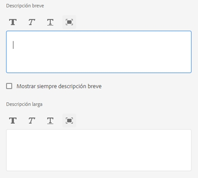
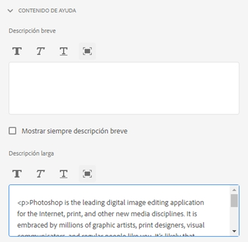
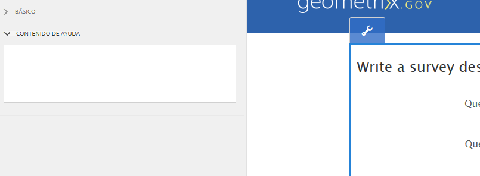

# Crear ayuda en contexto para campos de formulario{#authoring-in-context-help-for-form-fields}

## Introducción {#introduction}

Hay situaciones en las que los usuarios finales que rellenan un formulario no están seguros de cómo rellenar los detalles de un campo de formulario concreto. Para solucionar estos problemas, los formularios adaptables proporcionan asistencia para agregar texto o ayuda en contexto enriquecida en un campo de formulario. Esto contribuye a mejorar la experiencia de rellenado de los formularios y evita cualquier tipo de ambigüedad a los usuarios finales.

En este artículo se explica cómo los autores de formularios pueden agregar ayuda en contexto durante la creación de formularios adaptables.

## Agregar ayuda en contexto {#add-in-context-help}

Puede especificar la ayuda en contexto mediante las siguientes opciones de la sección Contenido de ayuda de la pestaña Propiedades de la barra lateral.

* [Descripción breve](authoring-in-field-help.md#p-short-description-p)
* [Descripción larga](authoring-in-field-help.md#p-long-description-p)

>[!NOTE]
>
>La descripción larga invalida la descripción breve. Si ha especificado ambas, solo se mostrará la descripción larga.

### Descripción breve {#short-description}

El campo Descripción breve proporciona sugerencias rápidas y cortas sobre cómo rellenar un campo de formulario. El texto especificado en el campo Descripción breve se muestra como información sobre herramientas al pasar el ratón por encima del campo.

>[!NOTE]
>
>Seleccione **Mostrar siempre una descripción breve** para mostrar permanentemente el texto de ayuda debajo del campo.

### Descripción larga {#long-description}

Puede utilizar el campo Descripción larga para especificar texto largo o incrustar contenido con medios enriquecidos, incluidos vídeos, como ayuda en contexto. Por ejemplo, la siguiente imagen muestra cómo incrustar un vídeo como ayuda en contexto.

Al añadir una descripción larga, se muestra el icono **?** junto al campo. Al hacer clic en el icono, se muestra el contenido añadido en la sección Descripción larga.

### Ayuda a nivel de panel {#panel-level-help}

Además de la ayuda en contexto de los campos de formulario, puede especificar ayuda a nivel de panel en la pestaña Contenido de ayuda del cuadro de diálogo de edición del panel.

Al añadir ayuda al panel, se muestra el icono **?** junto a la descripción del panel. Al hacer clic en el icono, se muestra el contenido añadido en la sección Contenido de ayuda del cuadro de diálogo de edición del panel.

