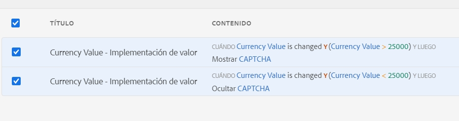

# Usar reCAPTCHA de Google en un formulario adaptable de AEM basado en componentes principales {#using-reCAPTCHA-in-adaptive-forms}

| Se aplica a | Vínculo del artículo |
| -------- | ---------------------------- |
| Formulario adaptable basado en componentes principales | Este artículo |
| Formulario adaptable basado en componentes de base | [Haga clic aquí](/help/forms/captcha-adaptive-forms.md) |

CAPTCHA (prueba de Turing completamente automática y pública para diferenciar ordenadores de humanos) es un programa que se utiliza comúnmente en transacciones en línea para distinguir entre humanos y programas o bots automatizados. Plantea un desafío y evalúa la respuesta del usuario para determinar si es un humano o un bot que interactúa con el sitio. Evita que el usuario continúe si la prueba falla y ayuda a que las transacciones en línea sean seguras al impedir que los bots publiquen contenido no deseado o con fines malintencionados.

AEM Forms as a Cloud Service es compatible con las siguientes soluciones CAPTCHA:

* [Google reCAPTCHA](#connect-your-aem-forms-environment-with-recaptcha-service-by-google)
* [hCaptcha](/help/forms/integrate-adaptive-forms-hcaptcha-core-components.md)

## Conecte sus componentes principales de AEM Forms con el servicio reCAPTCHA de Google {#connect-your-forms-environment-with-recaptcha-service-by-google}

Los creadores de formularios pueden utilizar el servicio reCAPTCHA de Google para implementar el reCAPTCHA en los formularios adaptables. Ofrece funcionalidades de Captcha avanzadas para proteger su sitio. Para obtener más información sobre cómo funciona reCAPTCHA, consulte [Google reCAPTCHA](https://developers.google.com/recaptcha/). Puede utilizarlo para presentar un desafío de CAPTCHA en el envío de formularios.[!DNL AEM Forms] as a [!DNL Cloud Service] admite reCAPTCHA v2 de Google y reCAPTCHA Enterprise.  No existe compatibilidad con ninguna otra versión. También hay que tener en cuenta que reCAPTCHA en formularios adaptables no es compatible con el modo sin conexión en la aplicación AEM Forms.

Según sus necesidades, puede configurar el servicio reCAPTCHA para habilitar lo siguiente:

* [reCAPTCHA Enterprise](#steps-to-implement-reCAPTCHA-enterprise-in-forms-core-components)
* [reCAPTCHA v2](#steps-to-implement-reCAPTCHA-v2-in-forms)

### Configuración de reCAPTCHA Enterprise  {#steps-to-implement-reCAPTCHA-enterprise-in-forms-core-components}

1. Cree o seleccione un [Proyecto de Google Cloud](https://cloud.google.com/recaptcha-enterprise/docs/set-up-non-google-cloud-environments-api-keys#before-you-begin) y habilite la [API de reCAPTCHA Enterprise](https://cloud.google.com/recaptcha-enterprise/docs/set-up-non-google-cloud-environments-api-keys#enable-the-recaptcha-enterprise-api).
1. Obtenga el [ID de proyecto](https://support.google.com/googleapi/answer/7014113?hl=en#:~:text=To%20locate%20your%20project%20ID,a%20member%20of%20are%20displayed) y cree una [clave de API](https://cloud.google.com/recaptcha-enterprise/docs/set-up-non-google-cloud-environments-api-keys#create_an_api_key) y una [clave del sitio para sitios web](https://cloud.google.com/recaptcha-enterprise/docs/create-key#create-key).
1. Crear un contenedor de configuración para los servicios en la nube.

   1. Vaya a **[!UICONTROL Herramientas > General > Explorador de configuración]**.
   1. Seleccione una carpeta o cree una carpeta y habilítela para las configuraciones de nube mediante los siguientes pasos:
      1. En el Explorador de configuración, selecciona la carpeta y selecciona **[!UICONTROL Propiedades]**.
      1. En el cuadro de diálogo Propiedades de configuración, habilite **[!UICONTROL Configuraciones de nube]**.
      1. Selecciona **[!UICONTROL Guardar y cerrar]** para guardar la configuración y salir del cuadro de diálogo.

1. Configure el servicio en la nube para [!DNL reCAPTCHA Enterprise].

   1. En la instancia de autor Experience Manager, vaya a  > **[!UICONTROL Cloud Services]**.
   1. Selecciona **[!UICONTROL reCAPTCHA]**. Se abre la página de configuración. Selecciona el contenedor de configuración que ha creado y seleccione **[!UICONTROL Crear]**.
   1. Seleccione versión como [!DNL reCAPTCHA Enterprise] y especifique el nombre, el ID del proyecto, la clave del sitio y la clave de la API (obtenida en el paso 2) para el servicio empresarial de reCAPTCHA.
   1. Seleccione el tipo de clave que debe ser el mismo que la clave de sitio configurada en el [proyecto de Google Cloud](https://cloud.google.com/recaptcha-enterprise/docs/set-up-non-google-cloud-environments-api-keys#before-you-begin). Por ejemplo, **clave de sitio de casilla** o **clave de sitio basada en puntuación**.
   1. Especifique una [puntuación de umbral en el rango de 0 a 1](https://cloud.google.com/recaptcha-enterprise/docs/interpret-assessment#interpret_scores). Las puntuaciones superiores o iguales a las puntuaciones de umbral identifican la interacción humana; de lo contrario, se considera interacción de bots.
   1. Selecciona **[!UICONTROL Crear]** para crear la configuración del servicio en la nube.

<!--
    1. In the Edit Component dialog, specify the name, project ID, site key, API key (obtained in steps 2 and 3), select the key type, and enter the threshold score. Select **[!UICONTROL Save Settings]** and then select **[!UICONTROL OK]** to complete the configuration.
-->

Una vez habilitado el servicio empresarial de reCAPTCHA, estará disponible para su uso en formularios adaptables. Ver [el uso de CAPTCHA en los formularios adaptables](#using-reCAPTCHA).

<!--

-->

### Configuración de Google reCAPTCHA v2 {#steps-to-implement-reCAPTCHA-v2-in-forms}

1. Obtener el [par de claves de la API reCAPTCHA](https://www.google.com/recaptcha/admin) de Google. Incluye una **clave del sitio** y una **clave secreta**.

   
1. Cree el contenedor de configuración en su entorno de AEM Forms as a Cloud Service. Un contenedor de configuración contiene las configuraciones en la nube utilizadas para conectar a AEM a los servicios externos. Para crear y configurar un contenedor de configuración para conectar su entorno de AEM Forms con el servicio reCAPTCHA de Google, haga lo siguiente:
   1. Abra la instancia AEM Forms as a Cloud Service.
   1. Vaya a **[!UICONTROL Herramientas > General > Explorador de configuración]**. En el Explorador de configuración, puede hacer lo siguiente:
   1. Seleccionar una carpeta existente o crear una nueva. Crear una carpeta y habilitar la opción Configuraciones de la nube para ella o Habilitar la opción Configuraciones de nube de la carpeta existente:

      * Para crear una carpeta y habilitar la opción Configuraciones de la nube para ella, haga lo siguiente:
         1. En el Explorador de configuración, pulse **[!UICONTROL Crear]**.
         1. En el cuadro de diálogo Crear configuración, especifique el nombre, el título y seleccione la opción **[!UICONTROL Configuraciones de la nube]**.
         1. Haga clic en **[!UICONTROL Crear]**
      * Para habilitar la opción Configuraciones de la nube para una carpeta existente, haga lo siguiente:
         1. En el Explorador de configuración, seleccione la carpeta y seleccione **[!UICONTROL Propiedades]**.
         1. En el cuadro de diálogo Propiedades de configuración, habilite **[!UICONTROL Configuraciones de nube]**.
         1. Seleccione **[!UICONTROL Guardar y cerrar]** para guardar la configuración y salir del cuadro de diálogo.

1. Configure Cloud Service:
   1. En la instancia de autor de AEM, vaya a  > **[!UICONTROL Cloud Services]** y seleccione **[!UICONTROL reCAPTCHA]**.
   1. Seleccione un contenedor de configuración, creado o actualizado en la sección anterior. Seleccione **[!UICONTROL Crear]**.
   1. Especificar **[!UICONTROL Título]**, **[!UICONTROL Nombre]**, **[!UICONTROL Clave del sitio]**, y **[!UICONTROL Clave secreta]** para el servicio reCAPTCHA (obtenido en el paso 1). Seleccione **[!UICONTROL Crear]**.

   

   Una vez configurado el servicio reCAPTCHA, está disponible para su uso en Formularios adaptables. Para obtener más información, consulte [Usar Google reCAPTCHA en un Formulario adaptable](#using-reCAPTCHA).

Usar Google reCAPTCHA en formularios adaptables

## Uso de Google reCAPTCHA en un formulario adaptable {#using-reCAPTCHA}

Para utilizar el reCAPTCHA en Formularios adaptables, haga lo siguiente:

1. Abra la instancia AEM Forms as a Cloud Service.
1. Vaya a **[!UICONTROL Formularios]** > **[!UICONTROL Formularios y documentos]**.
1. Seleccione un Formulario adaptable y seleccione **[!UICONTROL Propiedades]**. Para la opción **[!UICONTROL Contenedor de configuración]**, seleccione el contenedor de configuración que contiene la configuración de la nube que conecta AEM Forms con el servicio reCAPTCHA de Google y seleccione **[!UICONTROL Guardar y cerrar]**.

   Si no tiene ese Contenedor de configuración, consulte la sección [Conectar su entorno de AEM Forms con el servicio reCAPTCHA de Google](#connect-your-forms-environment-with-recaptcha-service-by-google) para obtener información sobre cómo crear este tipo de Contenedor de configuración.

   

1. Seleccione un formulario adaptable y seleccione **[!UICONTROL Editar]**. El formulario adaptable se abre en el editor de Formularios adaptables.
1. Desde el explorador de componentes, arrastre y suelte el componente **[!UICONTROL reCAPTCHA del formulario adaptable]** en este.

   >[!NOTE]
   > * La validación de reCAPTCHA de Google distingue entre mayúsculas y minúsculas y caduca en unos minutos. Por lo tanto, Adobe recomienda colocar el componente **[!UICONTROL reCAPTCHA del formulario adaptable]** justo antes de pulsar el botón **[!UICONTROL Enviar]**.

1. Seleccione el componente **[!UICONTROL reCAPTCHA del Formulario adaptable]** y seleccione el . Abre el cuadro de diálogo de propiedades. Especifique las siguientes propiedades obligatorias:
   * **[!UICONTROL Nombre]:** puede identificar fácilmente el componente de un formulario con su nombre único, tanto en el formulario como en el editor de reglas, pero el nombre no debe contener espacios ni caracteres especiales.
   * **[!UICONTROL Título]:** especifique un título para el widget CAPTCHA. El valor predeterminado es **Captcha**. Seleccione **Ocultar título** si no desea que aparezca el título. Seleccione **Permitir texto enriquecido para el título** para editar el título en formato de texto enriquecido. También puede marcar su título como **Elemento de formulario independiente**.
   * **[!UICONTROL Configuración de captcha]:** seleccione una configuración de la lista desplegable Configuración para **recaptcha Enterprise** o **recaptcha versión 2** para presentar el cuadro de diálogo de Google recaptcha para el formulario:
      1. Si selecciona la versión **reCAPTCHA empresarial**, el tipo de clave puede ser **casilla de verificación** o **basado en puntuación**, se compone de la selección realizada al configurar la [clave del sitio para sitios web](https://cloud.google.com/recaptcha-enterprise/docs/create-key#create-key):

         >[!NOTE]
         >
         >* En la configuración de nube con **tipo de clave** como **casilla de verificación**, el mensaje de error personalizado aparece como un mensaje en línea si falla la validación del captcha.
         >* En la configuración en la nube con **tipo de clave** como **basado en puntuación**, el mensaje de error personalizado se muestra como un mensaje emergente si falla la validación del captcha.

      1. Puede seleccionar el tamaño como **[!UICONTROL normal]** y **[!UICONTROL compacto]**.

     >[!NOTE]
     >* Puede tener varias configuraciones de la nube en su entorno para un propósito similar. Por lo tanto, elija el servicio con cuidado. Si no aparece ningún servicio, consulte [Conectar su entorno de AEM Forms con el servicio reCAPTCHA de Google](#connect-your-forms-environment-with-recaptcha-service-by-google) para aprender a crear un Cloud Service que conecte su entorno de AEM Forms con el servicio reCAPTCHA de Google.

   * **Tamaño del Captcha:** puede seleccionar el tamaño de visualización del diálogo de comprobación del reCAPTCHA de Google. Utilice la opción **[!UICONTROL Compacto]** para mostrar un tamaño pequeño y la opción **[!UICONTROL Normal]** para mostrar un cuadro de diálogo de comprobación de reCAPTCHA de Google de tamaño relativamente grande.
Si selecciona la versión **reCAPTCHA v2**:
      1. Puede seleccionar el tamaño **[!UICONTROL normal]** o **[!UICONTROL compacto]** para el widget reCAPTCHA.
      1. También puede seleccionar la opción **[!UICONTROL Invisible]** para mostrar la comprobación de CAPTCHA solamente en el caso de una actividad sospechosa.

   El servicio reCAPTCHA está habilitado en el formulario adaptable. Puede obtener una vista previa del formulario y ver cómo funciona CAPTCHA. El distintivo **protegido por reCAPTCHA**, que se muestra a continuación, aparece en los formularios protegidos.

   

1. Seleccione **[!UICONTROL Listo]**.

   Ahora, verá **protegido por reCAPTCHA** en el formulario adaptable. Se muestra en todos los formularios adaptables configurados para utilizar el servicio reCAPTCHA de Google.

   Ahora, solo se permite el envío de formularios legítimos, en los que la persona que rellena el formulario supera con éxito el desafío planteado por el servicio reCAPTCHA de Google.

<!--
### Show or hide CAPTCHA component based on rules {#show-hide-captcha}

You can select to show or hide the CAPTCHA component based on rules that you apply on a component in an Adaptive Form. Select the component, select , and select **[!UICONTROL Create]** to create a rule. For more information on creating rules, see [Rule Editor](rule-editor.md).

For example, the CAPTCHA component must display in an Adaptive Form only if the Currency Value field in the form has a value of more than 25000.

Select the **[!UICONTROL Currency Value]** field in the form and create the following rules:

   >[!NOTE]
   >
   > When you select a reCAPTCHA v2 configuration and the size is set to [!UICONTROL Invisible], the show/hide option remains disabled.

   -->

## Preguntas frecuentes

**P: ¿Puedo usar más de un componente Captcha en un formulario adaptable?**
**R:** No se puede usar más de un componente Captcha en un formulario adaptable. Además, no se recomienda utilizar el componente Captcha en un fragmento o panel marcado para la carga diferida.

## Consulte también {#see-also}

{{see-also}}
