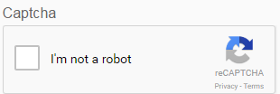
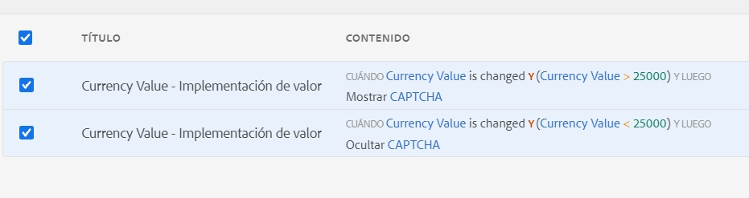

# Uso de CAPTCHA en Forms adaptable{#using-captcha-in-adaptive-forms}

CAPTCHA (prueba de Turing pública completamente automatizada para distinguir entre ordenadores y humanos) es un programa que se utiliza comúnmente en transacciones en línea para distinguir entre humanos y programas o bots automatizados. Plantea un desafío y evalúa la respuesta del usuario para determinar si es un humano o un bot que interactúa con el sitio. Evita que el usuario siga adelante si la prueba falla y ayuda a que las transacciones en línea sean seguras al impedir que los bots publiquen contenido no deseado o con fines malintencionados.

[!DNL AEM Forms] admite CAPTCHA en Forms adaptable. Google puede utilizar el servicio reCAPTCHA para implementar CAPTCHA.

>[!NOTE]
>
>* [!DNL AEM Forms] solo compatible con reCaptcha v2. No se admite ninguna otra versión.
>* CAPTCHA en Forms adaptable no es compatible con el modo sin conexión en [!DNL AEM Forms] aplicación.

>


## Configuración del servicio ReCAPTCHA por Google {#google-recaptcha}

Los creadores de formularios pueden utilizar el servicio reCAPTCHA de Google para implementar CAPTCHA en Adaptive Forms. Ofrece funciones CAPTCHA avanzadas para proteger su sitio. Para obtener más información sobre cómo funciona reCAPTCHA, consulte [Google reCAPTCHA](https://developers.google.com/recaptcha/).



Para implementar el servicio reCAPTCHA en [!DNL AEM Forms]:

1. Obtener [par de claves de la API reCAPTCHA](https://www.google.com/recaptcha/admin) de Google. Incluye una clave de sitio y un secreto.
1. Cree un contenedor de configuración para Cloud Services.

   1. Vaya a **[!UICONTROL Herramientas > General > Explorador de configuración]**.
      * Consulte la [Explorador de configuración](https://experienceleague.adobe.com/docs/experience-manager-65/administering/introduction/configurations.html?lang=en#introduction) documentación para obtener más información.
   1. Haga lo siguiente para habilitar la carpeta global para configuraciones de nube o omita este paso para crear y configurar otra carpeta para configuraciones de servicios de nube.

      1. En el Explorador de configuración, seleccione la opción **[!UICONTROL global]** carpeta y toque **[!UICONTROL Propiedades]**.

      1. En el cuadro de diálogo Propiedades de configuración, active **[!UICONTROL Configuraciones de nube]**.
      1. Toque **[!UICONTROL Guardar y cerrar]** para guardar la configuración y salir del cuadro de diálogo.
   1. En el Explorador de configuración, pulse **[!UICONTROL Crear]**.
   1. En el cuadro de diálogo Crear configuración , especifique un título para la carpeta y habilite **[!UICONTROL Configuraciones de nube]**.
   1. Toque **[!UICONTROL Crear]** para crear la carpeta habilitada para las configuraciones del servicio en la nube.


1. Configure el servicio en la nube para reCAPTCHA.

   1. En la instancia de autor de AEM, vaya a  > **[!UICONTROL Cloud Services]**.
   1. Toque **[!UICONTROL reCAPTCHA]**. Se abre la página Configuraciones. Seleccione el contenedor de configuración creado en el paso anterior y pulse **[!UICONTROL Crear]**.
   1. Especifique el nombre, la clave del sitio y la clave secreta para el servicio reCAPTCHA y pulse **[!UICONTROL Crear]** para crear la configuración del servicio en la nube.
   1. En el cuadro de diálogo Editar componente , especifique el sitio y las claves secretas obtenidas en el paso 1. Toque **[!UICONTROL Guardar configuración]** y, a continuación, toque **[!UICONTROL OK]** para completar la configuración.

   Una vez configurado el servicio reCAPTCHA, está disponible para su uso en Forms adaptable. Para obtener más información, consulte [Uso de CAPTCHA en Forms adaptable](#using-captcha).

## Uso de CAPTCHA en Forms adaptable {#using-captcha}

Para utilizar CAPTCHA en Forms adaptable:

1. Abra un formulario adaptable en modo de edición.

   >[!NOTE]
   >
   >Asegúrese de que el contenedor de configuración seleccionado al crear el formulario adaptable contiene el servicio en la nube reCAPTCHA. También puede editar las propiedades del formulario adaptable para cambiar el contenedor de configuración asociado al formulario.

1. Desde el navegador de componentes, arrastre y suelte el **[!UICONTROL Captcha]** en el formulario adaptable.

   >[!NOTE]
   >
   >No se admite el uso de más de un componente Captcha en un formulario adaptable. Además, no se recomienda utilizar CAPTCHA en un panel marcado para la carga diferida o en un fragmento.

   >[!NOTE]
   >
   >Captcha distingue entre tiempo y caduca en aproximadamente un minuto. Por lo tanto, se recomienda colocar el componente Captcha justo antes del botón Enviar en el formulario adaptable.

1. Seleccione el componente Captcha que ha agregado y pulse  para editar sus propiedades.
1. Especifique un título para el widget CAPTCHA. El valor predeterminado es **[!UICONTROL Captcha]**. Select **[!UICONTROL Ocultar título]** si no desea que aparezca el título.
1. En el **[!UICONTROL Servicio Captcha]** desplegable, seleccione **[!UICONTROL reCaptcha]** para habilitar el servicio reCAPTCHA si lo configuró como se describe en [Servicio ReCAPTCHA de Google](#google-recaptcha). Seleccione una configuración en la lista desplegable Configuración . Asimismo, seleccione el tamaño como **[!UICONTROL Normal]** o **[!UICONTROL Compacta]** para el widget reCAPTCHA.

   >[!NOTE]
   >
   >No seleccione **[!UICONTROL Predeterminado]** del menú desplegable del servicio Captcha, ya que el servicio AEM CAPTCHA predeterminado está obsoleto.

1. Guarde las propiedades.

El servicio reCAPTCHA está habilitado en el formulario adaptable. Puede obtener una vista previa del formulario y ver cómo funciona CAPTCHA.

### Mostrar u ocultar el componente CAPTCHA basado en reglas {#show-hide-captcha}

Puede seleccionar mostrar u ocultar el componente CAPTCHA en función de las reglas que aplique en un componente de un formulario adaptable. Pulse el componente, seleccione y toque **[!UICONTROL Crear]** para crear una regla. Para obtener más información sobre la creación de reglas, consulte [Editor de reglas](rule-editor.md).

Por ejemplo, el componente CAPTCHA debe mostrarse en un formulario adaptable solo si el campo Valor de moneda del formulario tiene un valor superior a 25000.

Toque . **[!UICONTROL Valor de moneda]** en el formulario y cree las siguientes reglas:



### Validar CAPTCHA {#validate-captcha}

Puede validar CAPTCHA en un formulario adaptable al enviar el formulario o basar la validación CAPTCHA en las acciones y condiciones del usuario.

#### Validación de CAPTCHA en el envío del formulario {#validation-form-submission}

Para validar un CAPTCHA automáticamente al enviar un formulario adaptable:

1. Pulse el componente CAPTCHA y seleccione  para ver las propiedades del componente.
1. En el **[!UICONTROL Validación de CAPTCHA]** , seleccione **[!UICONTROL Validación de CAPTCHA en el envío del formulario]**.
1. Toque  para guardar las propiedades del componente.

#### Validación de CAPTCHA en acciones y condiciones del usuario {#validate-captcha-user-action}

Para validar un CAPTCHA basado en condiciones y acciones del usuario:

1. Pulse el componente CAPTCHA y seleccione  para ver las propiedades del componente.
1. En el **[!UICONTROL Validación de CAPTCHA]** , seleccione **[!UICONTROL Validación de CAPTCHA en una acción del usuario]**.
1. Toque  para guardar las propiedades del componente.

[!DNL Experience Manager Forms] proporciona `ValidateCAPTCHA` API para validar CAPTCHA con condiciones predefinidas. Puede invocar la API utilizando una acción de envío personalizada o definiendo reglas sobre los componentes de un formulario adaptable.

El siguiente es un ejemplo de `ValidateCAPTCHA` API para validar CAPTCHA con condiciones predefinidas:

```javascript
if (slingRequest.getParameter("numericbox1614079614831").length() >= 5) {
    	GuideCaptchaValidatorProvider apiProvider = sling.getService(GuideCaptchaValidatorProvider.class);
        String formPath = slingRequest.getResource().getPath();
        String captchaData = slingRequest.getParameter(GuideConstants.GUIDE_CAPTCHA_DATA);
        if (!apiProvider.validateCAPTCHA(formPath, captchaData).isCaptchaValid()){
            response.setStatus(400);
            return;
        }
    }
```

El ejemplo significa que la variable `ValidateCAPTCHA` La API valida el CAPTCHA en el formulario solo si el número de dígitos en el cuadro numérico especificado por el usuario mientras rellena el formulario es bueno a 5.

**Opción 1: Uso [!DNL Experience Manager Forms] ValidateCAPTCHA API para validar CAPTCHA mediante una acción de envío personalizada**

Siga estos pasos para usar la variable `ValidateCAPTCHA` API para validar CAPTCHA con una acción de envío personalizada:

1. Añada la secuencia de comandos que incluya la variable `ValidateCAPTCHA` API para la acción de envío personalizada. Para obtener más información sobre las acciones de envío personalizadas, consulte [Crear una acción de envío personalizada para Forms adaptable](custom-submit-action-form.md).
1. Seleccione el nombre de la acción de envío personalizada en el **[!UICONTROL Enviar acción]** lista desplegable en **[!UICONTROL Envío]** propiedades de un formulario adaptable.
1. Toque **[!UICONTROL Submit]**. El CAPTCHA se valida según las condiciones definidas en `ValidateCAPTCHA` API de la acción de envío personalizada.

**Opción 2: Uso [!DNL Experience Manager Forms] Validar la API CAPTCHA para validar CAPTCHA en una acción del usuario antes de enviar el formulario**

También puede invocar `ValidateCAPTCHA` API mediante la aplicación de reglas en un componente en un formulario adaptable.

Por ejemplo, se agrega un **[!UICONTROL Validación de CAPTCHA]** en un formulario adaptable y cree una regla para invocar un servicio haciendo clic en un botón.

La siguiente ilustración ilustra cómo puede invocar un servicio al hacer clic en un **[!UICONTROL Validación de CAPTCHA]** botón:


Puede invocar el servlet personalizado que incluye `ValidateCAPTCHA` API mediante el editor de reglas y habilite o deshabilite el botón de envío del formulario adaptable en función del resultado de validación.

Del mismo modo, puede utilizar el editor de reglas para incluir un método personalizado para validar CAPTCHA en un formulario adaptable.

### Añadir servicios CAPTCHA personalizados {#add-custom-captcha-service}

[!DNL Experience Manager Forms] proporciona reCAPTCHA como servicio CAPTCHA. Sin embargo, puede agregar un servicio personalizado para que se muestre en la **[!UICONTROL Servicio CAPTCHA]** lista desplegable.

A continuación se muestra un ejemplo de implementación de la interfaz para agregar un servicio CAPTCHA adicional al formulario adaptable:

```javascript
package com.adobe.aemds.guide.service;

import org.osgi.annotation.versioning.ConsumerType;

/**
 * An interface to provide captcha validation at server side in Adaptive Form
 * This interface can be used to provide custom implementation for different captcha services.
 */
@ConsumerType
public interface GuideCaptchaValidator {
    /**
     * This method should define the actual validation logic of the captcha
     * @param captchaPropertyNodePath path to the node with CAPTCHA configurations inside form container
     * @param userResponseToken  The user response token provided by the CAPTCHA from client-side
     *
     * @return  {@link GuideCaptchaValidationResult} validation result of the captcha
     */
     GuideCaptchaValidationResult validateCaptcha(String captchaPropertyNodePath, String userResponseToken);

    /**
     * Returns the name of the captcha validator. This should be unique among the different implementations
     * @return  name of the captcha validator
     */
     String getCaptchaValidatorName();
}
```

`captchaPropertyNodePath` hace referencia a la ruta de recurso del componente CAPTCHA en el repositorio de Sling. Utilice esta propiedad para incluir detalles específicos del componente CAPTCHA. Por ejemplo, `captchaPropertyNodePath` incluye información para la configuración de nube reCAPTCHA configurada en el componente CAPTCHA. La información de configuración de la nube proporciona **[!UICONTROL Clave del sitio]** y **[!UICONTROL Clave secreta]** configuración para implementar el servicio reCAPTCHA.

`userResponseToken` hace referencia a `g_recaptcha_response` que se genera después de resolver un CAPTCHA en un formulario.

### Editar dominio de servicio reCAPTCHA {#recaptcha-service-domain}

El servicio reCAPTCHA utiliza `https://www.recaptcha.net/` como dominio predeterminado. Puede modificar la configuración para establecerla `https://www.google.com/` o cualquier nombre de dominio personalizado para cargar, procesar y validar el servicio reCAPTCHA.

Configure las variables **[!UICONTROL af.cloudservices.recaptcha.domain]** propiedad de la variable **[!UICONTROL Configuración del canal web de comunicaciones interactivas y formularios adaptables]** configuración para especificar `https://www.google.com/` o cualquier otro nombre de dominio personalizado. El siguiente archivo JSON muestra un ejemplo:

```json
{
  "af.cloudservices.recaptcha.domain": "https://www.google.com/"
}
```

Para establecer los valores de una configuración, [Generación de configuraciones de OSGi mediante el SDK de AEM](https://experienceleague.adobe.com/docs/experience-manager-cloud-service/implementing/deploying/configuring-osgi.html?lang=en#generating-osgi-configurations-using-the-aem-sdk-quickstart)y [implementar la configuración](https://experienceleague.adobe.com/docs/experience-manager-cloud-service/implementing/using-cloud-manager/deploy-code.html?lang=en#deployment-process) a su instancia de Cloud Service.
