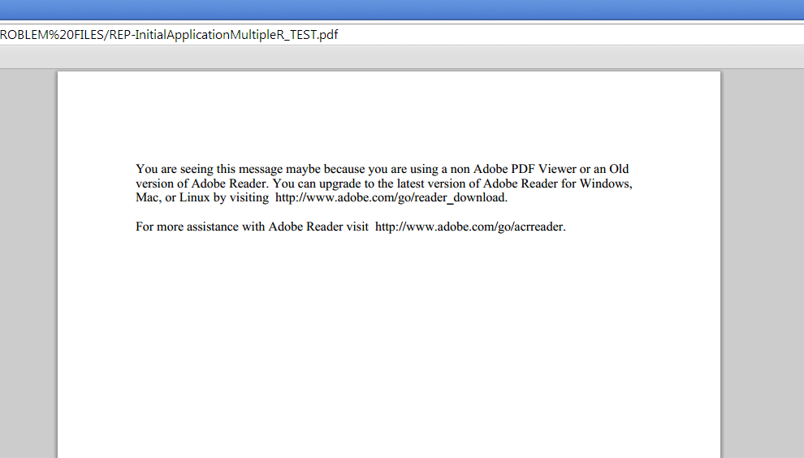

# Cambiar el contenido de la página cero en Designer {#changing-page-zero-content-in-designer}

El contenido de la página cero se muestra de forma predeterminada cuando un visor que no es Adobe PDF, como el visor de PDF predeterminado de [!DNL Chrome] o [!DNL Firefox], no puede leer el contenido del formulario PDF/XFA. A continuación, se muestra el mensaje predeterminado de la página cero.

[!DNL AEM Forms] La versión de Designer de permite cambiar el mensaje que se muestra en la página cero. Para cambiar el mensaje de la página cero, realice los siguientes pasos:

1. Asegúrese de que ha instalado la versión de Designer de [!DNL AEM Forms]. Puede comprobar la versión desde la pantalla Acerca de Designer.

1. Abra el formulario para el cual desea cambiar el contenido de la página cero.

1. Haga clic en **[!UICONTROL Archivo]** > **[!UICONTROL Propiedades del formulario]**.

1. En el cuadro de diálogo [!UICONTROL Propiedades del formulario], haga clic en  (icono + ) para añadir una propiedad personalizada.

1. Especifique **_pagezerocontent** como el nombre de la propiedad.
1. Agregue el nuevo mensaje de la página cero en formato de texto enriquecido como valor. Por ejemplo:

   `<body xmlns="https://www.w3.org/1999/xhtml" xmlns:xfa="https://www.xfa.org/schema/xfa-data/1.0/">
 </code>

You are seeing this message maybe because you are using a non Adobe PDF Viewer or an Old version of Adobe Reader. You can upgrade to the latest version of Adobe Reader for Windows, Mac, or Linux by visiting  </code>https://www.adobe.com/go/reader_download.

 </code>

For more assistance with Adobe Reader visit  </code>https://www.adobe.com/go/acrreader.
</body>`

1. Guarde el formulario como PDF.

1. Vea el formulario PDF en el explorador para confirmar que el mensaje se ha actualizado. El valor del ejemplo anterior aparece de la siguiente forma:

   

>[!NOTE]
>
>Es posible que la propiedad personalizada que acaba de crear no aparezca correctamente en el cuadro de diálogo Propiedades del formulario cuando vuelva a abrir el formulario. Sin embargo, funciona bien, y el formulario muestra el mensaje de la página cero actualizado.

>[!MORELIKETHIS]
>
>* [Descargue e instale Forms Designer para crear plantillas de documento de registro](/help/forms/installing-configuring-designer.md)
>* [Utilice Forms Designer para crear plantillas de documento de registro (DoR) y fragmentos de formulario?](/help/forms/use-forms-designer.md)
