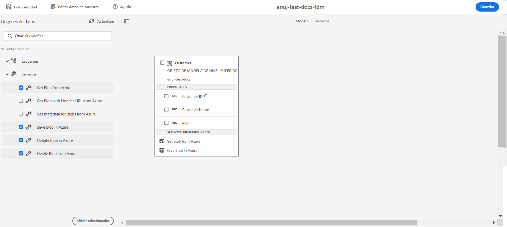

# Configuración de [!DNL Azure] Storage {#configure-azure-storage}

La integración de datos de [[!DNL Experience Manager Forms] ](data-integration.md) proporciona una configuración de almacenamiento de [!DNL Azure] para integrar formularios con los servicios de [!DNL Azure] Storage. El modelo de datos de formulario se puede utilizar para crear formularios adaptables que interactúen con el servidor [!DNL Azure] para habilitar los flujos de trabajo empresariales. Por ejemplo:

* escribir datos sobre el envío de formularios adaptables en [!DNL Azure];
* Escritura de datos en [!DNL Azure] mediante entidades personalizadas definidas en el modelo de datos de formulario y a la inversa.
* consultar datos en el servidor de [!DNL Azure] y rellenar previamente formularios adaptables.
* leer datos del servidor de [!DNL Azure].

## Crear la configuración de [!DNL Azure] Storage {#create-azure-storage-configuration}

Antes de ejecutar estos pasos, asegúrese de que dispone de una cuenta de [!DNL Azure] Storage y una clave de acceso para autorizar el acceso a la cuenta de [!DNL Azure] Storage.

1. Vaya a **[!UICONTROL Herramientas]** > **[!UICONTROL Cloud Services]** > **[!UICONTROL Almacenamiento de Azure]**.
1. Seleccione una carpeta para crear la configuración y pulse **[!UICONTROL Crear]**.
1. Especifique un título para la configuración en el campo **[!UICONTROL Título]**.
1. Especifique el nombre de la cuenta de [!DNL Azure] Storage en el campo **[!UICONTROL Cuenta de Azure Storage]**.
1. Especifique la clave para acceder a la cuenta de Azure Storage en el campo **[!UICONTROL Clave de acceso de Azure]** y pulse **[!UICONTROL Guardar]**.

## Crear modelo de datos de formulario {#create-azure-form-data-model}

Después de crear la configuración de [!DNL Azure] Storage, puede [crear el modelo de datos de formulario](create-form-data-models.md). Especifique la carpeta que contiene la configuración de [!DNL Azure] en el campo **[!UICONTROL Configuración de fuente de datos]** al crear el modelo de datos de formulario. A continuación, podrá seleccionar la configuración en la lista de configuraciones existente en el nombre de carpeta especificado.

### Agregar servicios de [!DNL Azure] al modelo de datos de formulario {#add-azure-services}

Después de crear el modelo de datos de formulario y los objetos de modelo, puede agregarle servicios de [!DNL Azure].

Para agregar servicios de [!DNL Azure]:

1. En el modo Edición, seleccione los servicios en la sección **[!UICONTROL Servicios]** del panel izquierdo y pulse **[!UICONTROL Agregar selección]**. Los servicios seleccionados se muestran en la pestaña **[!UICONTROL Servicios]** del modelo de datos de formulario.

   

1. En la pestaña **[!UICONTROL Servicios]**, seleccione el servicio y **[!UICONTROL Editar propiedades]**. En función del servicio, defina los objetos del modelo de entrada o salida del servicio.

1. Pulse **[!UICONTROL Guardar]** para guardar el modelo de datos de formulario.

   La siguiente tabla describe los servicios de [!DNL Azure] disponibles:

   <table>
    <tbody>
     <tr>
      <th><strong>Nombre del servicio</strong></th>
      <th><strong>Descripción</strong></th>
     </tr>
     <tr>
      <td>Obtener un blob de Azure</td>
      <td>Recuperar datos almacenados como un blob en Azure Storage mediante un ID o un nombre.</td>
     </tr>
     <tr>
      <td>Obtener un blob con URL binarias de Azure</td>
      <td>Recuperar datos almacenados como un blob con URL binarias en Azure Storage mediante un ID o un nombre.</td>
     </tr>
     <tr>
      <td>Guardar un blob de Azure</td>
      <td>Usar un ID de blob para guardar datos en Azure Storage.</td>
     </tr>
     <tr>
      <td>Actualizar un blob de Azure</td>
      <td>Usar un ID de blob para actualizar datos en Azure Storage.</td>
     </tr>
     <tr>
      <td>Recuperar una lista de ID de blobs de Azure</td>
      <td>Recupere una lista de ID de blobs de Azure en función del número definido en la solicitud de entrada.</td>
     </tr>
     <tr>
      <td>Recuperar URL de SAS de blobs de Azure</td>
      <td>Recupere URL de SAS de blobs de Azure en función de los ID de blob de la solicitud de entrada.</td>
     </tr>
     <tr>
      <td>Eliminar un blob de Azure</td>
      <td>Usar un ID de blob para eliminar datos en Azure Storage.</td>
     </tr>
    </tbody>
   </table>

### Definir la propiedad de un objeto de modelo de datos como clave de búsqueda {#define-data-model-object-as-metadata}

Para definir la propiedad de un objeto de modelo de datos como clave de búsqueda:

1. En la pestaña **[!UICONTROL Modelo]**, seleccione la propiedad de un objeto de modelo de datos y pulse **[!UICONTROL Editar propiedades]**.
1. Cambie el botón de alternancia de la opción **[!UICONTROL Clave de búsqueda]** al estado ACTIVADO. Esta opción solo está disponible para los tipos de datos principales.
1. Pulse **[!UICONTROL Listo]** y, a continuación, pulse **[!UICONTROL Guardar]** para guardar el modelo de datos de formulario.

Después de definir las propiedades de un objeto de modelo de datos como claves de búsqueda, los valores hash se almacenan en etiquetas de índice de Azure y los valores codificados en Base64 se almacenan en los metadatos de Azure.

>[!NOTE]
>
>Solo se permiten 10 claves de búsqueda por cada entidad de Azure, ya que Azure solo permite 10 etiquetas por cada blob, y el valor de las propiedades marcadas como claves de búsqueda se almacena en etiquetas de índice de Azure después del hash.

<!--

>[!MORELIKETHIS]
>
>* [Configure data sources for AEM Forms](/help/forms/configure-data-sources.md)
>* [Integrate Microsoft Dynamics 365 and Salesforce with Adaptive Forms](/help/forms/configure-msdynamics-salesforce.md)
>  [Add Forms Portal to an AEM Sites page](/help/forms/configure-forms-portal.md)

-->