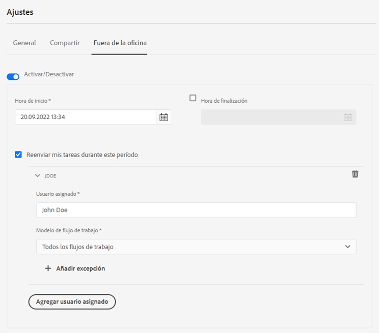

# Configuración de Fuera de la oficina {#configure-out-of-office-settings}

| Versión | Vínculo del artículo |
| -------- | ---------------------------- |
| AEM 6.5 | [Haga clic aquí](https://experienceleague.adobe.com/docs/experience-manager-65/forms/workflows/configure-out-of-office-settings.html) |
| AEM as a Cloud Service | Este artículo |

Si planea estar fuera de la oficina, puede especificar qué sucederá con los elementos que se le hayan asignado durante ese período.

Tiene la opción de especificar una fecha y una hora de inicio y una fecha y una hora de finalización para aplicar la configuración de Fuera de la oficina. Si se encuentra en una zona horaria diferente de la del servidor, la zona horaria utilizada será la del cliente.

Puede establecer la persona predeterminada a la que se enviarán todos los elementos. También puede especificar excepciones para que los elementos de procesos específicos se envíen a un usuario diferente o se mantengan en la Bandeja de entrada hasta que vuelva. Si la persona designada también está fuera de la oficina, el elemento se dirigirá al usuario que haya designado. Si el elemento no se puede asignar a un usuario que no esté fuera de la oficina, permanecerá en la Bandeja de entrada.

Puede distribuir la delegación de elementos según los modelos de flujo de trabajo. Por ejemplo, puede asignar un elemento relacionado con el flujo de trabajo A al usuario A y asignar un elemento relacionado con el flujo de trabajo B al usuario B.

>[!NOTE]
>
>* Cuando habilita la configuración Fuera de la oficina, todos los elementos disponibles en la Bandeja de entrada antes de habilitar dicha configuración permanecen en ella. Solo se delegan los elementos recibidos después de habilitar la configuración.
>* Cuando deshabilita la configuración de Fuera de la oficina, los elementos delegados no vuelven a asignársele automáticamente. Puede utilizar la funcionalidad Reclamar para asignarse elementos.
>* Cuando el usuario A delega elementos en el usuario B y el usuario B los delega a su vez en el usuario C, los elementos se asignan únicamente al usuario C y no al usuario B.
>* Cuando hay un bucle en la asignación, las tareas permanecen asignadas al usuario original. por ejemplo, cuando el usuario A delega elementos en el usuario B, el usuario B delega en el usuario C, el usuario C delega en el usuario D y el usuario D delega en el usuario B, se crea un bucle. En tal situación, el elemento permanece asignado al usuario original. El usuario A es el usuario original en el ejemplo anterior.

## Habilitar la configuración de Fuera de la oficina en su cuenta {#enable-out-of-office}

Realice los siguientes pasos para habilitar la configuración de Fuera de la oficina en su cuenta y delegar los elementos de la Bandeja de entrada en otro usuario:

1. Inicie sesión en la instancia de AEM. Pulse el icono  y luego pulse **[!UICONTROL Ver todo]**. Aparecerá una lista de los elementos de la Bandeja de entrada.
1. Pulse  o el icono  junto al botón **[!UICONTROL Crear]** y luego pulse **[!UICONTROL Configuración]**. Aparecerá el cuadro de diálogo Configuración.
1. Abra la pestaña **[!UICONTROL Fuera de la oficina]** en el cuadro de diálogo Configuración.
1. Pulse el botón **[!UICONTROL Habilitar/Deshabilitar]** para habilitar la configuración de Fuera de la oficina.
1. Especifique la **[!UICONTROL Hora de inicio]** y la **[!UICONTROL Hora de finalización]** para la configuración. Los elementos se delegarán únicamente durante el período especificado. Deje el campo **[!UICONTROL Hora de finalización]** vacío para delegar los elementos durante un período de tiempo indefinido.
1. Seleccione la casilla de verificación **[!UICONTROL Reenviar mis elementos durante este periodo]**. Si no selecciona la opción y no especifica un usuario asignado, los elementos no se reenviarán a ningún usuario. Aunque no esté presente y la configuración esté habilitada, los elementos permanecerán en la Bandeja de entrada.
1. Pulse **[!UICONTROL Agregar usuario asignado]**. Especifique un usuario en el campo **[!UICONTROL Usuario asignado]** en el que delegar los elementos. Especifique el **[!UICONTROL Modelo de flujo de trabajo]** para delegar en el usuario especificado. Puede seleccionar más de un modelo de flujo de trabajo.

   Además, para asignar todos los elementos a un usuario determinado independientemente del modelo de flujo de trabajo, seleccione **[!UICONTROL Todos los flujos de trabajo]** en la lista desplegable Modelo de flujo de trabajo.  

   Para asignar elementos a un usuario determinado para todos los modelos de flujo de trabajo excepto algunos, seleccione **[!UICONTROL Todos los flujos de trabajo]** en la lista desplegable Modelo de flujo de trabajo, pulse **[!UICONTROL + Agregar excepciones]** y especifique los modelos de flujo de trabajo que desea excluir.
    

   Repita el paso para agregar más usuarios asignados.  

   >[!NOTE]
   >
   >El orden de los usuarios asignados es importante. Cuando se asigna un elemento a un usuario que ha habilitado la configuración de Fuera de la oficina, el elemento se evalúa según la lista de usuarios asignados especificados en el orden en el que se agregan los usuarios asignados. Cuando un elemento coincide con los criterios, se asigna al usuario asignado y el siguiente usuario no se comprueba.

1. Pulse **[!UICONTROL Guardar]**. La configuración se aplica en la fecha y la hora de inicio especificadas. Si inicia sesión mientras está fuera de la oficina, no se considerará que ha vuelto hasta que cambie la configuración.

Ahora, los elementos que se le hayan asignado durante el período de tiempo que ha estado fuera de la oficina se asignarán automáticamente al usuario asignado especificado. 

>[!NOTE]
>
>(Solo para elementos de los flujos de trabajo centrados en Forms) Active la variable **[!UICONTROL Permitir que el usuario asignado delegue utilizando la configuración de &quot;Fuera de la oficina&quot;]** de la opción **[!UICONTROL Asignar tarea]** paso en el flujo de trabajo. Solo los elementos que tienen la opción mencionada habilitada se delegan en otros usuarios.
>(Solo para los elementos de flujos de trabajo centrados en formularios) Active la opción **[!UICONTROL Permitir que el usuario asignado delegue mediante la configuración de Fuera de la oficina]** del paso **[!UICONTROL Asignar tarea]** del flujo de trabajo. Solo los elementos que tienen la opción mencionada anteriormente habilitada se delegan en otros usuarios.

## Restricciones {#limitations}

* No se admite la asignación de elementos a un grupo.
* Actualmente no se admite la activación de la configuración de Fuera de la oficina para tareas de proyecto.
