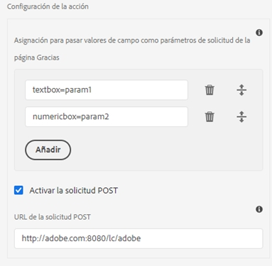
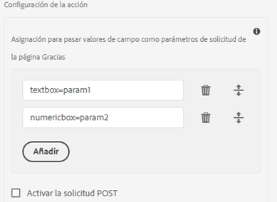

# Configurar un formulario adaptable para la acción de envío del punto final REST

: la capacidad para especificar el extremo REST mediante la configuración es un programa que lo adopta por anticipado y solo se aplica a los componentes principales y a Edge Delivery Services Forms. Puede escribir a `aem-forms-ea@adobe.com` desde su ID de correo electrónico oficial para unirse al programa de usuarios que lo adoptaron por primera vez y solicitar acceso a esta capacidad. 

Utilice la acción **[!UICONTROL Enviar al punto final REST]** para publicar los datos enviados en una URL de REST. La URL puede ser de un servidor interno (el servidor en el que se procesa el formulario) o externo.

AEM as a Cloud Service ofrece varias acciones de envío predeterminadas para gestionar los envíos de formularios. Puede obtener más información sobre estas opciones en el artículo [Acción de envío del formulario adaptable](/help/forms/aem-forms-submit-action.md).

## Ventajas

Algunas de las ventajas de configurar la acción de envío **[!UICONTROL Enviar al punto final REST]** para los formularios adaptables son:

* Permite la integración perfecta de los datos del formulario con los sistemas y servicios externos a través de las API de RESTful.
* Proporciona flexibilidad para manejar envíos de datos de formularios adaptables, lo que admite estructuras de datos dinámicas y complejas.
* Admite la asignación dinámica de campos de formulario a parámetros en la dirección URL del punto final REST, lo que permite envíos de datos adaptables y personalizables.

## Configurar la acción de envío Enviar al punto final REST {#steps-to-configure-submit-to-restendpoint-submit-action}

>[!BEGINTABS]

>[!TAB Componente Base]

Para configurar la acción de envío basada en la especificación de API abierta de Swagger para formularios adaptables basados en componentes de base, haga lo siguiente:

1. Abra el formulario adaptable para editarlo y vaya a la sección **[!UICONTROL Envío]** de las propiedades del contenedor del formulario adaptable.
1. En la lista desplegable **[!UICONTROL Acción de envío]**, seleccione la opción **[!UICONTROL Enviar al punto final REST]**.

   

   Para enviar datos a un servidor interno, proporcione la ruta del recurso. Los datos se publican en la ruta del recurso. Por ejemplo, `/content/restEndPoint`. Para estas peticiones POST se utiliza la información de autenticación de la solicitud de envío.
Esta opción le permite introducir directamente el extremo REST de destinatario
Para enviar datos a un servidor externo, proporcione una URL. El formato de la URL es el siguiente `https://host:port/path_to_rest_end_point`. Asegúrese de configurar la ruta para controlar la petición POST de forma anónima.
   

   En el ejemplo anterior, el usuario ha escrito información en `textbox` y se captura mediante el parámetro `param1`. La sintaxis para anunciar datos capturados con `param1` es la siguiente:

   `String data=request.getParameter("param1");`

   Del mismo modo, los parámetros que utiliza para publicar datos XML y archivos adjuntos son `dataXml` y `attachments`.

   Por ejemplo, utiliza estos dos parámetros en el script para analizar los datos en un punto final de REST. Se utiliza la siguiente sintaxis para almacenar y analizar los datos:

   `String data=request.getParameter("dataXml");`
   `String att=request.getParameter("attachments");`

   En este ejemplo, `data` almacena los datos XML y `att` almacena los datos adjuntos.
La acción de envío **[!UICONTROL Enviar al punto final REST]** envía los datos rellenados en el formulario a una página de confirmación configurada como parte de la petición HTTP GET. Puede añadir el nombre de los campos que desea solicitar. El formato de la solicitud es el siguiente:
   `{fieldName}={request parameter name}`

   Como se muestra en la siguiente imagen, `param1` y `param2` se pasan como parámetros con valores copiados de los campos **cuadro de texto** y **del cuadro numérico** para la siguiente acción.

   

   También puede **[!UICONTROL Habilitar la petición POST]** y proporcionar una URL para publicar la solicitud. Para enviar datos al servidor de AEM que aloja el formulario, utilice una ruta relativa correspondiente a la ruta raíz del servidor de AEM. Por ejemplo, `/content/forms/af/SampleForm.html`. Para enviar datos a cualquier otro servidor, utilice la ruta absoluta.

1. Haga clic en **[!UICONTROL Listo]**.

>[!TAB Componente principal]

Para configurar la acción de envío basada en la especificación de API abierta de Swagger para formularios adaptables basados en componentes principales, haga lo siguiente:

1. Abra el Explorador de contenido y seleccione el componente **[!UICONTROL Contenedor de guía]** del formulario adaptable.
1. Haga clic en el icono de propiedades del contenedor de guía . Se abre el cuadro de diálogo Contenedor de formulario adaptable.
1. Haga clic en la pestaña **[!UICONTROL Envío]**.
1. En la lista desplegable **[!UICONTROL Acción de envío]**, seleccione la opción **[!UICONTROL Enviar al punto final REST]**.

   

   Para enviar datos a un servidor interno, proporcione la ruta del recurso. Los datos se publican en la ruta del recurso. Por ejemplo, `/content/restEndPoint`. Para esas peticiones POST se utiliza la información de autenticación de la solicitud de envío.

   Tiene dos opciones para especificar el extremo REST:

   +++URL

   Esta opción le permite introducir directamente el extremo REST de destinatario
Para enviar datos a un servidor externo, proporcione una URL. El formato de la URL es el siguiente `https://host:port/path_to_rest_end_point`. Asegúrese de configurar la ruta para controlar la petición POST de forma anónima.

   

   En el ejemplo anterior, el usuario ha escrito información en `textbox` y se captura mediante el parámetro `param1`. La sintaxis para anunciar datos capturados con `param1` es la siguiente:

   `String data=request.getParameter("param1");`

   Del mismo modo, los parámetros que utiliza para publicar datos XML y archivos adjuntos son `dataXml` y `attachments`.

   Por ejemplo, utiliza estos dos parámetros en el script para analizar los datos en un punto final de REST. Se utiliza la siguiente sintaxis para almacenar y analizar los datos:

   `String data=request.getParameter("dataXml");`
   `String att=request.getParameter("attachments");`

   En este ejemplo, `data` almacena los datos XML y `att` almacena datos adjuntos.

   La acción de envío **[!UICONTROL Enviar al punto final REST]** envía los datos rellenados en el formulario a una página de confirmación configurada como parte de la petición HTTP GET. Puede añadir el nombre de los campos que desea solicitar. El formato de la solicitud es el siguiente:

   `{fieldName}={request parameter name}`

   Como se muestra en la siguiente imagen, `param1` y `param2` se pasan como parámetros con valores copiados de los campos **cuadro de texto** y **del cuadro numérico** para la siguiente acción.

   

   También puede **[!UICONTROL Habilitar la petición POST]** y proporcionar una URL para publicar la solicitud. Para enviar datos al servidor de AEM que aloja el formulario, utilice una ruta relativa correspondiente a la ruta raíz del servidor de AEM. Por ejemplo, `/content/forms/af/SampleForm.html`. Para enviar datos a cualquier otro servidor, utilice la ruta absoluta.

+++

   +++Configuración

   Esta opción le permite añadir una configuración HTTP predefinida administrada mediante el Explorador de configuración de AEM. Puede seleccionar la configuración creada para el tipo de autenticación de extremo de REST de servicio y los tipos de contenido. Para obtener más información sobre el tipo de autenticación y los tipos de contenido, visite [configurar fuentes de datos](/help/forms/configure-data-sources.md#configure-restful-services-using-service-endpoint-configure-restful-services-service-endpoint)

+++

1. Haga clic en **[!UICONTROL Listo]**.

>[!TAB Editor universal]

Para configurar la acción de envío basada en la especificación de la API abierta de Swagger para el formulario adaptable creado en el Editor universal, haga lo siguiente:

1. Abra el formulario adaptable para editarlo.
1. Haga clic en la extensión **Editar propiedades del formulario** en el editor.
Aparecerá el cuadro de diálogo **Propiedades del formulario**.
   >[!NOTE]
   >
   > * Si no ve el icono **Editar propiedades de formulario** en la interfaz de Universal Editor, habilite la extensión **Editar propiedades de formulario** en Extension Manager.
   > * Consulte el artículo [Aspectos destacados de las funciones de Extension Manager](https://developer.adobe.com/uix/docs/extension-manager/feature-highlights/#enablingdisabling-extensions) para obtener información sobre cómo habilitar o deshabilitar extensiones en el editor universal.
1. Haga clic en la pestaña **Envío** y seleccione la acción de envío **[!UICONTROL Enviar al extremo REST]**.

   Para enviar datos a un servidor interno, proporcione la ruta del recurso. Los datos se publican en la ruta del recurso. Por ejemplo, `/content/restEndPoint`. Para esas peticiones POST se utiliza la información de autenticación de la solicitud de envío.

   Tiene dos opciones para especificar el extremo REST:

   +++URL

   Esta opción le permite introducir directamente el extremo REST de destinatario
Para enviar datos a un servidor externo, proporcione una URL. El formato de la URL es el siguiente `https://host:port/path_to_rest_end_point`. Asegúrese de configurar la ruta para controlar la petición POST de forma anónima.

   

   En el ejemplo anterior, el usuario ha escrito información en `textbox` y se captura mediante el parámetro `param1`. La sintaxis para anunciar datos capturados con `param1` es la siguiente:

   `String data=request.getParameter("param1");`

   Del mismo modo, los parámetros que utiliza para publicar datos XML y archivos adjuntos son `dataXml` y `attachments`.

   Por ejemplo, utiliza estos dos parámetros en el script para analizar los datos en un punto final de REST. Se utiliza la siguiente sintaxis para almacenar y analizar los datos:

   `String data=request.getParameter("dataXml");`
   `String att=request.getParameter("attachments");`

   En este ejemplo, `data` almacena los datos XML y `att` almacena datos adjuntos.

   La acción de envío **[!UICONTROL Enviar al punto final REST]** envía los datos rellenados en el formulario a una página de confirmación configurada como parte de la petición HTTP GET. Puede añadir el nombre de los campos que desea solicitar. El formato de la solicitud es el siguiente:

   `{fieldName}={request parameter name}`

   Como se muestra en la siguiente imagen, `param1` y `param2` se pasan como parámetros con valores copiados de los campos **cuadro de texto** y **del cuadro numérico** para la siguiente acción.

   

   También puede **[!UICONTROL Habilitar la petición POST]** y proporcionar una URL para publicar la solicitud. Para enviar datos al servidor de AEM que aloja el formulario, utilice una ruta relativa correspondiente a la ruta raíz del servidor de AEM. Por ejemplo, `/content/forms/af/SampleForm.html`. Para enviar datos a cualquier otro servidor, utilice la ruta absoluta.

+++

   +++Configuración

   Esta opción le permite añadir una configuración HTTP predefinida administrada mediante el Explorador de configuración de AEM. Puede seleccionar la configuración creada para el tipo de autenticación de extremo de REST de servicio y los tipos de contenido. Para obtener más información sobre el tipo de autenticación y los tipos de contenido, visite [configurar fuentes de datos](/help/forms/configure-data-sources.md#configure-restful-services-using-service-endpoint-configure-restful-services-service-endpoint)

+++

1. Haga clic en **[!UICONTROL Guardar y cerrar]**.

>[!ENDTABS]

<!-- ### Configure submit action based on Service Rest Endpoint {#config-service-endpoint-auth}

1. Open the Content browser, and select the **[!UICONTROL Guide Container]** component of your Adaptive Form.
2. Click the Guide Container properties  icon. The Adaptive Form Container dialog box opens. 
3. Click the  **[!UICONTROL Submission]** tab. 
4. From the **[!UICONTROL Submit Action]** drop-down list, select **[!UICONTROL Submit to Rest endpoint]**.
5. Enable the POST request.
6. Specify the REST endpoint URL.
7. Select the Configuration you have created for your Service Rest Endpoint Authentication Type and the Content Types. To know more about Authentication Type and the Content Types, visit [configure data sources](/help/forms/configure-data-sources.md#configure-restful-services-using-service-endpoint-configure-restful-services-service-endpoint).
    
8. Click Done. -->

## Prácticas recomendadas

* Al publicar datos en un servidor externo, asegúrese de que la dirección URL sea segura y configure la ruta para gestionar la petición POST de forma anónima a fin de proteger la información confidencial.
* Para pasar los campos como parámetros en una URL REST, todos los campos deben tener nombres de elementos diferentes, incluso si se colocan en paneles diferentes.

## Artículos relacionados

{{af-submit-action}}
