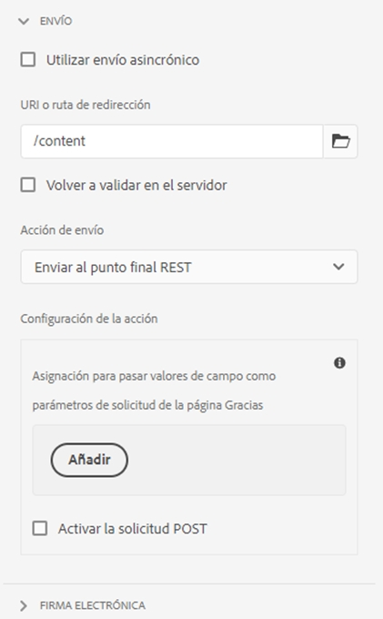

# Configuración de la página de redireccionamiento {#configuring-redirect-page}

| Versión | Vínculo del artículo |
| -------- | ---------------------------- |
| AEM 6.5 | [Haga clic aquí.](https://experienceleague.adobe.com/docs/experience-manager-65/forms/adaptive-forms-basic-authoring/configuring-redirect-page.html) |
| AEM as a Cloud Service | Este artículo |

Los autores de formularios pueden configurar una página para cada formulario, a la cual se redirigirá a los usuarios una vez enviado.

1. En el modo de edición, seleccione un componente y, a continuación, pulse  > **[!UICONTROL Contenedor de formulario adaptable]** y haga clic en .

1. En la barra lateral, haga clic en **[!UICONTROL Envío]**.

1. Proporcione la URL de la página de redireccionamiento en **[!UICONTROL URL/ruta de redireccionamiento]** en la sección **[!UICONTROL Envío]**.
1. De forma opcional, en Acción de envío, puede configurar el parámetro que se pasará a la página de redireccionamiento para la acción Enviar a extremo REST.

   

   Configuración de la página de redireccionamiento

Los autores de formularios pueden utilizar los siguientes parámetros, los cuales se pasan a la página de agradecimiento. Los parámetros `status` y `owner` se pasan para todas las acciones de envío disponibles. Además de estos dos parámetros, se pasan algunos parámetros adicionales para las siguientes acciones de envío:

* **[!UICONTROL Enviar a extremo REST]**: se pasan los parámetros añadidos para la asignación de campos en uso a parámetros. Los parámetros `status` y `owner` no se pasan en esta acción de envío. Para obtener más información, consulte [Configuración de la acción de envío Enviar a extremo REST](configuring-submit-actions.md).
