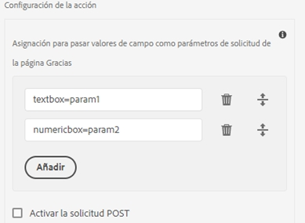

# Acción de envío de formulario adaptable {#configuring-the-submit-action}

Se activa una acción de envío cuando un usuario hace clic en el **[!UICONTROL Submit]** en un formulario adaptable. Forms adaptable proporciona algunas acciones de envío listas para usar. Las acciones de envío disponibles de fábrica son:

* [Enviar al extremo REST](#submit-to-rest-endpoint)
* [Enviar mensaje de correo electrónico](#send-email)
* [Enviar mediante modelo de datos de formulario](#submit-using-form-data-model)
* [Invocar un flujo de trabajo AEM](#invoke-an-aem-workflow)

También puede [ampliar las acciones de envío predeterminadas](custom-submit-action-form.md) para crear su propia acción de envío.

Puede configurar una acción de envío en la variable **[!UICONTROL Envío]** de las propiedades del contenedor del formulario adaptable, en la barra lateral.

<!-- [!NOTE]
>
>Send PDF via Email Submit Action is applicable only to Adaptive Forms that use XFA template as form model. 

>[!NOTE]
>
>Ensure that the [AEM_Installation_Directory]\crx-quickstart\temp\datamanager\ASM folder
>exists. The directory is required to temporarily store attachments. If the directory does not exist, create it. -->

<!--

>[!CAUTION]
>
>If you  [prefill](prepopulate-adaptive-form-fields.md) a form template,  a Form Data Model or schema based Adaptive Form with XML or JSON data complaint to a schema (XML schema, JSON schema , form template, or form data model) that is data does not contain &lt;afData&gt;, &lt;afBoundData&gt;, and &lt;/afUnboundData&gt; tags, then the data of unbounded fields (Unbounded fields are Adaptive Form fields without [bindref](prepopulate-adaptive-form-fields.md) property) of the Adaptive Form is lost. 

>[!CAUTION]
>
>If you [prefill](prepopulate-adaptive-form-fields.md) a form template, a Form Data Model or schema based Adaptive Form with XML or JSON data complaint to a schema (XML schema, JSON schema, or form data model) that does not contain &lt;afData&gt;, &lt;afBoundData&gt;, and &lt;/afUnboundData&gt; tags, then the data of unbounded fields (Unbounded fields are Adaptive Form fields without [bindref](prepopulate-adaptive-form-fields.md) property) of the Adaptive Form is lost.

-->

## Enviar al extremo REST {#submit-to-rest-endpoint}

Utilice la variable **[!UICONTROL Enviar a extremo REST]** acción para publicar los datos enviados en una URL de reposo. La URL puede ser de un servidor interno (el servidor en el que se representa el formulario) o externo.

Para enviar datos a un servidor interno, proporcione la ruta del recurso. Los datos se publican en la ruta del recurso. Por ejemplo, /content/restEndPoint. Para esas solicitudes posteriores se utiliza la información de autenticación de la solicitud de envío.

Para enviar datos a un servidor externo, proporcione una URL. El formato de la dirección URL es `https://host:port/path_to_rest_end_point`. Asegúrese de configurar la ruta para gestionar la solicitud del POST de forma anónima.

En el ejemplo anterior, el usuario ha introducido información en `textbox` se captura mediante un parámetro `param1`. Sintaxis para anunciar datos capturados con `param1` es:

`String data=request.getParameter("param1");`

Del mismo modo, los parámetros que se utilizan para publicar datos XML y archivos adjuntos son `dataXml` y `attachments`.

Por ejemplo, se utilizan estos dos parámetros en la secuencia de comandos para analizar los datos en un punto final de descanso. Se utiliza la siguiente sintaxis para almacenar y analizar los datos:

`String data=request.getParameter("dataXml");`
`String att=request.getParameter("attachments");`

En este ejemplo, `data` almacena los datos XML y `att` almacena datos adjuntos.

La variable **[!UICONTROL Enviar al extremo REST]** Acción de envío envía los datos rellenados en el formulario a una página de confirmación configurada como parte de la solicitud de GET HTTP. Puede añadir el nombre de los campos que desea solicitar. El formato de la solicitud es:

`{fieldName}={request parameter name}`

Como se muestra en la imagen siguiente, `param1` y `param2` se pasan como parámetros con valores copiados de la variable **textbox** y **numericbox** para la siguiente acción.

También puede **[!UICONTROL Habilitar solicitud de POST]** y proporcione una URL para publicar la solicitud. Para enviar datos al servidor de AEM que aloja el formulario, utilice una ruta relativa correspondiente a la ruta raíz del servidor de AEM. Por ejemplo, `/content/forms/af/SampleForm.html`. Para enviar datos a cualquier otro servidor, utilice la ruta absoluta.

>[!NOTE]
>
>Para pasar los campos como parámetros en una URL REST, todos los campos deben tener nombres de elementos diferentes, incluso si los campos se colocan en paneles diferentes.

## Enviar correo electrónico {#send-email}

Puede usar la variable **[!UICONTROL Enviar correo electrónico]** Enviar acción para enviar un correo electrónico a uno o varios destinatarios cuando el formulario se haya enviado correctamente. El correo electrónico generado puede contener datos de formulario en un formato predefinido. Por ejemplo, en la siguiente plantilla, el nombre del cliente, la dirección de envío, el nombre del estado y el código postal se recuperan de los datos del formulario enviado.

    &quot;
    
    Hola ${customer_Name},
    
    Lo siguiente se establece como su dirección de envío predeterminada:
    ${customer_Name},
    ${customer_Shipping_Address},
    ${customer_State},
    ${customer_ZIPCode}
    
    Saludos,
    WKND
    
    &quot;

>[!NOTE]
>
> * Todos los campos del formulario deben tener nombres de elemento diferentes, incluso si los campos se colocan en paneles diferentes de un formulario adaptable.
> * AEM as a Cloud Service requiere que el correo saliente esté cifrado. De forma predeterminada, el correo electrónico saliente está desactivado. Para activarlo, envíe un ticket de asistencia a [Solicitud de acceso](https://experienceleague.adobe.com/docs/experience-manager-cloud-service/implementing/developing/development-guidelines.html?lang=en#sending-email).

También puede incluir archivos adjuntos y un documento de registro (DoR) al correo electrónico. Para habilitar **[!UICONTROL Adjuntar documento de registro]** , configure el formulario adaptable para generar un documento de registro (DoR). Puede activar la opción para generar un documento de registro a partir de las propiedades del formulario adaptable.

<!-- ## Send PDF via Email {#send-pdf-via-email}

The **Send PDF via Email** Submit Action sends an email with a PDF containing form data, to one or more recipients on successful submission of the form.

>[!NOTE]
>
>This Submit Action is available for XFA-based Adaptive Forms and XSD-based adaption forms that have the Document of Record template. -->

<!-- ## Invoke a forms workflow {#invoke-a-forms-workflow}

The **Submit to Forms workflow** submit option sends a data xml and file attachments (if any) to an existing Adobe LiveCycle or [!DNL AEM Forms] on JEE process.

For information about how to configure the Submit to forms workflow Submit Action, see [Submitting and processing your form data using forms workflows](submit-form-data-livecycle-process.md). -->

## Enviar mediante modelo de datos de formulario {#submit-using-form-data-model}

La variable **[!UICONTROL Enviar mediante el modelo de datos de formulario]** Acción de envío escribe los datos del formulario adaptable enviados para el objeto del modelo de datos especificado en un Modelo de datos de formulario en su origen de datos. Al configurar la acción de envío, puede elegir un objeto de modelo de datos cuyos datos enviados desee volver a escribir en su origen de datos.

Además, se puede enviar un archivo adjunto de formulario mediante un Modelo de datos de formulario y un Documento de registro (DoR) al origen de datos. Para obtener información sobre el modelo de datos de formulario, consulte [[!DNL AEM Forms] Integración de datos](data-integration.md).

<!--
## Forms Portal Submit Action {#forms-portal-submit-action}

The **Forms Portal Submit Action** option makes form data available through an [!DNL AEM Forms] portal.

For more information about the Forms Portal and Submit Action, see [Drafts and submissions component](draft-submission-component.md). -->

## Invocar un flujo de trabajo AEM {#invoke-an-aem-workflow}

La variable **[!UICONTROL Invocar un flujo de trabajo AEM]** Acción de envío asocia un formulario adaptable con un [Flujo de trabajo AEM](https://experienceleague.adobe.com/docs/experience-manager-65/developing/extending-aem/extending-workflows/workflows-models.html?lang=en#extending-aem). Cuando se envía un formulario, el flujo de trabajo asociado se inicia automáticamente en la instancia de autor. Puede guardar el archivo de datos, los archivos adjuntos y el documento de registro en la ubicación de carga útil del flujo de trabajo o en una variable. Si el flujo de trabajo está marcado para almacenamiento de datos externos y está configurado para un almacenamiento de datos externo, solo está disponible la opción de variable . Puede seleccionar entre la lista de variables disponibles para el modelo de flujo de trabajo. Si el flujo de trabajo está marcado para almacenamiento de datos externos en una fase posterior y no en el momento de la creación del flujo de trabajo, asegúrese de que las configuraciones de variables requeridas estén establecidas.

La acción Enviar coloca lo siguiente en la ubicación de carga útil del flujo de trabajo o la variable si el flujo de trabajo está marcado para el almacenamiento de datos externos:

* **Archivo de datos**: Contiene datos enviados al formulario adaptable. Puede usar la variable **[!UICONTROL Ruta del archivo de datos]** para especificar el nombre del archivo y la ruta del archivo en relación con la carga útil. Por ejemplo, la variable `/addresschange/data.xml` ruta crea una carpeta llamada `addresschange` y lo coloca en relación a la carga útil. También puede especificar únicamente `data.xml` para enviar solo los datos enviados sin crear una jerarquía de carpetas. Si el flujo de trabajo está marcado para el almacenamiento de datos externos, utilice la opción de variable y seleccione la variable en la lista de variables disponibles para el modelo de flujo de trabajo.

* **Archivos adjuntos**: Puede usar la variable **[!UICONTROL Ruta de acceso de datos adjuntos]** para especificar el nombre de la carpeta en la que se almacenarán los archivos adjuntos cargados en el formulario adaptable. La carpeta se crea en relación con la carga útil. Si el flujo de trabajo está marcado para el almacenamiento de datos externos, utilice la opción de variable y seleccione la variable en la lista de variables disponibles para el modelo de flujo de trabajo.

* **Documento de registro**: Contiene el documento de registro generado para el formulario adaptable. Puede usar la variable **[!UICONTROL Documento de ruta de registro]** para especificar el nombre del archivo Document of Record y la ruta del archivo en relación con la carga útil. Por ejemplo, la variable `/addresschange/DoR.pdf` ruta crea una carpeta llamada `addresschange` en relación con la carga útil y coloca la variable `DoR.pdf` en relación con la carga útil. También puede especificar únicamente `DoR.pdf` para guardar sólo el documento de registro sin crear una jerarquía de carpetas. Si el flujo de trabajo está marcado para el almacenamiento de datos externos, utilice la opción de variable y seleccione la variable en la lista de variables disponibles para el modelo de flujo de trabajo.

Antes de usar la variable **[!UICONTROL Invocar un flujo de trabajo AEM]** Acción de envío configure lo siguiente para **[!UICONTROL Servicio de configuración AEM DS]** configuración:

* **[!UICONTROL URL del servidor de procesamiento]**: El servidor de procesamiento es el servidor en el que se activa Forms o AEM Workflow. Puede ser la misma que la URL de la instancia de autor AEM u otro servidor.

* **[!UICONTROL Nombre de usuario del servidor de procesamiento]**: Nombre de usuario del usuario del flujo de trabajo

* **[!UICONTROL Contraseña del servidor de procesamiento]**: Contraseña del usuario del flujo de trabajo

Para establecer los valores de una configuración, [Generación de configuraciones de OSGi mediante el SDK de AEM](https://experienceleague.adobe.com/docs/experience-manager-cloud-service/implementing/deploying/configuring-osgi.html?lang=en#generating-osgi-configurations-using-the-aem-sdk-quickstart)y [implementar la configuración](https://experienceleague.adobe.com/docs/experience-manager-cloud-service/implementing/using-cloud-manager/deploy-code.html?lang=en#deployment-process) a su instancia de Cloud Service.

## Usar envío sincrónico o asincrónico {#use-synchronous-or-asynchronous-submission}

Una acción de envío puede utilizar el envío sincrónico o asincrónico.

**Envío sincrónico**: Tradicionalmente, los formularios web se configuran para enviarse sincrónicamente. En un envío sincrónico, cuando los usuarios envían un formulario, se les redirige a una página de reconocimiento, una página de agradecimiento o, si hay un error en el envío, una página de error. Puede seleccionar el **[!UICONTROL Usar envío asincrónico]** para redirigir a los usuarios a una página web o mostrar un mensaje en el envío.

**Envío asincrónico**: Las experiencias web modernas, como las aplicaciones de una sola página, están ganando popularidad cuando la página web permanece estática mientras que la interacción cliente-servidor se produce en segundo plano. Ahora puede proporcionar esta experiencia con Forms adaptable mediante [configuración del envío asincrónico](asynchronous-submissions-adaptive-forms.md).

## Revalidación del lado del servidor en forma adaptable {#server-side-revalidation-in-adaptive-form}

Normalmente, en cualquier sistema de captura de datos en línea, los desarrolladores colocan algunas validaciones de JavaScript en el lado del cliente para aplicar algunas reglas comerciales. Sin embargo, en los navegadores modernos, los usuarios finales tienen la forma de evitar esas validaciones y realizar envíos manualmente utilizando diversas técnicas, como la consola de desarrolladores del explorador web. Estas técnicas también son válidas para Adaptive Forms. Un desarrollador de formularios puede crear varias lógicas de validación, pero técnicamente, los usuarios finales pueden omitir esas lógicas de validación y enviar datos no válidos al servidor. Los datos no válidos romperían las reglas comerciales que ha impuesto un autor de formularios.

La función de revalidación del lado del servidor permite ejecutar también las validaciones que ha proporcionado un autor de Forms adaptable al diseñar un formulario adaptable en el servidor. Evita cualquier posible compromiso de envíos de datos y violaciones de reglas comerciales representadas en términos de validaciones de formularios.

### ¿Qué se debe validar en el servidor? {#what-to-validate-on-server-br}

Todas las validaciones de campo predeterminadas (OOTB) de un formulario adaptable que se vuelven a ejecutar en el servidor son:

* Requerido
* Cláusula de imagen de validación
* Expresión de validación

### Activación de la validación en el lado del servidor {#enabling-server-side-validation-br}

Utilice la variable **[!UICONTROL Revalidate en el servidor]** en Contenedor de formulario adaptable en la barra lateral para habilitar o deshabilitar la validación del lado del servidor para el formulario actual.

Activación de la validación del lado del servidor

Si el usuario final omite esas validaciones y envía los formularios, el servidor vuelve a realizar la validación. Si la validación falla al final del servidor, se detiene la transacción de envío. Al usuario final se le vuelve a presentar el formulario original. Los datos capturados y enviados se presentan al usuario como un error.

>[!NOTE]
>
>La validación del lado del servidor valida el modelo de formulario. Se recomienda crear una biblioteca de cliente independiente para las validaciones y no mezclarla con otras cosas como el estilo del HTML y la manipulación DOM en la misma biblioteca de cliente.

### Compatibilidad con funciones personalizadas en expresiones de validación {#supporting-custom-functions-in-validation-expressions-br}

A veces, si hay **reglas de validación complejas**, la secuencia de comandos de validación exacta reside en funciones personalizadas y la llamada de autor llama a estas funciones personalizadas desde la expresión de validación de campo. Para que esta biblioteca de funciones personalizadas sea conocida y esté disponible mientras se realizan las validaciones del lado del servidor, el autor del formulario puede configurar el nombre de AEM biblioteca de cliente en la sección **[!UICONTROL Básico]** de las propiedades del contenedor del formulario adaptable como se muestra a continuación.

Compatibilidad con funciones personalizadas en expresiones de validación

El autor puede configurar la biblioteca customJavaScript por formulario adaptable. En la biblioteca, mantenga solo las funciones reutilizables, que dependen de las bibliotecas de terceros jquery y underscore.js .

## Tratamiento de errores en la acción de envío {#error-handling-on-submit-action}

Como parte de AEM directrices de seguridad y endurecimiento, configure páginas de error personalizadas como 400.jsp, 404.jsp y 500.jsp. Se llama a estos controladores cuando aparecen errores al enviar un formulario 400, 404 o 500. También se llama a los controladores cuando estos códigos de error se activan en el nodo Publish . También puede crear páginas JSP para otros códigos de error HTTP.

Cuando rellena previamente un modelo de datos de formulario o un formulario adaptable basado en esquema con datos XML o JSON que se quejan de un esquema que los datos no contienen `<afData>`, `<afBoundData>`y `</afUnboundData>` , los datos de los campos ilimitados del formulario adaptable se pierden. El esquema puede ser un esquema XML, un esquema JSON o un modelo de datos de formulario. Los campos sin límite son campos de formulario adaptable sin el `bindref` propiedad.

<!-- For more information, see [Customizing Pages shown by the Error Handler](/help/sites-developing/customizing-errorhandler-pages.md). -->
