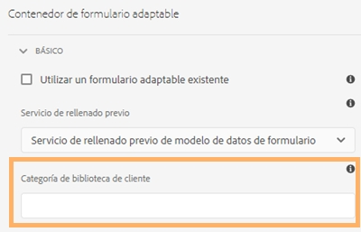

# Acción de envío de un formulario adaptable {#configuring-the-submit-action}

| Versión | Vínculo del artículo |
| -------- | ---------------------------- |
| AEM 6.5 | [Haga clic aquí](https://experienceleague.adobe.com/docs/experience-manager-65/forms/adaptive-forms-basic-authoring/configuring-submit-actions.html?lang=es) |
| AEM as a Cloud Service (componentes principales) | [Haga clic aquí](/help/forms/configure-submit-actions-core-components.md) |
| AEM as a Cloud Service (componentes de base) | Este artículo |

**Se aplica a**: ✔️ los componentes de base de formulario adaptable. ❌ [Componentes principales del Formulario adaptable](/help/forms/configure-submit-actions-core-components.md). Adobe recomienda utilizar los componentes principales para [añadir Formularios adaptables a una página de AEM Sites](create-or-add-an-adaptive-form-to-aem-sites-page.md) o para [crear Formularios adaptables independientes](creating-adaptive-form-core-components.md).

Se activa una acción de envío cuando un usuario hace clic en el botón **[!UICONTROL Enviar]** en un formulario adaptable. Forms as a Cloud Service proporciona las siguientes acciones de envío listas para usar.

* [Enviar al punto final REST](#submit-to-rest-endpoint)
* [Enviar correo electrónico](#send-email)
* [Enviar mediante el modo de datos de formulario (FDM)](#submit-using-form-data-model)
* [Invocar un flujo de trabajo de AEM](#invoke-an-aem-workflow)
* [Enviar a SharePoint](#submit-to-sharedrive)
* [Enviar a OneDrive](#submit-to-onedrive)
* [Enviar a Azure Blob Storage](#azure-blob-storage)
* [Enviar a Power Automate](#microsoft-power-automate)
* [Enviar a Workfront Fusion](#workfront-fusion)
* [Enviar a Marketo Engage](/help/forms/integrate-form-to-marketo-engage.md)

También puede [ampliar las acciones de envío predeterminadas](custom-submit-action-form.md) para crear su propia acción de envío.

Puede configurar una acción de envío en la sección **[!UICONTROL Envío]** de las propiedades del contenedor del formulario adaptable, en la barra lateral.


<!-- [!NOTE]
>
>Send PDF via Email Submit Action is applicable only to Adaptive Forms that use XFA template as form model. 

>[!NOTE]
>
>Ensure that the [AEM_Installation_Directory]\crx-quickstart\temp\datamanager\ASM folder
>exists. The directory is required to temporarily store attachments. If the directory does not exist, create it. -->

<!--

>[!CAUTION]
>
>If you  [prefill](prepopulate-adaptive-form-fields.md) a form template,  a Form Data Model or schema based Adaptive Form with XML or JSON data complaint to a schema (XML schema, JSON schema , form template, or form data model) that is data does not contain &lt;afData&gt;, &lt;afBoundData&gt;, and &lt;/afUnboundData&gt; tags, then the data of unbounded fields (Unbounded fields are Adaptive Form fields without [bindref](prepopulate-adaptive-form-fields.md) property) of the Adaptive Form is lost. 

>[!CAUTION]
>
>If you [prefill](prepopulate-adaptive-form-fields.md) a form template, a Form Data Model or schema based Adaptive Form with XML or JSON data complaint to a schema (XML schema, JSON schema, or form data model) that does not contain &lt;afData&gt;, &lt;afBoundData&gt;, and &lt;/afUnboundData&gt; tags, then the data of unbounded fields (Unbounded fields are Adaptive Form fields without [bindref](prepopulate-adaptive-form-fields.md) property) of the Adaptive Form is lost.
-->

## Enviar al punto final REST {#submit-to-rest-endpoint}

Utilice la acción **[!UICONTROL Enviar al punto final REST]** para publicar los datos enviados en una URL de REST. La URL puede ser de un servidor interno (el servidor en el que se procesa el formulario) o externo.

Para enviar datos a un servidor interno, proporcione la ruta del recurso. Los datos se publican en la ruta del recurso. Por ejemplo, /content/restEndPoint. Para esas peticiones POST se utiliza la información de autenticación de la solicitud de envío.

Para enviar datos a un servidor externo, proporcione una URL. El formato de la URL es el siguiente `https://host:port/path_to_rest_end_point`. Asegúrese de configurar la ruta para controlar la petición POST de forma anónima.


En el ejemplo anterior, el usuario ha escrito información en `textbox` y se captura mediante el parámetro `param1`. La sintaxis para anunciar datos capturados con `param1` es la siguiente:

`String data=request.getParameter("param1");`

Del mismo modo, los parámetros que utiliza para publicar datos XML y archivos adjuntos son `dataXml` y `attachments`.

Por ejemplo, utiliza estos dos parámetros en el script para analizar los datos en un punto final de REST. Se utiliza la siguiente sintaxis para almacenar y analizar los datos:

`String data=request.getParameter("dataXml");`
`String att=request.getParameter("attachments");`

En este ejemplo, `data` almacena los datos XML y `att` almacena datos adjuntos.

La acción de envío **[!UICONTROL Enviar al punto final REST]** envía los datos rellenados en el formulario a una página de confirmación configurada como parte de la petición HTTP GET. Puede agregar el nombre de los campos que desea solicitar. El formato de la solicitud es el siguiente:

`{fieldName}={request parameter name}`

Como se muestra en la siguiente imagen, `param1` y `param2` se pasan como parámetros con valores copiados de los campos **cuadro de texto** y **del cuadro numérico** para la siguiente acción.


También puede **[!UICONTROL Habilitar la petición POST]** y proporcionar una URL para publicar la solicitud. Para enviar datos al servidor de AEM que aloja el formulario, utilice una ruta relativa correspondiente a la ruta raíz del servidor de AEM. Por ejemplo, `/content/forms/af/SampleForm.html`. Para enviar datos a cualquier otro servidor, utilice la ruta absoluta.

>[!NOTE]
>
>Para pasar los campos como parámetros en una URL REST, todos los campos deben tener nombres de elementos diferentes, incluso si se colocan en paneles diferentes.

## Enviar correo electrónico {#send-email}

Puede usar la acción de envío **[!UICONTROL Enviar correo electrónico]** para enviar un correo electrónico a uno o varios destinatarios cuando el formulario se haya enviado correctamente. El correo electrónico generado puede contener datos de formulario en un formato predefinido. Por ejemplo, en la siguiente plantilla, el nombre del cliente, la dirección de envío, el nombre del estado y el código postal se recuperan de los datos del formulario enviado.

    ```
    
    Hola, ${customer_Name},
    
    La siguiente se establece como su dirección de envío predeterminada:
    ${customer_Name},
    ${customer_Shipping_Address},
    ${customer_State},
    ${customer_ZIPCode}
    
    Un saludo,
    WKND
    
    ```

>[!NOTE]
>
> * Todos los campos del formulario deben tener nombres de elemento diferentes, incluso si se colocan en paneles diferentes de un formulario adaptable.
> * AEM as a Cloud Service requiere que el correo saliente esté cifrado. De forma predeterminada, el correo electrónico saliente está deshabilitado. Para habilitarlo, envíe un ticket de asistencia a [Solicitar acceso](https://experienceleague.adobe.com/docs/experience-manager-cloud-service/implementing/developing/development-guidelines.html?lang=es#sending-email).

También puede incluir archivos adjuntos y un documento de registro (DoR) en el correo electrónico. Para habilitar la opción **[!UICONTROL Adjuntar documento de registro]**, configure el formulario adaptable para generar un documento de registro (DoR). Puede habilitar la opción para generar un documento de registro a partir de las propiedades del formulario adaptable.


<!-- ## Send PDF via Email {#send-pdf-via-email}

The **Send PDF via Email** Submit Action sends an email with a PDF containing form data, to one or more recipients on successful submission of the form.

>[!NOTE]
>
>This Submit Action is available for XFA-based Adaptive Forms and XSD-based adaption forms that have the Document of Record template. -->

<!-- ## Invoke a forms workflow {#invoke-a-forms-workflow}

The **Submit to Forms workflow** submit option sends a data xml and file attachments (if any) to an existing Adobe LiveCycle or [!DNL AEM Forms] on JEE process.

For information about how to configure the Submit to forms workflow Submit Action, see [Submitting and processing your form data using forms workflows](submit-form-data-livecycle-process.md). -->

## Enviar mediante el modelo de datos de formulario (FDM) {#submit-using-form-data-model}

La acción de envío **[!UICONTROL Enviar mediante el modelo de datos de formulario]** escribe los datos del formulario adaptable enviados para el objeto del modelo de datos especificado en un modelo de datos de formulario (FDM) en su fuente de datos. Al configurar la acción de envío, puede elegir un objeto de modelo de datos cuyos datos enviados desee volver a escribir en su fuente de datos.

Además, puede enviar a la fuente de datos un archivo adjunto de formulario mediante un modelo de datos de formulario (FDM) y un documento de registro (DoR). Para obtener información sobre el modelo de datos de formulario (FDM), consulte integración de datos de [[!DNL AEM Forms] ](data-integration.md).

<!--
## Forms Portal Submit Action {#forms-portal-submit-action}

The **Forms Portal Submit Action** option makes form data available through an [!DNL AEM Forms] portal.

For more information about the Forms Portal and Submit Action, see [Drafts and submissions component](draft-submission-component.md). -->

## Invocar un flujo de trabajo de AEM {#invoke-an-aem-workflow}

La acción de envío **[!UICONTROL Invocar un flujo de trabajo de AEM]** asocia un formulario adaptable con un [Flujo de trabajo de AEM](https://experienceleague.adobe.com/docs/experience-manager-65/developing/extending-aem/extending-workflows/workflows-models.html?lang=es#extending-aem). Cuando se envía un formulario, el flujo de trabajo asociado se inicia automáticamente en la instancia Autor. Puede guardar el archivo de datos, los archivos adjuntos y el documento de registro en la ubicación de carga útil del flujo de trabajo o en una variable. Si el flujo de trabajo está marcado y configurado para el almacenamiento de datos externo, solo estará disponible la opción de variable. Puede seleccionar de la lista de variables disponibles para el modelo de flujo de trabajo. Si el flujo de trabajo está marcado para el almacenamiento de datos externos en una fase posterior y no en el momento de la creación del flujo de trabajo, asegúrese de que las configuraciones de variables requeridas estén establecidas.

La acción de envío coloca lo siguiente en la ubicación de carga útil del flujo de trabajo, o la variable si el flujo de trabajo está marcado para el almacenamiento de datos externos:

* **Archivo de datos**: Contiene datos enviados al formulario adaptable. Puede usar la opción **[!UICONTROL Ruta del archivo de datos]** para especificar el nombre y la ruta del archivo en relación con la carga útil. Por ejemplo, la ruta `/addresschange/data.xml` crea una carpeta llamada `addresschange` y la coloca en relación a la carga útil. También puede especificar únicamente `data.xml` para enviar solo los datos enviados sin crear una jerarquía de carpetas. Si el flujo de trabajo está marcado para el almacenamiento de datos externos, utilice la opción de variable y seleccione la variable de la lista de variables disponibles para el modelo de flujo de trabajo.

* **Archivos adjuntos**: Puede usar la opción **[!UICONTROL Ruta de archivos adjuntos]** para especificar el nombre de la carpeta en la que se almacenarán los archivos adjuntos cargados en el formulario adaptable. La carpeta se creará en relación con la carga útil. Si el flujo de trabajo está marcado para el almacenamiento de datos externos, utilice la opción de variable y seleccione la variable de la lista de variables disponibles para el modelo de flujo de trabajo.

* **Documento de registro**: Contiene el documento de registro generado para el formulario adaptable. Puede usar la opción **[!UICONTROL Ruta del documento de registro]** para especificar el nombre y la ruta del documento de registro en relación con la carga útil. Por ejemplo, la ruta `/addresschange/DoR.pdf` crea una carpeta llamada `addresschange` en relación con la carga útil y coloca `DoR.pdf` en relación con la carga útil. También puede especificar únicamente `DoR.pdf` para guardar solo el documento de registro sin crear una jerarquía de carpetas. Si el flujo de trabajo está marcado para el almacenamiento de datos externos, utilice la opción de variable y seleccione la variable de la lista de variables disponibles para el modelo de flujo de trabajo.

Antes de usar la acción de envío **[!UICONTROL Invocar un flujo de trabajo de AEM]**, configure lo siguiente en la configuración del **[!UICONTROL Servicio de configuración de AEM DS]**:

* **[!UICONTROL URL del servidor de procesamiento]**: El servidor de procesamiento es el servidor en el que se activa Forms o AEM Workflow. Puede ser la misma que la URL de la instancia Autor de AEM u otro servidor.

* **[!UICONTROL Nombre de usuario del servidor de procesamiento]**: Nombre del usuario del flujo de trabajo

* **[!UICONTROL Contraseña del servidor de procesamiento]**: contraseña del usuario del flujo de trabajo

## Enviar a SharePoint {#submit-to-sharedrive}

La acción de envío **[!UICONTROL Enviar a SharePoint]** conecta un formulario adaptable con un almacenamiento de Microsoft® SharePoint. Puede enviar el archivo de datos de formulario, los archivos adjuntos o el documento de registro al almacenamiento de Microsoft® SharePoint conectado.

Con Enviar a SharePoint, puede hacer lo siguiente:
* [Conectar un formulario adaptable a la biblioteca de documentos de SharePoint](#connect-af-sharepoint-doc-library)
* [Conectar un formulario adaptable a la lista SharePoint](#connect-af-sharepoint-list)


### Conectar un formulario adaptable a la biblioteca de documentos de SharePoint {#connect-af-sharepoint-doc-library}

Para usar la acción de envío **[!UICONTROL Enviar a Biblioteca de documentos de SharePoint]** en un formulario adaptable:

1. [Crear una configuración de Biblioteca de documentos de SharePoint](#create-a-sharepoint-configuration-create-sharepoint-configuration): conecta AEM Forms a su almacenamiento de Microsoft® SharePoint.
2. [Utilice la acción de envío Enviar a SharePoint en un formulario adaptable](#use-sharepoint-configuartion-in-af): conecta el formulario adaptable al Microsoft® SharePoint configurado.

#### Crear configuración de biblioteca de documentos de SharePoint {#create-sharepoint-configuration}

Para conectar AEM Forms a su almacenamiento de Biblioteca de documentos de Microsoft® Sharepoint:

1. Vaya a su instancia de **AEM Forms Author** > **[!UICONTROL Herramientas]** > **[!UICONTROL Cloud Services]** >  **[!UICONTROL Microsoft® SharePoint]**.
1. Una vez seleccionada la variable **[!UICONTROL Microsoft® SharePoint]**, se le redirigirá a **[!UICONTROL Explorador SharePoint]**.
1. Seleccione un **Contenedor de configuración**. La configuración se almacena en el contenedor de configuración seleccionado.
1. Haga clic en **[!UICONTROL Crear]** > **[!UICONTROL Biblioteca de documentos de SharePoint]** en la lista desplegable. Aparecerá el asistente de configuración de SharePoint.

   
1. Especifique el **[!UICONTROL Título]**, **[!UICONTROL ID de cliente]**, **[!UICONTROL Secreto del cliente]** y **[!UICONTROL URL de OAuth]**. Para obtener información sobre cómo recuperar el ID de cliente, el secreto de cliente o el ID de inquilino para la URL de OAuth, consulte [Documentación de Microsoft®](https://learn.microsoft.com/es-es/graph/auth-register-app-v2).
   * Puede recuperar la variable `Client ID` y `Client Secret` de su aplicación desde el portal de Microsoft® Azure.
   * En el portal de Microsoft® Azure, añada el URI de redireccionamiento como `https://[author-instance]/libs/cq/sharepoint/content/configurations/wizard.html`. Reemplace `[author-instance]` por la URL de su instancia de autor.
   * Añada los permisos de API `offline_access` y `Sites.Manage.All` para proporcionar permisos de lectura y escritura.
   * Use la URL de OAuth: `https://login.microsoftonline.com/tenant-id/oauth2/v2.0/authorize`. Reemplace `<tenant-id>` por el `tenant-id` de su aplicación desde el portal de Microsoft® Azure.

   >[!NOTE]
   >
   > El campo **secreto de cliente** es obligatorio u opcional dependiendo de su configuración de la aplicación de Azure Active Directory. Si la aplicación está configurada para utilizar un secreto de cliente, es obligatorio proporcionar dicho secreto.

1. Haga clic en **[!UICONTROL Conectar]**. Si la conexión se realiza correctamente, aparece el mensaje `Connection Successful`.

1. Ahora, seleccione **Sitio de SharePoint** > **Biblioteca de documentos** > **Carpeta de SharePoint**, para guardar los datos.

   >[!NOTE]
   >
   >* De forma predeterminada, `forms-ootb-storage-adaptive-forms-submission` está presente en el sitio de SharePoint seleccionado.
   >* Cree una carpeta como `forms-ootb-storage-adaptive-forms-submission` si no está presente en la biblioteca `Documents` del sitio de SharePoint seleccionado haciendo clic en **Crear carpeta**.

Ahora puede utilizar esta configuración de SharePoint Sites para la acción de envío en un formulario adaptable.

#### Uso de la configuración de la biblioteca de documentos de SharePoint en un formulario adaptable {#use-sharepoint-configuartion-in-af}

Puede utilizar la configuración de la biblioteca de documentos de SharePoint creada en un formulario adaptable para guardar datos o el documento de registro generado en una carpeta de SharePoint. Siga estos pasos para usar una configuración de almacenamiento de la biblioteca de documentos de SharePoint en un formulario adaptable como el siguiente:

1. Crear un [Formulario adaptable](/help/forms/creating-adaptive-form.md).

   >[!NOTE]
   >
   > * Seleccione el mismo [!UICONTROL Contenedor de configuración] para un formulario adaptable, donde haya creado su almacenamiento de la biblioteca de documentos de SharePoint.
   > * Si no se selecciona ningún [!UICONTROL Contenedor de configuración], a continuación, las carpetas globales [!UICONTROL Configuración de almacenamiento] aparecen en la ventana de propiedades de la acción de envío.

1. Seleccionar **Acción de envío** como **[!UICONTROL Enviar a SharePoint]**.
   
1. Seleccione la **[!UICONTROL Configuración de almacenamiento]**, donde desee guardar los datos.
1. Haga clic en **[!UICONTROL Guardar]** para guardar la configuración de envío.

Al enviar el formulario, los datos se guardan en el almacenamiento especificado de la biblioteca de documentos de Microsoft® SharePoint.
La estructura de carpetas para guardar datos es `/folder_name/form_name/year/month/date/submission_id/data`.

>[!NOTE]
>
> Los archivos adjuntos también se almacenan en el directorio `/folder_name/form_name/year/month/date/submission_id/data`. Sin embargo, si selecciona **Guardar archivos adjuntos con el nombre original**, los archivos adjuntos se almacenarán en la carpeta utilizando sus nombres de archivo originales.
> {height=50%,width=50%}

### Conectar un formulario adaptable a la lista de Microsoft® SharePoint {#connect-af-sharepoint-list}

>[!VIDEO](https://video.tv.adobe.com/v/3424820/connect-aem-adaptive-form-to-sharepointlist/?quality=12&learn=on)

Para usar la acción de envío [!UICONTROL Enviar a lista de SharePoint] en un formulario adaptable, haga lo siguiente:

1. [Crear una configuración de lista de SharePoint](#create-sharepoint-list-configuration): conecta AEM Forms a su almacenamiento de de lista de Sharepoint de Microsoft®.
1. [Utilice la acción de envío Enviar con un modelo de datos de formulario (FDM) en un formulario adaptable](#use-submit-using-fdm): conecta el formulario adaptable a Microsoft® SharePoint configurado.

#### Crear configuración de lista de SharePoint {#create-sharepoint-list-configuration}

Para conectar AEM Forms a su lista de Sharepoint de Microsoft®:

1. Vaya a **[!UICONTROL Herramientas]** > **[!UICONTROL Cloud Services]** >  **[!UICONTROL Microsoft® SharePoint]**.
1. Seleccione un **Contenedor de configuración**. La configuración se almacena en el contenedor de configuración seleccionado.
1. Haga clic en **[!UICONTROL Crear]** > **[!UICONTROL Lista de SharePoint]** en la lista desplegable. Aparecerá el asistente de configuración de SharePoint.
1. Especifique el **[!UICONTROL Título]**, **[!UICONTROL ID de cliente]**, **[!UICONTROL Secreto del cliente]** y **[!UICONTROL URL de OAuth]**. Para obtener información sobre cómo recuperar el ID de cliente, el secreto de cliente o el ID de inquilino para la URL de OAuth, consulte [Documentación de Microsoft®](https://learn.microsoft.com/es-es/graph/auth-register-app-v2).
   * Puede recuperar la variable `Client ID` y `Client Secret` de su aplicación desde el portal de Microsoft® Azure.
   * En el portal de Microsoft® Azure, añada el URI de redireccionamiento como `https://[author-instance]/libs/cq/sharepointlist/content/configurations/wizard.html`. Reemplace `[author-instance]` por la URL de su instancia de autor.
   * Adición de los permisos de API `offline_access` y `Sites.Manage.All` en la pestaña **Microsoft® Graph** para proporcionar permisos de lectura y escritura. Añadir permiso de `AllSites.Manage` en la pestaña **SharePoint** para interactuar de forma remota con los datos de SharePoint.
   * Use la URL de OAuth: `https://login.microsoftonline.com/tenant-id/oauth2/v2.0/authorize`. Reemplace `<tenant-id>` por el `tenant-id` de su aplicación desde el portal de Microsoft® Azure.

     >[!NOTE]
     >
     > El campo **secreto de cliente** es obligatorio u opcional dependiendo de su configuración de la aplicación de Azure Active Directory. Si la aplicación está configurada para utilizar un secreto de cliente, es obligatorio proporcionar dicho secreto.

1. Haga clic en **[!UICONTROL Conectar]**. Si la conexión se realiza correctamente, aparece el mensaje `Connection Successful`.
1. Seleccionar **[!UICONTROL Sitio de SharePoint]** y **[!UICONTROL Lista de SharePoint]** en la lista desplegable.
1. Seleccione **[!UICONTROL Crear]** para crear la configuración de nube para la lista de SharePoint de Microsoft®.


#### Uso de la acción Enviar mediante modelo de datos de formulario (FDM) en un formulario adaptable {#use-submit-using-fdm}

Puede utilizar la configuración de lista de SharePoint creada en un formulario adaptable para guardar datos o el documento de registro generado en una lista de SharePoint. Siga estos pasos para usar una configuración de almacenamiento de lista de SharePoint en un formulario adaptable como:

1. [Cree un modelo de datos de formulario (FDM) con Microsoft](/help/forms/create-form-data-models.md)
1. [Configure el modelo de datos de formulario (FDM) para recuperar y enviar datos](/help/forms/work-with-form-data-model.md#configure-services)
1. [Creación de un formulario adaptable](/help/forms/creating-adaptive-form.md)
1. [Configure la acción de envío mediante un modelo de datos de formulario (FDM)](/help/forms/configuring-submit-actions.md#submit-using-form-data-model)

Al enviar el formulario, los datos se guardan en el almacenamiento de lista de Sharepoint de Microsoft® especificado.

>[!NOTE]
>
> En la lista de Microsoft® SharePoint, no se admiten los siguientes tipos de columnas:
> * columna de imagen
> * columna de metadatos
> * columna de persona
> * columna de datos externos


## Enviar a OneDrive {#submit-to-onedrive}

La acción de envío **[!UICONTROL Enviar a OneDrive]** conecta un formulario adaptable con un Microsoft® OneDrive. Puede enviar los datos del formulario, el archivo, los archivos adjuntos o el documento de registro al almacenamiento de Microsoft® OneDrive conectado. Para usar la acción de envío [!UICONTROL Enviar a OneDrive] en un formulario adaptable:

1. [Crear una configuración de OneDrive](#create-a-onedrive-configuration-create-onedrive-configuration): conecta AEM Forms al almacenamiento de Microsoft® OneDrive.
2. [Utilizar la acción de envío Enviar a OneDrive en un formulario adaptable](#use-onedrive-configuration-in-an-adaptive-form-use-onedrive-configuartion-in-af): conecta el formulario adaptable al Microsoft® OneDrive configurado.

### Crear configuración de OneDrive {#create-onedrice-configuration}

Para conectar AEM Forms al almacenamiento de Microsoft® OneDrive:

1. Vaya a su instancia de **Autor de AEM Forms** > **[!UICONTROL Herramientas]** > **[!UICONTROL Servicios de nube]** >  **[!UICONTROL Microsoft® OneDrive]**.
1. Una vez seleccionada la variable **[!UICONTROL Microsoft® OneDrive]**, se le redirigirá a **[!UICONTROL Explorador de OneDrive]**.
1. Seleccione un **Contenedor de configuración** La configuración se almacena en el contenedor de configuración seleccionado.
1. Haga clic en **[!UICONTROL Crear]**. Aparecerá el asistente de configuración de OneDrive.

   

1. Especifique el **[!UICONTROL Título]**, **[!UICONTROL ID de cliente]**, **[!UICONTROL Secreto del cliente]** y **[!UICONTROL URL de OAuth]**. Para obtener información sobre cómo recuperar el ID de cliente, el secreto de cliente o el ID de inquilino para la URL de OAuth, consulte [Documentación de Microsoft®](https://learn.microsoft.com/es-es/graph/auth-register-app-v2).
   * Puede recuperar la variable `Client ID` y `Client Secret` de su aplicación desde el portal de Microsoft® Azure.
   * En el portal de Microsoft® Azure, añada el URI de redireccionamiento como `https://[author-instance]/libs/cq/onedrive/content/configurations/wizard.html`. Reemplace `[author-instance]` por la URL de su instancia de autor.
   * Añada los permisos de API `offline_access` y `Files.ReadWrite.All` para proporcionar permisos de lectura y escritura.
   * Use la URL de OAuth: `https://login.microsoftonline.com/tenant-id/oauth2/v2.0/authorize`. Reemplace `<tenant-id>` por el `tenant-id` de su aplicación desde el portal de Microsoft® Azure.

   >[!NOTE]
   >
   > El campo **secreto de cliente** es obligatorio u opcional dependiendo de su configuración de la aplicación de Azure Active Directory. Si la aplicación está configurada para utilizar un secreto de cliente, es obligatorio proporcionar dicho secreto.

1. Haga clic en **[!UICONTROL Conectar]**. Si la conexión se realiza correctamente, aparece el mensaje `Connection Successful`.

1. Ahora, seleccione **[!UICONTROL Contenedor de OneDrive]** > **[Carpeta de OneDrive]** para guardar los datos.

   >[!NOTE]
   >
   >* De forma predeterminada, `forms-ootb-storage-adaptive-forms-submission` está presente en el contenedor de OneDrive.
   > * Cree una carpeta como `forms-ootb-storage-adaptive-forms-submission`, si no está presente haciendo clic en **Crear carpeta**.

Ahora puede usar esta configuración de almacenamiento de OneDrive para la acción de envío en un formulario adaptable.

### Usar la configuración de OneDrive en un formulario adaptable {#use-onedrive-configuartion-in-af}

Puede usar la configuración de almacenamiento de OneDrive creada en un formulario adaptable para guardar datos o el documento de registro generado en una carpeta de OneDrive. Siga estos pasos para usar la configuración de almacenamiento de OneDrive en un formulario adaptable como:
1. Crear un [Formulario adaptable](/help/forms/creating-adaptive-form.md).

   >[!NOTE]
   >
   > * Seleccione el mismo [!UICONTROL Contenedor de configuración] para un formulario adaptable, donde ha creado su almacenamiento de OneDrive.
   > * Si no se selecciona el [!UICONTROL Contenedor de configuración], a continuación, las carpetas [!UICONTROL Configuración de almacenamiento] globales aparecen en la ventana de propiedades de la acción de envío.

1. Seleccione **Acción de envío** como **[!UICONTROL Enviar a OneDrive]**.
   
1. Seleccione la **[!UICONTROL Configuración de almacenamiento]**, donde desee guardar los datos.
1. Haga clic en **[!UICONTROL Guardar]** para guardar la configuración de envío.

Al enviar el formulario, los datos se guardan en el almacenamiento de Microsoft® OneDrive especificado.
La estructura de carpetas para guardar datos es `/folder_name/form_name/year/month/date/submission_id/data`.

## Enviar a Azure Blob Storage {#submit-to-azure-blob-storage}

La acción de envío **[!UICONTROL Enviar al almacenamiento de Azure Blob]** conecta un formulario adaptable con un portal de Microsoft® Azure. Puede enviar los datos del formulario, el archivo, los archivos adjuntos o el documento de registro a los contenedores de almacenamiento de Azure conectados. Para utilizar la acción de envío para el almacenamiento de Azure Blob:

1. [Crear un contenedor de almacenamiento de Azure Blob](#create-a-azure-blob-storage-container-create-azure-configuration): conecta AEM Forms a los contenedores de almacenamiento de Azure.
2. [Usar la configuración de almacenamiento de Azure en un formulario adaptable ](#use-azure-storage-configuration-in-an-adaptive-form-use-azure-storage-configuartion-in-af): conecta su formulario adaptable a los contenedores de almacenamiento de Azure configurados.

### Crear un contenedor de almacenamiento de Azure Blob {#create-azure-configuration}

Para conectar AEM Forms a los contenedores de almacenamiento de Azure:
1. Vaya a su instancia de **Autor de AEM Forms** > **[!UICONTROL Herramientas]** > **[!UICONTROL Servicios de nube]** >  **[!UICONTROL Almacenamiento de Azure]**.
1. Una vez seleccionado el **[!UICONTROL Almacenamiento de Azure]**, se le redirigirá a **[!UICONTROL Explorador de almacenamiento de Azure]**.
1. Seleccione un **Contenedor de configuración** La configuración se almacena en el contenedor de configuración seleccionado.
1. Haga clic en **[!UICONTROL Crear]**. Aparecerá el asistente Crear configuración de almacenamiento de Azure.

   

1. Especifique el **[!UICONTROL Título]**, **[!UICONTROL Cuenta de almacenamiento de Azure]** y **[!UICONTROL Clave de acceso de Azure]**.

   * Puede recuperar el nombre de `Azure Storage Account` y la `Azure Access key` desde las cuentas de almacenamiento en el portal de Microsoft® Azure.

1. Haga clic en **[!UICONTROL Guardar]**.

Ahora puede utilizar esta configuración del contenedor de almacenamiento de Azure para la acción de envío en un formulario adaptable.

### Uso de la configuración de almacenamiento de Azure en un formulario adaptable {#use-azure-storage-configuartion-in-af}

Puede utilizar la configuración del contenedor de almacenamiento de Azure creada en un formulario adaptable para guardar datos o el documento de registro generado en el contenedor de almacenamiento de Azure. Realice los siguientes pasos para utilizar la configuración del contenedor de almacenamiento de Azure en un formulario adaptable como:
1. Crear un [Formulario adaptable](/help/forms/creating-adaptive-form.md)

   >[!NOTE]
   >
   > * Seleccione el mismo [!UICONTROL Contenedor de configuración] para un formulario adaptable, donde ha creado su almacenamiento de OneDrive.
   > * Si no se selecciona ningún [!UICONTROL Contenedor de configuración], aparecerán las carpetas globales [!UICONTROL Configuración de almacenamiento] en la ventana de propiedades de la acción de envío.

1. Seleccionar **Acción de envío** como **[!UICONTROL Enviar a almacenamiento de Azure Blob]**.
   

1. Seleccione la **[!UICONTROL Configuración de almacenamiento]** donde desee guardar los datos.
1. Haga clic en **[!UICONTROL Guardar]** para guardar la configuración de envío.

Al enviar el formulario, los datos se guardan en la configuración especificada del contenedor de almacenamiento de Azure.
La estructura de carpetas para guardar datos es `/configuration_container/form_name/year/month/date/submission_id/data`.

Para establecer los valores de una configuración, [Generar configuraciones OSGi mediante el SDK de AEM](https://experienceleague.adobe.com/docs/experience-manager-cloud-service/implementing/deploying/configuring-osgi.html?lang=es#generating-osgi-configurations-using-the-aem-sdk-quickstart) e [implemente la configuración](https://experienceleague.adobe.com/docs/experience-manager-cloud-service/implementing/using-cloud-manager/deploy-code.html?lang=es#deployment-process) a su instancia de Cloud Service.


## Enviar a Power Automate {#microsoft-power-automate}

Puede configurar un formulario adaptable para ejecutar un flujo de nube de Microsoft® Power Automate en el envío. El formulario adaptable configurado envía los datos capturados, los archivos adjuntos y el documento de registro al flujo de nube de Power Automate para su procesamiento. Le ayuda a crear una experiencia de captura de datos personalizados mientras aprovecha el poder de Microsoft® Power Automate para crear lógicas empresariales en torno a los datos capturados y automatizar los flujos de trabajo de los clientes. A continuación se muestran algunos ejemplos de lo que puede hacer después de integrar un formulario adaptable con Microsoft® Power Automate:

* Usar datos de formularios adaptables en procesos empresariales de Power Automate
* Utilice Power Automate para enviar datos capturados a más de 500 fuentes de datos o a cualquier API disponible públicamente
* Realizar cálculos complejos en los datos capturados
* Guardar datos de formularios adaptables en sistemas de almacenamiento con una programación predefinida

El editor de formularios adaptables ofrece la acción de envío **Invocar un flujo de Microsoft® Power Automate** para enviar una acción y enviar datos de formularios adaptables, archivos adjuntos y documentos de registro a flujos de nube de Power Automate. Para utilizar la acción Enviar para enviar los datos capturados a Microsoft® Power Automate, [conecte su instancia de Forms as a Cloud Service con Microsoft® Power Automate](forms-microsoft-power-automate-integration.md)

Después de una configuración correcta, utilice la acción de envío [Invocar un flujo de Microsoft® Power Automate](forms-microsoft-power-automate-integration.md#use-the-invoke-a-microsoft&reg;-power-automate-flow-submit-action-to-send-data-to-a-power-automate-flow-use-the-invoke-microsoft-power-automate-flow-submit-action) para enviar datos a un flujo de Power Automate.

## Enviar a Workfront Fusion {#workfront-fusion}

Puede configurar un formulario adaptable para enviar datos a Workfront Fusion en el envío. Workfront Fusion permite la automatización de los procesos para que el usuario pueda concentrarse en nuevas tareas en lugar de repetir las mismas tareas una y otra vez. Automatiza tanto las tareas simples como las complejas, ahorrando tiempo y garantizando una ejecución coherente del proceso.

El editor de Forms adaptable proporciona la acción de envío **Invocar un escenario de Workfront Fusion** para enviar datos de formularios adaptables o archivos adjuntos a un escenario de Workfront Fusion. Para utilizar la acción de envío para enviar los datos capturados a un escenario de Workfront Fusion, consulte [Envío de un formulario adaptable a Adobe Workfront Fusion](/help/forms/submit-adaptive-form-to-workfront-fusion.md).

## Usar envío sincrónico o asincrónico {#use-synchronous-or-asynchronous-submission}

Una acción de envío puede utilizar el envío sincrónico o asincrónico.

**Envío sincrónico**: Tradicionalmente, los formularios web se configuran para enviarse sincrónicamente. En un envío sincrónico, cuando los usuarios envían un formulario, se les redirige a una página de reconocimiento, una página de agradecimiento o, si hay un error en el envío, a una página de error. Puede seleccionar la opción **[!UICONTROL Usar envío asincrónico]** para redirigir a los usuarios a una página web o mostrar un mensaje en el envío.


**Envío asincrónico**: Las experiencias web modernas, como las aplicaciones de una sola página, están ganando popularidad cuando la página web permanece estática mientras que la interacción entre el cliente y el servidor se produce en segundo plano. Ahora puede proporcionar esta experiencia con formularios adaptables mediante la [configuración del envío asincrónico](asynchronous-submissions-adaptive-forms.md).

## Revalidación del lado del servidor en formularios adaptables {#server-side-revalidation-in-adaptive-form}

Normalmente, en cualquier sistema de captura de datos en línea, los desarrolladores colocan algunas validaciones de JavaScript en el lado del cliente para aplicar algunas reglas empresariales. Sin embargo, en los exploradores modernos, los usuarios finales tienen la forma de evitar esas validaciones y realizar envíos manualmente mediante diversas técnicas, como la consola de desarrolladores del explorador web. Estas técnicas también son válidas para los formularios adaptables. Un desarrollador de formularios puede crear varias lógicas de validación, pero técnicamente, los usuarios finales pueden omitir esas lógicas de validación y enviar datos no válidos al servidor. Los datos no válidos romperían las reglas empresariales que ha impuesto un autor de formularios.

La característica de revalidación del lado del servidor permite ejecutar también las validaciones que ha proporcionado un autor de formularios adaptables al diseñar un formulario adaptable en el servidor. Evita cualquier posible compromiso en el envíos de datos y violaciones de reglas empresariales representadas en términos de validaciones de formularios.

### ¿Qué se debe validar en el servidor? {#what-to-validate-on-server-br}

Todas las validaciones de campo listas para usar (OOTB) de un formulario adaptable que se vuelven a ejecutar en el servidor son las siguientes:

* Requerido
* Cláusula de imagen de validación
* Expresión de validación

### Habilitar la validación del lado del servidor {#enabling-server-side-validation-br}

Utilice **[!UICONTROL Revalidar en el servidor]** en el contenedor de formularios adaptables en la barra lateral para habilitar o deshabilitar la validación del lado del servidor para el formulario actual.


Habilitar la validación del lado del servidor

Si el usuario final omite esas validaciones y envía los formularios, el servidor volverá a realizar la validación. Si la validación falla al final del servidor, se detendrá la transacción del envío. Al usuario se le presenta el formulario original nuevamente. Los datos capturados y enviados se presentarán al usuario como un error.

>[!NOTE]
>
>La validación del lado del servidor valida el modelo de formulario. Se recomienda crear una biblioteca de cliente independiente para las validaciones y no mezclarla con otras cosas como el estilo del HTML y la manipulación DOM en la misma biblioteca de cliente.

### Compatibilidad con funciones personalizadas en expresiones de validación {#supporting-custom-functions-in-validation-expressions-br}

A veces, si hay **reglas de validación complejas**, el script de validación exacta reside en funciones personalizadas y el autor llama a estas funciones personalizadas desde la expresión de validación de campo. Para que esta biblioteca de funciones personalizadas sea conocida y esté disponible mientras se realizan las validaciones del lado del servidor, el autor del formulario puede configurar el nombre de la biblioteca de cliente de AEM en la pestaña **[!UICONTROL Básico]** de las propiedades del contenedor del formulario adaptable como se muestra a continuación.



Compatibilidad con funciones personalizadas en expresiones de validación

El autor puede configurar la biblioteca customJavaScript para formularios adaptables. En la biblioteca, mantenga solo las funciones reutilizables, que dependen de las bibliotecas de terceros jquery y underscore.js.

## Tratamiento de errores en la acción de envío {#error-handling-on-submit-action}

Como parte de las directrices de seguridad y endurecimiento de AEM, configure las páginas de error personalizadas como 400.jsp, 404.jsp y 500.jsp. Se llama a estos controladores cuando aparecen errores 400, 404 o 500 al enviar un formulario. También se llama a los controladores cuando estos códigos de error se activan en el nodo Publish. También puede crear páginas JSP para otros códigos de error HTTP.

Cuando rellena previamente un modelo de datos de formulario (FDM) o un formulario adaptable basado en un esquema, con datos XML o JSON que se ajustan a un esquema que no contiene las etiquetas `<afData>`, `<afBoundData>` y `</afUnboundData>`, los datos de los campos ilimitados del formulario adaptable se perderán. El esquema puede ser un esquema XML, JSON o un modelo de datos de formulario (FDM). Los campos sin límites son campos de formularios adaptables sin la propiedad `bindref`.

<!-- For more information, see [Customizing Pages shown by the Error Handler](/help/sites-developing/customizing-errorhandler-pages.md). -->

>[!MORELIKETHIS]
>
>* [Crear una acción de envío personalizada para un formulario adaptable](/help/forms/custom-submit-action-form.md)
