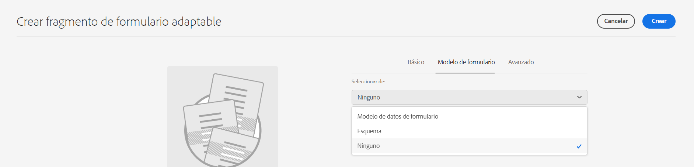

# Guía de introducción del creador de formularios {#creating-an-adaptive-form}

| Versión | Vínculo del artículo |
| -------- | ---------------------------- |
| AEM 6.5 | [Haga clic aquí](https://experienceleague.adobe.com/docs/experience-manager-65/forms/adaptive-forms-basic-authoring/creating-adaptive-form.html?lang=es) |
| AEM as a Cloud Service | Este artículo |

El generador de formularios de AEM Forms le permite crear formularios atractivos, interactivos, dinámicos y adaptables. Tanto si es el creador de formularios que crea formularios profesionales como si necesita crear formularios adaptables rápidamente, AEM Forms le ofrece un asistente fácil de usar. El asistente dispone de un rápido desplazamiento por pestañas para seleccionar fácilmente plantillas, estilos, campos y opciones de envío preconfiguradas.

{width="100%" align="center"}

Antes de empezar, obtenga información sobre el tipo de componentes de Forms disponibles para usted:

* [Componentes principales de formularios adaptables](https://experienceleague.adobe.com/docs/experience-manager-core-components/using/adaptive-forms/introduction.html?lang=es): son componentes estandarizados de captura de datos. Estos componentes proporcionan funcionalidades de personalización, un tiempo de desarrollo reducido y costes de mantenimiento más bajos para sus experiencias de inscripción digital. Un desarrollador puede personalizar y aplicar estilo fácilmente a estos componentes. Puede visitar [https://aemcomponents.dev/](https://aemcomponents.dev/) para ver los componentes principales disponibles en acción **Adobe recomienda utilizar estos componentes modernos y ampliables para desarrollar formularios adaptables**.

* [Componentes de base de formularios adaptables](creating-adaptive-form.md): estos son componentes clásicos (antiguos) de captura de datos. Puede seguir utilizándolos para editar su Formulario adaptable basado en componentes de base existentes. Si está creando formularios nuevos, Adobe recomienda utilizar los [Componentes principales de Formularios adaptables para crear Formularios adaptables](#create-an-adaptive-form-core-components).

>[!BEGINTABS]

>[!TAB Creación de formularios adaptables con componentes principales (recomendado)]

Para crear un formulario adaptable, es necesario lo siguiente:

* **Una plantilla de formulario adaptable**: Una plantilla ofrece una estructura básica y define el aspecto (diseños y estilos) de un formulario adaptable. Tiene componentes con formato previo que contienen determinadas propiedades y estructura de contenido. También ofrece opciones para definir una temática y una acción de envío. La temática define la apariencia, y la acción de envío define la acción que debe realizarse al enviar un Formulario adaptable. Por ejemplo, enviar los datos recopilados a una fuente de datos. El servicio en la nube proporciona una plantilla OOTB, denominada en blanco:

   * La plantilla `blank` se incluye con cada nuevo programa as a Cloud Service de AEM Forms.
   * Puede instalar el paquete de referencia mediante el Administrador de paquetes para agregar la plantilla `blank` a su programa as a Cloud Service de AEM Forms.
   * También puede [crear una plantilla de formularios adaptables (componentes principales)](template-editor.md) desde cero.

* **Una temática de formulario adaptable**: Una temática contiene detalles de estilo para los componentes y paneles. Los estilos incluyen propiedades como colores de fondo, colores de estado, transparencia, alineación y tamaño. Al aplicar una temática, el estilo especificado se refleja en los componentes correspondientes.  La plantilla `Canvas` se incluye con cada nuevo programa as a Cloud Service de AEM Forms.
  <!-- * You can install the reference package, via package manager, to add the `Canvas` template to your AEM Forms as a Cloud Service program.
    * You can also [create an Adaptive Forms theme (Core Components)](template-editor.md) and deploy it to your AEM Forms as a Cloud Service program. -->

* **Permisos**: añada sus usuarios al grupo [!DNL forms-users]. Los miembros del grupo [!DNL forms-users] tienen permisos para crear un formulario adaptable. Para obtener una lista detallada de los formularios y grupos de usuarios específicos, consulte [Grupos y permisos](forms-groups-privileges-tasks.md).

## Crear un formulario adaptable {#create-an-adaptive-form-core-components}

1. Inicie sesión en la instancia de autor de [!DNL Experience Manager Forms]. Puede ser una instancia de nube o una instancia de desarrollo local.

1. Introduzca sus credenciales en la página de inicio de sesión de Experience Manager. Cuando haya iniciado sesión, en la esquina superior izquierda, seleccione **[!UICONTROL Adobe Experience Manager]** > **[!UICONTROL Formularios]** > **[!UICONTROL Formularios y documentos]**.

1. Seleccione **[!UICONTROL Crear]** > **[!UICONTROL Formularios adaptables]**. Se abre el asistente. En la pestaña Fuente, seleccione una plantilla:

   {width="100%" align="center"}

   Al seleccionar una plantilla, se selecciona automáticamente un tema y una acción de envío especificados en la plantilla, y se habilita el botón **[!UICONTROL Crear]**. Puede ir a las pestañas **[!UICONTROL Estilo]** o **[!UICONTROL Envío]** para seleccionar un tema o acción de envío diferente. Si la plantilla seleccionada no especifica ninguna temática, el botón Crear permanece desactivado. Puede ir a la pestaña **[!UICONTROL Estilos]** para seleccionar manualmente una temática.

   >[!NOTE]
   >
   >
   > Si no tiene la plantilla de **Formularios adaptables (componente principal)** en su entorno, [Habilite los componentes principales de formularios adaptables para su entorno](setup-local-development-environment.md#enable-adaptive-forms-core-components-for-an-existing-aem-archetype-based-project). Al habilitar los componentes principales para su entorno, la plantilla de **Formularios adaptables (componente principal)** se agrega al entorno.

1. En la pestaña **[!UICONTROL Estilo]**, seleccione una temática:

   * Cuando la plantilla seleccionada especifica una temática, la temática se selecciona automáticamente en el asistente. También puede elegir una temática diferente de la pestaña Estilo.

   * Si la plantilla seleccionada no especifica ninguna temática, puede utilizar la pestaña Estilo para elegir una temática. El botón **[!UICONTROL Crear]** solo se habilita después de seleccionar una temática.

1. (Opcional) En la pestaña Datos, seleccione un modelo de datos:

   * **Modelo de datos de formulario**: un [Modelo de datos de formulario (FDM)](data-integration.md) le permite integrar entidades y servicios de distintas fuentes de datos en un formulario adaptable. Elija el modelo de datos de formulario (FDM) si el formulario adaptable que está creando implica recuperar y escribir datos desde y hacia varias fuentes de datos.

   * **Esquema JSON**: [Esquema JSON](adaptive-form-json-schema-form-model.md) Nuestro formulario adaptable basado en componentes principales permite una integración optimizada con el sistema back-end de su organización al proporcionar la capacidad de asociar un esquema JSON, que representa la estructura de los datos que se producen o consumen. Esta asociación permite a los autores añadir contenido de forma dinámica al formulario adaptable mediante los elementos del esquema. Los elementos del esquema son fácilmente accesibles en la pestaña Objetos de modelo de datos del Explorador de contenido durante el proceso de creación y todos los campos se añaden automáticamente a cualquier formulario adaptable recién creado.

   De forma predeterminada, todos los campos del esquema JSON asociado se seleccionan automáticamente y se convierten en los correspondientes componentes de formulario adaptable, lo que optimiza el proceso de creación. El asistente ofrece la comodidad añadida de permitirle elegir selectivamente qué campos se deben incluir en el formulario adaptable mediante el uso de casillas de verificación.

1. En la pestaña **[!UICONTROL Envío]**, seleccione una acción de envío:

   * Al seleccionar una plantilla, la acción de envío especificada en la plantilla se selecciona automáticamente. Puede seleccionar una acción de envío diferente en la pestaña Envío. La pestaña **[!UICONTROL Envío]** muestra todas las acciones de envío disponibles.

   * Cuando la plantilla seleccionada no especifica una acción de envío, puede utilizar la pestaña **[!UICONTROL Envío]** para seleccionar una acción de envío

1. (Opcional) En la pestaña **[!UICONTROL Entrega]**, puede especificar una fecha de publicación o cancelación de publicación de un formulario adaptable.

1. Seleccione **[!UICONTROL Crear]**. Aparece un cuadro de diálogo para especificar el título, el nombre y la ubicación para guardar el Formulario adaptable:

   * El **[!UICONTROL Título]** especifica el nombre para mostrar en el formulario. El título le ayuda a identificar el formulario en la interfaz de usuario de [!DNL Experience Manager Forms].
   * **[!UICONTROL Nombre:]** Especifica el nombre del formulario. Se crea un nodo con el nombre especificado en el repositorio. A medida que empieza a escribir un título, el valor del campo de nombre se genera automáticamente. Puede cambiar el valor sugerido. El campo de nombre solo puede incluir caracteres alfanuméricos, guiones y guiones bajos. Todas las entradas no válidas se sustituyen por guiones.
   * **[!UICONTROL Ruta:]** Especifica la ubicación en la que se va a guardar el formulario adaptable. Puede guardar el Formulario adaptable directamente en `/content/dam/formsanddocuments` o crear una carpeta como `/content/dam/formsanddocuments/adaptiveforms` para guardar un Formulario adaptable. Asegúrese de crear la carpeta antes de utilizarla en la ruta. El campo **[!UICONTROL Ruta]** no crea una carpeta automáticamente.

1. Seleccione **[!UICONTROL Crear]**. Se crea un formulario adaptable que se abre en el editor de formularios adaptables. El editor muestra el contenido disponible en la plantilla.  En función del tipo de formulario adaptable, los elementos del formulario presentes en el <!--XFA form template, XML schema or --> esquema JSON o modelo de datos de formulario (FDM) asociado se muestran en la pestaña **[!UICONTROL Objetos de modelo de datos]** del **[!UICONTROL Explorador de contenido]** en la barra lateral.

Ahora puede arrastrar y soltar los [Componentes principales de formularios adaptables](https://experienceleague.adobe.com/docs/experience-manager-core-components/using/adaptive-forms/introduction.html?lang=es#components) o los elementos de esquema para crear el formulario adaptable.

## Editar las propiedades del modelo de formulario de un formulario adaptable {#edit-form-model-core-components-based-adaptive-forms}

1. Seleccione el formulario adaptable e  > **[!UICONTROL Abrir propiedades]**. Se abre la página Propiedades del formulario.

1. Vaya a la pestaña **[!UICONTROL Modelo de formulario]** y elija un modelo de formulario. Si el formulario adaptable no cuenta con un modelo de formulario, tiene la posibilidad de elegir un esquema JSON o un modelo de datos de formulario (FDM). Por otro lado, si el formulario adaptable ya se basa en un modelo de formulario, tiene la opción de cambiar a otro modelo de formulario del mismo tipo. Por ejemplo, si el formulario utiliza un esquema JSON, puede cambiar fácilmente a otro esquema JSON y, asimismo, si el formulario utiliza un modelo de datos de formulario (FDM), puede cambiar a otro modelo de datos de formulario (FDM).

1. Seleccione **[!UICONTROL Guardar]** para guardar las propiedades.

>[!TAB Crear formularios adaptables con componentes de base]

Para crear un formulario adaptable, es necesario lo siguiente:

* **Permisos**: añada los usuarios a [!DNL forms-users] para darles permisos para crear un formulario adaptable. Para obtener una lista detallada de los grupos de usuarios específicos de formularios, consulte [Grupos y permisos](forms-groups-privileges-tasks.md).

* **Una temática de formulario adaptable**: Una temática contiene detalles de estilo para los componentes y paneles. Los estilos incluyen propiedades como colores de fondo, colores de estado, transparencia, alineación y tamaño. Al aplicar una temática, el estilo especificado se refleja en los componentes correspondientes. Puede [crear un tema nuevo](themes.md) o [importar uno existente](import-export-forms-templates.md#uploading-a-theme). También puede implementar el [tipo de archivo más reciente](https://experienceleague.adobe.com/docs/experience-manager-core-components/using/developing/archetype/using.html?lang=es#create-project) para algunas temáticas de ejemplo.

* **Una plantilla de formulario adaptable**: Una plantilla ofrece una estructura básica y define el aspecto (diseños y estilos) de un formulario adaptable. Tiene componentes con formato previo que contienen determinadas propiedades y estructura de contenido. También ofrece opciones para definir una temática y una acción de envío. La temática define la apariencia, y la acción de envío define la acción que debe realizarse al enviar un Formulario adaptable. Por ejemplo, enviar los datos recopilados a una fuente de datos. El servicio en la nube admite dos tipos de plantillas:

   * **Plantilla editable**: puede [crear una](template-editor.md) o [importar una plantilla editable existente](migrate-to-forms-as-a-cloud-service.md). También puede implementar el [arquetipo más reciente](https://experienceleague.adobe.com/docs/experience-manager-core-components/using/developing/archetype/using.html?lang=es#:~:text=El%20tipo%20de%20archivo%20de,servlets%20y%20filtros%20de%20solicitud.%20it.tests%3A%20are%20Java-based%20integration%20tests.) para obtener algunas plantillas editables de ejemplo.

   * **Plantilla estática**: estas son plantillas heredadas y solo se recomiendan para los clientes que migran de Adobe Managed Services (AMS) e instalaciones locales de AEM Forms (AEM Forms 6.5 o anteriores). Esto le permite seguir utilizando su inversión existente en plantillas estáticas. Cuando cree un formulario adaptable, utilice una Plantilla editable.

## Crear un formulario adaptable {#create-an-adaptive-form-foundation-components}

1. Acceda a la instancia de autor de [!DNL Experience Manager Forms]. Puede ser una instancia de nube o una instancia de desarrollo local.

1. Introduzca sus credenciales en la página de inicio de sesión de Experience Manager.

   Cuando haya iniciado sesión, en la esquina superior izquierda, seleccione **[!UICONTROL Adobe Experience Manager]** > **[!UICONTROL Formularios]** > **[!UICONTROL Formularios y documentos]**.

1. Seleccione **[!UICONTROL Crear]** > **[!UICONTROL Formularios adaptables]**. Se abre el asistente.
1. En la pestaña Fuente, seleccione una plantilla:

   * Al seleccionar una Plantilla editable, se seleccionan automáticamente un tema y una acción de envío especificados en la plantilla, y se habilita el botón **[!UICONTROL Crear]**. Puede ir a las pestañas **[!UICONTROL Estilo]** o **[!UICONTROL Envío]** para seleccionar una temática o acción de envío diferente. Si la Plantilla editable seleccionada no especifica ningún tema, el botón Crear permanece desactivado. Puede ir a la pestaña **[!UICONTROL Estilos]** para seleccionar manualmente una temática.

     >[!NOTE]
     >
     > También puede crear una plantilla de un [!UICONTROL Documento de registro] con un editor de formularios adaptables. Para obtener más información, consulte el [Documento de compatibilidad de registros en el Editor de formularios adaptables](/help/forms/generate-document-of-record-for-non-xfa-based-adaptive-forms.md#document-of-record-support-in-adaptive-form-editor-dor-support-in-adaptiveform).

   * Al seleccionar una plantilla estática, las opciones de datos, estilo, envío, entrega y vista previa no están disponibles. Cuando se crea un Formulario adaptable, se recomienda utilizar una Plantilla editable.

1. En la pestaña **[!UICONTROL Estilo]**, seleccione una temática:

   * Cuando la plantilla seleccionada especifica una temática, la temática se selecciona automáticamente en el asistente. También puede elegir una temática diferente de la pestaña Estilo.
   * Si la plantilla seleccionada no especifica ninguna temática, puede utilizar la pestaña Estilo para elegir una temática. El botón **[!UICONTROL Crear]** solo se habilita después de seleccionar una temática.

1. (Opcional) En la pestaña **[!UICONTROL Datos]**, seleccione un modelo de datos:

   * **Modelo de datos de formulario**: el [modelo de datos de formulario (FDM)](data-integration.md) permite integrar entidades y servicios de distintas fuentes de datos en un formulario adaptable. Elija el modelo de datos de formulario (FDM) si el formulario adaptable que está creando implica recuperar y escribir datos desde y hacia varias fuentes de datos.

   * **Esquema JSON**: [El esquema JSON](adaptive-form-json-schema-form-model.md) representa la estructura en la que el sistema back-end de su organización produce o consume datos. Puede asociar el esquema a un formulario adaptable y utilizar sus elementos para agregarle contenido dinámico. Los elementos del esquema están disponibles para su uso en la pestaña Objetos de modelo de datos del explorador de contenido al crear formularios adaptables y todos los campos también se añaden al formulario adaptable creado.

   De forma predeterminada, se seleccionan todos los campos del modelo de datos. Al crear el Formulario adaptable, todos los campos del modelo de datos seleccionado se convierten en los componentes correspondientes del Formulario adaptable. El asistente le proporciona casillas de verificación para seleccionar solo los campos que deben incluirse en el Formulario adaptable.

   <!-- 
   
   If your JSON schema contains a fragment, the fragment is considered a single unit. You can select or deselect a complete fragment and all the fields of the fragment are selected or deselected accordingly. 
   
   -->

1. En la pestaña **[!UICONTROL Envío]**, seleccione una acción de envío:

   * Al seleccionar una plantilla, la acción de envío especificada en la plantilla se selecciona automáticamente. Puede seleccionar una acción de envío diferente en la pestaña Envío. La pestaña **[!UICONTROL Envío]** muestra todas las acciones de envío disponibles.

   * Cuando la plantilla seleccionada no especifica una acción de envío, puede utilizar la pestaña **[!UICONTROL Envío]** para seleccionar una acción de envío.

1. (Opcional) En la pestaña Entrega, puede especificar una fecha de publicación o cancelación de publicación de un formulario adaptable.

1. Seleccione **[!UICONTROL Crear]**. Aparece un cuadro de diálogo para especificar el título, el nombre y la ubicación para guardar el Formulario adaptable:

   * El **[!UICONTROL Título]** especifica el nombre para mostrar en el formulario. El título le ayuda a identificar el formulario en la interfaz de usuario de [!DNL Experience Manager Forms].
   * **[!UICONTROL Nombre:]** Especifica el nombre del formulario. Se crea un nodo con el nombre especificado en el repositorio. A medida que empieza a escribir un título, el valor del campo de nombre se genera automáticamente. Puede cambiar el valor sugerido. El campo de nombre solo puede incluir caracteres alfanuméricos, guiones y guiones bajos. Todas las entradas no válidas se sustituyen por guiones.
   * **[!UICONTROL Ruta:]** Especifica la ubicación en la que se va a guardar el formulario adaptable. Puede guardar el Formulario adaptable directamente en `/content/dam/formsanddocuments` o crear una carpeta como `/content/dam/formsanddocuments/adaptiveforms` para guardar un Formulario adaptable. Asegúrese de crear la carpeta antes de utilizarla en la ruta. El campo **[!UICONTROL Ruta:]** no crea una carpeta automáticamente.

1. Seleccione **[!UICONTROL Crear]**. Se crea un formulario adaptable que se abre en el editor de formularios adaptables. El editor muestra el contenido disponible en la plantilla. También muestra la barra lateral para personalizar el formulario recién creado según las necesidades.

   En relación con el tipo de formulario adaptable, los elementos del formulario presentes en el esquema JSON <!--XFA form template, XML schema or --> o el modelo de datos de formulario (FDM) asociados se muestran en la pestaña **[!UICONTROL Objetos de modelo de datos]** del **[!UICONTROL Explorador de contenido]** en la barra lateral. También puede arrastrar y soltar estos elementos para crear su formulario adaptable.

<!-- ## Create an Adaptive Form based on a Form Data Model {#fdm}

[Data integration](data-integration.md) lets you integrate multiple data sources and bring their entities and services together to create a form data model. It is an extension of JSON schema. You can use a Form Data Model to create an Adaptive Form. The entities or data model objects configured in a Form Data Model are available as data model objects for form authoring. They are bound to respective data sources and used to prefill a form and write submitted data back to the respective data sources. You can also call services configured in a Form Data Model using Adaptive Form rules.

To use a Form Data Model for creating an Adaptive Form:

1. In Form Model tab on Add Properties screen, select **[!UICONTROL Form Data Model]** in the **[!UICONTROL Select From]** drop-down list.

   

1. Select to expand **[!UICONTROL Select Form Data Model]**. All available form data models are listed.Select a from data model.

>[!NOTE]
>
>You can also change the Form Data Model for an Adaptive Form. For detailed steps, see [Edit Form Model properties of an Adaptive Form](#edit-form-model).

## Create an adaptive form based on XML or JSON schema {#create-an-adaptive-form-based-on-xml-or-json-schema}

XML and JSON schemas represent the structure in which data is produced or consumed by the back-end system in your organization. You can associate a schema to an Adaptive Form and use its elements to add dynamic content to the Adaptive Form. The elements of the schema are available in the Data Model Object tab of the content browser for authoring Adaptive Forms. You can drag-drop the schema elements to build the form.

See the following documents to understand how to design XML or JSON schema for authoring Adaptive Forms.

* [Creating Adaptive Forms using XML schema](adaptive-form-xml-schema-form-model.md)
* [Creating Adaptive Forms using JSON schema](adaptive-form-json-schema-form-model.md)

Do the following to use XML or JSON schema as form model for an Adaptive Form:

1. On the **[!UICONTROL Add Properties]** step of Adaptive Form creation page, select on the **[!UICONTROL Form Model]** tab.
1. In the Form Model tab, select **[!UICONTROL Schema]** from the **[!UICONTROL Select From]** drop-down field.

1. Select **[!UICONTROL Select Schema]** and do one of the following:

    * **[!UICONTROL Upload from disk]** - Select this option and select Upload Schema Definition to browse and upload an XML schema or JSON schema from your file system. The uploaded schema file resides with the form and is not accessible to other Adaptive Forms.
    * **[!UICONTROL Search in repository]** - Select this option to select from the list of schema definition files available in the repository. Select the XML or JSON schema file as form model. The selected schema is associated with the form by reference and is accessible for use in other Adaptive Forms.

      Ensure that the JSON schema filename ends with **.schema.json**. For example: mySchema.schema.json

   
**Figure:** *Selecting XML or JSON schema*

1. (For XML schema only) After you select or upload an XML Schema, specify a root element of the selected XSD file to map with the Adaptive Form.

   
**Figure:** *Selecting XSD root element*

>[!NOTE]
>
>You can also change the schema for an Adaptive Form. For detailed steps, see [Edit Form Model properties of an Adaptive Form](#edit-form-model2). -->

## Editar las propiedades del modelo de formulario de un formulario adaptable {#edit-form-model-foundation-components}

Puede cambiar el modelo de formulario para un formulario adaptable (basado en JSON o en el modelo de datos de formulario (FDM)). No se puede cambiar de un modelo de formulario a otro.

1. Seleccione el formulario adaptable y seleccione el icono **Propiedades**.
1. Abra la pestaña **[!UICONTROL Modelo de formulario]** y haga una de las siguientes acciones.

   * Si el formulario adaptable no cuenta con un modelo de formulario, puede elegir otro modelo de formulario y, en consecuencia, seleccionar un esquema XML o JSON <!-- a form template, --> o un modelo de datos de formulario (FDM).
   * Si el formulario adaptable se basa en un modelo de formulario, puede elegir otro esquema XML o JSON <!-- form template, --> o modelo de datos de formulario (FDM) para el mismo modelo de formulario.

1. Seleccione **[!UICONTROL Guardar]** para guardar las propiedades.

También puede modificar las propiedades del modelo del formulario desde el Creador de formularios adaptables o el Creador de plantillas de formulario adaptable.

1. Seleccione el componente **[!UICONTROL Contenedor de formulario adaptable (raíz)]**.
1. Haga clic en el  para abrir **[!UICONTROL Propiedades]** del contenedor del Formulario adaptable.
1. Seleccione la pestaña **[!UICONTROL Modelo de datos]** y realice una de las siguientes acciones:

   * Si el formulario adaptable no posee un modelo de formulario, puede elegir un modelo de formulario y seleccionar un esquema XML o JSON <!-- a form template, -->, o un modelo de datos de formulario (FDM), según corresponda.
   * Si el formulario adaptable se basa en un modelo de formulario, no se puede cambiar el modelo de formulario. Puede elegir otro esquema XML o JSON <!-- form template, -->, o un modelo de datos de formulario (FDM) para el mismo modelo de formulario, según corresponda.
1. Seleccione  para guardar las propiedades.

{width="100%" align="center"}

>[!NOTE]
>
> También puede guardar un formulario adaptable como plantilla. Para obtener más información, consulte [Creación de una plantilla con un formulario adaptable](/help/forms/template-editor.md#saving-an-adaptive-form-as-template-saving-adaptive-form-as-template).

>[!ENDTABS]

## Próximos pasos

* [Utilización de Adobe Sign con Forms](working-with-adobe-sign.md)
* [Utilización de Google reCaptcha con Forms](captcha-adaptive-forms.md)
* [Añadir una sección repetible a un formulario](create-forms-repeatable-sections.md)
* [Rellenar previamente campos de un formulario](prepopulate-adaptive-form-fields.md)

>[!MORELIKETHIS]
>
>* [Crear un formulario adaptable](/help/forms/creating-adaptive-form-core-components.md)
