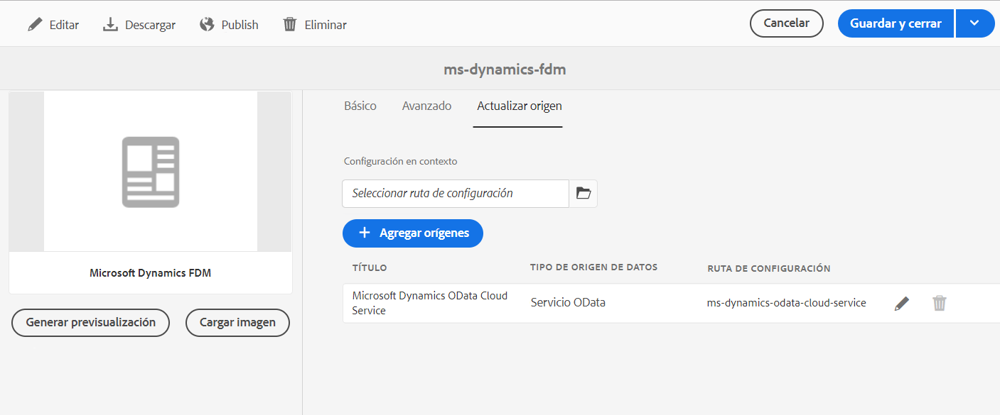

# Crear modelo de datos de formulario (FDM) {#create-form-data-model}

| Versión | Vínculo del artículo |
| -------- | ---------------------------- |
| AEM 6.5 | [Haga clic aquí](https://experienceleague.adobe.com/docs/experience-manager-65/forms/form-data-model/create-form-data-models.html?lang=es) |
| AEM as a Cloud Service | Este artículo |

La integración de datos de [!DNL Experience Manager Forms] ofrece una interfaz de usuario intuitiva para crear y trabajar con modelos de datos de formulario. Un modelo de datos de formulario (FDM) se basa en fuentes de datos para el intercambio de datos; sin embargo, puede crear un modelo de datos de formulario (FDM) con o sin una fuente de datos. Existen dos métodos para crear un modelo de datos de formulario en función de si ha configurado fuentes de datos:

* **Utilizando fuentes de datos preconfiguradas**: si ha configurado las fuentes de datos tal como se describe en [Configurar fuentes de datos](configure-data-sources.md), puede seleccionarlas al crear un modelo de datos de formulario (FDM). Incorpora todos los objetos, propiedades y servicios del modelo de datos de las fuentes de datos seleccionadas que se pueden utilizar en el modelo de datos de formulario (FDM).

* **Sin fuentes de datos**: si no ha configurado fuentes de datos para su modelo de datos de formulario (FDM), puede crearlo sin fuentes de datos. Puede utilizar el modelo de datos de formulario (FDM) para crear formularios adaptables <!--and interactive communication--> y probarlos utilizando datos de muestra. Cuando hay fuentes de datos disponibles, puede vincular el modelo de datos de formulario (FDM) con fuentes de datos, lo que se refleja automáticamente en los formularios adaptables asociados<!--and interactive communications-->.

>[!NOTE]
>
>Debe ser miembro de los grupos **fdm-author** y **forms-user** para poder crear y trabajar con el modelo de datos de formulario (FDM). Póngase en contacto con su administrador de [!DNL Experience Manager] para convertirse en miembro de los grupos.

## Crear modelo de datos de formulario (FDM) {#data-sources}

Asegúrese de haber configurado las fuentes de datos que desea utilizar en el modelo de datos de formulario (FDM) como se describe en [Configurar fuentes de datos](configure-data-sources.md). Para crear un modelo de datos de formulario (FDM) basado en fuentes de datos configuradas, haga lo siguiente:

1. En la instancia de autor de [!DNL Experience Manager], vaya a **[!UICONTROL Formularios > Integraciones de datos]**.
1. Seleccione **[!UICONTROL Crear > Modelo de datos de formulario]**.
1. En el cuadro de diálogo Crear un modelo de datos de formulario, haga lo siguiente:

   * Especifique un nombre para el modelo de datos del formulario (FDM).
   * (**Opcional**) Especifique el título, la descripción y las etiquetas del modelo de datos del formulario (FDM).
   * (**Opcional y aplicable solo si se configuran fuentes de datos**) Seleccione el icono de verificación situado junto al campo **[!UICONTROL Configuración de la fuente de datos]** y seleccione el nodo de configuración donde residen los servicios en la nube para las fuentes de datos que desea utilizar. Restringe la lista de fuentes de datos disponibles para su selección en la página siguiente a las disponibles en el nodo de configuración seleccionado. Sin embargo, cualquier fuente de datos de perfil de usuario de [!DNL Experience Manager] se enumera de forma predeterminada. Si no selecciona un nodo de configuración, se enumeran las fuentes de datos de todos los nodos de configuración.

1. Seleccione **[!UICONTROL Siguiente]**.

1. (**Aplicable únicamente si se han configurado fuentes de datos**). La pantalla **[!UICONTROL Seleccionar fuente de datos]** enumera las fuentes de datos disponibles, si las hay. Seleccione las fuentes de datos que desee utilizar en el modelo de datos de formulario.
1. Seleccione **[!UICONTROL Crear]** y en el cuadro de diálogo de confirmación, seleccione **[!UICONTROL Abrir]** para abrir el editor del modelo de datos de formulario.

   Revisemos los diferentes componentes de la interfaz de usuario del editor del modelo de datos de formulario.

   ![Un modelo de datos de formulario con tres fuentes de datos: un servicio RESTful, un perfil de usuario de [!DNL Experience Manager] y un RDBMS](assets/fdm-ui.png)

   A. **[!UICONTROL Fuentes de datos]** Muestra las fuentes de datos en un modelo de datos de formulario. Expanda una fuente de datos para ver los objetos y servicios del modelo de datos.

   B. **[!UICONTROL Actualizar definiciones de fuentes de datos]** Recupera cualquier cambio en las definiciones de fuentes de datos configuradas y las actualiza en la pestaña Fuentes de datos del editor del modelo de datos de formulario.

   C. **[!UICONTROL Modelo]** Área de contenido en la que aparecen los objetos del modelo de datos añadidos.

   D. **[!UICONTROL Servicios]** Área de contenido en la que aparecen las operaciones o los servicios de las fuentes de datos añadidas.

   E. **[!UICONTROL Barra de herramientas]** Herramientas para trabajar con el modelo de datos de formulario (FDM). La barra de herramientas muestra más opciones en función del objeto seleccionado en el modelo de datos de formulario (FDM).

   F. **[!UICONTROL Añadir selección]** Añade objetos y servicios del modelo de datos seleccionado al modelo de datos de formulario.

Para obtener más información sobre el editor del modelo de datos de formulario y cómo puede trabajar con él para editar y configurar el modelo de datos de formulario (FDM), consulte [Trabajar con el modelo de datos de formulario](work-with-form-data-model.md).

## Actualizar fuentes de datos {#update}

Haga lo siguiente para agregar o actualizar fuentes de datos en un modelo de datos de formulario existente (FDM).

1. Vaya a **[!UICONTROL Formularios > Integraciones de datos]**, seleccione el modelo de datos de formulario (FDM) en el que desea agregar o actualizar las fuentes de datos y seleccione **[!UICONTROL Propiedades]**.
1. En las propiedades del modelo de datos de formulario, vaya a la pestaña **[!UICONTROL Actualizar fuente]**.

   En la pestaña **[!UICONTROL Actualizar fuente]**:

   * Seleccione el icono Examinar en el campo **[!UICONTROL Configuración según el contexto]** y seleccione un nodo de configuración en el que reside la configuración de nube para la fuente de datos que desea agregar. Si no selecciona ningún nodo, solo se enumeran las configuraciones de nube que residen en el nodo `global` al seleccionar **[!UICONTROL Añadir fuentes]**.

   * Para añadir una fuente de datos nueva, seleccione **[!UICONTROL Añadir fuentes]** y elija las fuentes de datos que desea añadir al modelo de datos de formulario. Se muestran todas las fuentes de datos configuradas en `global` y el nodo de configuración seleccionado, de haber.

   * Para reemplazar una fuente de datos existente por otra fuente de datos del mismo tipo, seleccione el icono **[!UICONTROL Editar]** para la fuente de datos y seleccione en la lista de fuentes de datos disponibles.
   * Para eliminar una fuente de datos existente, seleccione el icono **[!UICONTROL Eliminar]** para la fuente de datos. El icono Eliminar está deshabilitado si se añade un objeto de modelo de datos en la fuente de datos en el modelo de datos del formulario (FDM).

     

1. Seleccione **[!UICONTROL Guardar y cerrar]** para guardar las propiedades.

>[!NOTE]
>
>Una vez que añada nuevas fuentes de datos o actualice las existentes en un modelo de datos de formulario (FDM), asegúrese de actualizar las referencias de enlace, según corresponda, en los formularios adaptables<!--and interactive communications--> que utilizan el modelo de datos de formulario actualizado.

## Configuraciones según el contexto para modos de ejecución específicos {#runmode-specific-context-aware-config}

[!UICONTROL El modelo de datos de formulario (FDM)] utiliza [Configuraciones según el contexto de Sling](https://experienceleague.adobe.com/docs/experience-manager-core-components/using/developing/context-aware-configs.html?lang=es) para ser compatible con distintos parámetros de fuente de datos y conectarse con fuentes de datos para diferentes modos de ejecución de [!DNL Experience Manager].

Cuando el [!UICONTROL modelo de datos de formulario (FDM)] utiliza configuraciones de nube para almacenar parámetros, que cuando se registran e implementan mediante el control de fuente (repositorio GIT de Cloud Manager) crea una configuración de nube con los mismos parámetros para todos los modos de ejecución (desarrollo, fase y producción). Sin embargo, en los casos de uso en los que sea necesario tener diferentes conjuntos de datos para entornos de prueba y producción, se utilizan parámetros de fuente de datos (por ejemplo, la URL de la fuente de datos) para diferentes modos de ejecución de [!DNL Experience Manager].

Para conseguirlo, debe crear una configuración de OSGi que contenga pares de parámetros-valor de la fuente de datos. Esto anula el mismo par de la configuración de nube del [!UICONTROL modelo de datos de formulario (FDM)] en el momento de ejecución. Como las configuraciones de OSGi son compatibles con estos modos de ejecución de forma predeterminada, puede anular un parámetro de fuente de datos en diferentes valores según el modo de ejecución.

Para habilitar las configuraciones de nube específicas de la implementación en el [!UICONTROL modelo de datos de formulario (FDM)]:

1. Cree una configuración de nube en la instancia de desarrollo local. Para ver los pasos detallados, consulte [Cómo configurar las fuentes de datos](/help/forms/configure-data-sources.md).

1. Almacene su configuración de nube en el sistema de archivos.
   1. Cree un paquete con el filtro `/conf/{foldername}/settings/cloudconfigs/fdm`. Utilice el mismo `{foldername}` que en el paso 1. Y reemplace `fdm` con `azurestorage` para la configuración de almacenamiento de Azure.
   1. Cree y descargue el paquete. Para obtener más información, consulte las [acciones de paquete](/help/implementing/developing/tools/package-manager.md).

1. Integrar la configuración de nube en un tipo de archivo del proyecto [!DNL Experience Manager].
   1. Descomprima el paquete descargado.
   1. Copie la carpeta `jcr_root` y colóquela en `ui.content` > `src` > `main` > `content`.
   1. Actualice `ui.content` > `src` > `main` > `content` > `META-INF` > `vault` > `filter.xml` para contener el filtro `/conf/{foldername}/settings/cloudconfigs/fdm`. Para obtener más información, consulte [módulo ui.content de tipo de archivo del proyecto AEM](https://experienceleague.adobe.com/docs/experience-manager-core-components/using/developing/archetype/uicontent.html?lang=es). Cuando este tipo de archivo del proyecto se implementa mediante la canalización de CM, la misma configuración de nube se instala en todos los entornos (o modos de ejecución). Para cambiar el valor de los campos (como la URL) de las configuraciones de nube basadas en el entorno, utilice la configuración de OSGi que se describe en el siguiente paso.

1. Cree una configuración de Apache Sling según el contexto. Para crear la configuración de OSGi:
   1. **Establezca los archivos de configuración de OSGi en el tipo de archivo del proyecto [!DNL Experience Manager].**
Cree los archivos de configuración de fábrica de OSGi con PID `org.apache.sling.caconfig.impl.override.OsgiConfigurationOverrideProvider`.  Cree un archivo con el mismo nombre en cada carpeta del modo de ejecución donde los valores deban cambiarse por modo de ejecución. Para obtener más información, consulte [Configurar OSGi para  [!DNL Adobe Experience Manager]](/help/implementing/deploying/configuring-osgi.md#creating-sogi-configurations).

   1. **Establezca el json de configuración de OSGI.** Para utilizar el proveedor de anulación de configuración de Apache Sling según el contexto:
      1. En la instancia de desarrollo local `/system/console/configMgr`, seleccione la configuración de fábrica de OSGi con el nombre **[!UICONTROL Proveedor de anulación de configuración de Apache Sling según el contexto: Configuración de OSGi]**.
      1. Aporte una descripción.
      1. Seleccione **[!UICONTROL habilitado]**.
      1. En las anulaciones, indique los campos que deben cambiarse en función del entorno en la sintaxis de anulación de Sling. Para obtener más información, consulte [Configuración de Apache Sling según el contexto: Anular](https://sling.apache.org/documentation/bundles/context-aware-configuration/context-aware-configuration-override.html#override-syntax). Por ejemplo, `cloudconfigs/fdm/{configName}/url="newURL"`. 
Se pueden agregar varias anulaciones seleccionando **[!UICONTROL +]**.
      1. Seleccione **[!UICONTROL Guardar]**.
      1. Para obtener el JSON de configuración de OSGI, siga los pasos en [Generar configuraciones de OSGi mediante la iniciación a AEM SDK](/help/implementing/deploying/configuring-osgi.md#generating-osgi-configurations-using-the-aem-sdk-quickstart).
      1. Coloque el JSON en los archivos de configuración de fábrica de OSGi creados en el paso anterior.
      1. Cambie el valor de `newURL` en función del entorno (o modo de ejecución).
      1. Para cambiar el valor secreto en función del modo de ejecución, se puede crear una variable secreta mediante la [API de Cloud Manager](/help/implementing/deploying/configuring-osgi.md#cloud-manager-api-format-for-setting-properties) y más adelante en la sección [Configuración de OSGi](/help/implementing/deploying/configuring-osgi.md#secret-configuration-values). 
Cuando este tipo de archivo del proyecto se implementa mediante la canalización de CM, la anulación ofrece valores diferentes en entornos diferentes (o modos de ejecución).

      >[!NOTE]
      >
      >Los usuarios de [!DNL Adobe Managed Service] pueden cifrar los valores secretos utilizando la compatibilidad con cifrado (para obtener más información, consulte [compatibilidad con cifrado para propiedades de configuración](https://experienceleague.adobe.com/docs/experience-manager-65/administering/security/encryption-support-for-configuration-properties.html?lang=es#enabling-encryption-support)) y colocar texto cifrado en el valor después de [las configuraciones según el contexto están disponibles en Service Pack 6.5.13.0](https://experienceleague.adobe.com/docs/experience-manager-65/forms/form-data-model/create-form-data-models.html?lang=es#runmode-specific-context-aware-config).

1. Actualice las definiciones de fuentes de datos mediante la opción para actualizar las definiciones de fuentes de datos en el [Editor del modelo de datos de formulario](#data-sources) para actualizar la caché de FDM mediante la interfaz de usuario de FDM y obtener la configuración más reciente.

## Pasos siguientes {#next-steps}

Ahora tiene un modelo de datos de formulario (FDM) con fuentes de datos añadidas. A continuación, puede editar el modelo de datos de formulario para añadir y configurar objetos y servicios del modelo de datos, añadir asociaciones entre objetos del modelo de datos, editar propiedades, añadir objetos y propiedades del modelo de datos personalizado, generar datos de muestra, etc.

Para obtener más información, consulte [Trabajo con el modelo de datos de formulario](work-with-form-data-model.md).

