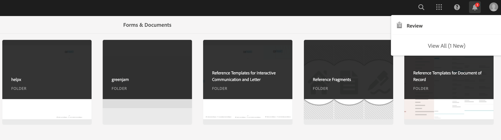
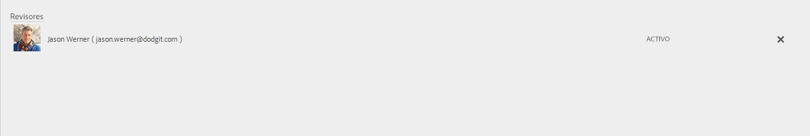
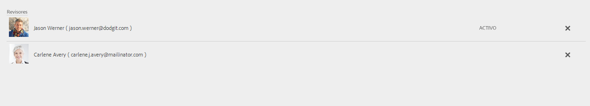

# Creación y administración de las revisiones en los formularios{#creating-and-managing-reviews-to-forms}

 Adobe recomienda utilizar la captura de datos moderna y ampliable [Componentes principales](https://experienceleague.adobe.com/docs/experience-manager-core-components/using/adaptive-forms/introduction.html?lang=es) para [crear un nuevo formulario adaptable](/help/forms/creating-adaptive-form-core-components.md) o [añadir formularios adaptables a páginas de AEM Sites](/help/forms/create-or-add-an-adaptive-form-to-aem-sites-page.md). Estos componentes representan un avance significativo en la creación de formularios adaptables, lo que garantiza experiencias de usuario impresionantes. Este artículo describe un enfoque antiguo para crear Formularios adaptables mediante componentes de base. 

| Versión | Vínculo del artículo |
| -------- | ---------------------------- |
| AEM 6.5 | [Haga clic aquí](https://experienceleague.adobe.com/docs/experience-manager-65/forms/adaptive-forms-advanced-authoring/create-reviews-forms.html?lang=es) |
| AEM as a Cloud Service | Este artículo |

## Revisión {#review}

Una revisión es un mecanismo que permite a uno o más revisores realizar comentarios sobre los formularios.

## Configurar una revisión {#setting-up-a-review}

1. Vaya al explorador de formularios y seleccione un formulario para revisarlo.
1. Si el Formulario no tiene ninguna revisión en curso, aparecerá el icono **Iniciar revisión**  en la barra de acciones. Haga clic en el icono **Iniciar revisión** 
1. Especifique la siguiente información:

   * **Título**: obligatorio. Puede contener caracteres alfanuméricos, guiones o guiones bajos.
   * **Descripción**: opcional, descripción del objetivo/contenido de la revisión.
   * **Fecha límite**: opcional, fecha en la que finaliza la revisión. Si se sobrepasa la fecha límite, la tarea aparece como “Vencida”.
   * **Nombre del revisor**: es obligatorio especificar al menos uno. Utilice el cuadro combinado para agregar revisores, escribiendo una lista de nombres con todos los nombres coincidentes; seleccione un nombre y haga clic en **Añadir**. En la siguiente sección de la pestaña **Revisores** se muestra el nombre de todos los revisores.

1. Haga clic en **Inicio** para comenzar una revisión.

   >[!NOTE]
   >
   >* El administrador puede acceder a cualquier grupo asociado con los usuarios del formulario.
   >* El grupo Usuarios de servicio no se puede seleccionar para la revisión.

### Acciones asociadas a la configuración de una revisión {#actions-that-occur-when-a-review-is-set-up}

Esta sección describe lo que sucede cuando se crea o configura una revisión.

1. Se crea una nueva tarea de revisión y se asigna al revisor seleccionado.
1. A todos los revisores se les asigna una tarea de revisión. La tarea aparece en la sección Notificaciones. Un revisor puede hacer clic en una notificación o ir a la Bandeja de entrada para ver la tarea. Un revisor puede hacer clic en para abrir la tarea de revisión, ver el formulario y empezar a añadir comentarios.

   

   Alerta de notificación del revisor

1. El cuadro de comentarios está disponible para los revisores del formulario. Otros pueden leer los comentarios pero no agregar los suyos propios.

## Administrar una revisión {#managing-a-review}

>[!NOTE]
>
>* Solo se pueden modificar las revisiones en progreso.
>* Las revisiones completadas no se pueden modificar.

1. Vaya a la pestaña Formularios y seleccione un formulario.

1. Si un formulario tiene una revisión en curso y usted es el iniciador de la revisión, aparece el icono **Administrar revisión**  en la barra de acciones. Solo el iniciador de revisión puede administrar (actualizar/finalizar) la revisión.

   Haga clic en el icono **Administrar revisión** 

   El icono Administrar revisión está deshabilitado para los usuarios distintos del iniciador.

1. Aparece una pantalla que muestra la información:

   * **Nombre de la revisión**: no se puede editar.

   * **Descripción de la revisión**: disponible para edición.

   * **Fecha límite de la revisión**: disponible para edición. Se puede modificar la fecha límite para establecer cualquier fecha y hora posterior a la fecha y la hora actuales.

   * **Revisores**: disponible para edición. Puede agregar o quitar revisores. Si una tarea ha vencido, solo podrá agregar revisores una vez que amplíe la fecha límite hasta pasada la fecha actual.

1. Para finalizar la revisión, haga clic en **Finalizar**.

### Acciones asociadas a la modificación de una revisión {#actions-that-occur-when-a-review-is-modified}

Esta sección describe lo que sucede cuando se **actualiza o finaliza una revisión**:

1. Si se modifica la descripción de la revisión, se actualiza la tarea correspondiente de los revisores y el iniciador.
1. Si se modifica la fecha límite de la revisión, se actualiza la tarea correspondiente de los revisores a la nueva fecha.

1. Si se quita un revisor:

   

   Quitar un revisor

   1. Si la tarea asignada está incompleta, termina.
   1. El revisor ya no puede comentar en el formulario.

1. Si se agrega un revisor:

   

   Agregar un revisor

   1. Se crea una tarea de revisión y se asigna al revisor que se acaba de agregar.
   1. El revisor que se acaba de agregar puede añadir comentarios acerca del formulario.

1. Cuando finaliza una revisión:

   1. **Revisores**: se termina la tarea incompleta relacionada con la revisión de cada uno de los revisores. La tarea ya no aparece como “Pendiente” en la sección Notificaciones del revisor.
   1. **Iniciador**: la tarea asignada al iniciador de la revisión se marca como completada y se quita de la sección Notificación del iniciador de la revisión.
   1. **Todos**: la revisión se muestra en la sección Revisiones anteriores. No se pueden añadir más comentarios.

   
