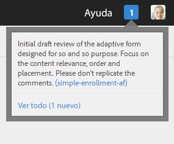
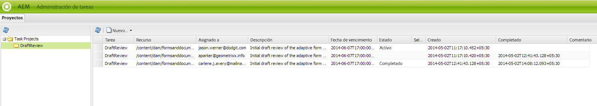

# Creación y administración de revisiones para recursos en formularios{#creating-and-managing-reviews-for-assets-in-forms}

## Crítica {#review}

Una revisión es un mecanismo que permite a uno o más revisores realizar comentarios sobre un recurso que está disponible en un formulario.

## Configuración de una revisión {#setting-up-a-review}

1. Vaya a la ficha Forms y seleccione un formulario.
1. Si el recurso no tiene una revisión en curso, consulte Iniciar revisión  aparece en la barra de acciones. Haga clic en Iniciar revisión  icono.
1. Indique la siguiente información:

   * Revisar nombre: obligatorio, puede contener caracteres alfanuméricos, guiones o guiones bajos.
   * Revisar descripción: Opcional, descripción del propósito/contenido para su revisión.
   * Revisar fecha límite: Opcional: la fecha en la que finaliza la revisión. Cuando ha pasado la fecha límite, la tarea aparece como &quot;Vencido&quot;.
   * Revisores: Un mínimo de uno es obligatorio. Utilice el cuadro combinado para añadir revisores. Si se escribe un nombre, se mostrarán todos los nombres coincidentes; seleccione un nombre y haga clic en Agregar.

1. Complete todos los detalles restantes y haga clic en Inicio.

### Acciones que se producen cuando se configura una revisión {#actions-that-occur-when-a-review-is-set-up}

En esta sección se describe lo que sucede cuando se crea o configura una revisión.

1. Se crea una nueva tarea de revisión y se asigna al iniciador de la revisión.
1. A todos los revisores se les asigna una tarea de revisión. La tarea aparece en la sección Notificaciones. Un revisor puede hacer clic en una notificación o ir a la Bandeja de entrada para ver la tarea. Un revisor puede hacer clic en para abrir la tarea de revisión, ver el formulario y empezar a añadir comentarios.

   

   Alerta de notificación del revisor

1. El cuadro de comentarios está disponible para el iniciador y los revisores del recurso. Otros pueden ver los comentarios, pero no pueden escribir comentarios.

## Administración de una revisión {#managing-a-review}

>[!NOTE]
>
>Solo se pueden modificar las revisiones en curso. Las revisiones completadas no se pueden modificar.

1. Vaya a la ficha Forms y seleccione un formulario.

1. Si un recurso tiene una revisión en curso y usted es el iniciador de la revisión, seleccione Administrar revisión  aparecen en la barra de acciones. Solo el iniciador de revisión puede administrar (actualizar/finalizar) la revisión.

   Haga clic en Administrar revisión icono.

   Para usuarios que no sean el iniciador, el icono Administrar revisión está deshabilitado.

1. Se obtiene una pantalla que muestra información:

   * **Revisar nombre**: No se puede editar.

   * **Revisar descripción**: Disponible para edición.

   * **Revisar fecha límite**: Disponible para edición. Se puede modificar la fecha límite a cualquier fecha y hora después de la fecha y hora actuales.

   * **Revisores**: Disponible para edición. Puede agregar o eliminar revisores. Si una tarea ha vencido, puede agregar revisores solo después de ampliar la fecha límite más allá de la fecha actual.

1. Edite los campos necesarios y, a continuación, haga clic en Actualizar.

   

   Revisar estado actualizado en el Administrador de tareas

1. Para finalizar la revisión, haga clic en Finalizar.

### Acciones que se producen cuando se modifica una revisión {#actions-that-occur-when-a-review-is-modified}

En esta sección se describe lo que sucede en la revisión final/modificación:

1. Si se modifica la descripción de la revisión, se actualiza la tarea correspondiente de los revisores y el iniciador.
1. Si se modifica la fecha límite de revisión, la tarea correspondiente para los revisores se actualiza con la nueva fecha.

1. Si se elimina un revisor:

   

   Eliminación de un revisor

   1. Si está incompleta, la tarea asignada termina.
   1. El revisor ya no puede realizar comentarios en el recurso.

1. Si se agrega un revisor:

   

   Adición de un revisor

   1. Se crea una tarea de revisión y se asigna al revisor recién agregado.
   1. El revisor recién añadido puede añadir comentarios para el recurso.

1. Cuando finaliza una revisión:

   1. **Revisores**: Para cada revisor, se termina la tarea incompleta relacionada con la revisión. La tarea ya no aparece como &quot;Pendiente&quot; en la sección Notificaciones del revisor.
   1. **Iniciador**: La tarea asignada al iniciador de revisión está marcada como completada. La tarea se elimina de la sección Notificación del iniciador de la revisión.
   1. **Todo**: La revisión aparece en la sección Revisiones anteriores . No se pueden añadir más comentarios.

