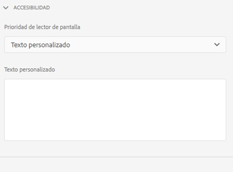
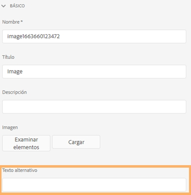

# Creación de formularios adaptables accesibles {#creating-accessible-adaptive-forms}

## Introducción {#introduction}

Un formulario accesible es un formulario que todos pueden utilizar, incluidos los usuarios con necesidades especiales. Los formularios adaptables incluyen una serie de características y funcionalidades que mejoran el uso de los usuarios con diferentes capacidades. La creación de accesibilidad en los formularios adaptables no solo permite la mayor audiencia posible de contenido, sino que también es un requisito al proporcionar documentos en zonas geográficas en las que se exige el cumplimiento de los estándares de accesibilidad. [!DNL AEM Forms] ayuda a los desarrolladores de formularios a cumplir con los estándares de accesibilidad.

Durante la creación de un formulario adaptable, el autor debe tener en cuenta los siguientes puntos para crear un formulario adaptable accesible:

* Comprobar el formulario con la herramienta de prueba de accesibilidad Inspector de nombres y descripciones accesibles (ANDI)
* Proporcionar las etiquetas adecuadas para los controles del formulario
* Proporcionar equivalentes de texto para las imágenes
* Proporcionar suficiente contraste de color
* Asegúrese de que los controles del formulario son accesibles mediante el teclado

## Requisitos previos

Necesita una herramienta de accesibilidad como **Inspector de nombres y descripciones accesibles (ANDI)** y un **tema del formulario adaptable desarrollado para solucionar problemas relacionados con la accesibilidad** para crear un formulario adaptable accesible.

### Descargar e instalar la herramienta de prueba de accesibilidad

La herramienta Inspector de nombres y descripciones accesibles (ANDI) ayuda a identificar y corregir los problemas relacionados con el cumplimiento de la accesibilidad en el contenido web. Es la herramienta recomendada bajo las directrices de Trusted Tester v5 del Departamento de Seguridad Nacional. El departamento de la administración de la Seguridad Social de Estados Unidos lo desarrolla para comprobar que la Sección 508 cumpla con el contenido web. La herramienta:

* Ayuda a detectar problemas de accesibilidad &#x200B;en una página web
* Proporciona sugerencias para mejorar la accesibilidad &#x200B;
* Detecta problemas de accesibilidad del teclado y del contraste de color
* Identifica claramente el contenido del lector de pantalla de acuerdo con los estándares

ANDI trabaja con los principales exploradores de Internet. Consulte la [documentación de ANDI](https://www.ssa.gov/accessibility/andi/help/install.html) para obtener instrucciones detalladas sobre cómo configurar y utilizar la herramienta.

### Descargue e instale la temática Ultramarine-Accessible

El tema Ultramarine-Accessible es un tema de referencia. Muestra cómo corregir el contraste de color y otros problemas relacionados con la accesibilidad en un formulario adaptable. Adobe recomienda crear un tema personalizado para el entorno de producción en función de los estilos aprobados por su organización. Para cargar la temática en la instancia de AEM, haga lo siguiente:

1. Descargue el paquete de temáticas.
1. Vaya a **[!UICONTROL Experience Manager]** > **[!UICONTROL Navegación]**  > **[!UICONTROL Forms]** en la instancia de AEM.
1. Seleccionar **[!UICONTROL Crear]** > **[!UICONTROL Carga de archivos]**. Seleccione y cargue el archivo x Ultramarine-Accessible-Theme.zip. Cargue el tema en la instancia de AEM.

## Hacer accesible un formulario adaptable

Debe centrarse en cuatro aspectos clave: navegación mediante el teclado, contraste de color, texto alternativo significativo para imágenes y etiquetas adecuadas para los controles del formulario para que un formulario adaptable sea accesible. Realice los siguientes pasos para hacer accesible el formulario adaptable existente:

### 1. Aplique un tema accesible y realice correcciones adicionales

Aplique el tema Ultramarine-Accessible al formulario adaptable existente. Para aplicar el tema, haga lo siguiente:

1. Abra el formulario adaptable para editarlo.
1. Seleccione un componente y seleccione el icono principal. En el menú contextual, seleccione **[!UICONTROL Contenedor de formulario adaptable]** y, a continuación, seleccione el icono configurar.
1. Seleccione la temática Ultramarine-Accessible en el explorador de propiedades y seleccione **[!UICONTROL Guardar]** icono.
1. Actualice la ventana del explorador. El tema se aplica al formulario adaptable.

Después de aplicar un tema accesible, realice las siguientes correcciones adicionales. Las correcciones se agregan a las correcciones de accesibilidad que se tratan en el tema accesible:

1. Agregar un texto alternativo significativo para la imagen del logotipo en el formulario adaptable.

   Proporcionar un texto alternativo significativo para las imágenes de los componentes del encabezado y del pie de página de la plantilla de formulario adaptable. Cuando arregla la plantilla y la utiliza para crear un formulario adaptable, el formulario adaptable hereda todas las correcciones relacionadas con la accesibilidad aplicadas al encabezado y al pie de página de la plantilla. Para un formulario adaptable existente, realice cambios en el nivel del formulario adaptable. Los cambios realizados en una plantilla de formulario adaptable no fluyen automáticamente a un formulario adaptable existente.

1. Agregue un componente de encabezado que contenga el nombre del formulario al formulario adaptable. Si el diseño de formulario especifica un nombre de empresa, agregue también un componente de encabezado independiente para el nombre de empresa.

   La mayoría de las herramientas de accesibilidad informan a los usuarios sobre la jerarquía del contenido para ayudarles a comprender la estructura de la página web. Defina niveles de encabezado distintos para el nombre de organización y el texto del nombre del formulario en el formulario adaptable para proporcionar una estructura jerárquica a este texto. Además, utilice un componente Texto antes de cada panel y sección con un nivel de encabezado adecuado para crear una jerarquía.

   

1. Cambie el color de fondo del pie de página para utilizar un contraste adecuado de acuerdo con los estándares de accesibilidad para mejorar la visibilidad y legibilidad del texto. Puede utilizar ANDI para encontrar problemas de contraste de color en el formulario. Además, no utilice fuentes muy pequeñas. Las fuentes pequeñas son difíciles de leer.

1. Reemplace los componentes de la selección de imagen y del conmutador del formulario adaptable existente por el componente de selección (radio).

1. Reemplace el componente paso numérico del formulario adaptable existente por el componente cuadro numérico.

1. Reemplace el campo de entrada de fecha por el campo selector de fecha.

1. Establezca los patrones de visualización, validación y edición para el componente selector de fechas. Asimismo, configure un mensaje de error de validación personalizado. Por ejemplo, ha especificado una fecha no válida. El formato correcto de la fecha es AAAA-MM-DD.

1. Establezca el texto de accesibilidad personalizado para el componente selector de fechas. Por ejemplo, introduzca la fecha de nacimiento. Los lectores de pantalla leen estos textos de accesibilidad personalizados.

1. Utilice una descripción breve en lugar de una descripción larga para los componentes del formulario adaptable. Una descripción larga agrega el botón de ayuda. Asegúrese de que el formulario adaptable no tenga ningún botón de ayuda.

1. Agregue texto de accesibilidad personalizado a todas las celdas de solo lectura de las tablas. Además, deshabilite todas las celdas de solo lectura de las tablas.

1. Elimine los campos de firma de las anotaciones, si los hubiera, en el formulario adaptable. Configure el formulario adaptable para usar [!DNL Adobe Sign] para una experiencia de firma digital perfecta.

### 2. Proporcione etiquetas adecuadas para los controles del formulario {#provide-proper-labels-for-form-controls}

La etiqueta o el título de un componente identifica lo que representa el componente del formulario. Por ejemplo, el texto “Nombre” indica a los usuarios que deben introducir su nombre en un campo de texto. Para que los lectores de pantalla puedan acceder, la etiqueta está asociada programáticamente a un componente del formulario. Como alternativa, el control del formulario se configura con información de accesibilidad adicional.

La etiqueta que perciben los lectores de pantalla no necesariamente debe ser la misma que el pie de ilustración visual. En algunos casos, es posible que desee ser más específico sobre el propósito del control. Para cada objeto de campo de un formulario, se pueden utilizar opciones de accesibilidad para especificar lo que anuncia el lector de pantalla para identificar el campo de formulario específico.

Para utilizar la opción Accesibilidad, haga lo siguiente:

1. Seleccione un componente y seleccione .
1. Haga clic en **[!UICONTROL Accesibilidad]** en la barra lateral para elegir la opción de accesibilidad deseada.

### Opciones de accesibilidad en componentes del formulario {#accessibility-options-in-form-components}

**Texto personalizado** Los autores de formularios proporcionan el contenido en la opción de accesibilidad Campo de texto personalizado. La tecnología de asistencia, como los lectores de pantalla, utiliza este texto personalizado. El uso de la configuración del título es la mejor opción en la mayoría de los casos. Considere la posibilidad de crear texto personalizado del lector de pantalla solo cuando utilice el título o cuando no sea posible hacer una descripción breve.

**Descripción breve** Para la mayoría de los componentes, la descripción breve aparece durante el tiempo de ejecución cuando el usuario pasa el puntero sobre el componente. Puede establecer esta opción en el campo de descripción breve, bajo la opción de contenido de ayuda.

**Título** Utilice esta opción para permitir [!DNL AEM Forms] el uso de la etiqueta visual asociada al campo de formulario como texto del lector de pantalla.

**Nombre** Puede especificar un valor en el campo Nombre de la pestaña Enlace. El nombre no puede contener espacios.

**Ninguno** Si selecciona Ninguno, el objeto del formulario no tendrá nombre en el formulario publicado. Ninguno no es una configuración recomendada para los controles del formulario.

>[!NOTE]
>
>* El botón de opción y la casilla de verificación solo pueden tener dos opciones para la accesibilidad, a saber, Texto personalizado y Título.
>* Para los formularios adaptables basados en XFA, la opción de accesibilidad se hereda de las opciones de accesibilidad establecidas en el XDP. La información del objeto de XDP se asigna a la descripción breve y el pie de ilustración se asigna al título. Las otras opciones funcionan tal cual.

### 3. Proporcione equivalentes de texto para las imágenes {#provide-text-equivalents-for-images}

Las imágenes pueden ayudar a mejorar la comprensión de algunos usuarios. Sin embargo, para los usuarios que utilizan lectores de pantalla, las imágenes reducen la accesibilidad del formulario. Si decide utilizar imágenes, proporcione descripciones de texto para todas las imágenes.

Asegúrese de que el texto describa el objeto y su propósito en el formulario. Un lector de pantalla lee este texto alternativo cuando encuentra una imagen. Una imagen siempre debe tener un texto alternativo especificado.

Seleccione un componente de imagen y seleccione . En la barra lateral, en Propiedades, especifique el texto alternativo de una imagen.

### 4. Proporcione suficiente contraste de color {#provide-sufficient-color-contrast}

El diseño de accesibilidad implica considerar directrices adicionales para el uso del color. Los autores de formularios pueden utilizar colores para mejorar el aspecto de los formularios, resaltando los distintos componentes del formulario. Sin embargo, un uso inapropiado del color puede hacer que una forma sea difícil o imposible de leer para personas con capacidades diferentes.

Los usuarios con deficiencias visuales dependen del alto contraste entre el texto y el fondo para poder leer el contenido digital. Sin un contraste suficiente, una forma puede resultar difícil, si no imposible, de leer para algunos usuarios.

Se recomienda utilizar la fuente y los colores de fondo predeterminados, contenido en color negro sobre fondo blanco. Si cambia los colores predeterminados, elija un color de primer plano oscuro en un color de fondo claro o viceversa.

<!-- See [Creating custom themes for Adaptive Forms](creating-custom-adaptive-form-themes.md), for more information about changing the color contrast and theme for the Adaptive Forms. -->

### 5. Asegúrese de que los controles de formulario sean accesibles mediante el teclado {#ensure-that-form-controls-are-keyboard-accessible}

Un formulario accesible se puede rellenar por completo utilizando solo el teclado o un dispositivo de entrada equivalente. Es posible que los usuarios con movilidad reducida o problemas de visión no tengan otra opción que utilizar el teclado y que muchos usuarios que pueden utilizar un ratón simplemente prefieran utilizar el teclado. Al permitir varios métodos de entrada no solo se crean formularios accesibles, sino que también se crean formularios que se adaptan mejor a las preferencias de todos los usuarios.

Los siguientes métodos abreviados del teclado están disponibles en [!DNL AEM Forms].

| Acción | Métodos abreviados del teclado |
|---|---|
| Mover el cursor hacia adelante a través de un formulario | Tab |
| Mover el cursor hacia atrás a través de un formulario | Mayús + Tab |
| Mover al siguiente panel | Alt+Flecha derecha |
| Mover al panel anterior | Alt+Flecha izquierda |
| Restablecer los datos rellenados en un formulario | Alt + R |
| Enviar un formulario | Alt + S |

Además, hay varias teclas de método abreviado de teclado disponibles para el **[!UICONTROL Selector de fechas]** en los formularios adaptables. Para activar las teclas de método abreviado, seleccione la opción **[!UICONTROL Selector de fecha]** Componente y seleccione  para abrir las propiedades. En la sección **[!UICONTROL Patrones]**, seleccione un patrón de visualización mediante las listas desplegables **[!UICONTROL Tipo]** y **[!UICONTROL Patrón]**. Guarde las propiedades para habilitar el uso de teclas de método abreviado para el componente **[!UICONTROL Selector de fechas]**.

Las siguientes teclas de método abreviado de teclado están disponibles para el componente Selector de fecha en formularios adaptables:

| Acción | Métodos abreviados del teclado |
|---|---|
| <ul><li>Mostrar las opciones del componente Selector de fecha cuando el enfoque de la pestaña resalta el icono del calendario</li><li>Realice el evento de clic cuando el enfoque de la pestaña resalta una opción</li> | Espacio o Entrar |
| Ocultar las opciones del componente Selector de fecha | Esc |
| <ul><li>Mover el cursor hacia adelante por las opciones disponibles en el componente Selector de fecha.</li><li>Definir el enfoque de la pestaña en el icono del calendario cuando el campo de entrada de fecha está activo</li> | Tab |
| Mover el cursor hacia atrás a través de las opciones disponibles en el componente Selector de fecha | Mayús + Tab |
| <ul><li>Mostrar las opciones del componente Selector de fecha cuando el enfoque de la pestaña resalta el campo de entrada de la fecha</li><li>Mover el cursor hacia abajo en el calendario disponible en el componente Selector de fecha</li> | Flecha hacia abajo |
| Mover el cursor hacia arriba en el calendario disponible en el componente Selector de fecha | Flecha hacia arriba |
| Mover el cursor hacia atrás en el calendario disponible en el componente Selector de fecha | Flecha izquierda |
| Mover el cursor hacia adelante en el calendario disponible en el componente Selector de fecha | Flecha derecha |
| Realizar la acción del pie de ilustración disponible entre las flechas de navegación derecha e izquierda del calendario | Mayús + flecha arriba |
| Realizar la acción del icono de la flecha de navegación derecha  disponible en el calendario | Mayús + flecha izquierda |
| Realizar la acción del icono de la flecha de navegación izquierda  disponible en el calendario | Mayús + flecha derecha |

## Utilizar la herramienta de accesibilidad para encontrar los problemas de accesibilidad restantes

El Inspector de nombres y descripciones accesibles (ANDI) ayuda a identificar y corregir los problemas relacionados con el cumplimiento de la accesibilidad en un formulario adaptable. Para utilizar la herramienta ANDI para encontrar los problemas de accesibilidad en un formulario adaptable, haga lo siguiente:

1. Abra el formulario adaptable en el modo de vista previa.
1. Haga clic en el icono de herramienta ANDI agregado como marcador. La herramienta ANDI analiza el formulario adaptable y muestra los problemas de accesibilidad. Para obtener más información sobre cómo utilizar la herramienta, consulte [Documentación de ANDI](https://www.ssa.gov/accessibility/andi/help/howtouse.html).
1. Revise y corrija los problemas que notifique la herramienta ANDI.