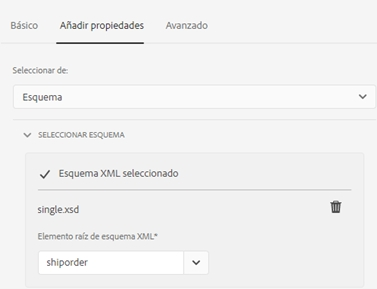

# Creación de un formulario adaptable {#creating-an-adaptive-form}

Forms adaptable le permite crear formularios atractivos, interactivos, dinámicos y adaptables. AEM Forms proporciona un asistente fácil de usar para las empresas que crea rápidamente Forms adaptable. El asistente dispone de un rápido desplazamiento por fichas para seleccionar fácilmente plantillas preconfiguradas, estilos, campos y opciones de envío para crear un formulario adaptable.

<!-- 

You can choose to create an Adaptive Form based on a form model or schema or without a form model. It is important to carefully choose the form model that not only suits your requirements but extends your existing infrastructural investments and assets. You get to choose from the following options to create an Adaptive Form: 

-->

<!-- 

Adaptive Forms allow you to create forms that are engaging, responsive, dynamic, and adaptive. [!DNL AEM Forms] provides an intuitive wizard and out-of-the-box components to create Adaptive Forms. You can choose to create an Adaptive Form based on a form model or schema or without a form model. It is important to carefully choose the form model that not only suits your requirements but extends your existing infrastructural investments and assets. You get to choose from the following options to create an Adaptive Form:

* **Using a form data model**
  [Data integration](data-integration.md) lets you integrate entities and services from disparate data sources in to a Form Data Model that you can use to create Adaptive Forms. Choose Form Data Model if the Adaptive Form you are creating involves fetching and write data from and to multiple data source.

  <!--  * **Using an XDP Form Template**
   It is an ideal form model if you have investments in XFA-based or XDP forms. It provides a direct way to convert your XFA-based forms into Adaptive Forms. Any existing XFA rules are retained in the associated Adaptive Forms. The resulting Adaptive Forms support XFA constructs, such as validations, events, properties, and patterns. 

* **Using an XML Schema Definition (XSD) or a JSON Schema**
   XML and JSON schemas represent the structure in which data is produced or consumed by the back-end system in your organization. You can associate the schema to an Adaptive Form and use its elements to add dynamic content to the Adaptive Form. The elements of the schema will be available for use in the Data Model Objects tab of the Content browser when authoring Adaptive Forms.

* **Using none or without a form model**
   Adaptive Forms created with this option don’t use any form model. The data XML generated from such forms has flat structure with fields and corresponding values. -->

## Requisitos previos

Para crear un formulario adaptable, es necesario lo siguiente:

* **Una plantilla de formulario adaptable**: Una plantilla proporciona una estructura básica y define el aspecto (diseños y estilos) de un formulario adaptable. Tiene componentes con formato previo que contienen determinadas propiedades y estructura de contenido. También proporciona las opciones para definir un tema y una acción de envío. El tema define el aspecto y la presentación y la acción de envío define la acción que debe realizarse al presentar una forma adaptativa. Por ejemplo, el envío de los datos recopilados a un origen de datos. Puede [crear una plantilla nueva](template-editor.md) o importar una plantilla existente. También puede implementar el [arquetipo más reciente](https://experienceleague.adobe.com/docs/experience-manager-core-components/using/developing/archetype/using.html?lang=en#:~:text=The%20AEM%20Archetype%20is%20made%20up%20of%20modules%3A,and%20request%20filters.%20it.testing%3A%20are%20Java-based%20integration%20testing.) para algunas plantillas de ejemplo.
* **Un tema de formulario adaptable**: Un tema contiene detalles de estilo para los componentes y paneles. Los estilos incluyen propiedades como colores de fondo, colores de estado, transparencia, alineación y tamaño. Al aplicar un tema, el estilo especificado se refleja en los componentes correspondientes. Puede [crear un tema nuevo](themes.md), [importar un tema existente](import-export-forms-templates.md#uploading-a-theme), o descargar e importar algunas [temas de ejemplo](https://documentcloud.adobe.com/link/track?uri=urn:aaid:scds:US:2779f80e-16ba-4cd1-a96f-8e2b53f3be25). También puede implementar el [arquetipo más reciente](https://experienceleague.adobe.com/docs/experience-manager-core-components/using/developing/archetype/using.html?lang=en#:~:text=The%20AEM%20Archetype%20is%20made%20up%20of%20modules%3A,and%20request%20filters.%20it.testing%3A%20are%20Java-based%20integration%20testing.) para algunos temas de muestra.
* **Permisos**: Agregue los usuarios a [!DNL forms-users] para proporcionarles permisos para crear un formulario adaptable. Para obtener una lista detallada de los formularios y grupos de usuarios específicos, consulte [Grupos y permisos](forms-groups-privileges-tasks.md).

## Creación de un formulario adaptable {#strong-create-an-adaptive-form-strong}

Siga estos pasos para crear un formulario adaptable.

1. Acceso [!DNL Experience Manager Forms] Instancia de autor. Puede ser una instancia de Cloud o una instancia de desarrollo local.

1. Introduzca sus credenciales en la página de inicio de sesión del Experience Manager.

   Cuando haya iniciado sesión, en la esquina superior izquierda, pulse **[!UICONTROL Adobe Experience Manager]** > **[!UICONTROL Forms]** > **[!UICONTROL Forms y documentos]**.

1. Toque **[!UICONTROL Crear]**  > **[!UICONTROL Forms adaptable]**. Se abre el asistente.
1. En la pestaña Source , seleccione una plantilla:
   * Al seleccionar una plantilla, se selecciona automáticamente un tema y una acción de envío especificados en la plantilla, y la variable **[!UICONTROL Crear]** está activado. Puede ir a la **[!UICONTROL Estilo]** o **[!UICONTROL Envío]** fichas para seleccionar un tema diferente o enviar acción.
   * Si la plantilla seleccionada no especifica ningún tema, el botón crear permanece desactivado. Puede ir a la **[!UICONTROL Estilos]** para seleccionar manualmente un tema.
1. En la ficha Estilo, seleccione un tema:
   * Cuando la plantilla seleccionada especifica un tema, el tema se selecciona automáticamente en el asistente. También puede elegir un tema diferente de la ficha Estilo.
   * Si la plantilla seleccionada no especifica ningún tema, puede utilizar la ficha Estilo para elegir un tema. La variable **[!UICONTROL Crear]** solo se activa después de seleccionar un tema.
1. (Opcional) En la ficha Datos, seleccione un modelo de datos:
   * **Modelo de datos de formulario**: A [Modelo de datos de formulario](data-integration.md) permite integrar entidades y servicios de distintos orígenes de datos en un formulario adaptable. Elija Modelo de datos de formulario si el formulario adaptable que está creando implica recuperar y escribir datos desde y hacia varios orígenes de datos.
   * **Esquema JSON**: [esquema JSON](adaptive-form-json-schema-form-model.md) representa la estructura en la que el sistema back-end de su organización produce o consume datos. Puede asociar el esquema a un formulario adaptable y utilizar sus elementos para agregar contenido dinámico al formulario adaptable. Los elementos del esquema están disponibles para su uso en la pestaña Objetos del modelo de datos del navegador de contenido durante la creación de Forms adaptable y todos los campos también se añaden al formulario adaptable recién creado.
1. En la ficha Envío, seleccione una acción de envío:
   * Al seleccionar una plantilla, la acción de envío especificada en la plantilla se selecciona automáticamente. Puede seleccionar una acción de envío diferente en la pestaña Envío . La variable **[!UICONTROL Envío]** muestra todas las acciones de envío disponibles.
   * Cuando la plantilla seleccionada no especifica una acción de envío, puede utilizar la variable **[!UICONTROL Envío]** para seleccionar una acción de envío

1. (Opcional) En la pestaña Delivery , puede especificar una fecha de publicación o cancelación de publicación de un formulario adaptable.

1. Toque **[!UICONTROL Crear]**. Aparece un cuadro de diálogo para especificar el título, el nombre y la ubicación para guardar el formulario adaptable:

   * **[!UICONTROL Título:]** Especifica el nombre para mostrar del formulario. El título le ayuda a identificar el formulario en la variable [!DNL Experience Manager Forms] interfaz de usuario.
   * **[!UICONTROL Nombre:]** Especifica el nombre del formulario. Se crea un nodo con el nombre especificado en el repositorio. A medida que empieza a escribir un título, el valor del campo de nombre se genera automáticamente. Puede cambiar el valor sugerido. El campo de nombre solo puede incluir caracteres alfanuméricos, guiones y guiones bajos. Todas las entradas no válidas se sustituyen por guiones.
   * **[!UICONTROL Ruta:]** Especifica la ubicación en la que se va a guardar el formulario adaptable. Puede guardar el formulario adaptable directamente en `/content/dam/formsanddocuments` o crear una carpeta como `/content/dam/formsanddocuments/adaptiveforms` para guardar un formulario adaptable. Asegúrese de crear la carpeta antes de utilizarla en la ruta de acceso. La variable **[!UICONTROL Ruta:]** no crea una carpeta automáticamente.

1. Toque **[!UICONTROL Crear]**. Se crea un formulario adaptable que se abre en el editor de Forms adaptable. El editor muestra el contenido disponible en la plantilla. También muestra la barra lateral para personalizar el formulario recién creado según las necesidades.

   En función del tipo de formulario adaptable, los elementos de formulario presentes en la variable <!--XFA form template, XML schema or --> El esquema JSON o el modelo de datos de formulario se muestran en la sección **[!UICONTROL Objetos del modelo de datos]** de la pestaña **[!UICONTROL Navegador de contenido]** en la barra lateral. También puede arrastrar y soltar estos elementos para crear el formulario adaptable.

<!-- ## Create an Adaptive Form based on a Form Data Model {#fdm}

[Data integration](data-integration.md) lets you integrate multiple data sources and bring their entities and services together to create a form data model. It is an extension of JSON schema. You can use a Form Data Model to create an Adaptive Form. The entities or data model objects configured in a Form Data Model are available as data model objects for form authoring. They are bound to respective data sources and used to prefill a form and write submitted data back to the respective data sources. You can also call services configured in a Form Data Model using Adaptive Form rules.

To use a Form Data Model for creating an Adaptive Form:

1. In Form Model tab on Add Properties screen, select **[!UICONTROL Form Data Model]** in the **[!UICONTROL Select From]** drop-down list.

   

1. Tap to expand **[!UICONTROL Select Form Data Model]**. All available form data models are listed.Select a from data model.

>[!NOTE]
>
>You can also change the Form Data Model for an Adaptive Form. For detailed steps, see [Edit Form Model properties of an Adaptive Form](#edit-form-model).

## Create an Adaptive Form based on XML or JSON schema {#create-an-adaptive-form-based-on-xml-or-json-schema}

XML and JSON schemas represent the structure in which data is produced or consumed by the back-end system in your organization. You can associate a schema to an Adaptive Form and use its elements to add dynamic content to the Adaptive Form. The elements of the schema are available in the Data Model Object tab of the content browser for authoring Adaptive Forms. You can drag-drop the schema elements to build the form.

See the following documents to understand how to design XML or JSON schema for authoring Adaptive Forms.

* [Creating Adaptive Forms using XML schema](adaptive-form-xml-schema-form-model.md)
* [Creating Adaptive Forms using JSON schema](adaptive-form-json-schema-form-model.md)

Do the following to use XML or JSON schema as form model for an Adaptive Form:

1. On the **[!UICONTROL Add Properties]** step of Adaptive Form creation page, tap on the **[!UICONTROL Form Model]** tab.
1. In the Form Model tab, select **[!UICONTROL Schema]** from the **[!UICONTROL Select From]** drop-down field.

1. Tap **[!UICONTROL Select Schema]** and do one of the following:

    * **[!UICONTROL Upload from disk]** - Select this option and tap Upload Schema Definition to browse and upload an XML schema or JSON schema from your file system. The uploaded schema file resides with the form and is not accessible to other Adaptive Forms.
    * **[!UICONTROL Search in repository]** - Select this option to select from the list of schema definition files available in the repository. Select the XML or JSON schema file as form model. The selected schema is associated with the form by reference and is accessible for use in other Adaptive Forms.

      Ensure that the JSON schema filename ends with **.schema.json**. For example: mySchema.schema.json

   
**Figure:** *Selecting XML or JSON schema*

1. (For XML schema only) After you select or upload an XML Schema, specify a root element of the selected XSD file to map with the Adaptive Form.

   
**Figure:** *Selecting XSD root element*

>[!NOTE]
>
>You can also change the schema for an Adaptive Form. For detailed steps, see [Edit Form Model properties of an Adaptive Form](#edit-form-model). -->

## Editar propiedades del modelo de formulario de un formulario adaptable {#edit-form-model}

Puede cambiar el modelo de formulario para un formulario adaptable (basado en JSON o en el modelo de datos de formulario). No se puede cambiar de un modelo de formulario a otro.

1. Seleccione el formulario adaptable y pulse el botón **Propiedades** icono.
1. Abra el **[!UICONTROL Modelo de formulario]** y haga una de las siguientes acciones.

   * Si el formulario adaptable no tiene un modelo de formulario, puede elegir otro modelo de formulario y, en consecuencia, seleccionar <!-- a form template, --> Esquema XML o JSON, o modelo de datos de formulario.
   * Si el formulario adaptable se basa en un modelo de formulario, puede elegir otro <!-- form template, --> Esquema XML o JSON, o Modelo de datos de formulario para el mismo modelo de formulario.

1. Toque **[!UICONTROL Guardar]** para guardar las propiedades.
