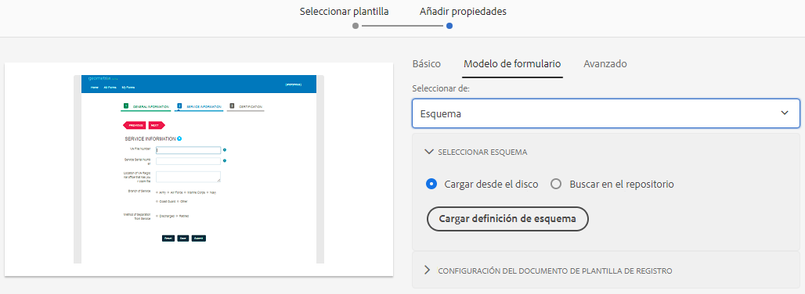

# Creación de un formulario adaptable {#creating-an-adaptive-form}

Forms adaptable le permite crear formularios atractivos, interactivos, dinámicos y adaptables. [!DNL AEM Forms] proporciona una interfaz de usuario intuitiva y componentes integrados para crear y trabajar con Forms adaptable. Puede elegir crear un formulario adaptable basado en un modelo o esquema de formulario o sin un modelo de formulario. Es importante elegir cuidadosamente el modelo de formulario que no solo se adapte a sus necesidades, sino que amplíe sus inversiones y recursos de infraestructura existentes. Puede elegir entre las siguientes opciones para crear un formulario adaptable:

* **Uso de un modelo de datos de formulario**
   [Integración de datos](data-integration.md) permite integrar entidades y servicios de distintos orígenes de datos en un Modelo de datos de formulario que se puede utilizar para crear Forms adaptable. Elija Modelo de datos de formulario si el formulario adaptable que está creando implica recuperar y escribir datos desde y hacia varios orígenes de datos.

   <!--  * **Using an XDP Form Template**
   It is an ideal form model if you have investments in XFA-based or XDP forms. It provides a direct way to convert your XFA-based forms into Adaptive Forms. Any existing XFA rules are retained in the associated Adaptive Forms. The resulting Adaptive Forms support XFA constructs, such as validations, events, properties, and patterns. -->

* **Uso de una definición de esquema XML (XSD) o un esquema JSON**
Los esquemas XML y JSON representan la estructura en la que el sistema back-end de su organización produce o consume los datos. Puede asociar el esquema a un formulario adaptable y utilizar sus elementos para agregar contenido dinámico al formulario adaptable. Los elementos del esquema estarán disponibles para su uso en la pestaña Objetos del modelo de datos del navegador de contenido al crear Forms adaptable.

* **Uso de ninguno o sin un modelo de formulario**
Forms adaptable creado con esta opción no utiliza ningún modelo de formulario. El XML de datos generado a partir de estos formularios tiene una estructura plana con campos y valores correspondientes.

## Requisitos previos

Para crear un formulario adaptable, es necesario lo siguiente:

* Una plantilla de formulario adaptable. Una plantilla proporciona una estructura básica y define el aspecto (diseños y estilos) de un formulario adaptable. Tiene componentes con formato previo que contienen determinadas propiedades y estructura de contenido. Puede [crear una plantilla nueva](template-editor.md), importar una plantilla existente o descargar e importar algunas [plantillas de ejemplo](https://documentcloud.adobe.com/link/track?uri=urn:aaid:scds:US:3f89abe1-0ece-492a-b5af-57c73badad52).
* Un tema de formulario adaptable. Un tema contiene detalles de estilo para los componentes y paneles. Los estilos incluyen propiedades como colores de fondo, colores de estado, transparencia, alineación y tamaño. Al aplicar un tema, el estilo especificado se refleja en los componentes correspondientes. Puede [crear un tema nuevo](themes.md), [importar un tema existente](import-export-forms-templates.md#uploading-a-theme), o descargar e importar algunas [temas de ejemplo](https://documentcloud.adobe.com/link/track?uri=urn:aaid:scds:US:2779f80e-16ba-4cd1-a96f-8e2b53f3be25).
* Agregue los usuarios a [!DNL forms-users] para proporcionarles permisos para crear un formulario adaptable. Para obtener una lista detallada de los formularios y grupos de usuarios específicos, consulte [Grupos y permisos](forms-groups-privileges-tasks.md).

## Creación de un formulario adaptable {#strong-create-an-adaptive-form-strong}

Siga estos pasos para crear un formulario adaptable.

1. Acceso [!DNL Experience Manager Forms] Instancia de autor. Puede ser una instancia de Cloud o una instancia de desarrollo local.

1. Introduzca sus credenciales en la página de inicio de sesión del Experience Manager.

   Cuando haya iniciado sesión, en la esquina superior izquierda, pulse **[!UICONTROL Adobe Experience Manager]** > **[!UICONTROL Forms]** > **[!UICONTROL Forms y documentos]**.

1. Toque **[!UICONTROL Crear]** y seleccione **[!UICONTROL Formulario adaptable]**. Seleccione una plantilla y pulse **[!UICONTROL Siguiente]**.
1. Una opción para **[!UICONTROL Agregar propiedades]** aparece. Especifique los valores para los siguientes campos de propiedad. Los campos Título y Nombre son obligatorios:

   * **[!UICONTROL Título:]** Especifica el nombre para mostrar del formulario. El título le ayuda a identificar el formulario en la variable [!DNL Experience Manager Forms] interfaz de usuario.
   * **[!UICONTROL Nombre:]** Especifica el nombre del formulario. Se crea un nodo con el nombre especificado en el repositorio. A medida que empieza a escribir un título, el valor del campo de nombre se genera automáticamente. Puede cambiar el valor sugerido. El campo de nombre solo puede incluir caracteres alfanuméricos, guiones y guiones bajos. Todas las entradas no válidas se sustituyen por guiones.
   * **[!UICONTROL Descripción:]** Especifica la información detallada sobre el formulario.
   * **[!UICONTROL Etiquetas:]** Especifica etiquetas para identificar de forma exclusiva el formulario adaptable. Las etiquetas ayudan a buscar en el formulario. Para crear etiquetas, escriba nuevos nombres de etiqueta en la **[!UICONTROL Etiquetas]** en la ventana

1. Puede crear un formulario adaptable basado en uno de los siguientes modelos de formulario:

   * [Modelo de datos de formulario](#fdm)

   <!--* [XFA form template](#create-an-adaptive-form-based-on-an-xfa-form-template)-->
   * [Esquema XML o JSON](#create-an-adaptive-form-based-on-xml-or-json-schema)
   * Ninguno o sin modelo de formulario

   Puede configurarlos desde el **[!UICONTROL Modelo de formulario]** en la ficha **[!UICONTROL Agregar propiedades]** página. De forma predeterminada, el modelo de formulario seleccionado es **[!UICONTROL Ninguna]**.

1. Toque **[!UICONTROL Crear]**. Se crea un formulario adaptable y aparece un cuadro de diálogo para abrir el formulario y editarlo.

1. Toque **[!UICONTROL Apertura]** para abrir el formulario recién creado en una pestaña nueva. El formulario se abre para su edición y muestra el contenido disponible en la plantilla. También muestra la barra lateral para personalizar el formulario recién creado según las necesidades.

   En función del tipo de formulario adaptable, los elementos de formulario presentes en la variable <!--XFA form template, -->El esquema XML o el esquema JSON se muestran en la sección **[!UICONTROL Objetos del modelo de datos]** de la pestaña **[!UICONTROL Navegador de contenido]** en la barra lateral. También puede arrastrar y soltar estos elementos para crear el formulario adaptable.

## Creación de un formulario adaptable basado en un modelo de datos de formulario {#fdm}

[Integración de datos](data-integration.md) permite integrar varios orígenes de datos y unir sus entidades y servicios para crear un modelo de datos de formulario. Es una extensión del esquema JSON. Puede utilizar un Modelo de datos de formulario para crear un Formulario adaptable. Las entidades u objetos del modelo de datos configurados en un Modelo de datos de formulario están disponibles como objetos del modelo de datos para la creación de formularios. Están enlazados a los respectivos orígenes de datos y se utilizan para rellenar previamente un formulario y escribir los datos enviados en los respectivos orígenes de datos. También puede llamar a servicios configurados en un Modelo de datos de formulario mediante reglas de formulario adaptable.

Para utilizar un modelo de datos de formulario para crear un formulario adaptable:

1. En la ficha Modelo de formulario de la pantalla Agregar propiedades, seleccione **[!UICONTROL Modelo de datos de formulario]** en el **[!UICONTROL Seleccionar de]** lista desplegable.

   

1. Toque para expandir **[!UICONTROL Seleccionar modelo de datos de formulario]**. Se muestran todos los modelos de datos de formulario disponibles.Seleccione un modelo de datos.

>[!NOTE]
>
>También puede cambiar el Modelo de datos de formulario para un formulario adaptable. Para ver los pasos detallados, consulte [Editar propiedades del modelo de formulario de un formulario adaptable](#edit-form-model).

## Creación de un formulario adaptable basado en un esquema XML o JSON {#create-an-adaptive-form-based-on-xml-or-json-schema}

Los esquemas XML y JSON representan la estructura en la que el sistema back-end de su organización produce o consume los datos. Puede asociar un esquema a un formulario adaptable y utilizar sus elementos para agregar contenido dinámico al formulario adaptable. Los elementos del esquema están disponibles en la pestaña Objeto del modelo de datos del navegador de contenido para crear Forms adaptable. Puede arrastrar y soltar los elementos de esquema para crear el formulario.

Consulte los siguientes documentos para comprender cómo diseñar el esquema XML o JSON para la creación de Forms adaptable.

* [Creación de Forms adaptable mediante esquema XML](adaptive-form-xml-schema-form-model.md)
* [Creación de Forms adaptable mediante el esquema JSON](adaptive-form-json-schema-form-model.md)

Haga lo siguiente para utilizar el esquema XML o JSON como modelo de formulario para un formulario adaptable:

1. En el **[!UICONTROL Agregar propiedades]** paso de la página de creación del formulario adaptable, toque en la **[!UICONTROL Modelo de formulario]** pestaña .
1. En la ficha Modelo de formulario, seleccione **[!UICONTROL Esquema]** de la variable **[!UICONTROL Seleccionar de]** campo desplegable.

1. Toque **[!UICONTROL Seleccionar esquema]** y realice una de las siguientes acciones:

   * **[!UICONTROL Cargar desde disco]** : seleccione esta opción y pulse Cargar definición de esquema para buscar y cargar un esquema XML o JSON desde el sistema de archivos. El archivo de esquema cargado reside con el formulario y no es accesible para otros Forms adaptables.
   * **[!UICONTROL Buscar en el repositorio]** - Seleccione esta opción para seleccionar de la lista de archivos de definición de esquema disponibles en el repositorio. Seleccione el archivo de esquema XML o JSON como modelo de formulario. El esquema seleccionado está asociado al formulario por referencia y es accesible para su uso en otros Forms adaptables.

      Asegúrese de que el nombre de archivo del esquema JSON termina con **.schema.json**. Por ejemplo: mySchema.schema.json
   
   **Figura:** *Selección del esquema XML o JSON*

1. (Solo para esquema XML) Después de seleccionar o cargar un esquema XML, especifique un elemento raíz del archivo XSD seleccionado para asignarlo al formulario adaptable.

   
   **Figura:** *Selección del elemento raíz XSD*

>[!NOTE]
>
>También puede cambiar el esquema de un formulario adaptable. Para ver los pasos detallados, consulte [Editar propiedades del modelo de formulario de un formulario adaptable](#edit-form-model).

## Editar propiedades del modelo de formulario de un formulario adaptable {#edit-form-model}

Los Forms adaptables se crean sin un modelo de formulario (con la opción Ninguno del modelo de formulario) o utilizando un modelo de formulario como un <!-- form template, --> Esquema XML, esquema JSON o modelo de datos de formulario. Puede cambiar el modelo de formulario para un formulario adaptable de Ninguno a otro modelo de formulario. Para Formulario adaptable basado en un modelo de formulario, puede elegir otro <!-- form template,--> Esquema XML, esquema JSON o Modelo de datos de formulario para el mismo modelo de formulario. Sin embargo, no se puede cambiar de un modelo de formulario a otro.

1. Seleccione el formulario adaptable y pulse el botón **Propiedades** icono.
1. Abra el **[!UICONTROL Modelo de formulario]** y haga una de las siguientes acciones.

   * Si el formulario adaptable no tiene un modelo de formulario, puede elegir otro modelo de formulario y, en consecuencia, seleccionar <!-- a form template, --> Esquema XML o JSON, o modelo de datos de formulario.
   * Si el formulario adaptable se basa en un modelo de formulario, puede elegir otro <!-- form template, --> Esquema XML o JSON, o Modelo de datos de formulario para el mismo modelo de formulario.

1. Toque **[!UICONTROL Guardar]** para guardar las propiedades.
