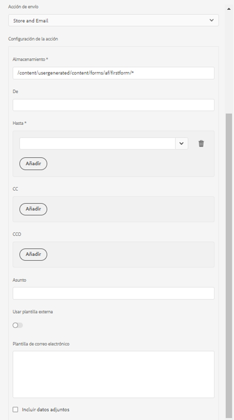
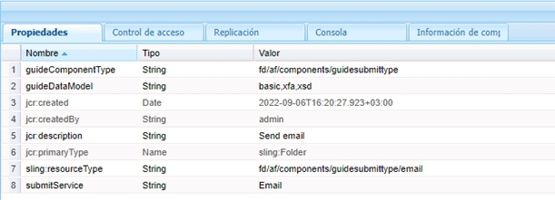

# Crear una acción de envío personalizada para un formulario adaptable {#writing-custom-submit-action-for-adaptive-forms}

| Versión | Vínculo del artículo |
| -------- | ---------------------------- |
| AEM 6.5 | [Haga clic aquí](https://experienceleague.adobe.com/docs/experience-manager-65/forms/customize-aem-forms/custom-submit-action-form.html?lang=es) |
| AEM as a Cloud Service (componentes principales) | [Haga clic aquí](https://experienceleague.adobe.com/es/docs/experience-manager-cloud-service/content/forms/adaptive-forms-authoring/authoring-adaptive-forms-core-components/create-an-adaptive-form-on-forms-cs/custom-submit-action-for-adaptive-forms-based-on-core-components) |
| AEM as a Cloud Service (componentes de base) | Este artículo |

Un formulario adaptable ofrece varias acciones de envío de forma predeterminada (OOTB). Una acción de envío especifica los detalles de las acciones que se realizarán en los datos recopilados mediante el formulario adaptable. Por ejemplo, el envío de datos en un correo electrónico.

Puede crear una acción de envío personalizada para agregar una funcionalidad que no esté incluida en [las acciones de envío de forma predeterminada](configuring-submit-actions.md) o no que no son compatibles con una única acción de envío OOTB. Por ejemplo, enviar datos a un flujo de trabajo, guardar los datos en un almacén de datos, enviar una notificación por correo electrónico a la persona que envía el formulario y enviar un correo electrónico a la persona responsable de procesar el formulario enviado para aprobarlo o rechazarlo mediante una única acción de envío.

## Formato de datos XML {#xml-data-format}

Los datos XML se envían al servlet utilizando el parámetro de solicitud **`jcr:data`**. Las acciones de envío puede acceder al parámetro para procesar los datos. El siguiente código describe el formato de los datos XML. Los campos vinculados al modelo de formulario aparecen en la sección **`afBoundData`**. Los campos no vinculados aparecen en la sección `afUnoundData`. <!--For more information about the format of the `data.xml` file, see [Introduction to prepopulating Adaptive Form fields](prepopulate-adaptive-form-fields.md).-->

```xml
<?xml ?>
<afData>
<afUnboundData>
<data>
<field1>value</field2>
<repeatablePanel>
    <field2>value</field2>
</repeatablePanel>
<repeatablePanel>
    <field2>value</field2>
</repeatablePanel>
</data>
</afUnboundData>
<afBoundData>
<!-- xml corresponding to the Form Model /XML Schema -->
</afBoundData>
</afData>
```

### Campos de acción {#action-fields}

Una acción de envío puede agregar campos de entrada ocultos (mediante la etiqueta de [entrada](https://developer.mozilla.org/es/docs/Web/HTML/Element/Input) HTML ) al HTML de formulario procesado. Estos campos ocultos pueden contener los valores que necesita al procesar el envío del formulario. Al enviar el formulario, estos valores de campo se vuelven a registrar como parámetros de solicitud que la acción de envío puede utilizar durante el envío. Los campos de entrada se denominan campos de acción.

Por ejemplo, una acción de envío que también capture el tiempo necesario para rellenar un formulario, puede agregar los campos de entrada ocultos `startTime` y `endTime`.

Un script puede aportar los valores de los campos `startTime` y `endTime` cuando el formulario se procesa y antes de enviarlo, respectivamente. El script de acción de envío `post.jsp` puede acceder a estos campos mediante parámetros de solicitud y calcular el tiempo total necesario para rellenar el formulario.

### Archivos adjuntos {#file-attachments}

Las acciones de envío también pueden utilizar los archivos adjuntos que se cargan mediante el componente Archivo adjunto. Los scripts de acción de envío pueden acceder a estos archivos utilizando el [API RequestParameter](https://sling.apache.org/apidocs/sling5/org/apache/sling/api/request/RequestParameter.html) de Sling. El método [isFormField](https://sling.apache.org/apidocs/sling5/org/apache/sling/api/request/RequestParameter.html#isFormField()) del API ayuda a identificar si el parámetro de solicitud es un archivo o un campo de formulario. Puede iterar los parámetros de solicitud en una acción de envío para identificar los parámetros del archivo adjunto.

El siguiente código de ejemplo identifica los archivos adjuntos en la solicitud. A continuación, lee los datos en el archivo utilizando [Obtener API](https://sling.apache.org/apidocs/sling5/org/apache/sling/api/request/RequestParameter.html#get()). Finalmente, crea un objeto Documento utilizando los datos y lo anexa a una lista.

```java
RequestParameterMap requestParameterMap = slingRequest.getRequestParameterMap();
for (Map.Entry<String, RequestParameter[]> param : requestParameterMap.entrySet()) {
    RequestParameter rpm = param.getValue()[0];
    if(!rpm.isFormField()) {
        fileAttachments.add(new Document(rpm.get()));
    }
}
```

Cuando adjunta archivos al formulario adaptable, el servidor valida los archivos adjuntos después del envío del formulario adaptable y muestra un mensaje de error si ocurre lo siguiente:

* Los archivos adjuntos incluyen un nombre de archivo que empieza por el carácter (.), contiene los caracteres \ / : * ?  &quot; &lt; > | ; % $, o contiene nombres de archivo especiales reservados para el sistema operativo Windows, como `nul`, `prn`, `con`, `lpt` o `com`.

* El tamaño del archivo adjunto es de 0 bytes.

* El formato del archivo adjunto no está definido en la sección [Tipos de archivo compatibles](https://helpx.adobe.com/es/document-cloud/help/supported-file-formats-fill-sign.html#main-pars_text) al configurar el componente Archivo adjunto en un formulario adaptable.

### Ruta de reenvío y URL de redireccionamiento {#forward-path-and-redirect-url}

Después de realizar la acción necesaria, el servlet de envío reenvía la solicitud a la ruta de reenvío. Una acción utiliza la API setForwardPath para establecer la ruta de reenvío en el servlet de envío de la guía.

Si la acción no ofrece una ruta de reenvío, el servlet de envío redirecciona el explorador mediante la URL de redireccionamiento. El autor configura la URL de redireccionamiento utilizando la configuración de la página de agradecimiento del cuadro de diálogo Editar formulario adaptable. También puede configurar la URL de redireccionamiento mediante la acción de envío o el API setRedirectUrl en el servlet de envío de la guía. También puede configurar los parámetros de solicitud enviados a la URL de redireccionamiento utilizando el API setRedirectParameters en el servlet de envío de la guía.

>[!NOTE]
>
>Un autor aporta la URL de redireccionamiento (mediante la configuración de la página de agradecimiento). [Las acciones de envío OOTB](configuring-submit-actions.md) utilizan la URL de redireccionamiento para redirigir el explorador desde el recurso al que hace referencia la ruta de reenvío.
>
>Puede escribir una acción de envío personalizada que reenvíe una solicitud a un recurso o servlet. Adobe recomienda que el script que administra los recursos de la ruta de reenvío redirija la solicitud a la URL de redireccionamiento cuando termine el procesamiento.

## Acción de envío {#submit-action}

Una acción de envío es un sling:Folder que incluye lo siguiente:

* **addfields.jsp**: Este script aporta los campos de acción que se añaden al archivo HTML durante la representación. Utilice este script para agregar los parámetros de entrada ocultos necesarios durante el envío en el script post.POST.jsp.
* **dialog.xml**: Este script es similar al cuadro de diálogo Componente CQ. Aporta información de configuración que el autor personaliza. Los campos se muestran en la pestaña Acciones de envío, del cuadro de diálogo Editar formulario adaptable, al seleccionar la acción de envío.
* **post.POST.jsp**: El servlet de envío utiliza este script con los datos que envía y los datos adicionales de las secciones anteriores. Cualquier mención de la ejecución de una acción en esta página implica la ejecución del script post.POST.jsp. Para registrar la acción de envío con los formularios adaptables para que se muestre en el cuadro de diálogo Editar formulario adaptable, añada estas propiedades al `sling:Folder`:

   * **guideComponentType** de tipo cadena y valor **fd/af/components/guidesubmittype**
   * **guideDataModel** de tipo cadena que especifica el tipo de formulario adaptable para el que se aplica la acción de envío. <!--**xfa** is supported for XFA-based Adaptive Forms while -->**xsd** es compatible con formularios adaptables basados en XSD. **basic** es compatible con formularios adaptables que no utilizan XDP o XSD. Para mostrar la acción en varios tipos de formularios adaptables, añada las cadenas correspondientes. Separe cada cadena con una coma. Por ejemplo, para que una acción esté visible en <!--XFA- and -->formularios adaptables basados en XSD, especifique el valor como <!--**xfa** and--> **xsd**.

   * **jcr:description** de tipo cadena. El valor de esta propiedad se muestra en la lista Enviar acción de la pestaña Acciones de envío del cuadro de diálogo Editar formulario adaptable. Las acciones OOTB están presentes en el repositorio CRX en la ubicación **/libs/fd/af/components/guidesubmittype**.

   * **submitService** de tipo cadena. Para obtener más información, consulte [Programar el envío del formulario adaptable para acciones personalizadas](#schedule-adaptive-form-submission).

## Crear una acción de envío personalizada {#creating-a-custom-submit-action}

>[!NOTE]
>
> Para obtener información sobre cómo crear una acción de envío personalizada para los componentes principales, consulte [Crear una acción de envío personalizada para formularios adaptables (componentes principales)](https://experienceleague.adobe.com/es/docs/experience-manager-cloud-service/content/forms/adaptive-forms-authoring/authoring-adaptive-forms-core-components/create-an-adaptive-form-on-forms-cs/custom-submit-action-for-adaptive-forms-based-on-core-components).

Realice los siguientes pasos para crear una acción de envío personalizada que guarde los datos en el repositorio CRX y luego le envíe un correo electrónico. El formulario adaptable contiene el contenido del almacén de acciones de envío OOTB (obsoleto) que guarda los datos en el repositorio CRX. Además, AEM facilitará un API de [Correo electrónico](https://www.adobe.io/experience-manager/reference-materials/6-5/javadoc/com/day/cq/mailer/package-summary.html) que se puede utilizar para enviar correos electrónicos. Antes de usar el API de correo electrónico, configure el servicio Day CQ Mail mediante la consola del sistema. Puede reutilizar la acción Almacenar contenido (obsoleta) para almacenar los datos en el repositorio. La acción Almacenar contenido (obsoleta) está disponible en la ubicación /libs/fd/af/components/guidesubmittype/store en el repositorio CRX.

1. Inicie sesión en CRXDE Lite en la URL https://&lt;server>:&lt;port>/crx/de/index.jsp. Cree un nodo con la propiedad sling:Folder y el nombre store_and_mail en la carpeta /apps/custom_submit_action. Cree la carpeta custom_submit_action si todavía no existe.

   

2. **Facilite los campos de configuración obligatorios.**

   Añada la configuración que requiere la acción Almacenar. Copie el nodo **cq:dialog** de la acción Almacenar de /libs/fd/af/components/guidesubmittype/store a la carpeta de acciones en /apps/custom_submit_action/store_and_email.

   

3. **Falicite campos de configuración para solicitar al autor que configure el correo electrónico.**

   El formulario adaptable también ofrece una acción de correo electrónico que envía correos electrónicos a los usuarios. Personalice esta acción según sus necesidades. Vaya a /libs/fd/af/components/guidesubmittype/email/dialog. Copie los nodos dentro del nodo cq:dialog al nodo cq:dialog de su acción de envío (/apps/custom_submit_action/store_and_email/dialog).

   

4. **Haga que la acción esté disponible en el cuadro de diálogo Editar el formulario adaptable.**

   Añada las siguientes propiedades en el nodo store_and_email:

   * **guideComponentType** de tipo **Cadena** y valor **fd/af/components/guidesubmittype**

   * **guideDataModel** de tipo **Cadena** y valor **<!--xfa, -->xsd, básico**

   * **jcr:description** de tipo **Cadena** y valor **Acción de almacenamiento y correo electrónico**

   * **submitService** de tipo **Cadena** y valor **Almacenamiento y correo electrónico**. Para obtener más información, consulte [Programar el envío del formulario adaptable para acciones personalizadas](#schedule-adaptive-form-submission).

5. Abra cualquier formulario adaptable. Haga clic en el botón **Editar** junto a **Inicio** para abrir el cuadro de diálogo **Editar** del contenedor del formulario adaptable. La nueva acción se muestra en la pestaña **Acciones de envío**. Al seleccionar **Acción de almacenamiento y correo electrónico**, muestra la configuración añadida en el nodo de diálogo.

   

6. **Utilice la acción para completar una tarea.**

   Añada el script post.POST.jsp a su acción. (/apps/custom_submit_action/store_and_mail/).

   Ejecute la acción Almacenamiento OOTB (script post.POST.jsp). Utilice el API [FormsHelper.runAction](https://www.adobe.io/experience-manager/reference-materials/6-5/javadoc/com/day/cq/wcm/foundation/forms/FormsHelper.html#runAction-java.lang.String-java.lang.String-org.apache.sling.api.resource.Resource-org.apache.sling.api.SlingHttpServletRequest-org.apache.sling.api.SlingHttpServletResponse-)&#x200B;(java.lang.String, java.lang.String, org.apache.sling.api.resource.Resource, org.apache.sling.api.SlingHttpServletRequest, org.apache.sling.api.SlingHttpServletResponse)) que CQ ofrece en su código para ejecutar la acción de almacenamiento. Añada el siguiente código en su archivo JSP:

   `FormsHelper.runAction("/libs/fd/af/components/guidesubmittype/store", "post", resource, slingRequest, slingResponse);`

   Para enviar el correo electrónico, el código lee la dirección de correo electrónico del destinatario de la configuración. Para recuperar el valor de configuración en el script de la acción, lea las propiedades del recurso actual utilizando el siguiente código. Del mismo modo, puede leer los demás archivos de configuración.

   `ValueMap properties = ResourceUtil.getValueMap(resource);`

   `String mailTo = properties.get("mailTo");`

   Finalmente, utilice la API CQ Mail para enviar el correo electrónico. Utilice la clase [SimpleEmail](https://commons.apache.org/proper/commons-email/commons-email2-javax/apidocs/org/apache/commons/mail2/javax/SimpleEmail.html) para crear el objeto de correo electrónico como se muestra a continuación:

   >[!NOTE]
   >
   >Asegúrese de que el archivo JSP tiene el nombre post.POST.jsp.

   ```java
   <%@include file="/libs/fd/af/components/guidesglobal.jsp" %>
   <%@page import="com.day.cq.wcm.foundation.forms.FormsHelper,
          org.apache.sling.api.resource.ResourceUtil,
          org.apache.sling.api.resource.ValueMap,
                   com.day.cq.mailer.MessageGatewayService,
     com.day.cq.mailer.MessageGateway,
     org.apache.commons.mail.Email,
                   org.apache.commons.mail.SimpleEmail" %>
   <%@taglib prefix="sling"
                   uri="https://sling.apache.org/taglibs/sling/1.0" %>
   <%@taglib prefix="cq"
                   uri="https://www.day.com/taglibs/cq/1.0"
   %>
   <cq:defineObjects/>
   <sling:defineObjects/>
   <%
           String storeContent =
                       "/libs/fd/af/components/guidesubmittype/store";
           FormsHelper.runAction(storeContent, "post", resource,
                                   slingRequest, slingResponse);
    ValueMap props = ResourceUtil.getValueMap(resource);
    Email email = new SimpleEmail();
    String[] mailTo = props.get("mailto", new String[0]);
    email.setFrom((String)props.get("from"));
           for (String toAddr : mailTo) {
               email.addTo(toAddr);
      }
    email.setMsg((String)props.get("template"));
    email.setSubject((String)props.get("subject"));
    MessageGatewayService messageGatewayService =
                       sling.getService(MessageGatewayService.class);
    MessageGateway messageGateway =
                   messageGatewayService.getGateway(SimpleEmail.class);
    messageGateway.send(email);
   %>
   ```

   Seleccione la acción en el formulario adaptable. La acción envía un correo electrónico y almacena los datos.

## Utilizar la propiedad submitService para las acciones de envío personalizadas {#submitservice-property}

Al establecer la acción de envío personalizada, que incluye la propiedad `submitService`, el formulario activa [FormSubmitActionService](https://helpx.adobe.com/experience-manager/6-5/forms/javadocs/com/adobe/aemds/guide/service/FormSubmitActionService.html) en el momento del envío. `FormSubmitActionService` utiliza el método `getServiceName` para recuperar el valor de la propiedad `submitService`. En función del valor de la propiedad `submitService`, el servicio invoca el método de envío adecuado. Incluya `FormSubmitActionService` al paquete personalizado que carga en el servidor de [!DNL AEM Forms].

Añada la propiedad `submitService` de tipo cadena a `sling:Folder` de su acción de envío personalizada para habilitar [!DNL Adobe Sign] para el formulario adaptable. Puede seleccionar la opción **[!UICONTROL Habilitar Adobe Sign]** en la sección **[!UICONTROL Firma electrónica]** de las propiedades del contenedor del formulario adaptable solo después de establecer el valor de la propiedad `submitService` de su acción de envío personalizada.

<!--As a result of setting an appropriate value for the `submitService` property and enabling [!DNL Adobe Sign], you can schedule the submission of an Adaptive Form to ensure that all configured signers have taken an action on the form. [!DNL Adobe Sign] Configuration Service keeps polling [!DNL Adobe Sign] server at regular intervals to verify the status of signatures. If all the signers complete signing the form, the Submit Action service is started and the form is submitted.-->





<!-- You can't do comments within comments, so I changed comment tags to <start-comment> <end-comment> -->

<!--
## Workflow for a Submit Action {#workflow-for-a-submit-action}

The flowchart depicts the workflow for a Submit Action that is triggered when you click the **[!UICONTROL Submit]** button in an Adaptive Form. The files in the File Attachment component are uploaded to the server, and the form data is updated with the URLs of the uploaded files. Within the client, the data is stored in the JSON format. The client sends an Ajax request to an internal servlet that massages the data you specified and returns it in the XML format. The client collates this data with action fields. It submits the data to the final servlet (Guide Submit servlet) through a Form Submit Action. Then, the servlet forwards the control to the Submit Action. The Submit Action can forward the request to a different sling resource or redirect the browser to another URL.


### XML data format {#xml-data-format}

The XML data is sent to the servlet using the **`jcr:data`** request parameter. Submit Actions can access the parameter to process the data. The following code describes the format of the XML data. The fields that are bound to the Form model appear in the **`afBoundData`** section. Unbound fields appear in the `afUnoundData`section. For more information about the format of the `data.xml` file, see [Introduction to prepopulating Adaptive Form fields](prepopulate-adaptive-form-fields.md).

```xml
<?xml ?>
<afData>
<afUnboundData>
<data>
<field1>value</field2>
<repeatablePanel>
    <field2>value</field2>
</repeatablePanel>
<repeatablePanel>
    <field2>value</field2>
</repeatablePanel>
</data>
</afUnboundData>
<afBoundData>
<start comment> xml corresponding to the Form Model /XML Schema <end comment>
<start comment> </afBoundData> <end comment>
</afData>
```

### Action fields {#action-fields}

A Submit Action can add hidden input fields (using the HTML [input](https://developer.mozilla.org/en/docs/Web/HTML/Element/Input) tag) to the rendered form HTML. These hidden fields can contain values that it needs while processing form submission. When submitting the form, these field values are posted back as request parameters that the Submit Action can use during submission handling. The input fields are called action fields.

For example, a Submit Action that also captures the time taken to fill a form can add the hidden input fields `startTime` and `endTime`.

A script can supply the values of the `startTime` and `endTime` fields when the form renders and before form submission, respectively. The Submit Action script `post.jsp` can then access these fields using request parameters and compute the total time required to fill the form.

### File attachments {#file-attachments}

Submit Actions can also use the file attachments you upload using the File Attachment component. Submit Action scripts can access these files using the sling [RequestParameter API](https://sling.apache.org/apidocs/sling5/org/apache/sling/api/request/RequestParameter.html). The [isFormField](https://sling.apache.org/apidocs/sling5/org/apache/sling/api/request/RequestParameter.html#isFormField()) method of the API helps identify whether the request parameter is a file or a form field. You can iterate over the Request parameters in a Submit Action to identify File Attachment parameters.

The following sample code identifies the file attachments in the request. Next, it reads the data into the file using the [Get API](https://sling.apache.org/apidocs/sling5/org/apache/sling/api/request/RequestParameter.html#get()). Finally, it creates a Document object using the data and appends it to a list.

```java
RequestParameterMap requestParameterMap = slingRequest.getRequestParameterMap();
for (Map.Entry<String, RequestParameter[]> param : requestParameterMap.entrySet()) {
    RequestParameter rpm = param.getValue()[0];
    if(!rpm.isFormField()) {
        fileAttachments.add(new Document(rpm.get()));
    }
}
```

### Forward path and Redirect URL {#forward-path-and-redirect-url}

After performing the required action, the Submit servlet forwards the request to the forward path. An action uses the setForwardPath API to set the forward path in the Guide Submit servlet.

If the action does not provide a forward path, the Submit servlet redirects the browser using the Redirect URL. The author configures the Redirect URL using the Thank You Page configuration in the Adaptive Form Edit dialog. You can also configure the Redirect URL through the Submit Action or the setRedirectUrl API in the Guide Submit servlet. You can also configure the Request parameters sent to the Redirect URL using the setRedirectParameters API in the Guide Submit servlet.

>[!NOTE]
>
>An author provides the Redirect URL (using the Thank You Page Configuration). [OOTB Submit Actions](configuring-submit-actions.md) use the Redirect URL to redirect the browser from the resource that the forward path references.
>
>You can write a custom Submit Action that forwards a request to a resource or servlet. Adobe recommends that the script that performs resource handling for the forward path redirect the request to the Redirect URL when the processing completes.

## Submit Action {#submit-action}

A Submit Action is a sling:Folder that includes the following:

* **addfields.jsp**: This script provides the action fields that are added to the HTML file during rendition. Use this script to add hidden input parameters required during submission in the post.POST.jsp script.
* **dialog.xml**: This script is similar to the CQ Component dialog. It provides configuration information that the author customizes. The fields are displayed in the Submit Actions Tab in the Adaptive Form Edit dialog when you select the Submit Action.
* **post.POST.jsp**: The Submit servlet calls this script with the data that you submit and the additional data in the previous sections. Any mention of running an action in this page implies running the post.POST.jsp script. To register the Submit Action with the Adaptive Forms to display in the Adaptive Form Edit dialog, add these properties to the sling:Folder:

    * **guideComponentType** of type String and value **fd/af/components/guidesubmittype**
    * **guideDataModel** of type String that specifies the type of Adaptive Form for which the Submit Action is applicable. **xfa** is supported for XFA-based Adaptive Forms while **xsd** is supported for XSD-based Adaptive Forms. **basic** is supported for Adaptive Forms that do not use XDP or XSD. To display the action on multiple types of Adaptive Forms, add the corresponding strings. Separate each string by a comma. For example, to make an action visible on XFA- and XSD-based Adaptive Forms, specify the values **xfa** and **xsd** respectively.

    * **jcr:description** of type String. The value of this property is displayed in the Submit Action list in the Submit Actions Tab of the Adaptive Form Edit dialog. The OOTB actions are present in the CRX repository at the location **/libs/fd/af/components/guidesubmittype**.

## Creating a custom Submit Action {#creating-a-custom-submit-action}

Perform the following steps to create a custom Submit Action that saves the data in the CRX repository and then sends you an email. The Adaptive Form contains the OOTB Submit Action Store Content (deprecated) that saves the data in the CRX repository. In addition, CQ provides a [Mail](https://www.adobe.io/experience-manager/reference-materials/6-5/javadoc/com/day/cq/mailer/package-summary.html) API that can be used to send emails. Before using the Mail API, configure the Day CQ Mail service through the system console. You can reuse the Store Content (deprecated) action to store the data in the repository. The Store Content (deprecated) action is available at the location /libs/fd/af/components/guidesubmittype/store in the CRX repository.

1. Log in to CRXDE Lite at the URL https://&lt;server&gt;:&lt;port&gt;/crx/de/index.jsp. Create a node with the property sling:Folder and name store_and_mail in the /apps/custom_submit_action folder. Create the custom_submit_action folder if it does not exist already.

   

1. **Provide the mandatory configuration fields.**

   Add the configuration the Store action requires. Copy the **cq:dialog** node of the Store action from /libs/fd/af/components/guidesubmittype/store to the action folder at /apps/custom_submit_action/store_and_email.

   

1. **Provide configuration fields to prompt the author for email configuration.**

   The Adaptive Form also provides an Email action that sends emails to users. Customize this action based on your requirements. Navigate to /libs/fd/af/components/guidesubmittype/email/dialog. Copy the nodes within the cq:dialog node to cq:dialog node of your Submit Action (/apps/custom_submit_action/store_and_email/dialog).

   

1. **Make the action available in the Adaptive Form Edit dialog.**

   Add the following properties in the store_and_email node:

    * **guideComponentType** of type **String** and value **fd/af/components/guidesubmittype**

    * **guideDataModel** of type **String** and value **xfa, xsd, basic**

    * **jcr:description** of type **String** and value **Store and Email Action**

1. Open any Adaptive Form. Click the **Edit** button next to **Start** to open the **Edit** dialog of the Adaptive Form container. The new action is displayed in the **Submit Actions** Tab. Selecting the **Store and Email Action** displays the configuration added in the dialog node.

   

1. **Use the action to complete a task.**

   Add the post.POST.jsp script to your action. (/apps/custom_submit_action/store_and_mail/).

   Run the OOTB Store action (post.POST.jsp script). Use the [FormsHelper.runAction](https://www.adobe.io/experience-manager/reference-materials/6-5/javadoc/com/day/cq/wcm/foundation/forms/FormsHelper.html#runAction-java.lang.String-java.lang.String-org.apache.sling.api.resource.Resource-org.apache.sling.api.SlingHttpServletRequest-org.apache.sling.api.SlingHttpServletResponse-(java.lang.String, java.lang.String, org.apache.sling.api.resource.Resource, org.apache.sling.api.SlingHttpServletRequest, org.apache.sling.api.SlingHttpServletResponse)) API that CQ provides in your code to run the Store action. Add the following code in your JSP file:

   `FormsHelper.runAction("/libs/fd/af/components/guidesubmittype/store", "post", resource, slingRequest, slingResponse);`

   To send the email, the code reads the recipient's email address from the configuration. To fetch the configuration value in the action's script, read the properties of the current resource using the following code. Similarly you can read the other configuration files.

   `ValueMap properties = ResourceUtil.getValueMap(resource);`

   `String mailTo = properties.get("mailTo");`

   Finally, use the CQ Mail API to send the email. Use the [SimpleEmail](https://commons.apache.org/proper/commons-email/apidocs/org/apache/commons/mail/SimpleEmail.html) class to create the Email Object as depicted below:

   >[!NOTE]
   >
   >Ensure that the JSP file has the name post.POST.jsp.

   ```java
   <%@include file="/libs/fd/af/components/guidesglobal.jsp" %>
   <%@page import="com.day.cq.wcm.foundation.forms.FormsHelper,
          org.apache.sling.api.resource.ResourceUtil,
          org.apache.sling.api.resource.ValueMap,
                   com.day.cq.mailer.MessageGatewayService,
     com.day.cq.mailer.MessageGateway,
     org.apache.commons.mail.Email,
                   org.apache.commons.mail.SimpleEmail" %>
   <%@taglib prefix="sling"
                   uri="https://sling.apache.org/taglibs/sling/1.0" %>
   <%@taglib prefix="cq"
                   uri="https://www.day.com/taglibs/cq/1.0"
   %>
   <cq:defineObjects/>
   <sling:defineObjects/>
   <%
           String storeContent =
                       "/libs/fd/af/components/guidesubmittype/store";
           FormsHelper.runAction(storeContent, "post", resource,
                                   slingRequest, slingResponse);
    ValueMap props = ResourceUtil.getValueMap(resource);
    Email email = new SimpleEmail();
    String[] mailTo = props.get("mailto", new String[0]);
    email.setFrom((String)props.get("from"));
           for (String toAddr : mailTo) {
               email.addTo(toAddr);
      }
    email.setMsg((String)props.get("template"));
    email.setSubject((String)props.get("subject"));
    MessageGatewayService messageGatewayService =
                       sling.getService(MessageGatewayService.class);
    MessageGateway messageGateway =
                   messageGatewayService.getGateway(SimpleEmail.class);
    messageGateway.send(email);
   %>
   ```

   Select the action in the Adaptive Form. The action sends an email and stores the data. 

-->

>[!MORELIKETHIS]
>
>* [Configuración de una acción de envío para un formulario adaptable](/help/forms/configure-submit-actions-core-components.md)