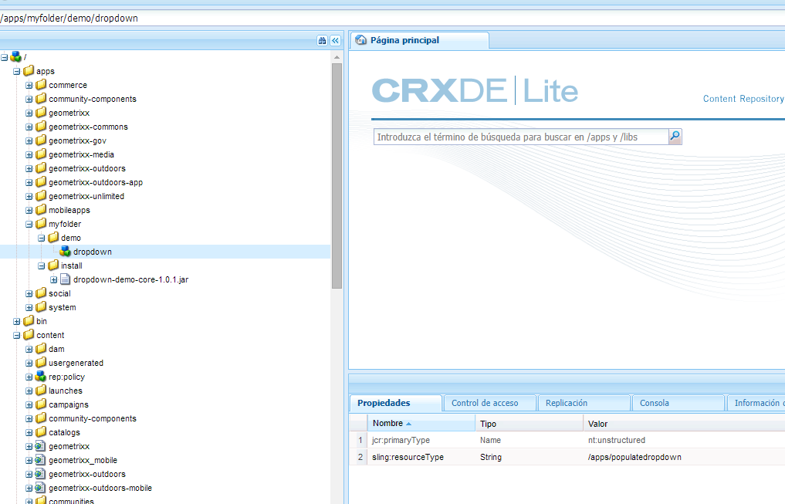
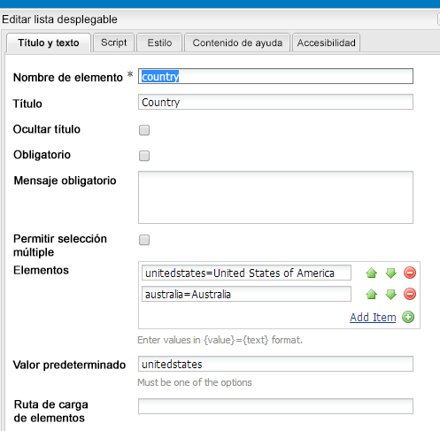
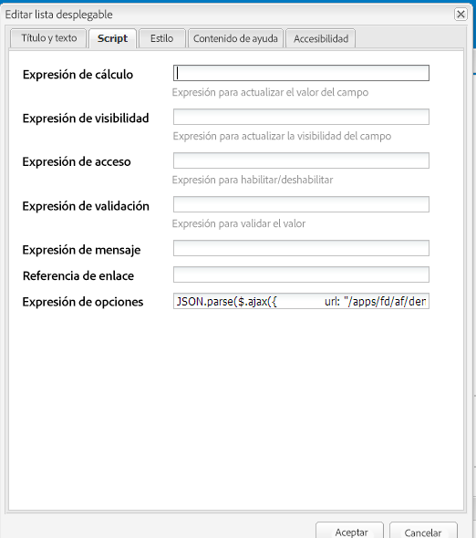
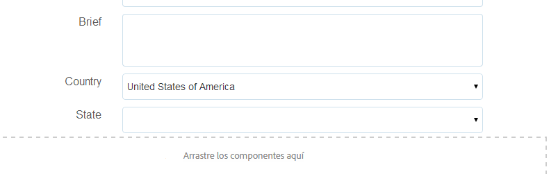

# Rellenar de manera dinámica listas desplegables {#dynamically-populating-drop-down-lists}

## Requisitos previos {#prerequisites}

* [Creación de paquetes OSGI](https://helpx.adobe.com/experience-manager/using/creating-osgi-bundles-digital-marketing.html)
* [Desarrollo de componentes de AEM](https://experienceleague.adobe.com/docs/experience-manager-cloud-service/implementing/developing/full-stack/components-templates/overview.html?lang=es#developing)
* [Creación de formularios adaptables](creating-adaptive-form.md)
* [Creación de formularios adaptables en el modo Autor](introduction-forms-authoring.md)

## Procedimiento para rellenar dinámicamente listas desplegables {#procedure-to-dynamically-populate-drop-down-lists}

Imagine un escenario en el que desee rellenar la lista desplegable **Estado** en función del valor que ha seleccionado en la lista desplegable **País**. Si selecciona Australia en la lista desplegable **País**, la lista desplegable **Estado** mostrará los estados de Australia. El siguiente procedimiento describe cómo realizar esta tarea.

1. Cree un proyecto con los siguientes módulos:

   * El paquete que contiene la lógica para rellenar la lista desplegable, que en este caso es un servlet.
   * El contenido, que incrusta el archivo .jar y tiene un recurso desplegable. El servlet señala a este recurso.

1. Escriba un servlet basado en el parámetro de solicitud País, el cual devuelve una matriz que contiene los nombres de los estados del país.

   ```java
   @Component(metatype = false)
   @Service(value = Servlet.class)
   @Properties({
           @Property(name = "sling.servlet.resourceTypes", value = "/apps/populatedropdown"),
           @Property(name = "sling.servlet.methods", value = {"GET", "POST"}),
           @Property(name = "service.description", value = "Populate states drop-down based on country value")
   })
   public class DropDownPopulator extends SlingAllMethodsServlet {
       private Logger logger = LoggerFactory.getLogger(DropDownPopulator.class);
   
       protected void doPost(SlingHttpServletRequest request,
                             final SlingHttpServletResponse response)
               throws ServletException, IOException {
           response.setHeader("Access-Control-Allow-Origin", "*");
           response.setContentType("application/json");
           response.setCharacterEncoding("UTF-8");
           try {
               String US_STATES[] = {"0=Alabama",
                       "1=Alaska",
                       "2=Arizona",
                       "3=Arkansas",
                       "4=California",
                       "5=Colorado",
                       "6=Connecticut",
                       "7=Delaware",
                       "8=Florida",
                       "9=Georgia",
                       "10=Hawaii",
                       "11=Idaho",
                       "12=Illinois",
                       "13=Indiana",
                       "14=Iowa",
                       "15=Kansas",
                       "16=Kentucky",
                       "17=Louisiana",
                       "18=Maine",
                       "19=Maryland",
                       "20=Massachusetts",
                       "21=Michigan",
                       "22=Minnesota",
                       "23=Mississippi",
                       "24=Missouri",
                       "25=Montana",
                       "26=Nebraska",
                       "27=Nevada",
                       "28=New Hampshire",
                       "29=New Jersey",
                       "30=New Mexico",
                       "31=New York",
                       "32=North Carolina",
                       "33=North Dakota",
                       "34=Ohio",
                       "35=Oklahoma",
                       "36=Oregon",
                       "37=Pennsylvania",
                       "38=Rhode Island",
                       "39=South Carolina",
                       "40=South Dakota",
                       "41=Tennessee",
                       "42=Texas",
                       "43=Utah",
                       "44=Vermont",
                       "45=Virginia",
                       "46=Washington",
                       "47=West Virginia",
                       "48=Wisconsin",
                       "49=Wyoming"};
               String AUSTRALIAN_STATES[] = {"0=Ashmore and Cartier Islands",
                       "1=Australian Antarctic Territory",
                       "2=Australian Capital Territory",
                       "3=Christmas Island",
                       "4=Cocos (Keeling) Islands",
                       "5=Coral Sea Islands",
                       "6=Heard Island and McDonald Islands",
                       "7=Jervis Bay Territory",
                       "8=New South Wales",
                       "9=Norfolk Island",
                       "10=Northern Territory",
                       "11=Queensland",
                       "12=South Australia",
                       "13=Tasmania",
                       "14=Victoria",
                       "15=Western Australia"};
               String country = request.getParameter("country");
               JSONArray stateJsonArray = new JSONArray();
               if (country.length() > 0) {
                   if ("australia".equalsIgnoreCase(country)) {
                       stateJsonArray = new JSONArray();
                       for (String state : AUSTRALIAN_STATES) {
                           stateJsonArray.put(state);
                       }
                   } else if ("unitedstates".equalsIgnoreCase(country)) {
                       stateJsonArray = new JSONArray();
                       for (String state : US_STATES) {
                           stateJsonArray.put(state);
                       }
                   }
                   response.setContentType("application/json");
                   response.getWriter().write(stateJsonArray.toString());
               }
   
           } catch ( Exception e) {
               logger.error(e.getMessage(), e);
           }
       }
   }
   ```

1. Cree un nodo desplegable en una jerarquía de carpetas determinada en las aplicaciones (por ejemplo, cree un nodo en /apps/myfolder/demo). Asegúrese de que el parámetro `sling:resourceType` del nodo sea el mismo que al que apunta el servlet (/apps/populatedropdown).

   

1. Empaquete el nodo de contenido e incruste el archivo .jar en una ubicación concreta (por ejemplo, /apps/myfolder/demo/install/).  Implemente el mismo archivo en el servidor.
1. Cree un formulario adaptable y añada dos listas desplegables, País y Estado. La lista País puede incluir nombres de países. La lista Estado puede rellenar dinámicamente los nombres de los estados del país seleccionado en la primera lista.

   Añada los nombres de los países para mostrarlos en la lista País. En la lista Estado, agregue un script para rellenarla en función del nombre del país de la lista País.

     

   ```javascript
   JSON.parse(
       $.ajax({
           url: "/apps/myfolder/demo/dropdown",
           type: "POST",
           async: false,
           data: {"country": country.value},
            success: function(res){},
            error : function (message) {
                 guideBridge._guide.logger().log(message);
                 successFlag = false;
                 }
              })
   .responseText);
   ```

El paquete de contenido que contiene un formulario adaptable de ejemplo (demo/AFdemo) con el código anterior implementado.

[Obtener archivo](assets/dropdown-demo-content-1.0.1-snapshot.zip)


>[!MORELIKETHIS]
>
>* [Rellenar previamente los campos de un formulario adaptable](/help/forms/prepopulate-adaptive-form-fields.md)
