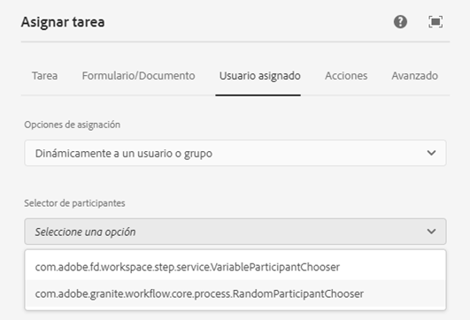

# Seleccionar dinámicamente un usuario o grupo para los pasos de flujo de trabajo centrados en AEM Forms {#dynamically-select-a-user-or-group-for-aem-forms-centric-workflow-steps}

Obtenga información sobre cómo seleccionar un usuario o grupo para un [!DNL AEM Forms] flujo de trabajo en tiempo de ejecución.

En las organizaciones grandes, existen requisitos para seleccionar usuarios de forma dinámica para un proceso. Por ejemplo, seleccionar un agente de campo para servir a un cliente en función de la proximidad del agente al cliente. En tal escenario, el agente se selecciona dinámicamente.

Asignar tarea y [!DNL Adobe Sign] pasos de [Flujos de trabajo centrados en Forms en OSGi](aem-forms-workflow.md) proporciona opciones para seleccionar dinámicamente un usuario. Puede utilizar paquetes ECMAScript o OSGi para seleccionar dinámicamente un usuario asignado para el paso Asignar tarea o para seleccionar firmantes para el paso Firmar documento.

## Utilice ECMAScript para seleccionar dinámicamente un usuario o grupo {#use-ecmascript-to-dynamically-select-a-user-or-group}

ECMAScript es un lenguaje de secuencias de comandos. Se utiliza para secuencias de comandos del lado del cliente y aplicaciones de servidor. Siga estos pasos para seleccionar dinámicamente un usuario o un grupo mediante ECMAScript:

1. Abra el CRXDE Lite . La dirección URL es `https://'[server]:[port]'/crx/de/index.jsp`
1. Cree un archivo con la extensión .ecma en la siguiente ruta. Si la ruta (estructura de nodos) no existe, créela:

   * (Ruta para el paso Asignar tarea) `/apps/fd/dashboard/scripts/participantChooser`
   * (Ruta para el paso de firma) `/apps/fd/workflow/scripts/adobesign`

1. Agregue ECMAScript, que tiene la lógica de seleccionar dinámicamente un usuario, al archivo .ecma. Haga clic en **[!UICONTROL Guardar todo]**.

   Para ver las secuencias de comandos de ejemplo, consulte [Ejemplo de ECMAScripts para seleccionar dinámicamente un usuario o un grupo](dynamically-select-a-user-or-group-for-aem-workflow.md#sample-ecmascripts-to-dynamically-choose-a-user-or-a-group).

1. Añada el nombre para mostrar de la secuencia de comandos. Este nombre se muestra en los pasos del flujo de trabajo. Para especificar el nombre:

   1. Expanda el nodo de secuencia de comandos, haga clic con el botón derecho en el botón **[!UICONTROL jcr:content]** y haga clic en **[!UICONTROL Mezclas]**.
   1. Agregue la variable `mix:title` en el cuadro de diálogo Editar mezclas y haga clic en **OK**.
   1. Agregue la siguiente propiedad al nodo jcr:content del script:

      | Nombre | Tipo | Value |
      |--- |--- |--- |
      | jcr:title | Cadena | Especifique el nombre de la secuencia de comandos. Por ejemplo, seleccione el agente de campo más cercano. Este nombre se muestra en los pasos Asignar tarea y Firmar documento . |

   1. Haga clic en **Guardar todo**. La secuencia de comandos está disponible para su selección en los componentes de AEM flujo de trabajo.

      

### Ejemplo de ECMAScripts para elegir dinámicamente un usuario o un grupo {#sample-ecmascripts-to-dynamically-choose-a-user-or-a-group}

El siguiente ejemplo de ECMAScript selecciona dinámicamente un usuario asignado para el paso Asignar tarea . En esta secuencia de comandos, se selecciona un usuario en función de la ruta de la carga útil. Antes de usar esta secuencia de comandos, asegúrese de que todos los usuarios mencionados en la secuencia de comandos existan en AEM. Si los usuarios mencionados en la secuencia de comandos no existen en AEM, el proceso relacionado puede fallar.

```javascript
function getParticipant() {

var workflowData = graniteWorkItem.getWorkflowData();

if (workflowData.getPayloadType() == "JCR_PATH") { 

var path = workflowData.getPayload().toString(); 
     if (path.indexOf("/content/geometrixx/en") == 0) {
    return "user1";
    } 
   else {
              return "user2";
            }
}
}
```

El siguiente ejemplo de ECMAScript selecciona dinámicamente un usuario asignado para el [!DNL Adobe Sign] paso a paso. Antes de utilizar la siguiente secuencia de comandos, asegúrese de que la información del usuario (direcciones de correo electrónico y números de teléfono) que se menciona en la secuencia de comandos sea correcta. Si la información del usuario que se menciona en la secuencia de comandos es incorrecta, el proceso relacionado puede fallar.

>[!NOTE]
>
>Al usar ECMAScript para [!DNL Adobe Sign], el script debe estar ubicado en crx-repository en /apps/fd/workflow/scripts/adobesign/, y debe tener una función denominada getAdobeSignRecipients para devolver una lista de los usuarios.

```javascript
function getAdobeSignRecipients() {

    var recipientSetInfos = new Packages.java.util.ArrayList();

    var recipientInfoSet = new com.adobe.aem.adobesign.recipient.RecipientSetInfo();
    var recipientInfoList = new Packages.java.util.ArrayList();
    var recipientInfo = new com.adobe.aem.adobesign.recipient.RecipientInfo();

    var email;
    var recipientAuthenticationMethod = com.adobe.aem.adobesign.recipient.RecipientAuthenticationMethod.PHONE;  
    //var recipientAuthenticationMethod = com.adobe.aem.adobesign.recipient.RecipientAuthenticationMethod.NONE;
    var securityOptions = null;

    var phoneNumber = "123456789";
    var countryCode = "+1";
    var recipientPhoneInfo = new Array();
    recipientPhoneInfo.push(new com.adobe.aem.adobesign.recipient.RecipientPhoneInfo(phoneNumber, countryCode));

     securityOptions = new com.adobe.aem.adobesign.recipient.RecipientSecurityOption(recipientAuthenticationMethod, recipientPhoneInfo , null);
    
    email = "example@example.com";
    
    recipientInfo.setEmail(email);
    recipientInfo.setSecurityOptions(securityOptions);
    
    recipientInfoList.add(recipientInfo);
    recipientInfoSet.setMemberInfos(recipientInfoList);
    recipientSetInfos.add(recipientInfoSet);

    return recipientSetInfos;

}
```

## Usar la interfaz de Java para elegir dinámicamente un usuario o grupo {#use-java-interface-to-dynamically-choose-a-user-or-group}

Puede usar la variable [RecipientInfoSpecifier](https://developer.adobe.com/experience-manager/reference-materials/6-5/forms/javadocs/com/adobe/fd/workflow/adobesign/api/RecipientInfoSpecifier.html) Interfaz de Java para elegir dinámicamente un usuario o un grupo para [!DNL Adobe Sign] y asignar pasos de tarea. Puede crear un paquete OSGi que use el [RecipientInfoSpecifier](https://developer.adobe.com/experience-manager/reference-materials/6-5/forms/javadocs/com/adobe/fd/workflow/adobesign/api/RecipientInfoSpecifier.html) Interfaz de Java e impleméntelo en la [!DNL AEM Forms] servidor. Hace que la opción esté disponible para su selección en Asignar tarea y [!DNL Adobe Sign] componentes de AEM flujo de trabajo.

Debe [[!DNL AEM Forms] Client SDK](https://experienceleague.adobe.com/docs/experience-manager-release-information/aem-release-updates/forms-updates/aem-forms-releases.html) jar y [tarro de granito](https://repo1.maven.org/maven2/com/adobe/granite/com.adobe.granite.workflow.api/1.0.2/) para compilar el ejemplo de código que se muestra a continuación. Agregue estos archivos jar como dependencias externas al proyecto de paquete OSGi. Puede utilizar cualquier IDE de Java para crear un paquete OSGi. El siguiente procedimiento proporciona los pasos para utilizar Eclipse para crear un paquete OSGi:

1. Abra Eclipse IDE. Vaya a **[!UICONTROL Archivo]**> **[!UICONTROL Nuevo proyecto]**.
1. En la pantalla Seleccionar un asistente , seleccione **[!UICONTROL Proyecto Maven]** y haga clic en **[!UICONTROL Siguiente]**.
1. En el proyecto Nuevo Maven, mantenga los valores predeterminados y haga clic en **[!UICONTROL Siguiente]**. Seleccione un tipo de archivo y haga clic en **[!UICONTROL Siguiente]**. Por ejemplo, maven-archetype-quickstart. Especifique **[!UICONTROL ID de grupo]**, **[!UICONTROL Id. de artefacto]**, **[!UICONTROL version]** y **[!UICONTROL paquete]** para el proyecto y haga clic en **[!UICONTROL Finalizar]**. Se crea el proyecto.
1. Abra el archivo pom.xml para editarlo y reemplace todo el contenido del archivo por lo siguiente:

   ```xml
   <project xmlns="https://maven.apache.org/POM/4.0.0" xmlns:xsi="https://www.w3.org/2001/XMLSchema-instance"
       xsi:schemaLocation="https://maven.apache.org/POM/4.0.0 https://maven.apache.org/xsd/maven-4.0.0.xsd">
       <modelVersion>4.0.0</modelVersion>
   
       <groupId>getAgent</groupId>
       <artifactId>assignToAgent</artifactId>
       <version>1.0</version>
       <packaging>bundle</packaging><!-- packaging type bundle is must -->
   
       <name>assignToAgent</name>
       <url>https://maven.apache.org</url>
       <repositories>
           <repository>
               <id>adobe</id>
               <name>Adobe Public Repository</name>
               <url>https://repo1.maven.org/maven2/com/adobe/</url>
               <layout>default</layout>
           </repository>
       </repositories>
       <pluginRepositories>
           <pluginRepository>
               <id>adobe</id>
               <name>Adobe Public Repository</name>
               <url>https://repo1.maven.org/maven2/com/adobe/</url>
               <layout>default</layout>
           </pluginRepository>
       </pluginRepositories>
   
       <dependencies>
           <dependency>
               <groupId>com.adobe.aemfd</groupId>
               <artifactId>aemfd-client-sdk</artifactId>
               <version>6.0.138</version>
           </dependency>
           <dependency>
               <groupId>com.adobe.granite</groupId>
               <artifactId>com.adobe.granite.workflow.api</artifactId>
               <version>1.0.0</version>
           </dependency>
   
           <dependency>
               <groupId>org.osgi</groupId>
               <artifactId>org.osgi.core</artifactId>
               <version>4.2.0</version>
               <scope>provided</scope>
           </dependency>
   
           <dependency>
               <groupId>org.apache.felix</groupId>
               <artifactId>org.apache.felix.scr.annotations</artifactId>
               <version>1.7.0</version>
   
           </dependency>
   
           <dependency>
               <groupId>org.apache.sling</groupId>
               <artifactId>org.apache.sling.api</artifactId>
               <version>2.2.0</version>
   
           </dependency>
   
       </dependencies>
   
       <!-- ====================================================================== -->
       <!-- B U I L D D E F I N I T I O N -->
       <!-- ====================================================================== -->
       <build>
           <plugins>
   
               <plugin>
                   <groupId>org.apache.felix</groupId>
                   <artifactId>maven-bundle-plugin</artifactId>
                   <extensions>true</extensions>
                   <configuration>
                       <instructions>
                           <Bundle-SymbolicName>com.aem.assigntoAgent-bundle</Bundle-SymbolicName>
                       </instructions>
                   </configuration>
               </plugin>
   
               <plugin>
                   <groupId>org.apache.felix</groupId>
                   <artifactId>maven-scr-plugin</artifactId>
                   <version>1.9.0</version>
                   <executions>
                       <execution>
                           <id>generate-scr-descriptor</id>
                           <goals>
                               <goal>scr</goal>
                           </goals>
                       </execution>
                   </executions>
               </plugin>
           </plugins>
       </build>
   
   </project>
   ```

1. Agregar código fuente que utilice [RecipientInfoSpecifier](https://developer.adobe.com/experience-manager/reference-materials/6-5/forms/javadocs/com/adobe/fd/workflow/adobesign/api/RecipientInfoSpecifier.html) Interfaz de Java para elegir dinámicamente un usuario o un grupo para el paso Asignar tarea . Para ver el código de ejemplo, consulte [Ejemplo para elegir dinámicamente un usuario o un grupo mediante la interfaz Java](#-sample-scripts-for).
1. Abra un símbolo del sistema y vaya al directorio que contiene el proyecto de paquete OSGi. Utilice el siguiente comando para crear el paquete OSGi:

   `mvn clean install`

1. Cargue el paquete en un [!DNL AEM Forms] servidor. Puede utilizar AEM Administrador de paquetes para importar el paquete en [!DNL AEM Forms] servidor.

Una vez importado el paquete, la opción de elegir la interfaz Java para seleccionar dinámicamente un usuario o un grupo está disponible en los pasos de Adobe Sign y Asignar tarea.

### Ejemplo de código Java para elegir dinámicamente un usuario o un grupo {#sample-java-code-to-dynamically-choose-a-user-or-a-group}

El siguiente código de ejemplo elige dinámicamente un usuario asignado para el paso de Adobe Sign. El código se utiliza en un paquete OSGi. Antes de usar el código de la lista siguiente, asegúrese de que la información de usuario (direcciones de correo electrónico y números de teléfono) que se menciona en el código sea correcta. Si la información del usuario mencionada en el código es incorrecta, el proceso relacionado puede fallar.

```java
/*************************************************************************

 *
 * ADOBE CONFIDENTIAL
 * __________________
 *
 * Copyright 2016 Adobe Systems Incorporated
 * All Rights Reserved.
 *
 * NOTICE:  All information contained herein is, and remains
 * the property of Adobe Systems Incorporated and its suppliers,
 * if any.  The intellectual and technical concepts contained
 * herein are proprietary to Adobe Systems Incorporated and its
 * suppliers and are protected by trade secret or copyright law.
 * Dissemination of this information or reproduction of this material
 * is strictly forbidden unless prior written permission is obtained
 * from Adobe Systems Incorporated.
 **************************************************************************/
 
package com.aem.impl;

import java.util.ArrayList;
import java.util.List;

import com.adobe.aem.adobesign.recipient.RecipientAuthenticationMethod;
import com.adobe.aem.adobesign.recipient.RecipientInfo;
import com.adobe.aem.adobesign.recipient.RecipientPhoneInfo;
import com.adobe.aem.adobesign.recipient.RecipientSecurityOption;
import com.adobe.aem.adobesign.recipient.RecipientSetInfo;
import com.adobe.fd.workflow.adobesign.api.RecipientInfoSpecifier;
import com.adobe.granite.workflow.WorkflowException;
import com.adobe.granite.workflow.WorkflowSession;
import com.adobe.granite.workflow.exec.WorkItem;
import com.adobe.granite.workflow.metadata.MetaDataMap;
import org.apache.felix.scr.annotations.Component;
import org.apache.felix.scr.annotations.Service;

/**
 * <code>DummyRecipientInfoSpecifier implementation. A sample code to write implementation of RecipientInfoSpecifier to choose recipients/code>...
 */
@Service

@Component(metatype = false)
public class DummyRecipientChoser implements RecipientInfoSpecifier {
    public List<RecipientSetInfo> getAdobeSignRecipients(WorkItem workItem, WorkflowSession workflowSession, MetaDataMap args) throws WorkflowException {

        List<RecipientSetInfo> recipientSetInfos = new ArrayList<RecipientSetInfo>();

                //First Recipient

                RecipientSetInfo recipientInfoSet1 = new RecipientSetInfo();
                List<RecipientInfo> recipientInfoList = new ArrayList<RecipientInfo>();
                RecipientInfo recipientInfo1 = new RecipientInfo();//Member to first recipient

                String email;

                RecipientAuthenticationMethod recipientAuthenticationMethod = RecipientAuthenticationMethod.WEB_IDENTITY;
                RecipientSecurityOption securityOptions = null;

                String phoneNumber = "123456789";
                String countryCode = "+1";
                RecipientPhoneInfo[] recipientPhoneInfo = new RecipientPhoneInfo[1];  //if multiple phone numbers, size>1
                recipientPhoneInfo[0] = new RecipientPhoneInfo(phoneNumber, countryCode);
                securityOptions = new RecipientSecurityOption(recipientAuthenticationMethod, recipientPhoneInfo , null);
                 
                email = "example@example.com";

                recipientInfo1.setEmail(email);
                recipientInfo1.setSecurityOptions(securityOptions);

                recipientInfoList.add(recipientInfo1);  //Add member

                recipientInfoSet1.setMemberInfos(recipientInfoList);

                //Second Recipient

                RecipientSetInfo recipientInfoSet2 = new RecipientSetInfo();
                List<RecipientInfo> recipientInfoList2 = new ArrayList<RecipientInfo>();

                recipientAuthenticationMethod = RecipientAuthenticationMethod.PHONE;
                securityOptions = null;
                 
                phoneNumber = "987654321";//"0123456789";

                countryCode = "+1";
                RecipientPhoneInfo[] recipientPhoneInfo_1 = new RecipientPhoneInfo[1];
                recipientPhoneInfo_1[0] = new RecipientPhoneInfo(phoneNumber, countryCode);
                securityOptions = new RecipientSecurityOption(recipientAuthenticationMethod, recipientPhoneInfo_1 , null);
                 
                email = "example2@example.com";//"dummymail2@domain.com";

                RecipientInfo recipientInfo2  = new RecipientInfo();
                recipientInfo2.setEmail(email);
                recipientInfo2.setSecurityOptions(securityOptions);

                recipientInfoList2.add(recipientInfo2);  //Add member

                recipientInfoSet2.setMemberInfos(recipientInfoList2);

                //*********************************

                recipientSetInfos.add(recipientInfoSet1); 
                recipientSetInfos.add(recipientInfoSet2);

        return recipientSetInfos;

    }

}
```
