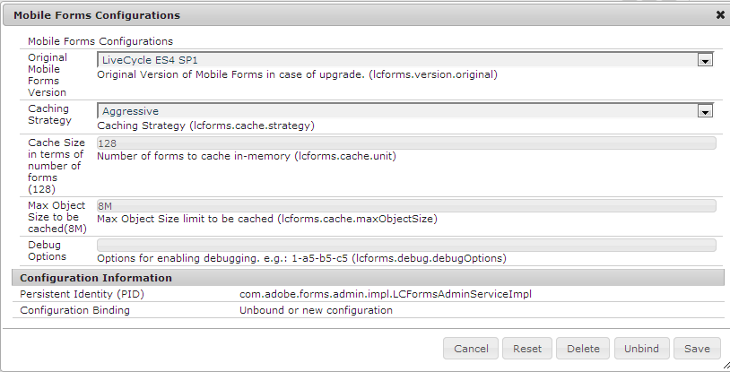

# Habilitar el registro para formularios HTML5{#enable-logging-for-html-forms}

: la funcionalidad HTML5 Forms se ofrece como parte del programa de acceso anticipado. Para solicitar acceso, envíe un correo electrónico con el ID de correo electrónico oficial (de trabajo) a aem-forms-ea@adobe.com.

Puede configurar la utilidad del registrador para empezar a crear registros para los formularios HTML5. La utilidad del registrador tiene varios niveles, puede establecer un nivel según sus necesidades. Los formularios HTML5 tienen componentes de servidor y cliente. Puede configurar los registros de ambos componentes.

## Configuración del registro en el lado del servidor {#configuring-server-side-logging}

Siga estos pasos para configurar los registros del lado del servidor:

1. Vaya a `https://'[server]:[port]'/system/console/configMgr`. Busque y abra la opción *Configuración del registrador de Sling de Apache*. Aparecerá un cuadro de diálogo:

   

   Opción de configuración del registrador de registros de Sling

1. Cambie el **Nivel de registro** a **Depuración**.

1. Especifique el nombre y la ruta de acceso del **Archivo de registro**.

   >[!NOTE]
   >
   >Para generar registros en el directorio de registro de formularios HTML5, agregue ../logs/ antes del nombre de archivo.

1. Cambie **Logger** a **HTMLFormsPerfLogger**. Haga clic en **Guardar**.

## Configurar el registro de cliente {#configuring-client-logging}

Puede utilizar los siguientes métodos para habilitar el inicio de sesión en el lado del cliente en los formularios HTML5:

* Usar el parámetro de solicitud denominado `log`
* Usar el administración de configuración CQ

### Habilitar el registro mediante el parámetro de solicitud {#enabling-logging-using-request-parameter}

Con este método, puede generar registros para una solicitud en particular. El nombre del parámetro de solicitud es `log`. La URL de registro es la siguiente:

`https://<server>:<port>/content/xfaforms/profiles/test.html?contentRoot=<path of the folder containing form xdp>&template=<name of the xdp>&log=<log configuration>.`

La configuración del registro está formada por el nivel de registro y la categoría del registrador.

#### Destino del registro {#log-destination}

<table>
 <tbody>
  <tr>
   <th><strong>Destino del registro</strong></th>
   <th><strong>Descripción</strong></th>
  </tr>
  <tr>
   <td>1</td>
   <td>Los registros se dirigen al explorador <strong>Consola</strong></td>
  </tr>
  <tr>
   <td>2</td>
   <td>Los registros se recopilan en un objeto JavaScript del lado del cliente y se pueden publicar en <strong>Servidor</strong> </td>
  </tr>
  <tr>
   <td>3</td>
   <td>Ambas opciones anteriores  </td>
  </tr>
 </tbody>
</table>

#### Niveles de registro {#log-levels}

<table>
 <tbody>
  <tr>
   <th>Nivel de registro</th>
   <th>Descripción</th>
  </tr>
  <tr>
   <td>0</td>
   <td>DESACTIVADO  </td>
  </tr>
  <tr>
   <td>1</td>
   <td>FATAL  </td>
  </tr>
  <tr>
   <td>2</td>
   <td>ERROR  </td>
  </tr>
  <tr>
   <td>3</td>
   <td>AVISAR  </td>
  </tr>
  <tr>
   <td>4</td>
   <td>INFORMACIÓN  </td>
  </tr>
  <tr>
   <td>5</td>
   <td>DEPURAR  </td>
  </tr>
  <tr>
   <td>6</td>
   <td>ENCONTRAR  </td>
  </tr>
  <tr>
   <td>7</td>
   <td>TODO  </td>
  </tr>
 </tbody>
</table>

#### Categorías de registrador {#logger-categories}

<table>
 <tbody>
  <tr>
   <th>Categoría de registro</th>
   <th>Descripción</th>
  </tr>
  <tr>
   <td>a</td>
   <td>xfa (registros relacionados con el motor de script)</td>
  </tr>
  <tr>
   <td>b</td>
   <td>xfaView (registros relacionados con el motor de diseño)  </td>
  </tr>
  <tr>
   <td>c</td>
   <td>xfaPerf (registros relacionados con el rendimiento)  </td>
  </tr>
 </tbody>
</table>

#### Configuración del registro {#log-configuration}

En la URL del registro, el parámetro de cadena de consulta de configuración del registro se define de la siguiente manera:

`{destination}-{a level}-{b level}-{c level}`

Por ejemplo:

<table>
 <tbody>
  <tr>
   <th>Configuración del registro</th>
   <th>Descripción</th>
  </tr>
  <tr>
   <td>2-a4-b5-c6  </td>
   <td>Destino: Servidor  nivel xfa: INFORMACIÓN  nivel xfaView: DEPURAR  nivel xfaPerf: RASTRO</td>
  </tr>
 </tbody>
</table>

>[!NOTE]
>
>El nivel de registro predeterminado para cada categoría de registro a (xfa), b (xfaView) y c (xfaPerf) es 2 (ERROR). Por lo tanto, para la configuración de registros: 2-b6, los niveles de registro para diferentes categorías son:
>>a (xfa): 2 (nivel predeterminado ERROR)
>>b (xfaView): 6 (RASTRO especificado por el usuario)
>>a (xfaPerf): 2 (nivel predeterminado ERROR)

### Habilitar el registro mediante el administrador de configuración {#enabling-logging-using-configuration-manager}

Si utiliza el administrador de configuración para habilitar el registro, se generarán registros para cada solicitud de procesamiento hasta que se desactive de nuevo el registro.

1. Inicie sesión en el administrador de configuración CQ en `https://'[server]:[port]'/system/console/configMgr` e inicie sesión con credenciales de administrador.
1. Busque y haga clic en **Configuraciones de formularios Mobile**.
1. En el cuadro de texto Opciones de depuración, escriba las configuraciones de registro como se describe en la sección anterior, por ejemplo: **2-a4-b5-c6**

   

   Configuración de formularios

## Cargar registros {#uploading-logs}

Si el destino se establece como 1, todos los mensajes de registro de scripts de cliente se dirigirán a la consola. Si un administrador requiere estos registros junto con los registros del servidor, establezca el nivel de destino en 2. En este nivel, todos los registros se recopilan en un objeto JS del lado del cliente y si el formulario se procesa con el perfil predeterminado, aparecerá un botón **Enviar registros** a la izquierda del botón **Resaltar campos existentes** en la barra de herramientas. Cuando el usuario haga clic en el vínculo, todos los registros recopilados se publicarán en el servidor y se registrarán en el archivo de registro de errores configurado en el servidor.

De forma predeterminada, toda la información se agregará al archivo error.log en el directorio /crx-repository/logs/.

Para cambiar la ubicación y el nombre del archivo de registro:

1. Inicie sesión en el administrador de configuración como administrador. La dirección URL predeterminada del administrador de configuración es `https://'[server]:[port]'/system/console/configMgr`.
1. Haga clic en **Configuración del registrador de Apache Sling**. Aparecerá un cuadro de diálogo.

   

1. Cambie el **Nivel de registro** a Depuración.

1. Especifique la ruta y el nombre del **Archivo de registro**.

   >[!NOTE]
   >
   >Para crear registros en el mismo directorio donde se guardan otros archivos de registro, especifique ../logs/&lt;filename> en la propiedad Archivos de registro.

1. Cambie el **Registrador** a **HTMLFormsPerfLogger** y haga clic en **Guardar**.
