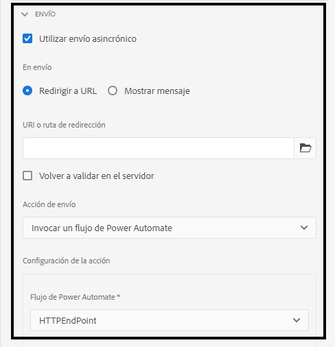

# Conectar un formulario adaptable con Microsoft® Power Automate {#connect-adaptive-form-with-power-automate}

<span class="preview"> Si se encuentra en GovCloud y necesita conectarse a un inquilino de GCC (Government Cloud Computing), envíe un correo electrónico desde su dirección oficial a aem-forms-ea@adobe.com para solicitar acceso a través del programa para primeros usuarios. </span>

Puede configurar un formulario adaptable para ejecutar un flujo de nube de Microsoft® Power Automate en el envío. El formulario adaptable configurado envía los datos capturados, los archivos adjuntos y el documento de registro al flujo de nube de Power Automate para su procesamiento. Le ayuda a crear una experiencia de captura de datos personalizada mientras aprovecha el poder de Microsoft® Power Automate para crear lógicas empresariales en torno a los datos capturados y automatizar los flujos de trabajo de los clientes.

El editor de formularios adaptables ofrece la acción de envío **Invocar un flujo de Microsoft® Power Automate** para enviar datos de formularios adaptables, archivos adjuntos y documentos de registro al flujo de nube de Power Automate. 

AEM as a Cloud Service ofrece varias acciones de envío predeterminadas para gestionar los envíos de formularios. Puede obtener más información sobre estas opciones en el artículo [Acción de envío del formulario adaptable](/help/forms/aem-forms-submit-action.md).


## Ventajas

A continuación se muestran algunos ejemplos de lo que puede hacer después de integrar un formulario adaptable con Microsoft® Power Automate:

* Usar datos de formularios adaptables en procesos empresariales de Power Automate
* Utilice Power Automate para enviar datos capturados a más de 500 fuentes de datos o a cualquier API disponible públicamente
* Realizar cálculos complejos en los datos capturados
* Guardar datos de formularios adaptables en sistemas de almacenamiento con una programación predefinida

## Requisitos previos

Para conectar un formulario adaptable con Microsoft® Power Automate, es necesario lo siguiente:

* Licencia de Microsoft® Power Automate Premium.
* Flujo de Microsoft® [Power Automate ](https://docs.microsoft.com/es-es/power-automate/create-flow-solution) con el activador `When an HTTP request is received` para aceptar los datos de envío del formulario adaptable.
* Un usuario de Experience Manager con privilegios de [autor de formularios](/help/forms/forms-groups-privileges-tasks.md) y [administrador de formularios](/help/forms/forms-groups-privileges-tasks.md)
* La cuenta utilizada para conectarse a Microsoft® Power Automate es la propietaria del flujo de Power Automate configurada para recibir datos del formulario adaptable

## Conectar su instancia de Forms as a Cloud Service con Microsoft® Power Automate {#connect-forms-server-with-power-automate}

Realice las siguientes acciones para conectar su instancia de Forms as a Cloud Service con Microsoft® Power Automate:

1. [Crear un Microsoft](#ms-power-automate-application)
1. [Crear Microsoft](#microsoft-power-automate-dataverse-cloud-configuration)
1. [Crear Microsoft](#create-microsoft-power-automate-flow-cloud-configuration)
1. [Publicar Microsoft](#publish-microsoft-power-automate-dataverse-cloud-configuration)

### Crear una aplicación de Microsoft® Azure Active Directory {#ms-power-automate-application}

1. Iniciar sesión en [Azure Portal](https://portal.azure.com/).
1. Seleccione [!UICONTROL Azure Active Directory] en el panel de navegación izquierdo.
1. En la página de directorio predeterminada, seleccione [!UICONTROL Registros de aplicaciones] en el panel izquierdo.
1. En la página Registros de aplicaciones, haga clic en Nuevos registros.
1. Especifique el nombre, tipos de cuenta compatibles y URI de redireccionamiento en la página. En el URI de redireccionamiento, especifique lo siguiente y haga clic en Guardar.
   * `https://[Forms as a Cloud Service Server]/libs/fd/powerautomate/content/dataverse/config.html`
   * `https://[Forms as a Cloud Service Server]/libs/fd/powerautomate/content/flowservice/config.html`

   

   >[!NOTE]
   >También puede especificar los URI de redireccionamiento adicionales, si es necesario, desde la página Autenticación.
   > Para los tipos de cuenta compatibles, seleccione un inquilino o varios o una cuenta personal de Microsoft®, según su caso de uso


1. En la página Autenticación, habilite las siguientes opciones y haga clic en Guardar.


   * Tokens de acceso (utilizados para flujos implícitos)
   * Tokens de ID (utilizados para flujos implícitos e híbridos)

1. En la página Permisos de API, haga clic en `Add a permission`.

1. En las API de Microsoft®, seleccione `Power Automate` y selecione los siguientes permisos.
   * Flows.Manage.All
   * Flows.Read.All
   * Permiso GCC (opcional si desea conectarse a un inquilino de GCC [Government Cloud Computing])
Haga clic en `Add permissions` para guardar los permisos.
1. En la página Permisos de API, haga clic en `Add a permission`. Seleccione las API que utiliza mi organización y busque `DataVerse` y habilite `user_impersonation`. Haga clic en `Add` permisos.
1. (Opcional) En la página Certificados y secretos, haga clic en Nuevo secreto de cliente. En la pantalla Añadir un secreto de cliente, aporte una descripción y un período de tiempo para que el secreto caduque y haga clic en Añadir. Se genera una cadena secreta.
1. Tenga en cuenta la [URL del entorno de Dynamics](https://docs.microsoft.com/es-es/power-automate/web-api#compose-http-requests) específica de su organización.

### Crear la configuración de nube de Microsoft® Power Automate Dataverse {#microsoft-power-automate-dataverse-cloud-configuration}

1. En la instancia de autor de AEM Forms, vaya a **[!UICONTROL Herramientas]**  > **[!UICONTROL General]** > **[!UICONTROL Explorador de configuración]**.
1. En la página **[!UICONTROL Explorador de configuración]**, seleccione **[!UICONTROL Crear]**.
1. En el cuadro de diálogo **[!UICONTROL Crear configuración]**, especifique un **[!UICONTROL Título]** para la configuración, habilite **[!UICONTROL Configuraciones de nube]** y seleccione **[!UICONTROL Crear]**. Crea un contenedor de configuración para almacenar servicios en la nube. Asegúrese de que el nombre de la carpeta no contenga ningún espacio.
1. Vaya a **[!UICONTROL Herramientas]**  > **[!UICONTROL Cloud Services]** > **[!UICONTROL Microsoft® Power Automate Dataverse]** y abra el contenedor de configuración que creó en el paso anterior.


   >[!NOTE]
   >
   >Cuando cree un formulario adaptable, especifique el nombre del contenedor en el campo **[!UICONTROL Contenedor de configuración]**.

1. En la página de configuración, seleccione **[!UICONTROL Crear]** para crear una configuración de [!DNL Microsoft® Power Automate Flow Service] en AEM Forms.
1. En la página **[!UICONTROL Configurar el servicio Dataverse para Microsoft® Power Automate]**, especifique el **[!UICONTROL ID del cliente]** (también denominado ID de aplicación), el **[!UICONTROL secreto del cliente]**, la **[!UICONTROL URL de OAuth]** y la **[!UICONTROL URL del entorno de Dynamics]**. Utilice el ID del cliente, el secreto del cliente, la URL de OAuth y la URL del entorno de Dynamics de la [Aplicación de Microsoft® Azure Active Directory](#ms-power-automate-application) creada en la sección anterior. Utilice la opción Puntos finales en la interfaz de usuario de la aplicación de Microsoft® Azure Active Directory para encontrar la URL de OAuth

   

1. Seleccione **[!UICONTROL Conectar]**. Si se le solicita, inicie sesión en su cuenta de Microsoft® Azure. Seleccione **[!UICONTROL Guardar]**.

### Crear la configuración de nube de Microsoft® Power Automate Flow Service. {#create-microsoft-power-automate-flow-cloud-configuration}

1. Vaya a **[!UICONTROL Herramientas]**  > **[!UICONTROL Cloud Services]** > **[!UICONTROL Microsoft® Power Automate Flow Service]** y abra el contenedor de configuración que creó en la sección anterior.


   >[!NOTE]
   >
   >Cuando cree un formulario adaptable, especifique el nombre del contenedor en el campo **[!UICONTROL Contenedor de configuración]**.

1. En la página de configuración, seleccione **[!UICONTROL Crear]** para crear una configuración de [!DNL Microsoft® Power Automate Flow Service] en AEM Forms.

1. (Opcional) Seleccione la casilla de verificación `Connect to Microsoft GCC` para conectarse al inquilino GCC.

   >[!NOTE]
   >
   > Si desea conectarse a un inquilino GCC (Government Cloud Computing), seleccione el permiso GCC en Microsoft Azure Portal.


   

1. En la página **[!UICONTROL Configurar Dataverse para Microsoft® Power Automate]**, especifique el **[!UICONTROL ID del cliente]** (también denominado ID de aplicación), el **[!UICONTROL secreto del cliente]**, la **[!UICONTROL URL de OAuth]** y la **[!UICONTROL URL del entorno de Dynamics]**. Utilice el ID del cliente, el secreto del cliente, la URL de OAuth y el ID del entorno de Dynamics. Utilice la opción Puntos finales en la interfaz de usuario de la aplicación de Microsoft® Azure Active Directory para encontrar la URL de OAuth. Abra el vínculo [Mis flujos](https://us.flow.microsoft.com) y seleccione Mis flujos para usar el ID indicado en la URL como ID del entorno de Dynamics.

1. Seleccione **[!UICONTROL Conectar]**. Si se le solicita, inicie sesión en su cuenta de Microsoft® Azure. Seleccione **[!UICONTROL Guardar]**.

### Publicar las configuraciones de nube de Microsoft® Power Automate Dataverse y Microsoft® Power Automate Flow Service {#publish-microsoft-power-automate-dataverse-cloud-configuration}

1. Vaya a **[!UICONTROL Herramientas]**  > **[!UICONTROL Cloud Services]** > **[!UICONTROL Microsoft® Power Automate Dataverse]** y abra el contenedor de configuración que creó en la sección [Crear la configuración de nube de Microsoft® Power Automate Dataverse](#microsoft-power-automate-dataverse-cloud-configuration) anterior.
1. Seleccione la configuración de `dataverse` y seleccione **[!UICONTROL Publicar]**.
1. En la página Publicar, seleccione **[!UICONTROL Todas las configuraciones]** y seleccione **[!UICONTROL Publicar]**. Publicar las configuraciones de nube de Power Automate Dataverse y Power Automate Flow Service.

Su instancia de Forms as a Cloud Service ahora está conectada con Microsoft® Power Automate. Ahora puede enviar datos de formularios adaptables a un flujo de Power Automate.

## Utilizar la acción de envío Invocar un flujo de Microsoft® Power Automate para enviar datos a un flujo de Power Automate {#use-the-invoke-microsoft-power-automate-flow-submit-action}

Tras [conectar su instancia de Forms as a Cloud Service con Microsoft® Power Automate](#connect-forms-server-with-power-automate), realice la siguiente acción para configurar el formulario adaptable y enviar los datos capturados a un flujo de Microsoft® al enviar el formulario.

>[!BEGINTABS]

>[!TAB Componente Base]

1. Inicie sesión en la instancia de autor, seleccione su formulario adaptable y haga clic en **[!UICONTROL Propiedades]**.
1. En el contenedor de configuración, examine y seleccione el contenedor creado en la sección [Crear la configuración de nube de Microsoft® Power Automate Dataverse](#microsoft-power-automate-dataverse-cloud-configuration) y seleccione **[!UICONTROL Guardar y cerrar]**.
1. Abra el formulario adaptable para editarlo y vaya a la sección **[!UICONTROL Envío]** de las propiedades del contenedor del formulario adaptable.
1. En el contenedor de propiedades, para las **[!UICONTROL Acciones de envío]** seleccione la opción **[!UICONTROL Invocar un flujo de Power Automate]** y un **[!UICONTROL Flujo de Power Automate]**. Seleccione el flujo necesario y los datos de formularios adaptables se envían en el momento del envío.

   
1. Haga clic en **[!UICONTROL Listo]**.

>[!NOTE]
>
> Antes de enviar el formulario adaptable, asegúrese de que se añada el activador `When an HTTP Request is received` con el esquema JSON a continuación a su flujo de Power Automate.

```
        {
            "type": "object",
            "properties": {
                "attachments": {
                    "type": "array",
                    "items": {
                        "type": "object",
                        "properties": {
                            "filename": {
                                "type": "string"
                            },
                            "data": {
                                "type": "string"
                            },
                            "contentType": {
                                "type": "string"
                            },
                            "size": {
                                "type": "integer"
                            }
                        },
                        "required": [
                            "filename",
                            "data",
                            "contentType",
                            "size"
                        ]
                    }
                },
                "templateId": {
                    "type": "string"
                },
                "templateType": {
                    "type": "string"
                },
                "data": {
                    "type": "string"
                },
                "document": {
                    "type": "object",
                    "properties": {
                        "filename": {
                            "type": "string"
                        },
                        "data": {
                            "type": "string"
                        },
                        "contentType": {
                            "type": "string"
                        },
                        "size": {
                            "type": "integer"
                        }
                    }
                }
            }
        }
```

>[!TAB Componente principal]

1. Inicie sesión en la instancia de autor, seleccione su formulario adaptable y haga clic en **[!UICONTROL Propiedades]**.
1. En el contenedor de configuración, examine y seleccione el contenedor creado en la sección [Crear la configuración de nube de Microsoft® Power Automate Dataverse](#microsoft-power-automate-dataverse-cloud-configuration) y seleccione **[!UICONTROL Guardar y cerrar]**.
1. Abra el Explorador de contenido y seleccione el componente **[!UICONTROL Contenedor de guía]** del formulario adaptable.
1. Haga clic en el icono de propiedades del contenedor de guía . Se abre el cuadro de diálogo Contenedor de formulario adaptable.
1. Haga clic en la pestaña **[!UICONTROL Envío]**.
1. Seleccione la opción **[!UICONTROL Invocar un flujo de Power Automate]** de la lista desplegable Enviar acción y seleccione un **[!UICONTROL flujo de Power Automate]**. Seleccione el flujo necesario y los datos de formularios adaptables se envían en el momento del envío.

   
1. Haga clic en **[!UICONTROL Listo]**.

>[!NOTE]
>
> Antes de enviar el formulario adaptable, asegúrese de que se añada el activador `When an HTTP Request is received` con el esquema JSON a continuación a su flujo de Power Automate.

```
        {
            "type": "object",
            "properties": {
                "attachments": {
                    "type": "array",
                    "items": {
                        "type": "object",
                        "properties": {
                            "filename": {
                                "type": "string"
                            },
                            "data": {
                                "type": "string"
                            },
                            "contentType": {
                                "type": "string"
                            },
                            "size": {
                                "type": "integer"
                            }
                        },
                        "required": [
                            "filename",
                            "data",
                            "contentType",
                            "size"
                        ]
                    }
                },
                "templateId": {
                    "type": "string"
                },
                "templateType": {
                    "type": "string"
                },
                "data": {
                    "type": "string"
                },
                "document": {
                    "type": "object",
                    "properties": {
                        "filename": {
                            "type": "string"
                        },
                        "data": {
                            "type": "string"
                        },
                        "contentType": {
                            "type": "string"
                        },
                        "size": {
                            "type": "integer"
                        }
                    }
                }
            }
        }
```

>[!TAB Editor universal]

1. Inicie sesión en la instancia de autor y seleccione su formulario adaptable.
1. En el contenedor de configuración, examine y seleccione el contenedor creado en la sección [Crear la configuración de nube de Microsoft® Power Automate Dataverse](#microsoft-power-automate-dataverse-cloud-configuration) y seleccione **[!UICONTROL Guardar y cerrar]**.
1. Abra el formulario adaptable para editarlo.
1. Haga clic en la extensión **Editar propiedades del formulario** en el editor.
Aparecerá el cuadro de diálogo **Propiedades del formulario**.

   >[!NOTE]
   >
   > * Si no ve el icono **Editar propiedades de formulario** en la interfaz de Universal Editor, habilite la extensión **Editar propiedades de formulario** en Extension Manager.
   > * Consulte el artículo [Aspectos destacados de las funciones de Extension Manager](https://developer.adobe.com/uix/docs/extension-manager/feature-highlights/#enablingdisabling-extensions) para obtener información sobre cómo habilitar o deshabilitar extensiones en el editor universal.


1. Haga clic en la pestaña **Envío** y seleccione la acción de envío **[!UICONTROL Invocar un flujo de Power Automate]**. Seleccione el flujo necesario y los datos de formularios adaptables se envían en el momento del envío.

   
1. Haga clic en **[!UICONTROL Guardar y cerrar]**.

>[!NOTE]
>
> Antes de enviar el formulario adaptable, asegúrese de que se añada el activador `When an HTTP Request is received` con el esquema JSON a continuación a su flujo de Power Automate.

```
        {
            "type": "object",
            "properties": {
                "attachments": {
                    "type": "array",
                    "items": {
                        "type": "object",
                        "properties": {
                            "filename": {
                                "type": "string"
                            },
                            "data": {
                                "type": "string"
                            },
                            "contentType": {
                                "type": "string"
                            },
                            "size": {
                                "type": "integer"
                            }
                        },
                        "required": [
                            "filename",
                            "data",
                            "contentType",
                            "size"
                        ]
                    }
                },
                "templateId": {
                    "type": "string"
                },
                "templateType": {
                    "type": "string"
                },
                "data": {
                    "type": "string"
                },
                "document": {
                    "type": "object",
                    "properties": {
                        "filename": {
                            "type": "string"
                        },
                        "data": {
                            "type": "string"
                        },
                        "contentType": {
                            "type": "string"
                        },
                        "size": {
                            "type": "integer"
                        }
                    }
                }
            }
        }
```

>[!ENDTABS]

<!--
## See also

* [Create an Adaptive Form](creating-adaptive-form-core-components.md)
* [Configure a Submit Action](configure-submit-actions-core-components.md)
* [Adobe Experience Manager Connector for Microsoft&reg; Power Automate](https://learn.microsoft.com/en-us/connectors/adobeexperiencemanag/)
* [Connect Adaptive Form to Microsoft&reg; Power Automate](/help/forms/configure-submit-actions-core-components.md#microsoft-power-automate)
-->


## Artículos relacionados

{{af-submit-action}}

<!--

>[!MORELIKETHIS]
>
>* [Connect Adaptive Form to Microsoft Power Automate](/help/forms/configure-submit-actions-core-components.md#microsoft-power-automate)

-->