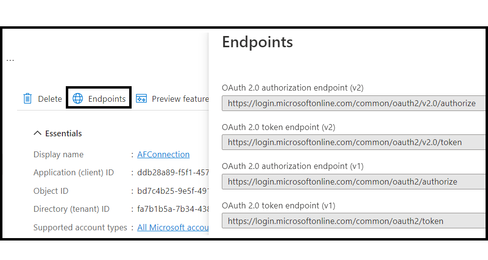

# Conectar un formulario adaptable con Microsoft® Power Automate {#connect-adaptive-form-with-power-automate}

Puede configurar un formulario adaptable para ejecutar un flujo de nube Microsoft® Power Automate en el envío. El formulario adaptable configurado envía los datos capturados, los archivos adjuntos y el documento de registro al flujo de Power Automate Cloud para su procesamiento. Le ayuda a crear una experiencia de captura de datos personalizada mientras aprovecha el poder de Microsoft® Power Automate para crear lógicas empresariales en torno a los datos capturados y automatizar los flujos de trabajo de los clientes. A continuación se muestran algunos ejemplos de lo que puede hacer después de integrar un formulario adaptable con Microsoft® Power Automate:

* Uso de datos de Forms Adaptable en un Power Automatice procesos empresariales
* Utilice Power Automate para enviar datos capturados a más de 500 fuentes de datos o a cualquier API disponible públicamente
* Realizar cálculos complejos en datos capturados
* Guardar datos de Forms adaptable en sistemas de almacenamiento de información en una programación predefinida

El editor de Forms adaptable proporciona la variable **Invocar un flujo Microsoft® Power Automate** envíe una acción para enviar datos de formularios adaptables, archivos adjuntos y documentos de registro a Power Automate Cloud Flow. Para utilizar la acción Enviar para enviar datos capturados a Microsoft® Power Automate, [Conecte su instancia as a Cloud Service de Forms con Microsoft® Power Automate](forms-microsoft-power-automate-integration.md#connect-forms-server-with-power-automate)

## Requisitos previos

Para conectar un formulario adaptable con Microsoft® Power Automate, es necesario lo siguiente:

* Licencia Microsoft® Power Automate Premium.
* Microsoft® [Power Automatizar flujo](https://docs.microsoft.com/en-us/power-automate/create-flow-solution) con la variable `When an HTTP request is received` déclencheur para aceptar los datos de envío del formulario adaptable.


* Un usuario Experience Manager con privilegios de Autor de Forms y Administrador de Forms.
* Asegúrese de que la cuenta utilizada para conectarse a Power Automate sea la propietaria del flujo de Power Automate.


## Conecte su instancia as a Cloud Service de Forms con Microsoft® Power Automate {#connect-forms-server-with-power-automate}

Realice las siguientes acciones para conectar su instancia as a Cloud Service de Forms con Microsoft® Power Automate:

1. Crear una aplicación de Microsoft® Azure Active Directory
1. Cree la configuración de Microsoft® Power Automate Dataverse Cloud.
1. Creación de la configuración de nube del servicio de flujo Microsoft® Power Automate
1. Publique la configuración de Microsoft® Power Automate Dataverse Cloud.

### Crear aplicación de Microsoft® Azure Active Directory {#ms-power-automate-application}

1. Iniciar sesión en [Azure Portal](https://portal.azure.com/).
1. Select [!UICONTROL Azure Active Directory] desde el panel de navegación izquierdo.
1. En la página Directorio predeterminado , seleccione [!UICONTROL Registros de aplicaciones] del panel izquierdo.
1. En la página Registros de aplicación , haga clic en Nuevos registros.
1. Especifique Nombre, Tipos de cuenta compatibles y URI de redirección en la página. En el URI de redirección, especifique lo siguiente y haga clic en Guardar.
   * `https://[Forms as a Cloud Service Server]/libs/fd/powerautomate/content/dataverse/config.html`
   * `https://[Forms as a Cloud Service Server]/libs/fd/powerautomate/content/flowservice/config.html`

   

   >[!NOTE]
   >También puede especificar URI de redireccionamiento adicionales, si es necesario, desde la página Autenticación .
   > Para los tipos de cuenta compatibles, seleccione un solo inquilino, varios inquilinos o cuenta personal de Microsoft según su caso de uso


1. En la página Autenticación, habilite las siguientes opciones y haga clic en Guardar.


   * Tokens de acceso (utilizados para flujos implícitos)
   * Tokens de ID (utilizados para flujos implícitos e híbridos)

1. En la página Permisos de API, haga clic en Agregar un permiso.
1. En las API de Microsoft®, seleccione el servicio de flujo y los siguientes permisos.
   * Flows.Manage.All
   * Flows.Read.All

   Haga clic en Agregar permisos para guardar los permisos.
1. En la página Permisos de API, haga clic en Agregar un permiso. Seleccione las API que utiliza mi organización y busque `DataVerse`.
1. Habilite user_impersonation y haga clic en Agregar permisos.
1. (Opcional) En la página Certificados y secretos , haga clic en Nuevo secreto de cliente. En la pantalla Agregar un secreto de cliente , proporcione una descripción y un período de tiempo para que el secreto caduque y haga clic en Agregar. Se genera una cadena secreta.
1. Tenga en cuenta las características específicas de su organización [URL del entorno de Dynamics](https://docs.microsoft.com/en-us/power-automate/web-api#compose-http-requests).

### Creación de la configuración de Microsoft® Power Automate Dataverse Cloud {#microsoft-power-automate-dataverse-cloud-configuration}

1. En la instancia de autor de AEM Forms, vaya a **[!UICONTROL Herramientas]**  > **[!UICONTROL General]** > **[!UICONTROL Explorador de configuración]**.
1. En el **[!UICONTROL Explorador de configuración]** página, toque **[!UICONTROL Crear]**.
1. En el **[!UICONTROL Crear configuración]** , especifique un **[!UICONTROL Título]** para la configuración, habilite **[!UICONTROL Configuraciones de nube]** y toque **[!UICONTROL Crear]**. Crea un contenedor de configuración para almacenar Cloud Services. Asegúrese de que el nombre de la carpeta no contenga ningún espacio.
1. Vaya a **[!UICONTROL Herramientas]**  > **[!UICONTROL Cloud Services]** > **[!UICONTROL Microsoft® Power Automate Dataverse]** y abra el contenedor de configuración que creó en el paso anterior.

   >[!NOTE]
   >
   >Cuando cree un formulario adaptable, especifique el nombre del contenedor en la variable **[!UICONTROL Contenedor de configuración]** campo .
1. En la página de configuración, pulse **[!UICONTROL Crear]** para crear [!DNL Microsoft® Power Automate Flow Service] en AEM Forms.
1. En el **[!UICONTROL Configurar el servicio Dataverse para Microsoft® Power Automate]** , especifique el **[!UICONTROL ID de cliente]** (también denominado ID de aplicación), **[!UICONTROL Secreto del cliente]**, **[!UICONTROL URL de OAuth]** y **[!UICONTROL URL de entorno dinámico]**. Utilice el ID del cliente, el Secreto del cliente, la URL de OAuth y la URL de entorno dinámico de [Aplicación Microsoft® Azure Active Directory](#ms-power-automate-application) creado en la sección anterior. Utilice la opción Endpoints en la interfaz de usuario de la aplicación Microsoft® Azure Active Directory para encontrar la URL de OAuth


Utilice la opción Endpoints en la interfaz de usuario de la aplicación Microsoft® Power Automatice para encontrar la URL de OAuth

1. Toque **[!UICONTROL Connect]** . Si se le solicita, inicie sesión en su cuenta de Microsoft® Azure. Toque **[!UICONTROL Guardar]**.

### Cree la configuración de nube del servicio de flujo Microsoft® Power Automate.

1. Vaya a **[!UICONTROL Herramientas]**  > **[!UICONTROL Cloud Services]** > **[!UICONTROL Servicio de flujo Microsoft® Power Automate]** y abra el contenedor de configuración que creó en la sección anterior.

   >[!NOTE]
   >
   >Cuando cree un formulario adaptable, especifique el nombre del contenedor en la variable **[!UICONTROL Contenedor de configuración]** campo .
1. En la página de configuración, pulse **[!UICONTROL Crear]** para crear [!DNL Microsoft® Power Automate Flow Service] en AEM Forms.
1. En el **[!UICONTROL Configurar Dataverse para Microsoft® Power Automate]** , especifique el **[!UICONTROL ID de cliente]** (también denominado ID de aplicación), **[!UICONTROL Secreto del cliente]**, **[!UICONTROL URL de OAuth]** y **[!UICONTROL URL de entorno dinámico]**. Utilice el ID del cliente, el Secreto del cliente, la URL de OAuth y el ID del entorno de Dynamics. Utilice la opción Extremos en la interfaz de usuario de la aplicación Microsoft® Azure Active Directory para encontrar la URL de OAuth. Abra el [Mis flujos](https://us.flow.microsoft.com) y pulse Mis flujos para usar el ID indicado en URL como ID de entorno de Dynamics.
1. Toque **[!UICONTROL Connect]**. Si se le solicita, inicie sesión en su cuenta de Microsoft® Azure. Toque **[!UICONTROL Guardar]**.

### Publique tanto Microsoft® Power Automate Dataverse como Microsoft® Power Automate Flow Service Cloud Configurations {#publish-microsoft-power-automate-dataverse-cloud-configuration}

1. Vaya a **[!UICONTROL Herramientas]**  > **[!UICONTROL Cloud Services]** > **[!UICONTROL Microsoft® Power Automate Dataverse]** y abra el contenedor de configuración que creó en el [Creación de la configuración de Microsoft® Power Automate Dataverse Cloud](#microsoft-power-automate-dataverse-cloud-configuration) para obtener más información.
1. Seleccione el `dataverse` configuración y toque **[!UICONTROL Publicación]**.
1. En la página Publicar , seleccione **[!UICONTROL Todas las configuraciones]** y toque **[!UICONTROL Publicación]**. Publique tanto Power Automate Dataverse como Power Automate Flow Service Cloud Configurations.

La instancia as a Cloud Service de Forms ahora está conectada con Microsoft® Power Automate. Ahora puede enviar datos de Adaptive Forms a un flujo de Power Automate.

## Utilice la acción de envío de flujo Invocar una alimentación de Microsoft® Automate para enviar datos a un flujo de automatización de energía {#use-the-invoke-microsoft-power-automate-flow-submit-action}

Tras [Conecte su instancia as a Cloud Service de Forms con Microsoft® Power Automate](#connect-forms-server-with-power-automate), realice la siguiente acción para configurar el formulario adaptable a fin de que envíe los datos capturados a un flujo de Microsoft® al enviar el formulario.

1. Inicie sesión en la instancia de autor, seleccione el formulario adaptable y haga clic en **[!UICONTROL Propiedades]**.
1. En el contenedor de configuración, busque y seleccione el contenedor creado en la sección [Creación de la configuración de Microsoft® Power Automate Dataverse Cloud](#microsoft-power-automate-dataverse-cloud-configuration)y toque **[!UICONTROL Guardar y cerrar]**.
1. Abra el formulario adaptable para editarlo y vaya a **[!UICONTROL Envío]** de las propiedades del contenedor del formulario adaptable.
1. En el contenedor de propiedades, para **[!UICONTROL Enviar acciones]** seleccione **[!UICONTROL Invocar un flujo de Power Automate]** . Una lista de los flujos de Power Automate disponibles está disponible **[!UICONTROL Power Automatizar flujo]** . Seleccione el flujo necesario y los datos de Forms adaptables se le envían al enviarlos.


>[!NOTE]
>
> Antes de enviar el formulario adaptable, asegúrese de que la variable `When an HTTP Request is received` El déclencheur con a continuación Esquema JSON se agrega a su flujo de Power Automate.

```
        {
            "type": "object",
            "properties": {
                "attachments": {
                    "type": "array",
                    "items": {
                        "type": "object",
                        "properties": {
                            "filename": {
                                "type": "string"
                            },
                            "data": {
                                "type": "string"
                            },
                            "contentType": {
                                "type": "string"
                            },
                            "size": {
                                "type": "integer"
                            }
                        },
                        "required": [
                            "filename",
                            "data",
                            "contentType",
                            "size"
                        ]
                    }
                },
                "templateId": {
                    "type": "string"
                },
                "templateType": {
                    "type": "string"
                },
                "data": {
                    "type": "string"
                },
                "document": {
                    "type": "object",
                    "properties": {
                        "filename": {
                            "type": "string"
                        },
                        "data": {
                            "type": "string"
                        },
                        "contentType": {
                            "type": "string"
                        },
                        "size": {
                            "type": "integer"
                        }
                    }
                }
            }
        }
```

