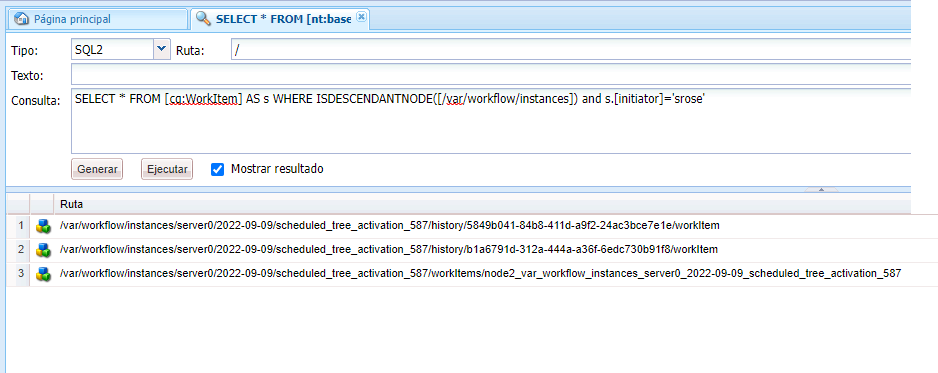
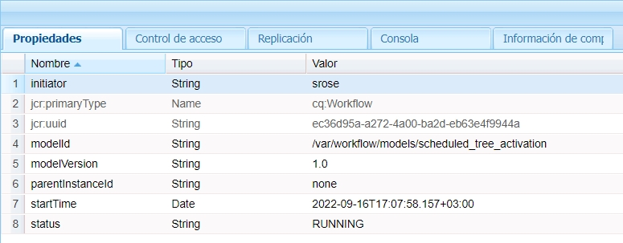
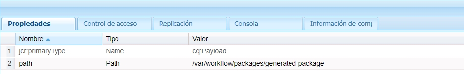

# Flujos de trabajo centrados en Forms en OSGi | Gestión de datos de usuario {#forms-centric-workflows-on-osgi-handling-user-data}

Los flujos de trabajo de AEM centrados en Forms le permiten automatizar procesos empresariales reales centrados en Forms. Los flujos de trabajo constan de una serie de pasos que se ejecutan en el orden especificado en el modelo de flujo de trabajo asociado. Cada paso realiza una acción específica, como asignar una tarea a un usuario o enviar un mensaje de correo electrónico. Los flujos de trabajo pueden interactuar con los recursos del repositorio, las cuentas de usuario y los servicios. Por lo tanto, los flujos de trabajo pueden coordinar actividades complejas que implican cualquiera de los aspectos de Experience Manager.

Un flujo de trabajo centrado en Forms se puede activar o iniciar mediante cualquiera de los siguientes métodos:

* El envío de una solicitud desde la bandeja de entrada AEM;
* El envío de una aplicación desde la aplicación AEM [!DNL Forms];
* El envío de un formulario adaptable;
* El uso de una carpeta inspeccionada;
* El envío de una comunicación interactiva o una carta.

Para obtener más información sobre los flujos de trabajo y las capacidades de AEM centrados en Forms, consulte [Flujo de trabajo centrado en Forms de OSGi](aem-forms-workflow.md).

## Almacenamiento de datos y datos de usuarios {#user-data-and-data-stores}

Cuando se activa un flujo de trabajo, se genera automáticamente una carga útil en la instancia del flujo de trabajo. A cada instancia de flujo de trabajo se le asigna un ID de instancia único y un ID de carga útil asociado. La carga útil contiene las ubicaciones del repositorio para los datos de usuario y de formulario asociados a una instancia de flujo de trabajo. Además, los borradores y los datos históricos de una instancia de flujo de trabajo también se almacenan en el repositorio de AEM.

Las ubicaciones de repositorio predeterminadas donde se encuentran la carga útil, los borradores y el historial de una instancia de flujo de trabajo son las siguientes:

>[!NOTE]
>
>Puede configurar diferentes ubicaciones para almacenar los datos de la carga útil, los borradores y el historial al crear un flujo de trabajo o una aplicación. Para identificar las ubicaciones en las que un flujo de trabajo o aplicación ha almacenado datos, revise el flujo de trabajo.

<table>
 <tbody>
  <tr>
   <td> </td>
   <td><b>AEM 6.4 [!DNL Forms]</b></td>
   <td><b>AEM 6.3 [!DNL Forms]</b></td>
  </tr>
  <tr>
   <td><strong>Instancia   del flujo de trabajo</strong></td>
   <td>/var/workflow/instances/[server_id]/&lt;date&gt;/[workflow-instance]/</td>
   <td>/etc/workflow/instances/[server_id]/[date]/[workflow-instance]/</td>
  </tr>
  <tr>
   <td><strong>Carga útil</strong></td>
   <td>/var/fd/dashboard/payload/[server_id]/[date]/  [payload-id]/</td>
   <td>/etc/fd/dashboard/payload/[server_id]/[date]/  [payload-id]/</td>
  </tr>
  <tr>
   <td><strong>Borradores</strong></td>
   <td>/var/fd/dashboard/instances/[server_id]/  [date]/[workflow-instance]/draft/[workitem]/</td>
   <td>/etc/fd/dashboard/instances/[server_id]/  [date]/[workflow-instance]/draft/[workitem]/</td>
  </tr>
  <tr>
   <td><strong>Historia</strong></td>
   <td>/var/fd/dashboard/instances/[server_id]/  [date]/[workflow_instance]/history/</td>
   <td>/etc/fd/dashboard/instances/[server_id]/  [date]/[workflow_instance]/history/</td>
  </tr>
 </tbody>
</table>

## Acceder y eliminar datos de usuario {#access-and-delete-user-data}

Puede acceder a los datos de usuario de una instancia de flujo de trabajo del repositorio y eliminarlos. Para ello, debe conocer el ID de instancia de la instancia de flujo de trabajo asociada al usuario. Puede encontrar el ID de instancia de una instancia de flujo de trabajo utilizando el nombre de usuario del usuario que inició la instancia de flujo de trabajo o que es el usuario asignado actual de la instancia de flujo de trabajo.

Sin embargo, no puede identificar flujos de trabajo asociados a un iniciador (o los resultados pueden ser ambiguos) en los siguientes casos:

* **Flujos de trabajo activados a través de una carpeta inspeccionada**: una instancia de flujo de trabajo no se puede identificar por su iniciador si el flujo de trabajo se activa mediante una carpeta inspeccionada. En este caso, la información del usuario se codifica en los datos almacenados.
* **AEM Flujo de trabajo iniciado desde una instancia de publicación**: todas las instancias de flujo de trabajo se crean mediante un usuario de servicio cuando se envían Forms AEM adaptable o cartas desde una instancia de publicación de la publicación de la publicación de la. En estos casos, el nombre de usuario del usuario que ha iniciado sesión no se captura en los datos de la instancia de flujo de trabajo.

### Acceder a los datos de usuario {#access}

Para identificar y acceder a los datos de usuario almacenados en una instancia de flujo de trabajo, realice los siguientes pasos:

1. En una instancia de autor de AEM, vaya a `https://'[server]:[port]'/crx/de` y después vaya a **[!UICONTROL Herramientas > Consulta]**.

   Seleccione **[!UICONTROL SQL2]** en la lista desplegable **[!UICONTROL Tipo]**.

1. En función de la información disponible, ejecute una de las siguientes consultas:

   * Ejecute lo siguiente si conoce el iniciador del flujo de trabajo:

   `SELECT &ast; FROM [cq:Workflow] AS s WHERE ISDESCENDANTNODE([path-to-workflow-instances]) and s.[initiator]='*initiator-ID*'`

   * Ejecute lo siguiente si el usuario de los datos que busca es el usuario asignado del flujo de trabajo actual:

   `SELECT &ast; FROM [cq:WorkItem] AS s WHERE ISDESCENDANTNODE([path-to-workflow-instances]) and s.[assignee]='*assignee-id*'`

   La consulta devuelve la ubicación de todas las instancias de flujo de trabajo del iniciador de flujo de trabajo especificado o el usuario asignado del flujo de trabajo actual.

   Por ejemplo, la siguiente consulta devuelve dos rutas de instancia de flujo de trabajo desde el nodo `/var/workflow/instances` cuyo iniciador de flujo de trabajo es `srose`.

   

1. Vaya a una de las rutas de instancia de flujo de trabajo devueltas por la consulta. La propiedad status muestra el estado actual de la instancia de flujo de trabajo.

   

1. En el nodo de la instancia de flujo de trabajo, vaya a `data/payload/`. La propiedad `path` almacena la ruta de acceso a la carga útil de la instancia de flujo de trabajo. Puede ir a la ruta para acceder a los datos almacenados en la carga útil.

   

1. Vaya a las ubicaciones de los borradores y el historial de la instancia de flujo de trabajo.

   Por ejemplo:

   `/var/fd/dashboard/instances/server0/2018-04-09/_var_workflow_instances_server0_2018-04-09_basicmodel_54/draft/`

   `/var/fd/dashboard/instances/server0/2018-04-09/_var_workflow_instances_server0_2018-04-09_basicmodel_54/history/`

1. Repita los pasos 3-5 para todas las instancias de flujo de trabajo devueltas por la consulta del paso 2.

   >[!NOTE]
   >
   >La aplicación AEM [!DNL Forms] también almacena datos en el modo Sin conexión. Es posible que los datos de una instancia de flujo de trabajo se almacenen localmente en dispositivos individuales y se envíen al servidor de [!DNL Forms] cuando la aplicación se sincroniza con él.

### Eliminar los datos de usuario {#delete-user-data}

Es necesario ser administrador de AEM para eliminar los datos de usuario de las instancias de flujo de trabajo mediante los siguientes pasos:

1. Siga las instrucciones indicadas en [Acceso a los datos de usuario](forms-workflow-osgi-handling-user-data.md#access) y anote lo siguiente:

   * las rutas a las instancias de flujo de trabajo asociadas al usuario;
   * el estado de las instancias de flujo de trabajo;
   * las rutas a las cargas útiles de las instancias de flujo de trabajo;
   * las rutas a los borradores y el historial de las instancias de flujo de trabajo.

1. Siga este paso para las instancias de flujo de trabajo cuyo estado sea **EN EJECUCIÓN**, **SUSPENDIDA** u **OBSOLETA**:

   1. Vaya a `https://'[server]:[port]'/aem/start.html` e inicie sesión con las credenciales de administrador.
   1. Vaya a **[!UICONTROL Herramientas > Flujo de trabajo > Instancias]**.
   1. Seleccione las instancias de flujo de trabajo relevantes para el usuario y pulse **[!UICONTROL Finalizar]** para finalizar las instancias en ejecución.

      Para obtener más información sobre cómo trabajar con instancias de flujo de trabajo, consulte [Administración de instancias de flujo de trabajo](https://experienceleague.adobe.com/docs/experience-manager-cloud-service/sites/authoring/workflows/overview.html?lang=es#authoring).

1. Vaya a la consola [!DNL CRXDE Lite], vaya a la ruta de la carga útil de una instancia de flujo de trabajo y elimine el nodo `payload`.
1. Vaya a la ruta de los borradores de una instancia de flujo de trabajo y elimine el nodo `draft`.
1. Vaya a la ruta del historial de una instancia de flujo de trabajo y elimine el nodo `history`.
1. Vaya a la ruta de instancia de flujo de trabajo de una instancia de flujo de trabajo y elimine el nodo `[workflow-instance-ID]` del flujo de trabajo.

   >[!NOTE]
   >
   >Al quitar el nodo de la instancia de flujo de trabajo, se eliminará la instancia de flujo de trabajo para todos los participantes del flujo de trabajo.

1. Repita los pasos 2-6 para todas las instancias de flujo de trabajo identificadas de un usuario.
1. Identifique y elimine los datos de los borradores y de envío sin conexión de la bandeja de salida de la aplicación AEM [!DNL Forms] de los participantes del flujo de trabajo para evitar que se realice ningún envío al servidor.

También puede utilizar API para acceder a los nodos y las propiedades y quitarlos. Consulte los siguientes documentos para obtener más información.

* [Cómo acceder mediante programación al JCR de AEM](https://experienceleague.adobe.com/docs/experience-manager-65/developing/platform/access-jcr.html?lang=es#platform)
* [Eliminación de nodos y propiedades](https://docs.adobe.com/docs/en/spec/jcr/2.0/10_Writing.html#10.9%20Removing%20Nodes%20and%20Properties)
* [Referencia de la API](https://helpx.adobe.com/es/experience-manager/6-3/sites-developing/reference-materials/javadoc/overview-summary.html)

>[!MORELIKETHIS]
>
>* [Uso del flujo de trabajo de AEM Forms para la automatización de procesos empresariales](/help/forms/aem-forms-workflow.md)