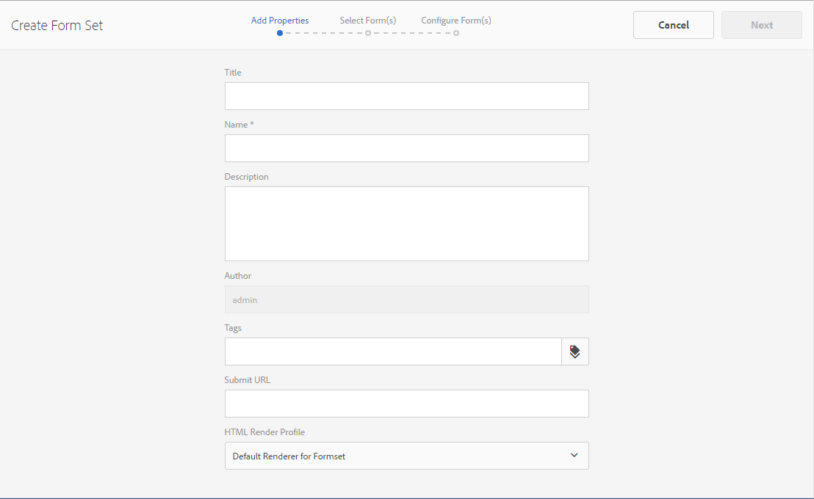

# Conjunto de formularios en AEM Forms{#form-set-in-aem-forms}

## Información general {#overview}

A menudo, es necesario que los clientes envíen varios formularios para solicitar un servicio o beneficio. Este proceso requiere localizar todos los formularios pertinentes, rellenarlos, enviarlos y realizar un seguimiento de forma individual. Además, es necesario que los clientes rellenen datos comunes varias veces en los formularios. Todo el proceso resulta engorroso y suele ser propenso a errores cuando se trabaja con un gran número de formularios. La función Conjuntos de formularios de AEM Forms puede ayudar a simplificar la experiencia del usuario en estos casos.

Un conjunto de formularios es una colección de formularios HTML5 agrupados y presentados como un único conjunto de formularios para los usuarios finales. Cuando estos empiezan a rellenar un conjunto de formularios, pueden desplazarse de un formulario a otro sin problemas. Al final, pueden enviar todos los formularios con un solo clic.

AEM Forms proporciona a los autores de formularios una interfaz de usuario intuitiva para crear, configurar y administrar conjuntos de formularios. Como autor, puede ordenar los formularios en la secuencia concreta que desea que sigan los usuarios finales. Además, puede aplicar condiciones o expresiones de idoneidad en formularios individuales para controlar su visibilidad en función de las entradas del usuario. Por ejemplo, puede configurar el formulario de datos del cónyuge para que aparezca únicamente cuando el estado civil se especifique como Casado.

Además, puede configurar campos comunes en distintos formularios para compartir enlaces de datos comunes. Cuando utiliza los enlaces de datos adecuados, los usuarios finales solo tienen que cumplimentar los datos comunes una vez, y estos se rellenan automáticamente en los formularios posteriores.

Los conjuntos de formularios también se admiten en la aplicación de AEM Forms, lo que permite que el personal de campo disponga de un conjunto de formularios sin conexión, visite a los clientes, introduzca los datos y sincronice posteriormente el conjunto con el servidor de AEM Forms para enviar los datos de los formularios a los procesos empresariales.

## Creación y administración de un conjunto de formularios {#creating-and-managing-form-set}

Puede asociar varios XDP o plantillas de formulario creados con Designer a un conjunto de formularios. Los conjuntos de formularios se pueden utilizar para procesar de forma selectiva los XDP en función de los valores introducidos por los usuarios en los formularios iniciales y sus perfiles.

Use la [Interfaz de usuario de AEM Forms](https://experienceleague.adobe.com/en/docs/experience-manager-65/content/forms/getting-started/introduction-managing-forms) para administrar todos los formularios, conjuntos de formularios y recursos relacionados.

### Crear un conjunto de formularios {#create-a-form-set}

Para crear un conjunto de formularios, haga lo siguiente:

1. Seleccione Forms > Formularios y documentos.
1. Seleccione Crear > Conjunto de formularios.

1. En la página Agregar propiedades, añada los siguientes detalles y haga clic en Siguiente.

   * Título: especifica el título del documento. El título le ayuda a identificar el formulario en la interfaz de usuario de AEM Forms.
   * Descripción: especifica la información detallada sobre el documento.
   * Etiquetas: especifica etiquetas para identificar el conjunto de formularios de forma única. Las etiquetas ayudan a buscar en el conjunto de formularios. Para crear etiquetas, escriba nuevos nombres de etiqueta en el cuadro Etiquetas.
   * Enviar URL: especifica la URL en la que se registran los datos enviados en el caso de que se represente un conjunto de formularios de forma independiente (caso de uso de aplicaciones distintas de AEM Forms). Se envían datos a este extremo como multipart/formdata con el siguiente parámetro de solicitud:
   * dataXML: este parámetro contiene una representación XML de los datos del conjunto de formularios enviado. Si todos los formularios del conjunto de formularios utilizan un esquema común, el XML se genera siguiendo ese esquema. De lo contrario, la etiqueta raíz XML contiene una etiqueta secundaria para cada formulario rellenado en el conjunto de formularios que contiene los datos de los archivos adjuntos del formulario.
   * formsetPath: la ruta del conjunto de formularios en CRXDE que se ha enviado.
   * Perfil de procesamiento HTML: puede configurar determinadas opciones, como campos flotantes, archivos adjuntos y compatibilidad con borradores (para la representación de conjuntos de formularios independientes), a fin de personalizar la apariencia, el comportamiento y las interacciones del conjunto de formularios. Puede personalizar o ampliar el perfil existente para cambiar cualquier configuración del perfil de los formularios HTML.

   

1. La pantalla Seleccionar formularios muestra los formularios XDP o los archivos XDP disponibles. Busque y seleccione los formularios que desea incluir en el conjunto de formularios y, a continuación, haga clic en Agregar a conjunto de formularios. Si es necesario, vuelva a buscar los formularios que desea agregar. Después de agregar todos los formularios al conjunto de formularios, haga clic en Siguiente.

   >[!NOTE]
   >
   >Asegúrese de que los nombres de campo de los formularios XDP no contienen el carácter de punto. De lo contrario, los scripts que intenten resolver los campos con caracteres de punto no podrán hacerlo.

1. En la página Configurar formularios, puede hacer lo siguiente:

   * Orden del formulario: arrastre y suelte los formularios para reordenarlos. El orden del formulario define el orden en el que se muestran los formularios al usuario final en la aplicación de AEM Forms y en la representación independiente.
   * Identificador de formulario: especifica una identidad única para los formularios que se van a utilizar en las expresiones de idoneidad.
   * Raíz de datos: para cada formulario del conjunto de formularios, el autor puede configurar el XPATH en el que los datos de ese formulario en particular se colocan en el XML enviado. El valor predeterminado es /. Si todos los formularios del conjunto de formularios están enlazados a un esquema y comparten el mismo esquema XML, puede cambiar este valor. Se recomienda que cada campo del formulario incluya el enlace de datos adecuado especificado en el XDP. Si dos campos de dos formularios diferentes comparten el enlace de datos común, el campo del segundo formulario muestra los valores rellenados previamente del primer formulario. No enlace dos subformularios con el mismo contenido interno al mismo nodo XML. Para obtener más información sobre la estructura XML del conjunto de formularios, consulte [Rellenar previamente XML para un conjunto de formularios](https://experienceleague.adobe.com/en/docs/experience-manager-65/content/forms/html5-forms/formset-in-aem-forms#prefill-xml-for-form-set).
   * Expresión de idoneidad: especifica una expresión de JavaScript que evalúa un valor booleano e indica si un formulario de un conjunto de formularios es apto para rellenarlo. Si es false, no se pregunta al usuario ni se le muestra el formulario que se va a rellenar. Normalmente, la expresión se basa en los valores de los campos capturados antes de este formulario. Las expresiones también contienen llamadas a la API fs.valueOf del conjunto de formularios para extraer los valores rellenados por el usuario en un campo de uno de los formularios del conjunto de formularios:

   *fs.valueOf(&lt;Form Identifier>, &lt;fieldSom expression>) > &lt;value>*

   Por ejemplo, si tiene dos formularios en el conjunto de formularios denominados Gastos comerciales y Gastos de viajes, puede agregar un fragmento de JavaScript en el campo Expresión de idoneidad para ambos formularios para comprobar los datos introducidos por el usuario en un formulario sobre el tipo de gasto. Si el usuario elige Gastos comerciales, se procesa el formulario Gastos comerciales para el usuario final. En cambio, si el usuario elige Gastos de viaje, se procesa un formulario diferente para el usuario final. Para obtener más información, consulte Expresión de idoneidad.

   Además, el autor también puede optar por quitar un formulario del conjunto de formularios utilizando el icono Eliminar de la esquina derecha de cada fila o agregar otro conjunto de formularios utilizando el icono &quot;**+**&quot; que aparece en la barra de herramientas. El icono &quot;**+**&quot; vuelve a dirigir al usuario al paso anterior del asistente, el cual se utilizó para &quot;Seleccionar formularios&quot;. Las selecciones existentes se mantienen, y cualquier selección adicional que realice debe agregarse al conjunto de formularios utilizando el icono Agregar a conjunto de formularios de esa página.

   

   >[!NOTE]
   >
   >La interfaz de usuario de AEM Forms administra todos los formularios que se utilizan en el conjunto de formularios.

### Administrar un conjunto de formularios {#managing-a-form-set}

Una vez creado un conjunto de formularios, puede realizar las siguientes acciones en ese conjunto:

* Un solo clic: cuando se crea el conjunto de formularios y aparece en la página de recursos principal, puede hacer clic en él para verlo. Se abre el conjunto de formularios y se muestran todas las plantillas de formulario (XDP) de ese conjunto de formularios.
* Editar: al hacer clic en Editar después de seleccionar un conjunto de formularios, aparece la pantalla Configurar formulario que se ha mostrado anteriormente en Pasos para crear un conjunto de formularios. Puede utilizar todas las funcionalidades que se describen en este punto.
* Copiar y pegar: esto permite copiar todo el conjunto de formularios desde una ubicación y pegarlo en la misma ubicación o en cualquier otra ubicación o carpeta.
* Descargar: puede descargar el conjunto de formularios con todas sus dependencias.
* Iniciar/Administrar revisión: una vez creado el conjunto de formularios, puede configurar su revisión haciendo clic en Iniciar revisión. Una vez iniciada la revisión de un conjunto de formularios, se muestra al usuario la opción Administrar revisión. En la pantalla Administrar revisión, puede actualizar o finalizar la revisión. En el caso de las revisiones que ha agregado, puede comprobar la revisión y agregar comentarios, si es necesario.
* Eliminar: elimina todo el conjunto de formularios. Los formularios del conjunto de formularios eliminado permanecen en el repositorio.
* Publicar/Cancelar publicación: esta funcionalidad publica o cancela la publicación del conjunto de formularios junto con todos los formularios que contiene y los recursos relacionados con estos formularios.
* Vista previa: la vista previa ofrece dos opciones: Vista previa como HTML (sin datos) y ver una vista previa personalizada con datos de muestra.
* Ver/editar propiedades: puede ver o editar las propiedades de metadatos de un conjunto de formularios seleccionado.


### Editar un conjunto de formularios {#edit-a-form-set}

Para editar un conjunto de formularios, haga lo siguiente:

1. Seleccione Forms > Formularios y documentos.
1. Busque el conjunto de formularios que desea editar. Pase el puntero por encima de él y seleccione Editar ().
1. En la página Configurar formularios, puede editar las siguientes opciones:

   * Orden del formulario
   * Identificador de formulario
   * Raíz de datos
   * Expresión de idoneidad

   También puede hacer clic en el icono Eliminar correspondiente para eliminar el formulario del conjunto de formularios.

## Conjunto de formularios en Process Management {#form-set-in-process-management}

Una vez que haya creado un conjunto de formularios utilizando la interfaz de usuario de AEM Forms Management, puede utilizar el conjunto de formularios en una actividad de Punto de inicio o Asignar tarea mediante Workbench.

### Uso del conjunto de formularios en Tarea o Punto de inicio {#using-form-set-in-task-or-start-point}

1. Al diseñar un proceso, en la sección Presentación y datos de Asignar tarea/Punto de inicio, seleccione **Usar un recurso CRX**. Aparecerá el Explorador de recursos CRX.

   

1. Seleccione el conjunto de formularios para filtrar el conjunto de formularios en el repositorio de AEM (CRX).

   

1. Seleccione un conjunto de formularios y haga clic en Aceptar.

## Expresiones de idoneidad {#eligibility-expressions}

Las expresiones de idoneidad de un conjunto de formularios se utilizan para definir y controlar dinámicamente los formularios que se muestran a un usuario. Por ejemplo, se utilizan para mostrar un formulario concreto solo si el usuario pertenece a un grupo de edad en particular. Puede especificar y editar las expresiones de idoneidad mediante Forms Manager.

Las expresiones de idoneidad pueden ser cualquier instrucción de JavaScript válida que devuelva un valor booleano. La última instrucción del fragmento de código JavaScript se trata como un valor booleano que determina la idoneidad del formulario en función del procesamiento en el resto (líneas anteriores) del fragmento de código JavaScript. Si el valor de la expresión es true, el formulario puede mostrarse al usuario. Estos formularios se denominan &quot;formularios aptos&quot;.

>[!NOTE]
>
>No se ejecuta la expresión de idoneidad para el primer formulario del conjunto de formularios. El primer formulario se muestra siempre, independientemente de su expresión de idoneidad.

Además de las funciones de JavaScript estándares, el conjunto de formularios también expone la API fs.valueOf, que proporciona acceso al valor del campo de un formulario de un conjunto de formularios. Utilice esta API para acceder al valor del campo de un formulario de un conjunto de formularios. La sintaxis de la API es fs.valueOf (formUid, fieldSOM), donde:

* formUid (cadena): el ID exclusivo de un formulario del conjunto de formularios. Puede especificarlo al crear el conjunto de formularios en la interfaz de usuario de Forms Manager. De forma predeterminada, es el nombre del formulario.
* fieldSOM (cadena): la expresión SOM del campo del formulario especificado por formUid. La expresión SOM, o expresión del modelo de objetos de scripts, se utiliza para hacer referencia a valores, propiedades y métodos dentro de un modelo de objetos de documento (DOM) concreto. Puede verla en la pestaña Scripts de Forms Designer mientras el campo está seleccionado.

>[!NOTE]
>
>Los parámetros formUid y fieldSOM deben ser literales de cadena.

### Ejemplos {#examples}

Uso válido de la API:

`fs.valueOf("form1", "xfa.form.form1.subform1.field1")`

Uso no válido de la API:

```javascript
var formUid = "form1";
 var fieldSOM = "xfa.form.form1.subform1.field1"; fs.valueOf(formUid, fieldSOM);
```

## Rellenar previamente XML para el conjunto de formularios {#prefill-xml-for-form-set}

Un conjunto de formularios es una colección de varios formularios HTML5 con esquemas comunes o diferentes. El conjunto de formularios admite la cumplimentación previa de campos de formulario mediante un archivo XML. Puede asociar un archivo XML con un conjunto de formularios, de modo que al abrir un formulario del conjunto de formularios, algunos de los campos del formulario se cumplimenten previamente.

El archivo XML de relleno previo se especifica utilizando el parámetro dataRef de la URL del conjunto de formularios. El parámetro dataRef especifica la ruta absoluta del archivo XML de datos que se combina con el conjunto de formularios.

Por ejemplo, tiene tres formularios (formulario1, formulario2 y formulario3), en el conjunto de formularios con la siguiente estructura:

formulario1

campo
campodelformulario1

formulario2

campo
campodelformulario2

formulario3

campo
campodelformulario3

Cada formulario tiene un campo de nombre común denominado &quot;campo&quot; y un campo de nombre único denominado &quot;campo de&lt;i>formulario&quot;.

Puede rellenar previamente este conjunto de formularios utilizando un XML con la siguiente estructura:

```xml
<?xml version="1.0" encoding="UTF-8" ?>
<formSetRootTag>
 <field>common field value</field>
 <form1field>value1</form1field>
 <form2field>value2</form2field>
 <form3field>value3</form3field>
</formSetRootTag>
```

>[!NOTE]
>
>La etiqueta raíz XML puede tener cualquier nombre, pero las etiquetas de elemento correspondientes a los campos deben tener el mismo nombre que el campo. La jerarquía del XML debe imitar la jerarquía del formulario, lo que significa que el XML debe tener las etiquetas correspondientes para ajustar los subformularios.

El fragmento XML anterior muestra que el XML de relleno previo del conjunto de formularios es una unión de los fragmentos XML de relleno previo de los formularios individuales. Si ciertos campos de los diferentes formularios tienen una jerarquía/esquema de datos similar entre sí, los campos se rellenan previamente con los mismos valores. En este ejemplo, los tres formularios se rellenan previamente con el mismo valor para el campo común, &quot;campo&quot;. Es una forma sencilla de transferir los datos de un formulario al siguiente. Otra forma de hacerlo es enlazar los campos al mismo esquema o referencia de datos. Si desea separar los datos del conjunto de formularios en función del esquema de los formularios, puede hacerlo especificando el atributo &quot;raíz de datos&quot; del formulario durante la creación del conjunto de formularios (el valor predeterminado es &quot;/&quot;, que se asigna a la etiqueta raíz del conjunto de formularios).

En el ejemplo anterior, si especifica las raíces de datos &quot;/formulario1&quot;, &quot;/formulario2&quot; y &quot;/formulario3&quot; respectivamente para los tres formularios, debe utilizar un XML de relleno previo con la siguiente estructura:

```xml
<?xml version="1.0" encoding="UTF-8" ?>
<formSetRootTag>
 <form1>
  <field>field value1</field>
  <form1field>value1</form1field>
 </form1>
 <form2>
  <field>field value2</field>
  <form2field>value2</form2field>
 </form2>
 <form3>
  <field>field value3</field>
  <form3field>value3</form3field>
 </form3>
</formSetRootTag>
```

En un conjunto de formularios, el XML ha definido un esquema XML con la siguiente sintaxis:

```xml
<formset>
 <fs_data>
  <xdp:xdp xmlns:xdp="https://ns.adobe.com/xdp/">
  <xfa:datasets xmlns:xfa="https://www.xfa.org/schema/xfa-data/1.0/">
   <xfa:data>
   <rootElement>
    ... data ....
   </rootElement>
   </xfa:data>
  </xfa:datasets>
  </xdp:xdp>
 </fs_data>
 <fs_draft>
  ... private data...
 </fs_draft>
</formset>
```

>[!NOTE]
>
>Si hay dos formularios con raíces de datos superpuestas, o si la jerarquía de elementos de un formulario se superpone con la jerarquía raíz de datos de otro, se combinan los valores de los elementos superpuestos en el xml de relleno previo. El XML de envío tiene una estructura similar a la del XML de relleno previo, pero el XML de envío tiene más etiquetas de contenedor y algunas etiquetas de datos de contexto del conjunto de formularios anexadas al final.

### Descripción de elementos XML de relleno previo {#prefill-xml-elements-description}

Reglas de sintaxis para crear un archivo XML de relleno previo:

* Parent elements: los elementos que pueden ser principales, en los cuales el valor null indica que el elemento puede estar en la raíz del XML.
* Cardinality: representa el número de veces que el elemento se puede usar dentro de su elemento principal.
* SubmitXML: indica si el elemento está siempre presente (P) u es opcional (O) en el XML de envío.
* PrefillXML: indica si el elemento es obligatorio(R) u opcional(O) en el XML de relleno previo.
* children: indica qué elementos pueden ser los elementos secundarios.

### FORMSET {#formset}

`parent elements:`

`null`

`cardinality: [0,1]`

`submitXML: P`

`prefillXML: O`

`children: fs_data`

El elemento raíz del conjunto de formularios XML. Se recomienda no utilizar esta palabra como nombre de rootSubform en ningún formulario del conjunto de formularios.

### FS_DATA {#fs-data}

`parent elements:`

`formset`

cardinality: [1]

submitXML: P

prefillXML: O

`children: xdp:xdp/rootElement`

El subárbol indica los datos de los formularios del conjunto de formularios. El elemento es opcional en el XML de relleno previo únicamente si el elemento del conjunto de formularios no está presente

### XDP:XDP {#xdp-xdp}

`parent elements: fs_data/null`

`cardinality: [0,1]`

`submitXML: O`

`prefillXML: O`

`children: xfa:datasets`

Esta etiqueta indica el inicio del XML del formulario HTML5. Se agrega al XML de envío si está presente en el XML de relleno previo o si no hay ningún XML de relleno previo. Esta etiqueta se puede eliminar del XML de relleno previo.

### XFA:DATASETS {#xfa-datasets}

`parent elements: xdp:xdp`

`cardinality: [1]`

`submitXML: O`

`prefillXML: O`

`children: xfa:data`

### XFA:DATA {#xfa-data}

`parent elements: xfa:datasets`

`cardinality: [1]`

`submitXML: O`

`prefillXML: O`

`children: rootElement`

### ROOTELEMENT {#rootelement}

`parent elements: xfa:datasets/fs_data/null`

`cardinality: [0,1]`

`submitXML: P`

`prefillXML: O`

`children: controlled by the Forms in Form set`

El nombre rootElement es solo un marcador de posición. El nombre real se selecciona de entre los formularios utilizados en el conjunto de formularios. El subárbol que comienza con rootElement contiene los datos de los campos y los subformularios de los formularios del conjunto de formularios. Existen múltiples factores que determinan la estructura de rootElement y sus elementos secundarios.

En el XML de relleno previo, esta etiqueta es opcional, pero si falta, se ignora la totalidad del XML.

NOMBRE DE LA ETIQUETA DEL ELEMENTO RAÍZ

Si hay un elemento raíz en el XML de relleno previo, el nombre de ese elemento también se agrega al XML de envío. En los casos en los que no hay un XML de relleno previo, el nombre de rootElement es el nombre del subformulario raíz del primer formulario del conjunto de formularios que tiene una propiedad dataRoot establecida en &quot;/&quot;. Si no existe ese formulario, el nombre de rootElement es **fs_dummy_root**, el cual es una palabra clave reservada.

## Conjunto de formularios de la aplicación AEM Forms {#formset-in-workspace-app}

La aplicación AEM Forms permite a los trabajadores de campo sincronizar sus dispositivos móviles con un servidor de AEM Forms y trabajar en sus tareas. La aplicación funciona incluso cuando el dispositivo está sin conexión guardando los datos de forma local en el dispositivo. Mediante las funciones de anotación, como las fotografías, los trabajadores de campo pueden proporcionar información precisa para integrarla en los procesos empresariales.

<!-- Update link as it is a 404 - For more information on AEM Forms app, see [AEM Forms app overview](/help/forms/using/mobile-workspace-overview.md).-->

## Limitaciones conocidas: algunos patrones no son totalmente compatibles con los conjuntos de formularios {#known-limitations-patterns-not-fully-supported-in-form-set}

Los siguientes patrones de datos no son totalmente compatibles con los conjuntos de formularios:

<table>
 <tbody>
  <tr>
   <td><strong>Patrón solo parcialmente compatible con los conjuntos de formularios</strong></td>
   <td><strong>Ejemplo</strong></td>
  </tr>
  <tr>
   <td>El tamaño de entrada y el tamaño del patrón no coinciden</td>
   <td><p>Cuando pattern= num{z,zzz}</p> <p>E input=</p> <p>12,345 o</p> <p>1,23</p> </td>
  </tr>
  <tr>
   <td>Patrones de cláusula de imagen con corchetes "(" ")"</td>
   <td>num{(zz,zzz)}</td>
  </tr>
  <tr>
   <td>Varios patrones de datos</td>
   <td>num{zz,zzz} | num{z,zzz,zzz}</td>
  </tr>
  <tr>
   <td>Patrones abreviados </td>
   <td><p>num.integer{},</p> <p>num.decimal{},</p> <p>num.percent{} o</p> <p>num.currency{}</p> </td>
  </tr>
 </tbody>
</table>
