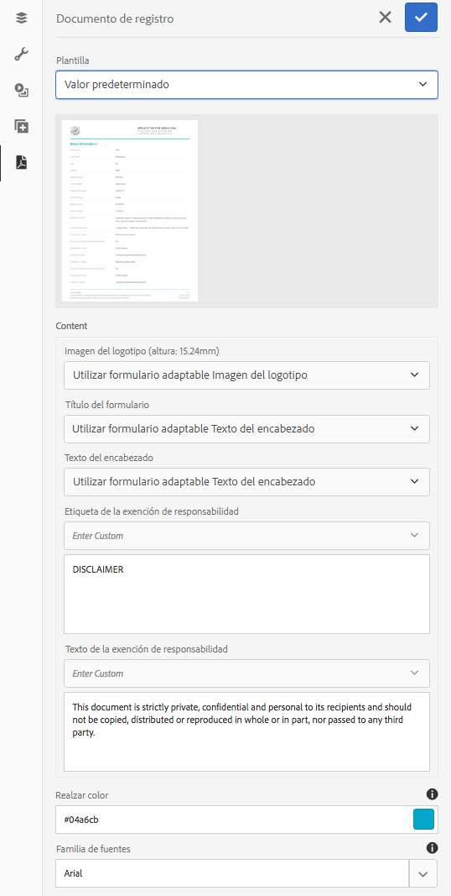

# Generar documento de registro para Forms adaptable

## Información general {#overview}

Cuando se rellena o se envía un formulario, se puede guardar un registro del formulario, en formato impreso o en formato de documento. Este registro se denomina Documento de registro (DoR). Se trata de una copia del formulario enviado que puede imprimirse. También puede remitir el documento de registro a la información que los clientes hayan rellenado en una fecha posterior o utilizar el documento de registro para archivar formularios y contenido en formato PDF.


Para crear un documento de registro, una plantilla basada en XFA o Acrobat se combina con los datos recopilados mediante un formulario adaptable. Puede generar un documento de registro automáticamente o bajo demanda.
La opción bajo demanda le permite especificar una plantilla personalizada basada en XFA o Acroform para proporcionar un aspecto personalizado al documento de registro.

Puede hacer lo siguiente:

* [Generar un documento de registro basado en XFA](#generate-an-XFA-based-document-of-record)
* [Generar un documento de registro basado en Acrobat (PDF de formulario de Acrobat)](#generate-an-Acroform-based-document-of-record)
* [Generar automáticamente un documento de registro](#auto-generate-a-document-of-record)

## Antes de comenzar {#components-to-automatically-generate-a-document-of-record}

Antes de empezar, aprenda y prepare los recursos necesarios para un documento de registro:

**Plantilla base:** Una plantilla XFA (archivo XDP) creada en Forms Designer o un formulario Acrobat (AcroForm). [Plantilla base](#base-template-of-a-document-of-record) se utiliza para especificar la información de estilo y marca de un documento de registro. Cargue la plantilla XFA (archivo XDP) en la instancia de AEM Forms antes de

**Formulario adaptable:** Formulario adaptable para el que se generará el documento de registro.

## Generar un documento de registro basado en XFA {#generate-an-XFA-based-document-of-record}

Cargue la plantilla XFA (archivo XDP) en la instancia de AEM Forms. Realice los siguientes pasos para configurar un formulario adaptable para utilizar una plantilla XFA (archivo XDP) como plantilla para el documento de registro:

1. En la instancia de autor del Experience Manager, haga clic en **[!UICONTROL Forms]** > **[!UICONTROL Forms y documentos].**
1. Seleccione un formulario y haga clic en **[!UICONTROL Propiedades]**.
1. En la ventana Propiedades, pulse **[!UICONTROL Modelo de formulario]**.
1. En el  **[!UICONTROL Modelo de formulario]** en la **[!UICONTROL Seleccionar de]** desplegable, seleccione **[!UICONTROL Esquema]** o **[!UICONTROL Ninguna]**. También puede seleccionar un modelo de formulario al crear un formulario.
1. En la sección Configuración de plantilla de documento de registro de la ficha Modelo de formulario, seleccione **Asociar plantilla de formulario como plantilla de documento de registro**. Al seleccionar esta opción, se muestran todas las plantillas XFA (archivos XDP) disponibles en el equipo. Seleccione el archivo correspondiente. Además, asegúrese de que se utiliza el mismo esquema (esquema de datos) para el formulario adaptable y la plantilla XFA seleccionada (archivo XDP).
1. Haga clic en **[!UICONTROL Listo.]**

El formulario adaptable ahora está configurado para utilizar un archivo XDP como plantilla para el documento de registro. Los siguientes pasos son [enlazar componentes de formulario adaptable con campos de plantilla correspondientes](#bind-adaptive-form-components-with-template-fields).

## Generar un documento de registro basado en Acrobat {#generate-an-Acroform-based-document-of-record}

Cargue su PDF de Adobe Acrobat (Acrobat) a su instancia de AEM Forms. Realice los siguientes pasos para configurar un formulario adaptable para que utilice el PDF de Adobe Acrobat (Acroform) como plantilla para el documento de registro:

1. En la instancia de autor del Experience Manager, haga clic en **[!UICONTROL Forms]** > **[!UICONTROL Forms y documentos].**
1. Seleccione un formulario y haga clic en **[!UICONTROL Propiedades]**.
1. En la ventana Propiedades, pulse **[!UICONTROL Modelo de formulario]**.
1. En el  **[!UICONTROL Modelo de formulario]** en la **[!UICONTROL Seleccionar de]** desplegable, seleccione **[!UICONTROL Esquema]** o **[!UICONTROL Ninguna]**. También puede seleccionar un modelo de formulario al crear un formulario.
1. En la sección Configuración de plantilla de documento de registro de la ficha Modelo de formulario, seleccione **Asociar plantilla de formulario como plantilla de documento de registro**. Al seleccionar esta opción, se muestran todos los PDF de Acrobat (Acrobat) disponibles en el equipo. Seleccione el archivo correspondiente.
1. Haga clic en **[!UICONTROL Listo.]**

El formulario adaptable ahora está configurado para utilizar una plantilla de Acroform como plantilla para el documento de registro. Los siguientes pasos son [enlazar componentes de formulario adaptable con campos de plantilla correspondientes](#bind-adaptive-form-components-with-template-fields).

## Generar automáticamente un documento de registro {#auto-generate-a-document-of-record}

Cuando se configura un formulario adaptable para que genere automáticamente un documento de registro, cada vez que se cambia un formulario, su documento de registro se actualiza inmediatamente. Por ejemplo, si se quita un campo de un formulario adaptable existente, el campo correspondiente también se elimina y no es visible en el Documento de registro. Hay muchas otras ventajas de generar automáticamente el Documento de Registro. :

* Los desarrolladores de formularios no tienen que mantener enlaces de datos manualmente. El documento de registro generado automáticamente se encarga de las actualizaciones relacionadas con los enlaces de datos.
* Los desarrolladores de formularios no tienen que ocultar manualmente los campos marcados como excluir del documento de registro. El documento de registro generado automáticamente está preconfigurado para excluir estos campos.
* La opción Documento de registro generado automáticamente ahorra el tiempo necesario para crear una plantilla de formulario para el documento de registro.
* La opción Documento de registro generado automáticamente le permite utilizar diferentes estilos y apariencias utilizando distintas plantillas base. Ayuda a seleccionar el mejor estilo y aspecto del documento de registro para su organización. Si no especifica estilo, los estilos del sistema se establecen como predeterminados.
* El documento de registro generado automáticamente garantiza que cualquier cambio en el formulario se refleje inmediatamente en el documento de registro.

Realice los siguientes pasos para configurar un formulario adaptable para generar automáticamente un documento de registro:

1. En la instancia de autor del Experience Manager, haga clic en **[!UICONTROL Forms]** > **[!UICONTROL Forms y documentos].**
1. Seleccione un formulario y haga clic en **[!UICONTROL Propiedades]**.
1. En la ventana Propiedades, pulse **[!UICONTROL Modelo de formulario]**.
1. En el  **[!UICONTROL Modelo de formulario]** en la **[!UICONTROL Seleccionar de]** desplegable, seleccione **[!UICONTROL Esquema]** o **[!UICONTROL Ninguna]**. También puede seleccionar un modelo de formulario al crear un formulario.
1. En la sección Configuración de plantilla de documento de registro de la ficha Modelo de formulario, seleccione **Generar documento de registro**.
1. Haga clic en **[!UICONTROL Listo.]**

## Enlazar componentes de formulario adaptable con campos de plantilla {#bind-adaptive-form-components-with-template-fields}

Enlace los campos de formulario adaptable con campos de plantilla para mostrar los datos de formulario capturados en el campo correspondiente Documento de registro. Para enlazar componentes de formulario adaptable con campos de plantilla de documento de registro correspondientes:

1. Abra el formulario adaptable, configurado para utilizar una plantilla de formulario personalizada para editarlo.

1. Seleccione un componente Formulario adaptable y haga clic en Abrir Configurar  icono. Abre el explorador de propiedades.

1. En el navegador de propiedades, busque y seleccione un campo.

   * (Para la plantilla AcroForm), la variable **[!UICONTROL Campo de referencia de enlace de documento]** propiedad.
   * (Para plantilla XFA) el **[!UICONTROL Referencia de enlace del modelo de datos]** propiedad.

1. Haga clic en **[!UICONTROL Guardar]**.

<!-- 
In the following video Adaptive Form components are binded with corresponding Acroform template fields and the Document of Record is sent as an email attachment.
-->

Puede utilizar la acción Enviar correo electrónico y enviar flujo de trabajo de Experience Manager junto con [Paso Documento de registro y otras acciones de envío](configuring-submit-actions.md) para recibir un documento de registro.

## Actualizaciones incrementales en la plantilla Documento de registro {#document-of-record-template-incremental-updates}

Los formularios adaptables y las plantillas de documento de registro correspondientes pueden evolucionar a lo largo del tiempo. Puede elegir entre agregar, quitar o modificar campos a un formulario adaptable o a una plantilla de documento de registro.

Cuando se realizan cambios en una plantilla Documento de registro y se carga la plantilla modificada Documento de registro en AEM Forms, el editor de Adaptive Forms detecta automáticamente los enlaces modificados y le informa sobre los componentes de formulario adaptables que requieren nuevos enlaces. Le permite realizar actualizaciones incrementales en una plantilla Documento de registro.

Por ejemplo, una organización, *We.Retail*, tiene una plantilla Documento de registro basado en AcroForm, *we-retail-Invoice.pdf*. La plantilla tiene el siguiente aspecto:


Después de usar la plantilla durante un tiempo, la organización decide cambiar el nombre `invoice-number` campo a `bill-number` y captura la dirección de correo electrónico de los compradores. Un desarrollador actualiza el nombre del `invoice-number` y añade un campo de correo electrónico a la plantilla. También crea una nueva versión de la plantilla llamada  *we-retail-Invoice-v2.pdf*.


El desarrollador carga y aplica a la plantilla actualizada al formulario adaptable. El formulario adaptable detecta y muestra automáticamente la lista de campos en los que el enlace ha cambiado.


El desarrollador de formularios enlaza los campos de Adaptive Forms con la plantilla correspondiente Documento de registro.
>[!VIDEO](assets/we-retail-binding.mp4)

Ahora, cuando se envía el formulario adaptable, se crea un documento actualizado de registro.


## Consideraciones clave al trabajar con el documento de registro {#key-considerations-when-working-with-document-of-record}

Tenga en cuenta las siguientes consideraciones y limitaciones al trabajar en Document of Record for Adaptive Forms.

* Las plantillas Documento de registro no admiten texto enriquecido. Por lo tanto, cualquier texto enriquecido del Formulario adaptable estático o de la información rellenada por el usuario final aparece como texto sin formato en el Documento de registro.
* Los fragmentos de documento de un formulario adaptable no aparecen en el documento de registro. Sin embargo, se admiten los fragmentos de formulario adaptables.
* No se admite el enlace de contenido en el documento de registro generado para el formulario adaptable basado en esquema XML.
* La versión localizada del documento de registro se crea bajo demanda para una configuración regional cuando el usuario solicita la renderización del documento de registro. La localización del documento de registro se produce junto con la localización del formulario adaptable. <!-- For more information on localization of Document of Record and Adaptive Forms see Using AEM translation workflow to localize Adaptive Forms and Document of Record.-->

<!-- ## Configure an adaptive form to generate  Document of Record {#adaptive-form-types-and-their-documents-of-record}

While creating an adaptive form, in the Form Model tab of Adaptive Form properties, select one the following option: 

* **None**
  Select the option to create an Adaptive Form without a form model. When the option is selected, the Document of Record is automatically generated for your Adaptive Form.

* **[Associate form template as a Document of Record template](creating-adaptive-form.md#create-an-adaptive-form-based-on-an-xfa-form-template)**
  
  Select the option to use an XFA Form as a template for Document of Record. 

* **[Generate Document of Record](creating-adaptive-form.md#create-an-adaptive-form-based-on-xml-or-json-schema)**
  Select the option to use an XFA Form as a template. When the option is selected, the Document of Record is automatically generated for your Adaptive Form. When you use an XML schema as a template for an Adaptive Form, ensure that the adaptive form and associated XFA Form use the same XML schema as your Adaptive Form
  

When you select a form model, configure Document of Record using options available under Document of Record Template Configuration. See [Document of Record Template Configuration](#document-of-record-template-configuration). -->

## Asignación de elementos de formulario adaptable {#mapping-of-adaptive-form-elements}

En la tabla siguiente se describen los componentes de formulario adaptable y los componentes XFA correspondientes y si aparecen en un documento de registro.

### Campos {#fields}

<table>
 <tbody>
  <tr>
   <th>Componente de formulario adaptable</th>
   <th>Componente XFA correspondiente</th>
   <th>¿Se incluye de forma predeterminada en la plantilla Documento de registro?</th>
   <th>Notas</th>
  </tr>
  <tr>
   <td>Botón</td>
   <td>Botón</td>
   <td>false</td>
   <td> </td>
  </tr>
  <tr>
   <td>Casilla de verificación</td>
   <td>Casilla de verificación</td>
   <td>verdadero</td>
   <td> </td>
  </tr>
  <tr>
   <td>Selector de fecha</td>
   <td>Campo de fecha y hora</td>
   <td>verdadero</td>
   <td> </td>
  </tr>
  <tr>
   <td>Lista desplegable</td>
   <td>Lista desplegable</td>
   <td>verdadero</td>
   <td> </td>
  </tr>
  <tr>
   <td>Firma a mano alzada</td>
   <td>Scribble de firma</td>
   <td>verdadero</td>
   <td> </td>
  </tr>
  <tr>
   <td>Cuadro numérico</td>
   <td>Campo numérico</td>
   <td>verdadero</td>
   <td> </td>
  </tr>
  <tr>
   <td>Cuadro de contraseña</td>
   <td>Campo de contraseña</td>
   <td>false</td>
   <td> </td>
  </tr>
  <tr>
   <td>Botón de opción</td>
   <td>Botón de opción</td>
   <td>verdadero</td>
   <td> </td>
  </tr>
  <tr>
   <td>Cuadro de texto</td>
   <td>Campo de texto</td>
   <td>verdadero</td>
   <td> </td>
  </tr>
  <tr>
   <td>Botón Restablecer</td>
   <td>Botón Restablecer</td>
   <td>false</td>
   <td> </td>
  </tr>
  <tr>
   <td>Botón Enviar</td>
   <td><p>Botón de envío por correo electrónico</p> <p>Botón Enviar HTTP</p> </td>
   <td>false</td>
   <td> </td>
  </tr>
  <tr>
   <td>Términos y condiciones</td>
   <td> </td>
   <td>verdadero</td>
   <td> </td>
  </tr>
  <tr>
   <td>Archivo adjunto</td>
   <td> </td>
   <td>false</td>
   <td>No disponible en la plantilla Documento de registro. Solo disponible en Documento de registro mediante archivos adjuntos.</td>
  </tr>
 </tbody>
</table>

### Contenedores {#containers}

<table>
 <tbody>
  <tr>
   <th>Componente de formulario adaptable</th>
   <th>Componente XFA correspondiente</th>
   <th>Notas</th>
  </tr>
  <tr>
   <td>Panel<br /> </td>
   <td>Subformulario<br /> </td>
   <td>El panel repetible se asigna a un subformulario repetible.</td>
  </tr>
 </tbody>
</table>

### Componentes estáticos {#static-components}

| Componente de formulario adaptable | Componente XFA correspondiente | Notas |
|---|---|---|
| Imagen | Imagen | Los componentes TextDraw e Image, tanto enlazados como no enlazados, siempre aparecen en el documento de registro de un formulario adaptable basado en XSD, a menos que se excluyan con la configuración Documento de registro. |
| Texto | Texto |

### Tablas {#tables}

Los componentes de tabla de Forms adaptable como encabezado, pie de página y asignación de filas a los componentes XFA correspondientes. Puede asignar paneles repetibles a tablas en el Documento de registro.

## Plantilla base de un documento de registro {#base-template-of-a-document-of-record}

La plantilla base proporciona información de estilo y apariencia al Documento de registro. Permite personalizar el aspecto predeterminado del documento de registro generado automáticamente. Por ejemplo, puede utilizar la plantilla base para añadir el logotipo de su empresa en el encabezado y la información de copyright en el pie de página del Documento de registro.

La página de formato de la plantilla base se utiliza como página de formato para la plantilla Documento de registro. La página de formato puede tener información como encabezado de página, pie de página y número de página que puede aplicar al documento de registro. Puede aplicar dicha información al documento de registro utilizando la plantilla base para la generación automática del documento de registro. El uso de una plantilla base permite cambiar las propiedades predeterminadas de los campos.

Siga siempre [Convenciones de plantilla base](#base-template-conventions) al diseñar la plantilla base.

## Convenciones de plantilla base {#base-template-conventions}

Se utiliza una plantilla base para definir el encabezado, pie de página, estilo y apariencia de un documento de registro. El encabezado y pie de página pueden incluir información como el logotipo de la empresa y el texto de copyright. La primera página de formato de la plantilla base se copia y se utiliza como página de formato del documento de registro, que contiene el encabezado, pie de página, número de página o cualquier otra información que deba aparecer en todas las páginas del documento de registro. Si utiliza una plantilla base que no se ajuste a las convenciones de plantilla base, la primera página de formato de la plantilla base se seguirá utilizando en la plantilla Documento de registro. Se recomienda encarecidamente que diseñe la plantilla base según sus convenciones y que la utilice para la generación automática del documento de registro.

**Convenciones de la página de formato**

* En la plantilla base, asigne un nombre al subformulario raíz como `AF_METATEMPLATE` y la página de formato como `AF_MASTERPAGE`.

* La página de formato con el nombre `AF_MASTERPAGE` ubicado bajo el `AF_METATEMPLATE` se prefiere el subformulario raíz para extraer información de encabezado, pie de página y estilo.

* If `AF_MASTERPAGE` no existe, se utiliza la primera página de formato presente en la plantilla base.

**Convenciones de estilo para campos**

* Para aplicar estilo en los campos del Documento de registro, la plantilla base proporciona campos ubicados en la variable `AF_FIELDSSUBFORM` subdesde en el `AF_METATEMPLATE` subformulario raíz.

* Las propiedades de estos campos se aplican a los campos del Documento de registro. Estos campos deben seguir el `AF_<name of field in all caps>_XFO` convención de nomenclatura. Por ejemplo, el nombre de campo de la casilla de verificación debe ser `AF_CHECKBOX_XFO`.

Para crear una plantilla base, haga lo siguiente en Forms Designer.

1. Haga clic en **[!UICONTROL Archivo]** > **[!UICONTROL Nuevo]**.
1. Seleccione el **[!UICONTROL Basado en una plantilla]** .

1. Seleccione el **[!UICONTROL Forms - Documento de registro]** categoría.
1. Select **[!UICONTROL Plantilla base DoR]**.
1. Haga clic en **[!UICONTROL Siguiente]** y proporcione la información requerida.

1. (Opcional) Modifique el estilo y el aspecto de los campos que desea aplicar en los campos del Documento de registro.
1. Guarde el formulario.

Ahora puede utilizar el formulario guardado como plantilla base para el documento de registro. No modifique ni elimine ninguna secuencia de comandos presente en la plantilla base.

**Modificación de la plantilla base**

* Si no se aplica ningún estilo a los campos de la plantilla base, es aconsejable quitar esos campos de la plantilla base para que todas las actualizaciones a la plantilla base se recojan automáticamente.
* Al modificar la plantilla base, no elimine, agregue ni modifique secuencias de comandos.

Siga estrictamente las convenciones e instrucciones mencionadas anteriormente para diseñar una plantilla base.

## Personalización de la información de marca en Documento de registro {#customize-the-branding-information-in-document-of-record}

Al generar un documento de registro, puede cambiar la información de marca del documento de registro en la ficha Documento de registro. La ficha Documento de registro incluye opciones como logotipo, apariencia, diseño, encabezado y pie de página, renuncia de responsabilidad y si desea incluir o no las opciones de casillas de verificación y botones de opción no seleccionadas.

Para localizar la información de marca introducida en la ficha Documento de registro, asegúrese de que la configuración regional del explorador esté correctamente configurada. Para personalizar la información de marca del Documento de registro, realice los siguientes pasos:

1. Seleccione un panel (panel raíz) en el documento de registro y, a continuación, pulse .
1. Toque . Aparecerá la ficha Documento de registro.
1. Seleccione la plantilla predeterminada o una plantilla personalizada para procesar el documento de registro. Si selecciona la plantilla predeterminada, aparece una vista previa en miniatura del documento de registro debajo de la lista desplegable Plantilla.

   

   Si elige seleccionar una plantilla personalizada, busque y seleccione un XDP en su [!DNL AEM Forms] servidor. Si desea utilizar una plantilla que no esté ya en su [!DNL AEM Forms] servidor, primero debe cargar el XDP en su [!DNL AEM Forms] servidor.

1. En función de si selecciona una plantilla predeterminada o personalizada, algunas o todas las propiedades siguientes aparecen en la ficha Documento de registro. Especifíquelos correctamente:

   * **Imagen del logotipo**: Puede elegir usar la imagen del logotipo en el formulario adaptable, elegir una de DAM o cargar una desde el equipo.
   * **Título del formulario**
   * **Texto de encabezado**
   * **Etiqueta de la exención de responsabilidad**
   * **Exención de responsabilidad**
   * **Texto de la exención de responsabilidad**
   * **Color de énfasis**: El color en el que se representan las líneas del texto del encabezado y del separador en el PDF del documento o registro
   * **Familia de fuentes**: Familia de fuentes del texto en el PDF Documento de registro
   * **Para los componentes Casilla de verificación y Botón de radio , muestre solo los valores seleccionados**
   * **Separador para varios valores seleccionados**
   * **Incluir objetos de formulario que no estén enlazados al modelo de datos**
   * **Excluir campos ocultos del documento de registro**
   * **Ocultar descripción de paneles**

   >[!NOTE]
   >
   >Si utiliza una plantilla de formulario adaptable creada con una versión de Designer anterior a la 6.3 para que funcionen las propiedades Color de acento y Familia de fuentes, asegúrese de que lo siguiente esté presente en la plantilla de formulario adaptable en el subformulario raíz:

   ```xml
   <proto>
   <font typeface="Arial"/>
   <fill>
   <color value="4,166,203"/>
   </fill>
   <edge>
   <color value="4,166,203"/>
   </edge>
   </proto>
   ```

1. Para guardar los cambios de marca, pulse Listo.

## Presentaciones de tablas y columnas para paneles del Documento de registro {#table-and-column-layouts-for-panels-in-document-of-record}

El formulario adaptable puede ser largo y tener varios campos de formulario. Es posible que no desee guardar un documento de registro como una copia exacta del formulario adaptable. Ahora puede elegir un diseño de tabla o columna para guardar uno o más paneles de Formulario adaptable en el PDF Documento de registro.

Antes de generar un documento de registro, en la configuración de un panel, seleccione Presentación del documento de registro para ese panel como Tabla o Columna. Los campos del panel se organizan en consecuencia en el documento de registro.


Campos de un panel procesado con una presentación de tabla en el documento de registro


Campos de un panel procesado en una presentación de columna del Documento de registro

## Configuración del documento de registro {#document-of-record-settings}

La configuración de Documento de registro le permite elegir las opciones que desea incluir en el Documento de registro. Por ejemplo, un banco acepta el nombre, la edad, el número de la seguridad social y el número de teléfono en un formulario. El formulario genera un número de cuenta bancaria y detalles de sucursal. Puede elegir mostrar únicamente el nombre, el número de la seguridad social, la cuenta bancaria y los detalles de la sucursal en el documento de registro.

La configuración del componente Documento de registro está disponible en sus propiedades. Para acceder a las propiedades de un componente, seleccione el componente y haga clic en  en la superposición. Las propiedades se enumeran en la barra lateral y puede encontrar la siguiente configuración en ella.

**Configuración del nivel de campo**

* **Excluir del documento de registro**: Al establecer la propiedad true, se excluye el campo del documento de registro. Se trata de una propiedad con nombre de secuencias de comandos `excludeFromDoR`. Su comportamiento depende de **Excluir campos de DoR si están ocultos** propiedad de nivel de formulario.

* **Mostrar panel como tabla:** Al establecer la propiedad, se muestra el panel como tabla en Documento de registro si el panel tiene menos de 6 campos. Aplicable solo para panel.
* **Excluir título del documento de registro:** Al establecer la propiedad se excluye el título del panel o tabla del documento de registro. Aplicable solo para panel y tabla.
* **Excluir descripción del documento de registro:** Al establecer la propiedad se excluye la descripción del panel/tabla del documento de registro. Aplicable solo para panel y tabla.

**Configuración del nivel de formulario**

* **Incluir campos no enlazados en DoR:** La configuración de la propiedad incluye campos no enlazados del formulario adaptable basado en esquema del documento de registro. De forma predeterminada, es true.
* **Excluir campos de DoR si están ocultos:** Al establecer la propiedad se anula el comportamiento de la propiedad de nivel de campo &quot;Excluir del documento de registro&quot; cuando no es verdadera. Si los campos están ocultos en el momento del envío del formulario, se excluyen del documento de registro si la propiedad está establecida en true, siempre que la propiedad &quot;Excluir del documento de registro&quot; no esté establecida. Configuración [Revalidate en el servidor](/help/forms/configuring-submit-actions.md#server-side-revalidation-in-adaptive-form-server-side-revalidation-in-adaptive-form) property to true identifica los campos ocultos para su exclusión del documento de registro en el servidor.

## Usar un archivo XCI personalizado

Un archivo XCI ayuda a establecer varias propiedades de un documento. Forms as a Cloud Service tiene un archivo XCI maestro. Puede utilizar un archivo XCI personalizado para anular una o más propiedades predeterminadas especificadas en el archivo XCI maestro. Por ejemplo, puede optar por incrustar una fuente en un documento o habilitar la propiedad etiquetada para todos los documentos. La siguiente tabla especifica las opciones de XCI:

| Opción XCI | Descripción |
|--- |--- |
| config/actual/pdf/creator | Identifica al creador del documento mediante la entrada Creador del diccionario de información del documento. Para obtener información sobre este diccionario, consulte la [Guía de referencia del PDF](https://www.adobe.com/content/dam/acom/en/devnet/pdf/pdfs/pdf_reference_archives/PDFReference.pdf). |
| config/actual/pdf/production | Identifica al productor del documento mediante la entrada Producer del diccionario de información del documento. Para obtener información sobre este diccionario, consulte la [Guía de referencia del PDF](https://www.adobe.com/content/dam/acom/en/devnet/pdf/pdfs/pdf_reference_archives/PDFReference.pdf). |
| config/current/layout | Controla si la salida es un solo panel o paginado. |
| config/current/pdf/compression/level | Especifica el grado de compresión que se utilizará al generar un documento de PDF. |
| config/actual/pdf/fontInfo/embed | Controla la incrustación de fuentes en el documento de salida. |
| config/current/pdf/scriptModel | Controla si la información específica de XFA se incluye en el documento del PDF de salida. |
| config/current/common/data/adaptData | Controla si la aplicación XFA ajusta los datos después de la combinación. |
| config/actual/pdf/renderPolicy | Controla si la generación del contenido de la página se realiza en el servidor o se diferye al cliente. |
| config/current/common/locale | Especifica la configuración regional predeterminada utilizada en el documento de salida. |
| config/current/destination | Cuando está contenido en un elemento presente, especifica el formato de salida. Cuando está contenido en un elemento openAction, especifica la acción que se debe realizar al abrir el documento en un cliente interactivo. |
| config/current/output/type | Especifica el tipo de compresión que se aplicará a un archivo o el tipo de salida que se producirá. |
| config/current/common/temp/uri | Especifica el URI del formulario. |
| config/current/common/template/base | Proporciona una ubicación base para URIs en el diseño de formulario. Cuando este elemento está ausente o vacío, se utiliza como base la ubicación del diseño de formulario. |
| config/current/common/log/to | Controla la ubicación en la que se escriben los datos de registro o los datos de salida. |
| config/current/output/to | Controla la ubicación en la que se escriben los datos de registro o los datos de salida. |
| config/current/script/currentPage | Especifica la página inicial cuando se abre el documento. |
| config/current/script/exclude | Informa a Forms as a Cloud Service qué eventos se deben ignorar. |
| config/actual/pdf/linearized | Controla si el documento del PDF de salida está linealizado. |
| config/current/script/runScripts | Controla qué conjunto de secuencias de comandos se ejecuta Forms as a Cloud Service. |
| config/actual/pdf/tagged | Controla la inclusión de etiquetas en el documento del PDF de salida. Las etiquetas, en el contexto del PDF, son información adicional incluida en un documento para exponer la estructura lógica del documento. Las etiquetas ayudan a facilitar la accesibilidad y a cambiar el formato. Por ejemplo, un número de página puede etiquetarse como un artefacto para que un lector de pantalla no lo enuncie en medio del texto. Aunque las etiquetas hacen que un documento sea más útil, también aumentan el tamaño del documento y el tiempo de procesamiento para crearlo. |
| config/current/pdf/fontInfo/alwaysEmbed | Especifica una fuente que está incrustada en el documento de salida. |
| config/current/pdf/fontInfo/neverEmbed | Especifica una fuente que nunca debe incrustarse en el documento de salida. |
| config/actual/pdf/pdfa/part | Especifica el número de versión de la especificación de PDF/A a la que se ajusta el documento. |
| config/actual/pdf/pdfa/amd | Especifica el nivel de modificación de la especificación PDF/A. |
| config/actual/pdf/pdfa/conformance | Especifica el nivel de conformidad con la especificación PDF/A. |
| config/actual/pdf/version | Especifica la versión del documento de PDF que se va a generar |
| config/actual/pdf/version/map | Especifica las fuentes de reserva para el documento |

### Utilizar un archivo XCI personalizado en el entorno as a Cloud Service de Forms

1. Añada el archivo XCI personalizado al proyecto de desarrollo.
1. Especifique lo siguiente [inline, propiedad](/help/implementing/deploying/configuring-osgi.md):

   ```JSON
    {
     "xciFilePath": "[path of XCI file]"
    }
   ```

   Por ejemplo,

   ```JSON
    {
     "xciFilePath": "/content/dam/formsanddocuments/customMinionProBoldAndTagged.xci"
    }
   ```

1. Implemente el proyecto en el entorno de Cloud Service.

### Utilizar un archivo XCI personalizado en el entorno de desarrollo as a Cloud Service de Forms local

1. Cargue el archivo XCI en su entorno de desarrollo local.
1. Abra el administrador de configuración del SDK de Cloud Service. La dirección URL predeterminada es: <http://localhost:4502/system/console/configMgr>.
1. Busque y abra el **[!UICONTROL Canal web de comunicaciones interactivas y Forms adaptable]** configuración.
1. Especifique la ruta del archivo XCI y haga clic en **[!UICONTROL Guardar]**.
