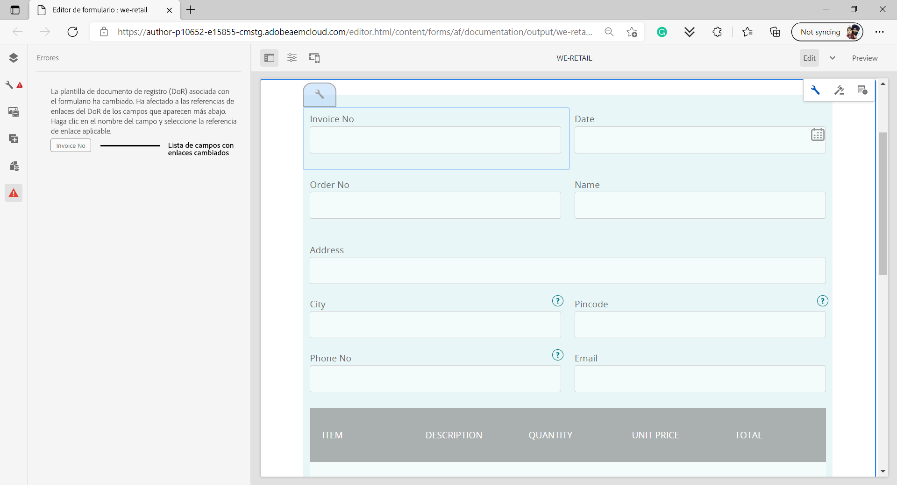

# Generar documento de registro para formularios adaptables

>[!NOTE]
>
> Adobe recomienda utilizar la captura de datos moderna y ampliable [Componentes principales](https://experienceleague.adobe.com/docs/experience-manager-core-components/using/adaptive-forms/introduction.html?lang=es) para [crear nuevos formularios adaptables](/help/forms/creating-adaptive-form-core-components.md) o [adición de formularios adaptables a páginas de AEM Sites](/help/forms/create-or-add-an-adaptive-form-to-aem-sites-page.md). Estos componentes representan un avance significativo en la creación de formularios adaptables, lo que garantiza experiencias de usuario impresionantes. Este artículo describe un enfoque más antiguo para crear formularios adaptables con componentes de base.


| Versión | Vínculo del artículo |
| -------- | ---------------------------- |
| AEM 6.5 | [Haga clic aquí](https://experienceleague.adobe.com/docs/experience-manager-65/forms/adaptive-forms-advanced-authoring/asynchronous-submissions-adaptive-forms.html?lang=es) |
| AEM as a Cloud Service | Este artículo |

## Información general {#overview}

Cuando se rellena o se envía un formulario, se puede guardar un registro del formulario, en formato impreso o en formato de documento. Este registro se denomina Documento de registro (DoR). Se trata de una copia del formulario enviado que puede imprimirse. También puede remitir el documento de registro a la información que los clientes hayan rellenado en una fecha posterior o utilizar el documento de registro para archivar formularios y contenido en formato PDF.


Para crear un documento de registro, una plantilla basada en XFA o AcroForm se combina con los datos recopilados mediante un formulario adaptable. Puede generar un documento de registro automáticamente o bajo demanda. 
La opción bajo demanda permite especificar una plantilla personalizada basada en XFA o AcroForm para proporcionar un aspecto personalizado al documento de registro.

Puede hacer lo siguiente:

* [Generar un documento de registro basado en XFA](#generate-an-XFA-based-document-of-record)
* [Generar un documento de registro basado en AcroForm (PDF de formulario de Acrobat)](#generate-an-Acroform-based-document-of-record)
* [Generar automáticamente un documento de registro](#auto-generate-a-document-of-record)

## Antes de comenzar {#components-to-automatically-generate-a-document-of-record}

Antes de comenzar, aprenda y prepare los recursos necesarios para un documento de registro:

**Plantilla base:** una plantilla XFA (archivo XDP) creada en el diseñador de formularios o un formulario de Acrobat (AcroForm). La [plantilla base](#base-template-of-a-document-of-record) se utiliza para especificar la información de estilo y de personalización de marca de un documento de registro. Cargue la plantilla XFA (archivo XDP) en la instancia de AEM Forms previamente.

**Formulario adaptable:** formulario adaptable para el que se generará el documento de registro.

## Generar un documento de registro basado en XFA {#generate-an-XFA-based-document-of-record}

Cargue la plantilla XFA (archivo XDP) en la instancia de AEM Forms. Realice los siguientes pasos para configurar un formulario adaptable con el que utilizar una plantilla XFA (archivo XDP) para el documento de registro:

1. En la instancia de autor del Experience Manager, haga clic en **[!UICONTROL Forms]** > **[!UICONTROL Formularios y documentos].**
1. Seleccione un formulario y haga clic en **[!UICONTROL Propiedades]**.
1. En la ventana Propiedades, seleccione **[!UICONTROL Modelo de formulario]**.
1. En la pestaña **[!UICONTROL Modelo de formulario]**, en el menú desplegable **[!UICONTROL Seleccionar de]**, elija **[!UICONTROL Esquema]** o **[!UICONTROL Ninguno]**. También puede seleccionar un modelo de formulario al crear un formulario.
1. En la sección Configuración de plantilla de documento de registro de la pestaña Modelo de formulario, seleccione **Asociar plantilla de formulario como plantilla de documento de registro**. Al seleccionar esta opción, se muestran todas las plantillas XFA (archivos XDP) disponibles en el equipo. Seleccione el archivo apropiado. Además, asegúrese de que se utiliza el mismo esquema (esquema de datos) para el formulario adaptable y la plantilla XFA seleccionada (archivo XDP).
1. Haga clic en **[!UICONTROL Listo]**.

El formulario adaptable ahora está configurado para utilizar un archivo XDP como plantilla para el documento de registro. Los siguientes pasos son [enlazar componentes de formulario adaptable con campos de plantilla correspondientes](#bind-adaptive-form-components-with-template-fields).

## Generar un documento de registro basado en AcroForm {#generate-an-Acroform-based-document-of-record}

Cargue el PDF de Adobe Acrobat (AcroForm) a su instancia de AEM Forms. Realiza los siguientes pasos para configurar un formulario adaptable con el que utilizar un PDF de Adobe Acrobat (AcroForm) como plantilla para el documento de registro:

1. En la instancia de autor del Experience Manager, haga clic en **[!UICONTROL Forms]** > **[!UICONTROL Formularios y documentos].**
1. Seleccione un formulario y haga clic en **[!UICONTROL Propiedades]**.
1. En la ventana Propiedades, seleccione **[!UICONTROL Modelo de formulario]**.
1. En la pestaña **[!UICONTROL Modelo de formulario]**, en el menú desplegable **[!UICONTROL Seleccionar de]**, elija **[!UICONTROL Esquema]** o **[!UICONTROL Ninguno]**. También puede seleccionar un modelo de formulario al crear un formulario.
1. En la sección Configuración de plantilla de documento de registro de la pestaña Modelo de formulario, seleccione **Asociar plantilla de formulario como plantilla de documento de registro**. Al seleccionar esta opción, se muestran todos los PDF de Acrobat (AcroForm) disponibles en el equipo. Seleccione el archivo apropiado.
1. Haga clic en **[!UICONTROL Listo]**.

El formulario adaptable ahora está configurado para utilizar Acroform como plantilla para el documento de registro. Los siguientes pasos son [enlazar componentes de formulario adaptable con campos de plantilla correspondientes](#bind-adaptive-form-components-with-template-fields).

## Generar automáticamente un documento de registro {#auto-generate-a-document-of-record}

Cuando se configura un formulario adaptable para que genere automáticamente un documento de registro, cada vez que se cambia un formulario, su documento de registro se actualiza inmediatamente. Por ejemplo, si se quita un campo de un formulario adaptable existente, el campo correspondiente también se elimina y no es visible en el documento de registro. Hay muchas otras ventajas derivadas de generar automáticamente el documento de registro :

* Los desarrolladores de formularios no tienen que mantener enlaces de datos de forma manual. El documento de registro generado automáticamente se encarga de las actualizaciones relacionadas con los enlaces de datos.
* Los desarrolladores de formularios no tienen que ocultar de forma manual los campos marcados como excluir del documento de registro. El documento de registro generado automáticamente está preconfigurado para excluir estos campos.
* Al crear un documento de registro generado automáticamente, se ahorra el tiempo necesario para crear una plantilla de formulario para el documento de registro.
* Crear un documento de registro generado automáticamente permite utilizar diferentes estilos y apariencias con distintas plantillas base. Ayuda a seleccionar el mejor estilo y aspecto del documento de registro para su organización. Si no especifica estilo, los estilos del sistema se establecen como predeterminados.
* El documento de registro generado automáticamente garantiza que cualquier cambio en el formulario se refleje inmediatamente en el documento de registro.

Siga estos pasos para configurar un formulario adaptable para generar automáticamente un documento de registro:

1. En la instancia de autor del Experience Manager, haga clic en **[!UICONTROL Forms]** > **[!UICONTROL Formularios y documentos].**
1. Seleccione un formulario y haga clic en **[!UICONTROL Propiedades]**.
1. En la ventana Propiedades, seleccione **[!UICONTROL Modelo de formulario]**.
1. En la pestaña **[!UICONTROL Modelo de formulario]**, en el menú desplegable **[!UICONTROL Seleccionar de]**, elija **[!UICONTROL Esquema]** o **[!UICONTROL Ninguno]**. También puede seleccionar un modelo de formulario al crear un formulario.
1. En la sección Configuración de plantilla de documento de registro de la pestaña Modelo de formulario, seleccione **Generar documento de registro**.
1. Haga clic en **[!UICONTROL Listo]**.

## Enlazar componentes de formulario adaptable con campos de plantilla {#bind-adaptive-form-components-with-template-fields}

Enlace los campos de formulario adaptable con campos de plantilla para mostrar los datos de formulario capturados en el campo correspondiente del documento de registro. Para enlazar componentes de formulario adaptable con campos de plantilla de documento de registro correspondientes:

1. Abra el formulario adaptable, configurado para utilizar una plantilla de formulario personalizada, para editarlo.

1. Seleccione un componente del formulario adaptable y haga clic en el icono Configurar  para abrirlo. Se abrirá el explorador de propiedades.

1. En el explorador de propiedades, busque y seleccione un campo.

   * (Para la plantilla AcroForm) La propiedad **[!UICONTROL Campo de referencia de enlace de documento de registro]**.
   * (Para plantilla XFA) La propiedad **[!UICONTROL Referencia de enlace del modelo de datos]**.

1. Haga clic en **[!UICONTROL Guardar]**.

<!-- 
In the following video, Adaptive Form components are bound with corresponding Acroform template fields and the Document of Record is sent as an email attachment.
-->

Puede utilizar la acción de envío de correo electrónico, la acción de envío del flujo de trabajo de Experience Manager junto con el [paso del documento de registro](configuring-submit-actions.md) y otras acciones de envío para recibir un documento de registro.

## Actualizaciones incrementales en la plantilla del documento de registro {#document-of-record-template-incremental-updates}

Los formularios adaptables y las plantillas de documento de registro correspondientes pueden evolucionar a lo largo del tiempo. Puede elegir entre agregar, quitar o modificar campos a un formulario adaptable o a una plantilla de documento de registro.

Cuando se realizan cambios en una plantilla de documento de registro y se carga la plantilla modificada en AEM Forms, el editor de formularios adaptables detecta automáticamente los enlaces modificados y te informa sobre los componentes de formulario adaptables que requieren nuevos enlaces. Permite realizar actualizaciones incrementales en una plantilla de documento de registro.

Por ejemplo, una organización, *We.Retail*, tiene una plantilla de documento de registro basada en AcroForm, *we-retail-Invoice.pdf*. La plantilla tiene el siguiente aspecto:


Después de usar la plantilla durante un tiempo, la organización decide cambiar el nombre del campo `invoice-number` a `bill-number` y captura la dirección de correo electrónico de los compradores. Un desarrollador actualiza el nombre del campo `invoice-number` y agrega un campo de correo electrónico a la plantilla. También crea una nueva versión de la plantilla llamada *we-retail-invoice-v2.pdf*.


El desarrollador carga y aplica a la plantilla actualizada al formulario adaptable. El formulario adaptable detecta y muestra automáticamente la lista de campos en los que el enlace ha cambiado.



El desarrollador de formularios enlaza los campos del formulario adaptable con la plantilla correspondiente de documento de registro.

>[!VIDEO](assets/we-retail-binding.mp4)

Ahora, cuando se envía el formulario adaptable, se crea un documento actualizado de registro.


## Consideraciones clave al trabajar con el documento de registro {#key-considerations-when-working-with-document-of-record}

Tenga en cuenta las siguientes consideraciones y limitaciones al trabajar en documentos de registro para formularios adaptables.

* Las plantillas de documento de registro no admiten texto enriquecido. Por lo tanto, cualquier texto enriquecido del formulario adaptable estático o de la información rellenada por el usuario final aparece como texto sin formato en el documento de registro.
* Los fragmentos de documento de un formulario adaptable no aparecen en el documento de registro. Sin embargo, se admiten los fragmentos de formularios adaptables.
* No se admite el enlace de contenido en el documento de registro generado para el formulario adaptable basado en el esquema XML.
* La versión localizada del documento de registro se crea bajo demanda para una configuración regional cuando el usuario solicita la representación del documento de registro. La localización del documento de registro se produce junto con la localización del formulario adaptable. <!-- For more information on localization of Document of Record and Adaptive Forms see Using AEM translation workflow to localize Adaptive Forms and Document of Record.-->

<!-- ## Configure an adaptive form to generate  Document of Record {#adaptive-form-types-and-their-documents-of-record}

While creating an adaptive form, in the Form Model tab of Adaptive Form properties, select one the following option: 

* **None**
  Select the option to create an Adaptive Form without a form model. When the option is selected, the Document of Record is automatically generated for your Adaptive Form.

* **[Associate form template as a Document of Record template](creating-adaptive-form.md#create-an-adaptive-form-based-on-an-xfa-form-template)**
  
  Select the option to use an XFA Form as a template for Document of Record. 

* **[Generate Document of Record](creating-adaptive-form.md#create-an-adaptive-form-based-on-xml-or-json-schema)**
  Select the option to use an XFA Form as a template. When the option is selected, the Document of Record is automatically generated for your Adaptive Form. When you use an XML schema as a template for an Adaptive Form, ensure that the adaptive form and associated XFA Form use the same XML schema as your Adaptive Form
  

When you select a form model, configure Document of Record using options available under Document of Record Template Configuration. See [Document of Record Template Configuration](#document-of-record-template-configuration). -->

## Asignación de elementos de formulario adaptable {#mapping-of-adaptive-form-elements}

En la tabla siguiente se describen los componentes de formulario adaptable y los componentes XFA correspondientes, y si aparecen en un documento de registro.

### Campos {#fields}

<table>
 <tbody>
  <tr>
   <th>Componente de formulario adaptable</th>
   <th>Componente XFA correspondiente</th>
   <th>¿Se incluye de forma predeterminada en la plantilla de documento de registro?</th>
   <th>Notas</th>
  </tr>
  <tr>
   <td>Botón</td>
   <td>Botón</td>
   <td>false</td>
   <td> </td>
  </tr>
  <tr>
   <td>Casilla de verificación</td>
   <td>Casilla de verificación</td>
   <td>true</td>
   <td> </td>
  </tr>
  <tr>
   <td>Selector de fecha</td>
   <td>Campo de fecha y hora</td>
   <td>true</td>
   <td> </td>
  </tr>
  <tr>
   <td>Lista desplegable</td>
   <td>Lista desplegable</td>
   <td>true</td>
   <td> </td>
  </tr>
  <tr>
   <td>Firma manuscrita</td>
   <td>Firma manuscrita</td>
   <td>true</td>
   <td> </td>
  </tr>
  <tr>
   <td>Cuadro numérico</td>
   <td>Campo numérico</td>
   <td>true</td>
   <td> </td>
  </tr>
  <tr>
   <td>Cuadro de contraseña</td>
   <td>Campo de contraseña</td>
   <td>false</td>
   <td> </td>
  </tr>
  <tr>
   <td>Botón de opción</td>
   <td>Botón de opción</td>
   <td>true</td>
   <td> </td>
  </tr>
  <tr>
   <td>Cuadro de texto</td>
   <td>Campo de texto</td>
   <td>true</td>
   <td> </td>
  </tr>
  <tr>
   <td>Botón Restablecer</td>
   <td>Botón Restablecer</td>
   <td>false</td>
   <td> </td>
  </tr>
  <tr>
   <td>Botón Enviar</td>
   <td><p>Botón Enviar correo electrónico</p> <p>Botón Enviar HTTP</p> </td>
   <td>false</td>
   <td> </td>
  </tr>
  <tr>
   <td>Términos y condiciones</td>
   <td> </td>
   <td>true</td>
   <td> </td>
  </tr>
  <tr>
   <td>Archivo adjunto</td>
   <td> </td>
   <td>false</td>
   <td>No disponible en la plantilla de documento de registro. Solo disponible en el documento de registro mediante archivos adjuntos.</td>
  </tr>
 </tbody>
</table>

### Contenedores {#containers}

<table>
 <tbody>
  <tr>
   <th>Componente de formulario adaptable</th>
   <th>Componente XFA correspondiente</th>
   <th>Notas</th>
  </tr>
  <tr>
   <td>Panel<br /> </td>
   <td>Subformulario<br /> </td>
   <td>El panel repetible se asigna a un subformulario repetible.</td>
  </tr>
 </tbody>
</table>

### Componentes estáticos {#static-components}

| Componente de formulario adaptable | Componente XFA correspondiente | Notas |
|---|---|---|
| Imagen | Imagen | Los componentes TextDraw e Image, estén enlazados o no, siempre aparecen en el documento de registro de un formulario adaptable basado en XSD, a menos que se excluyan en la configuración del documento de registro. |
| Texto | Texto |

### Tablas {#tables}

Los componentes de las tablas de formularios adaptables, como el encabezado, el pie de página y la fila, se asignan a los componentes XFA correspondientes. Puede asignar paneles repetibles a tablas en el documento de registro.

## Plantilla base de un documento de registro {#base-template-of-a-document-of-record}

La plantilla base proporciona información de estilo y apariencia al documento de registro. Permite personalizar el aspecto predeterminado del documento de registro generado automáticamente. Por ejemplo, puede utilizar la plantilla base para agregar el logotipo de su empresa en el encabezado y la información de copyright en el pie de página del documento de registro.

La página maestra de la plantilla base se utiliza como página maestra de la plantilla de documento de registro. La página maestra puede tener información como el encabezado de página, el pie de página y el número de página que puede aplicar al documento de registro. Puede aplicar dicha información al documento de registro mediante la plantilla base para la generación automática del documento de registro. El uso de una plantilla base permite cambiar las propiedades predeterminadas de los campos.

Siga siempre las [convenciones de plantilla base](#base-template-conventions) al diseñarla.

## Convenciones de plantilla base {#base-template-conventions}

Se utiliza una plantilla base para definir el encabezado, el pie de página, el estilo y la apariencia de un documento de registro. El encabezado y pie de página pueden incluir información como el logotipo de la empresa y la información de copyright. La primera página maestra de la plantilla base se copia y se utiliza como página maestra del documento de registro, que contiene el encabezado, el pie de página, el número de página o cualquier otra información que deba aparecer en todas las páginas del documento. Si utiliza una plantilla base que no se ajusta a las convenciones de la plantilla base, la primera página maestra de la plantilla se sigue utilizando en la plantilla de documento de registro. Se recomienda encarecidamente que diseñe la plantilla base según sus convenciones y que la utilice para la generación automática del documento de registro.

**Convenciones de la página maestra**

* En la plantilla base, nombre el subformulario raíz como `AF_METATEMPLATE` y la página maestra como `AF_MASTERPAGE`.

* La página maestra con el nombre `AF_MASTERPAGE` situada bajo el subformulario raíz `AF_METATEMPLATE` es la preferida para extraer la información de encabezado, pie de página y estilo.

* Si `AF_MASTERPAGE` no existe, se utiliza la primera página maestra presente en la plantilla base.

**Convenciones de estilo para campos**

* Para aplicar estilo en los campos del documento de registro, la plantilla base proporciona campos ubicados en el subformulario `AF_FIELDSSUBFORM` supeditado al subformulario raíz `AF_METATEMPLATE`.

* Las propiedades de estos campos se aplican a los campos del documento de registro. Estos campos deben seguir la convención de nomenclatura de `AF_<name of field in all caps>_XFO`. Por ejemplo, el nombre de campo de la casilla de verificación debe ser `AF_CHECKBOX_XFO`.

Para crear una plantilla base, haga lo siguiente en el diseñador de formularios.

1. Haga clic en **[!UICONTROL Archivo]** > **[!UICONTROL Nuevo]**.
1. Seleccione la opción **[!UICONTROL Basado en una plantilla]**.

1. Seleccione la categoría **[!UICONTROL Formulario - Documento de registro]**.
1. Seleccione **[!UICONTROL Plantilla base de documento de registro]**.
1. Haga clic en **[!UICONTROL Siguiente]** y proporcione la información requerida.

1. (Opcional) Modifique el estilo y el aspecto de los campos que desea aplicar en los campos del documento de registro.
1. Guarde el formulario.

Ahora puede utilizar el formulario guardado como plantilla base para el documento de registro. No modifique ni elimine ningún script presente en la plantilla base.

**Modificación de la plantilla base**

* Si no se aplica ningún estilo a los campos de la plantilla base, es aconsejable quitar esos campos de la plantilla para que todas las actualizaciones en esta se recojan automáticamente.
* Al modificar la plantilla base, no elimine, agregue ni modifique scripts.

Siga estrictamente las convenciones e instrucciones mencionadas anteriormente para diseñar una plantilla base.

## Personalizar información de marca en el documento de registro {#customize-the-branding-information-in-document-of-record}

Al generar un documento de registro, puede cambiar la información de marca del documento de registro en la pestaña Documento de registro. La pestaña Documento de registro incluye opciones como logotipo, apariencia, diseño, encabezado y pie de página, exención de responsabilidad y si desea incluir o no las opciones de casillas de verificación y botones de opción no seleccionadas.

Para localizar la información de marca indicada en la pestaña Documento de registro, asegúrese de que la configuración regional del explorador esté correctamente configurada. Para personalizar la información de marca del documento de registro, siga estos pasos:

1. Seleccione un panel (panel raíz) en el documento de registro y, a continuación, seleccione .
1. Seleccione . Aparecerá la pestaña Documento de registro.
1. Seleccione la plantilla predeterminada o una plantilla personalizada para procesar el documento de registro. Si selecciona la plantilla predeterminada, aparece una vista previa en miniatura del documento de registro debajo de la lista desplegable Plantilla.
1. En función de si selecciona una plantilla predeterminada o personalizada, algunas o todas las propiedades siguientes aparecen en la pestaña Documento de registro. Especifique las siguientes propiedades mencionadas para definir el aspecto del Documento de registro:

   1. **Propiedades básicas**:
      * **Plantilla**: si elige una plantilla personalizada, busque y seleccione un XDP en el servidor [!DNL AEM Forms]. Si desea utilizar una plantilla que no esté ya en el servidor [!DNL AEM Forms], primero debe cargar el XDP en el servidor [!DNL AEM Forms].
      * **Color de contraste**: el color en el que se muestra el texto de encabezado y las líneas separadoras en el documento de registro en PDF.
      * **Familia tipográfica**: la familia de fuentes de texto del Documento de registro en PDF.

        >[!NOTE]
        >
        > AEM Forms ofrece una variedad de fuentes integradas que se integran perfectamente con los archivos de PDF. Para ver la lista de fuentes compatibles, [haga clic aquí](/help/forms/supported-out-of-the-box-fonts.md).

      * **Incluir objetos de formulario que no estén enlazados al modelo de datos**: al configurar esta propiedad se incluyen campos no enlazados del formulario adaptable basado en esquemas del Documento de registro.
      * **Excluir campos ocultos del documento de registro**: al configurar esta propiedad se identifican los campos ocultos para la exclusión del Documento de registro.
      * **Ocultar la descripción de paneles:** al configurar esta propiedad se excluye la descripción de paneles o tablas del Documento de registro. Aplicable para paneles y tablas.

      

   2. **Propiedades del campo de formulario**:
      * **Mostrar solo los valores seleccionados para los componentes Casilla de verificación y Botón de radio**: al configurar esta propiedad solo se muestran los valores seleccionados de la casilla de verificación y el botón de radio en [!UICONTROL Documento de registro].
      * **Separador para varios valores**: puede elegir cualquier separador, como comas o saltos de línea, para mostrar varios valores.
      * **Alineación de opciones**: puede seleccionar la alineación deseada (Horizontal, Vertical o Igual que el formulario adaptable) para establecer la alineación de los campos, como la casilla de verificación o el botón de radio, que se mostrarán en [!UICONTROL Documento de registro]. De forma predeterminada, la alineación vertical está establecida para los campos de [!UICONTROL Documento de registro]. Al configurar las propiedades desde la variable [!UICONTROL Propiedades del campo de formulario] del documento, se sobrescriben las propiedades establecidas en la variable [!UICONTROL Alineación de elementos] para los campos de un formulario adaptable. En caso de que seleccione la opción [!UICONTROL Igual que el formulario adaptable], se utiliza la alineación tal y como está configurada en una instancia de autor del formulario adaptable para los campos de [!UICONTROL Documento de registro].
      * **Número de opciones de alineación horizontal**: puede definir el número de opciones que se mostrarán en el Documento de registro para la alineación horizontal.

      

   3. **Propiedades de página maestra**:
      * **Imagen del logotipo**: puede elegir usar la imagen del logotipo en el formulario adaptable, elegir una de DAM o cargar una desde el equipo.
      * **Título del formulario**: título del documento de registro.
      * **Texto de encabezado**: texto que aparece en la sección de encabezado del Documento de registro.
      * **Etiqueta de descargo de responsabilidad**: etiqueta de descargo de responsabilidad.
      * **Descargo de responsabilidad**: texto que especifica el ámbito de derechos y obligaciones del Documento de registro.
      * **Texto de descargo de responsabilidad**: texto del descargo de responsabilidad.

      

   >[!NOTE]
   >
   >Si está utilizando una plantilla de formulario adaptable creada con una versión del diseñador anterior a la 6.3, para que las propiedades Color de énfasis y Familia de fuentes funcionen, asegúrese de que lo siguiente esté presente en su plantilla de formulario adaptable bajo el subformulario raíz:

   ```xml
   <proto>
   <font typeface="Arial"/>
   <fill>
   <color value="4,166,203"/>
   </fill>
   <edge>
   <color value="4,166,203"/>
   </edge>
   </proto>
   ```

1. Para guardar los cambios de personalización de marca, seleccione **[!UICONTROL Listo]**.

>[!NOTE]
> 
> Para mostrar un título de formulario personalizado en el documento de registro, edite **Título de formulario personalizado** en **Propiedades del documento de registro** > **Propiedades de la página maestra**. Este título personalizado:
> 
> * Aparece en el encabezado del PDF generado
> * Aparece como Título en las propiedades del documento de PDF
> * Aparece como el Título de la vista inicial cuando se abre PDF

## Asistencia del Documento de registro en el Editor de formularios adaptables {#dor-support-in-adaptiveform}

Puede configurar la plantilla [!UICONTROL Documento de registro] directamente desde el editor de formularios adaptables o el editor de plantillas de formulario adaptable.

Realice los siguientes pasos desde la instancia de autor del editor de formularios adaptables:

1. Seleccione el componente **[!UICONTROL Contenedor de formulario adaptable (raíz)]**.
1. Haga clic en el icono  para abrir las **[!UICONTROL Propiedades]** del contenedor del formulario adaptable.
1. Abra la pestaña **[!UICONTROL Plantilla del documento de registro]** y seleccione una de las siguientes opciones:
   * **[!UICONTROL Ninguna]**: cuando se selecciona esta opción, no se crea ninguna plantilla de [!UICONTROL Documento de registro] para el formulario adaptable.

   * **[!UICONTROL Plantilla de formulario asociado como plantilla de documento de registro]**: cuando se selecciona esta opción, el formulario XFA se utiliza como plantilla para el documento de registro.

   * **[!UICONTROL Generar documento de registro]**: cuando se selecciona esta opción, la plantilla del [!UICONTROL documento de registro] se genera automáticamente para el formulario adaptable.

1. Seleccione  para guardar las propiedades.


>[!NOTE]
>
>Cuando se crea la plantilla del [!UICONTROL documento de registro] utilizando un editor de plantillas de formulario adaptable, a continuación, las únicas dos opciones disponibles en la pestaña [!UICONTROL Plantilla de documento de registro] son [!UICONTROL Ninguna] y [!UICONTROL Generar documento de registro].

## Diseños de tablas y columnas para paneles del documento de registro {#table-and-column-layouts-for-panels-in-document-of-record}

El formulario adaptable puede ser largo y tener varios campos de formulario. Es posible que no desee guardar un documento de registro como una copia exacta del formulario adaptable. Ahora puede elegir un diseño de tabla o columna para guardar uno o más paneles de formulario adaptable en el documento de registro en PDF.

Antes de generar un documento de registro, en la configuración de un panel, seleccione Diseño del documento de registro para ese panel como Tabla o Columna. Los campos del panel se organizan en consecuencia en el documento de registro.


Los campos de un panel se representan en forma de tabla en el documento de registro


Los campos de un panel se representan en forma de columna en el documento de registro

## Configuración del documento de registro {#document-of-record-settings}

La configuración del documento de registro le permite elegir las opciones que desea incluir en dicho documento. Por ejemplo, un banco acepta el nombre, la edad, el número de la seguridad social y el número de teléfono en un formulario. El formulario genera un número de cuenta bancaria y detalles de sucursal. Puede elegir mostrar únicamente el nombre, el número de la seguridad social, la cuenta bancaria y los detalles de la sucursal en el documento de registro.

La configuración del componente de documento de registro está disponible en sus propiedades. Para acceder a las propiedades de un componente, seleccione el componente y haga clic en  en la superposición. Las propiedades se enumeran en la barra lateral y puede encontrar la siguiente configuración en ella.

**Configuración del nivel de campo**

* **Excluir del documento de registro**: al establecer la propiedad en True, se excluye el campo del documento de registro. Se trata de una propiedad que puede ser script y que se llama `excludeFromDoR`. Su comportamiento depende de la propiedad de nivel de formulario **Excluir campos del documento de registro si están ocultos**.

* **Mostrar panel como tabla:** al establecer la propiedad, se muestra el panel como tabla en el documento de registro si el panel tiene menos de 6 campos. Solo aplicable para paneles.
* **Excluir título del documento de registro:** al establecer la propiedad, se excluye el título del panel o tabla del documento de registro. Aplicable solo para paneles y tablas.
* **Excluir descripción del documento de registro:** al establecer la propiedad, se excluye la descripción del panel o la tabla del documento de registro. Aplicable solo para paneles y tablas.

**Configuración del nivel de formulario**

* **Incluir campos no enlazados en el documento de registro:** al establecer la propiedad, se incluyen los campos no enlazados del formulario adaptable basado en el esquema en el documento de registro. De forma predeterminada, es True.
* **Excluir campos de DoR si están ocultos:** establezca la propiedad para excluir los campos ocultos del documento de registro al enviar el formulario. Al activar [Revalidar en el servidor](/help/forms/configuring-submit-actions.md#server-side-revalidation-in-adaptive-form-server-side-revalidation-in-adaptive-form), el servidor vuelve a calcular los campos ocultos antes de excluir dichos campos del documento de registro.

## Usar un archivo XCI personalizado

Un archivo XCI ayuda a establecer varias propiedades de un documento. Forms as a Cloud Service tiene un archivo XCI maestro. Puede utilizar un archivo XCI personalizado para anular una o más propiedades predeterminadas especificadas en el archivo XCI maestro. Por ejemplo, puede optar por incrustar una fuente en un documento o habilitar la propiedad etiquetada para todos los documentos. La siguiente tabla especifica las opciones de XCI:

| Opción XCI | Descripción |
|--- |--- |
| config/present/pdf/creator | Identifica al creador del documento mediante la entrada Creador del diccionario de información del documento. Para obtener información sobre este diccionario, consulte la [guía de referencia del PDF](https://opensource.adobe.com/dc-acrobat-sdk-docs/acrobatsdk/). |
| config/present/pdf/producer | Identifica al productor del documento mediante la entrada Productor del diccionario de información del documento. Para obtener información sobre este diccionario, consulte la [guía de referencia del PDF](https://opensource.adobe.com/dc-acrobat-sdk-docs/acrobatsdk/). |
| config/present/layout | Controla si la salida es un papel único o paginado. |
| config/present/pdf/compression/level | Especifica el grado de compresión que se utilizará al generar un documento PDF. |
| config/present/pdf/fontInfo/embed | Controla la incrustación de fuentes en el documento de salida. |
| config/present/pdf/scriptModel | Controla si la información específica de XFA se incluye en el documento PDF de salida. |
| config/present/common/data/adjustData | Controla si la aplicación XFA ajusta los datos después de la combinación. |
| config/present/pdf/renderPolicy | Controla si la generación del contenido de la página se realiza en el servidor o se difiere al cliente. |
| config/present/common/locale | Especifica la ubicación predeterminada utilizada en el documento de salida. |
| config/present/destination | Cuando está contenido en un elemento presente, especifica el formato de salida. Cuando está contenido en un elemento openAction, especifica la acción que se debe realizar al abrir el documento en un cliente interactivo. |
| config/present/output/type | Especifica el tipo de compresión que se aplicará a un archivo o el tipo de salida que se producirá. |
| config/present/common/temp/uri | Especifica el URI del formulario. |
| config/present/common/template/base | Proporciona una ubicación base para URI en el diseño de formulario. Cuando este elemento está ausente o vacío, se utiliza como base la ubicación del diseño de formulario. |
| config/present/common/log/to | Controla la ubicación en la que se escriben los datos de registro o los datos de salida. |
| config/present/output/to | Controla la ubicación en la que se escriben los datos de registro o los datos de salida. |
| config/present/script/currentPage | Especifica la página inicial cuando se abre el documento. |
| config/present/script/exclude | Informa a Forms as a Cloud Service sobre qué eventos se deben ignorar. |
| config/present/pdf/linearized | Controla si el documento PDF de salida está linealizado. |
| config/present/script/runScripts | Controla qué conjunto de scripts ejecuta Forms as a Cloud Service. |
| config/present/pdf/tagged | Controla la inclusión de etiquetas en el documento PDF de salida. Las etiquetas, en el contexto del PDF, son información adicional incluida en un documento para exponer la estructura lógica del mismo. Las etiquetas ayudan a facilitar la accesibilidad y a cambiar el formato. Por ejemplo, un número de página puede etiquetarse como un artefacto para que un lector de pantalla no lo enuncie en medio del texto. Aunque las etiquetas hacen que un documento sea más útil, también aumentan el tamaño del documento y el tiempo de procesamiento para crearlo. |
| config/present/pdf/fontInfo/alwaysEmbed | Especifica una fuente que está incrustada en el documento de salida. |
| config/present/pdf/fontInfo/neverEmbed | Especifica una fuente que nunca debe incrustarse en el documento de salida. |
| config/present/pdf/pdfa/part | Especifica el número de versión de la especificación PDF/A a la que se ajusta el documento. |
| config/present/pdf/pdfa/amd | Especifica el nivel de modificación de la especificación PDF/A. |
| config/present/pdf/pdfa/conformance | Especifica el nivel de conformidad con la especificación PDF/A. |
| config/present/pdf/version | Especifica la versión del documento PDF que se va a generar. |
| config/present/pdf/version/map | Especifica las fuentes de reserva para el documento. |

>[!NOTE]
>
> AEM Forms ofrece una variedad de fuentes integradas que se integran perfectamente con los archivos de PDF. Para ver la lista de fuentes compatibles, [haga clic aquí](/help/forms/supported-out-of-the-box-fonts.md).


### Utilizar un archivo XCI personalizado en el entorno de Forms as a Cloud Service.

1. Añada el archivo XCI personalizado al proyecto de desarrollo.
1. Especifique la siguiente [propiedad en línea](/help/implementing/deploying/configuring-osgi.md):

   ```JSON
    {
     "xciFilePath": "[path of XCI file]"
    }
   ```

   Por ejemplo,

   ```JSON
    {
     "xciFilePath": "/content/dam/formsanddocuments/customMinionProBoldAndTagged.xci"
    }
   ```

1. Implemente el proyecto en el entorno de Cloud Service.

### Utilice un archivo XCI personalizado en el entorno de desarrollo local de Forms as a Cloud Service.

1. Cargue el archivo XCI en su entorno de desarrollo local.
1. Abra el administrador de configuración del SDK de Cloud Service. La URL predeterminada es <http://localhost:4502/system/console/configMgr>.
1. Busque y abra la configuración del **[!UICONTROL canal web de comunicaciones interactivas y formularios adaptables]**.
1. Especifique la ruta del archivo XCI y haga clic en **[!UICONTROL Guardar]**.


## Ver también {#see-also}

{{see-also}}
