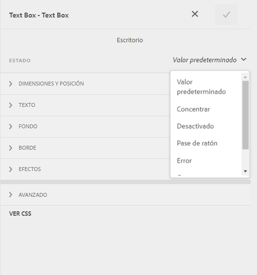
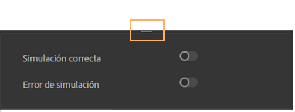

# Aplicar estilos en línea a los componentes de un formulario adaptable {#inline-styling-of-adaptive-form-components}

>[!NOTE]
>
> Adobe recomienda utilizar la captura de datos moderna y ampliable [Componentes principales](https://experienceleague.adobe.com/docs/experience-manager-core-components/using/adaptive-forms/introduction.html?lang=es) para [crear nuevos formularios adaptables](/help/forms/creating-adaptive-form-core-components.md) o [adición de formularios adaptables a páginas de AEM Sites](/help/forms/create-or-add-an-adaptive-form-to-aem-sites-page.md). Estos componentes representan un avance significativo en la creación de formularios adaptables, lo que garantiza experiencias de usuario impresionantes. Este artículo describe un enfoque más antiguo para crear formularios adaptables con componentes de base.

| Versión | Vínculo del artículo |
| -------- | ---------------------------- |
| AEM 6.5 | [Haga clic aquí](https://experienceleague.adobe.com/docs/experience-manager-65/forms/adaptive-forms-basic-authoring/inline-style-adaptive-forms.html?lang=es) |
| AEM as a Cloud Service | Este artículo |

Puede definir el aspecto y el estilo generales de un formulario adaptable especificando los estilos mediante el [Editor de temáticas](themes.md). Además, puede aplicar estilos CSS en línea a componentes de formulario adaptable individuales y previsualizar los cambios sobre la marcha. Los estilos en línea reemplazan el estilo proporcionado en el tema.

## Aplicar propiedades CSS en línea {#apply-inline-css-properties}

Para añadir estilos en línea a un componente:

1. Abra el formulario en el generador de formularios y cambie el modo al modo Estilo. Para cambiar el modo al modo de estilo, en la barra de herramientas de la página, seleccione  > **[!UICONTROL Estilo]**.
1. Seleccione un componente de la página y seleccione el botón Editar . Las propiedades del estilo se abren en la barra lateral.

   También puede seleccionar componentes en el árbol de jerarquía del formulario de la barra lateral. El árbol de jerarquía del formulario está disponible como Objetos del formulario en la barra lateral.

   En el modo [!UICONTROL Estilo], puede ver los componentes que aparecen en Objetos de formulario. Sin embargo, la lista Objetos de formulario de la barra lateral muestra componentes como los campos y los paneles. Los campos y los paneles son componentes genéricos que pueden contener otros componentes como, por ejemplo, cuadros de texto y botones de opción.

   Cuando seleccione un componente en la barra lateral, verá una lista de todos los subcomponentes y las propiedades del componente seleccionado. Puede seleccionar un subcomponente específico y aplicarle un estilo.

1. Haga clic en una de las pestañas de la barra lateral para especificar las propiedades CSS. Puede especificar propiedades como las siguientes:

   * [!UICONTROL Dimensiones y posición] (Mostrar configuración, relleno, altura, anchura, margen, posición, índice Z, flotante, borrar, desbordamiento)
   * [!UICONTROL Texto] (Familia de fuentes, grosor, color, tamaño, altura de línea y alineación)
   * [!UICONTROL Fondo] (Imagen y degradado, color de fondo)
   * [!UICONTROL Borde] (Anchura, estilo, color, radio)
   * [!UICONTROL Efectos] (Sombra, opacidad)
   * [!UICONTROL Avanzadas] (Permite escribir CSS personalizado para el componente)

1. Del mismo modo, puede aplicar estilos a otras partes de un componente, como [!UICONTROL Widget], [!UICONTROL Pie de ilustración] y [!UICONTROL Ayuda].
1. Seleccione **[!UICONTROL Listo]** para confirmar los cambios o **[!UICONTROL Cancelar]** para descartarlos.

## Ejemplo: estilos en línea de un componente de campo {#example-inline-styles-for-a-field-component}

Las siguientes imágenes muestran un campo de texto antes y después de que se le apliquen estilos en línea.

Componente de cuadro de texto antes de aplicar propiedades de estilo en línea

Observe el cambio en el estilo del cuadro de texto después de aplicar las siguientes propiedades CSS, como se muestra en la imagen.

<table>
 <tbody>
  <tr>
   <td>
Selector
 </td>
   <td>
Propiedad CSS
 </td>
   <td>
Valor
 </td>
   <td>
Efecto
 </td>
  </tr>
  <tr>
   <td>
Campo
 </td>
   <td>
border
 </td>
   <td>
Border width =2px
 
Border style=Solid
 
Border color=#1111
 </td>
   <td>
Crea un borde ancho negro de 2 píxeles alrededor del campo
 </td>
  </tr>
  <tr>
   <td>
Cuadro de texto
 </td>
   <td>
background-color
 </td>
   <td>
#6495ED
 </td>
   <td>
Cambia el color de fondo a CornflowerBlue (#6495ED)
 
Nota: Puede especificar un nombre de color o su código hexadecimal en el campo del valor.
 </td>
  </tr>
  <tr>
   <td>
Etiqueta
 </td>
   <td>
Dimensiones y posición &gt; width
 </td>
   <td>
100px
 </td>
   <td>
Fija la anchura en 100 píxeles para la etiqueta
 </td>
  </tr>
  <tr>
   <td>Icono de ayuda de campo</td>
   <td>Texto &gt; Color de fuente</td>
   <td>#2ECC40</td>
   <td>Cambia el color de la cara del icono de ayuda.</td>
  </tr>
  <tr>
   <td>
Descripción larga
 </td>
   <td>
text-align
 </td>
   <td>
center
 </td>
   <td>
Alinea la descripción larga para centrar la ayuda.
 </td>
  </tr>
 </tbody>
</table>

Componente de cuadro de texto después de aplicar propiedades de estilo en línea

Siguiendo los pasos anteriores, puede seleccionar y aplicar estilos a otros componentes, como paneles, botones de envío y botones de opción.

>[!NOTE]
>
>Las propiedades del estilo varían en función del componente que selecciona.

## Copiar y pegar estilos {#copy-paste-styles}

También puede copiar y pegar un estilo de un componente a otro en un formulario adaptable. En el modo **[!UICONTROL Estilo]**, seleccione el componente y seleccione el icono Copiar .

Seleccione el otro componente del mismo tipo y seleccione el icono Pegar  para pegar el estilo copiado. También puede seleccionar el icono Borrar estilo  para borrar el estilo aplicado.

## Definir estilos para diferentes estados de un componente {#set-styles-for-states}

Puede definir estilos para los diferentes estados de un tipo de componente. Los diferentes estados incluyen: [!UICONTROL Enfoque], [!UICONTROL Desactivado], [!UICONTROL Mantener el puntero], [!UICONTROL Error], [!UICONTROL Correcto] y [!UICONTROL Obligatorio].

Para definir el estilo de un estado de un componente:

1. En el modo **[!UICONTROL Estilo]**, seleccione el componente y seleccione el icono Editar .

1. Seleccione el estado del componente mediante la lista desplegable **[!UICONTROL Estado]**.

   

1. Defina el estilo para el estado seleccionado del componente y seleccione  para guardar las propiedades.

También puede simular los estados de éxito y error. Seleccione el icono Expandir para ver las opciones **[!UICONTROL Simular éxito]** y **[!UICONTROL Simular error]**.

## Ver también {#see-also}

{{see-also}}

<!--

>[!MORELIKETHIS]
>
>* [Use themes in Adaptive Form Core Components ](/help/forms/using-themes-in-core-components.md)

-->