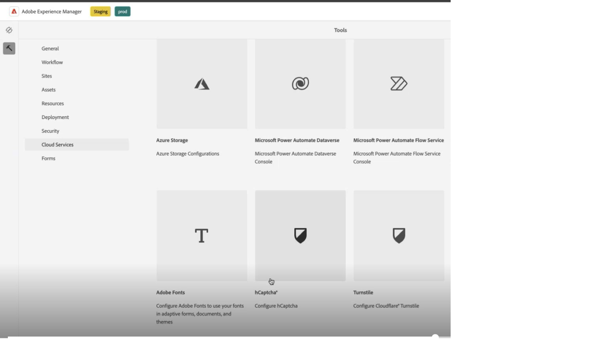

# Conecte su entorno AEM Forms con Chcaptcha® {#connect-your-forms-environment-with-hcaptcha-service}

 Esta característica se encuentra en el programa para usuarios que la adoptaron por anticipado. Puede enviar un correo electrónico a aem-forms-ea@adobe.com desde su ID de correo electrónico oficial para unirse al programa para primeros usuarios y solicitar acceso a esta funcionalidad. 

CAPTCHA (prueba de Turing completamente automática y pública para diferenciar ordenadores de humanos) es un programa que se utiliza comúnmente en transacciones en línea para distinguir entre humanos y programas o bots automatizados. Plantea un desafío y evalúa la respuesta del usuario para determinar si es un humano o un bot que interactúa con el sitio. Evita que el usuario continúe si la prueba falla y ayuda a que las transacciones en línea sean seguras al impedir que los bots publiquen contenido no deseado o con fines malintencionados.

AEM Forms as a Cloud Service es compatible con las siguientes soluciones CAPTCHA:
* [hCaptcha](#integrate-aem-forms-environment-with-hcaptcha-captcha)
* [Google reCAPTCHA](/help/forms/captcha-adaptive-forms-core-components.md)
* [hCaptcha](/help/forms/integrate-adaptive-forms-hcaptcha-core-components.md)

## Integración del entorno de AEM Forms con Captcha Captcha

El servicio hCaptcha® protege sus formularios de bots, correos no deseados y abusos automatizados. Plantea un desafío tipo Widget de la casilla de verificación y evalúa la respuesta del usuario para determinar si es un humano o un bot el que interactúa con el formulario. Evita que el usuario continúe si la prueba falla y ayuda a que las transacciones en línea sean seguras al impedir que los bots publiquen contenido no deseado o actividades maliciosas.

AEM Forms as a Cloud Service es compatible con hCaptcha® en los componentes principales de Forms adaptable. Puede utilizarlo para presentar un desafío de widget de casilla de verificación al enviar el formulario.

<!-- -->

### Requisitos previos para integrar el entorno de AEM Forms con Captcha® {#prerequisite}

Para configurar hCaptcha® con AEM Forms, necesita obtener la clave del sitio [hCaptcha® y la clave secreta](https://docs.hcaptcha.com/switch/#get-your-hcaptcha-sitekey-and-secret-key) del sitio web de hCaptcha®.

### Configure Chcaptcha® {#steps-to-configure-hcaptcha}

Para integrar AEM Forms con el servicio hCaptcha®, realice los siguientes pasos:

1. Cree un contenedor de configuración en el entorno de AEM Forms as a Cloud Service. Un contenedor de configuración contiene las configuraciones en la nube utilizadas para conectar a AEM a los servicios externos. Para crear y configurar un contenedor de configuración para conectar su entorno de AEM Forms con Chcaptcha®:
   1. Abra la instancia AEM Forms as a Cloud Service.
   1. Vaya a **[!UICONTROL Herramientas > General > Explorador de configuración]**.
   1. En el Explorador de configuración, puede seleccionar una carpeta existente o crear una carpeta. Crear una carpeta y habilitar la opción Configuraciones de la nube para ella o Habilitar la opción Configuraciones de nube de la carpeta existente:

      * Para crear una carpeta y habilitar la opción Configuraciones de la nube para ella, haga lo siguiente:
         1. En el Explorador de configuración, pulse **[!UICONTROL Crear]**.
         1. En el cuadro de diálogo Crear configuración, especifique un nombre, un título y seleccione la opción **[!UICONTROL Configuraciones de nube]**.
         1. Haga clic en **[!UICONTROL Crear]**.
      * Para habilitar la opción Configuraciones de la nube para una carpeta existente, haga lo siguiente:
         1. En el Explorador de configuración, seleccione la carpeta y seleccione **[!UICONTROL Propiedades]**.
         1. En el cuadro de diálogo Propiedades de configuración, habilite **[!UICONTROL Configuraciones de nube]**.
         1. Seleccione **[!UICONTROL Guardar y cerrar]** para guardar la configuración y salir del cuadro de diálogo.

1. Configure Cloud Service:
   1. En la instancia de autor de AEM, vaya a  > **[!UICONTROL Cloud Services]** y seleccione **[!UICONTROL hCaptcha®]**.

      
   1. Seleccione un contenedor de configuración, creado o actualizado, como se describe en la sección anterior. Seleccione **[!UICONTROL Crear]**.

      
   1. Especifique **[!UICONTROL Title]**, **[!UICONTROL Name]**, **[!UICONTROL Site Key]** y **[!UICONTROL Secret Key]** para el servicio hCaptcha® [obtenido en Prerequisite](#prerequisite). Seleccione **[!UICONTROL Crear]**.

      

   >[!NOTE]
   > Los usuarios no tienen que modificar [la URL de validación de JavaScript del lado del cliente](https://docs.hcaptcha.com/#add-the-hcaptcha-widget-to-your-webpage) y [la URL de validación del lado del servidor](https://docs.hcaptcha.com/#verify-the-user-response-server-side), ya que ya están rellenadas previamente para la validación de hCaptcha®.

   Una vez configurado el servicio hCAPTCHA, estará disponible para su uso en un [formulario adaptable basado en componentes principales](https://experienceleague.adobe.com/en/docs/experience-manager-core-components/using/adaptive-forms/introduction).

## Usar hCaptcha® en componentes principales de Forms adaptable {#using-hCaptcha®-core-components}

1. Abra la instancia AEM Forms as a Cloud Service.
1. Vaya a **[!UICONTROL Formularios]** > **[!UICONTROL Formularios y documentos]**.
1. Seleccione un formulario adaptable y seleccione **[!UICONTROL Propiedades]**. Para la opción **[!UICONTROL Contenedor de configuración]**, seleccione el contenedor de configuración que contiene la configuración de nube que conecta AEM Forms con Chcaptcha® y seleccione **[!UICONTROL Guardar y cerrar]**.

   Si no tiene ese contenedor de configuración, consulte la sección [Conecte su entorno de AEM Forms con hCaptcha®](#connect-your-forms-environment-with-hcaptcha-service) para obtener información sobre cómo crear un contenedor de configuración.

   

1. Seleccione un formulario adaptable y seleccione **[!UICONTROL Editar]**. El formulario adaptable se abre en el editor de Formularios adaptables.
1. Desde el explorador de componentes, arrastre y suelte o agregue el componente **[!UICONTROL Captcha de formulario adaptable®]** al formulario adaptable.
1. Seleccione el componente **[!UICONTROL Captcha de formulario adaptable®]** y haga clic en las propiedades . Abre el cuadro de diálogo de propiedades. Especifique las siguientes propiedades:

   

   * **[!UICONTROL Nombre]:** Especifique el nombre para el componente Captcha, puede identificar fácilmente un componente de formulario con su nombre único tanto en el formulario como en el editor de reglas.
   * **[!UICONTROL Título]:** Especifique el título del componente Captcha.
   * **[!UICONTROL Ajustes de configuración]:** seleccione una configuración de nube configurada para hCaptcha®.
   * **Tamaño del captcha:** Puede seleccionar el tamaño de visualización del cuadro de diálogo de desafío de captcha®. Utilice la opción **[!UICONTROL Compacto]** para mostrar un tamaño pequeño y la opción **[!UICONTROL Normal]** para mostrar un cuadro de diálogo de desafío de hCaptcha® de tamaño relativamente grande.<!-- or **[!UICONTROL Invisible]** to validate hCaptcha&reg; without explicitly rendering the checkbox widget on the user interface. -->
   * **[!UICONTROL Mensaje de validación]:** Proporcione un mensaje de validación para su validación Captcha al enviar el formulario.
   * **[!UICONTROL Mensaje de validación de la secuencia de comandos]**: esta opción permite introducir un mensaje que se mostrará si la validación de la secuencia de comandos falla.

     >[!NOTE]
     >Puede tener varias configuraciones en la nube en su entorno para un propósito similar. Por lo tanto, elija el servicio con cuidado. Si no aparece ningún servicio, consulte [Conectar su entorno de AEM Forms con hCaptcha®](#connect-your-forms-environment-with-hcaptcha-service) para aprender a crear un Cloud Service que conecte su entorno de AEM Forms con el servicio hCaptcha®.

   <!--* **Error Message:** Provide the error message to display to the user when the Captcha submission fails.-->

1. Seleccione **[!UICONTROL Listo]**.

Ahora, solo se permiten para el envío del formulario los formularios legítimos, en los que el usuario que rellena el formulario borra correctamente el desafío planteado por el servicio hCaptcha®. hCaptcha®

**hCaptcha® es una marca comercial registrada de Intuition Machines, Inc.**

## Preguntas frecuentes

* **Q: ¿Puedo usar más de un componente Captcha en un formulario adaptable?**
* **R:** No se admite el uso de más de un componente Captcha en un formulario adaptable. Además, no se recomienda utilizar un componente Captcha en un fragmento o panel marcado para la carga diferida.

## Consulte también {#see-also}

{{see-also}}
