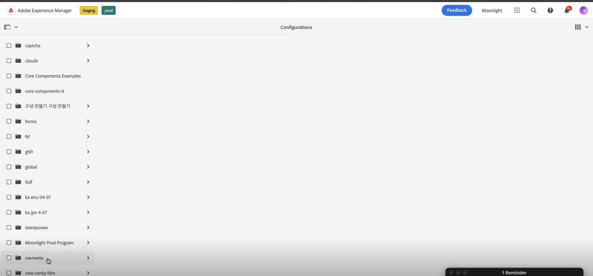

# Conecte su entorno AEM Forms con Chcaptcha® {#connect-your-forms-environment-with-hcaptcha-service}

 Esta función se encuentra en el Programa de usuarios que la adoptaron por anticipado. Puede escribir a aem-forms-ea@adobe.com desde su ID de correo electrónico oficial para unirse al programa de primeros usuarios y solicitar acceso a esta funcionalidad. 

El servicio Captcha® protege sus formularios de bots, spam y abusos automatizados. Plantea un desafío de widget de casilla de verificación y evalúa la respuesta del usuario para determinar si es un humano o un bot que interactúa con el formulario. Evita que el usuario continúe si la prueba falla y ayuda a que las transacciones en línea sean seguras al impedir que los bots publiquen contenido no deseado o actividades malintencionadas.

<!-- -->

AEM Forms as a Cloud Service admite hCaptcha® en Forms adaptable. Puede utilizarlo para presentar un desafío de widget de casilla de verificación al usuario al enviar el formulario.

## Requisitos previos para integrar el entorno de AEM Forms con Captcha® {#prerequisite}

Para configurar hCaptcha® con AEM Forms, debe obtener el [Captcha® clave del sitio y clave secreta](https://docs.hcaptcha.com/switch/#get-your-hcaptcha-sitekey-and-secret-key) del sitio web de Chcaptcha®.

## Pasos para configurar hCaptcha® {#steps-to-configure-hcaptcha}

1. Cree un contenedor de configuración en el entorno as a Cloud Service de AEM Forms. Un contenedor de configuración contiene las configuraciones en la nube utilizadas para conectar a AEM a los servicios externos. Para crear y configurar un contenedor de configuración para conectar su entorno de AEM Forms con Chcaptcha®:
   1. Abra la instancia AEM Forms as a Cloud Service.
   1. Vaya a **[!UICONTROL Herramientas > General > Explorador de configuración]**.
   1. En el Explorador de configuración, puede seleccionar una carpeta existente o crear una carpeta. Puede crear una carpeta y habilitar la opción Configuraciones de nube para ella o habilitar la opción Configuraciones de nube para una carpeta existente:

      * **Para crear una carpeta y habilitar la opción Configuraciones de nube para ella**:
         1. En el Explorador de configuración, pulse **[!UICONTROL Crear]**.
         1. En el cuadro de diálogo Crear configuración, especifique un nombre, un título y seleccione **[!UICONTROL Configuraciones de nube]** opción.
         1. Haga clic en **[!UICONTROL Crear]**.
      * Para habilitar la opción Configuraciones de la nube para una carpeta existente, haga lo siguiente:
         1. En el Explorador de configuración, seleccione la carpeta y seleccione **[!UICONTROL Propiedades]**.
         1. En el cuadro de diálogo Propiedades de configuración, habilite **[!UICONTROL Configuraciones de nube]**.
         1. Seleccione **[!UICONTROL Guardar y cerrar]** para guardar la configuración y salir del cuadro de diálogo.

1. Configure Cloud Service:
   1. AEM En la instancia de autor de la, vaya a  > **[!UICONTROL Cloud Service]** y seleccione **[!UICONTROL Captcha®]**.
      
   1. Seleccione un contenedor de configuración, creado o actualizado, como se describe en la sección anterior. Seleccione **[!UICONTROL Crear]**.
      
   1. Especificar **[!UICONTROL Título]**, **[!UICONTROL Nombre]**, **[!UICONTROL Clave del sitio]**, y **[!UICONTROL Clave secreta]** para el servicio ®captcha [obtenido en requisito previo](#prerequisite). Seleccione **[!UICONTROL Crear]**.

      

>[!NOTE]
> Los usuarios no tienen que modificar [URL de validación de JavaScript del lado del cliente](https://docs.hcaptcha.com/#add-the-hcaptcha-widget-to-your-webpage) y [URL de validación del lado del servidor](https://docs.hcaptcha.com/#verify-the-user-response-server-side) ya que ya se han rellenado previamente para la validación de hCaptcha®. En algunos países, los puntos finales pueden ser diferentes, visite [Preguntas frecuentes sobre Chcaptcha®](https://docs.hcaptcha.com/faq#does-hcaptcha-support-access-by-users-in-china) para obtener más información.

Una vez configurado el servicio hCAPTCHA, estará disponible para su uso en un formulario adaptable.

## Uso de Chcaptcha® en un formulario adaptable{#using-hCaptcha®-foundation-components}

1. Abra la instancia AEM Forms as a Cloud Service.
1. Vaya a **[!UICONTROL Formularios]** > **[!UICONTROL Formularios y documentos]**.
1. Seleccione un formulario adaptable y seleccione **[!UICONTROL Propiedades]**. Para el **[!UICONTROL Contenedor de configuración]** , seleccione el Contenedor de configuración que contiene la Configuración de nube que conecta AEM Forms con Chcaptcha® y seleccione **[!UICONTROL Guardar y cerrar]**.

   Si no tiene ese contenedor de configuración, consulte la sección [Conecte su entorno AEM Forms con Chcaptcha®](#connect-your-forms-environment-with-hcaptcha-service) para aprender a crear un contenedor de configuración.

   

1. Seleccione un formulario adaptable y seleccione **[!UICONTROL Editar]**. El formulario adaptable se abre en el editor de Formularios adaptables.
1. Desde el navegador de componentes, arrastre y suelte el componente **[!UICONTROL Captcha]** en el formulario adaptable.
1. Seleccione el **[!UICONTROL Captcha]** y haga clic en propiedades  icono. Abre el cuadro de diálogo de propiedades.

   

   Especifique las siguientes propiedades:

   * **[!UICONTROL Título]:** Especifique el título del componente Captcha, puede identificar fácilmente un componente del formulario con su nombre único tanto en el formulario como en el editor de reglas.
   * **[!UICONTROL Mensaje de validación]:** Proporcione un mensaje de validación para la validación de Captcha al enviar el formulario.
   * **[!UICONTROL Validar Captcha]:** Puede seleccionar una de las opciones para validar el captcha:
      * Al enviar el formulario
      * Sobre una acción del usuario.
   * **[!UICONTROL Servicio Captcha]:** Seleccione el servicio Captcha, donde selecciona el servicio Captcha®.
   * **[!UICONTROL Configuración de Captcha]:** Seleccione una Configuración de nube configurada para Chcaptcha®.
     >[!NOTE]
     >Puede tener varias configuraciones en la nube en su entorno para un propósito similar. Por lo tanto, elija el servicio con cuidado. Si no aparece ningún servicio, consulte [Conecte su entorno AEM Forms con Chcaptcha®](#connect-your-forms-environment-with-hcaptcha-service) para aprender a crear un Cloud Service que conecte su entorno de AEM Forms con el servicio hCaptcha®.

   * **Mensaje de error:** Proporcione el mensaje de error que se mostrará al usuario cuando falle el envío del Captcha.
   * **Tamaño de Captcha:** Se selecciona el tamaño de visualización del cuadro de diálogo de desafío hCaptcha®. Utilice el **[!UICONTROL Compacto]** opción para mostrar un tamaño pequeño y el **[!UICONTROL Normal]** opción para mostrar un cuadro de diálogo de desafío hCaptcha® de tamaño relativamente grande o **[!UICONTROL Invisible]** para validar hCaptcha® sin procesar explícitamente el widget de casilla de verificación en la interfaz de usuario.

1. Seleccione **[!UICONTROL Listo]**.

Ahora, solo se permiten para el envío del formulario los formularios legítimos, en los que el usuario que rellena el formulario borra correctamente el desafío planteado por el servicio hCaptcha®.

**Captcha® es una marca comercial registrada de Intuition Machines, Inc.**

## Preguntas frecuentes

* **P: ¿Puedo usar más de un componente Captcha en un formulario adaptable?**
* **R:** No se puede usar más de un componente Captcha en un formulario adaptable. Además, no se recomienda utilizar un componente Captcha en un fragmento o panel marcado para la carga diferida.

## Ver también {#see-also}

{{see-also}}
