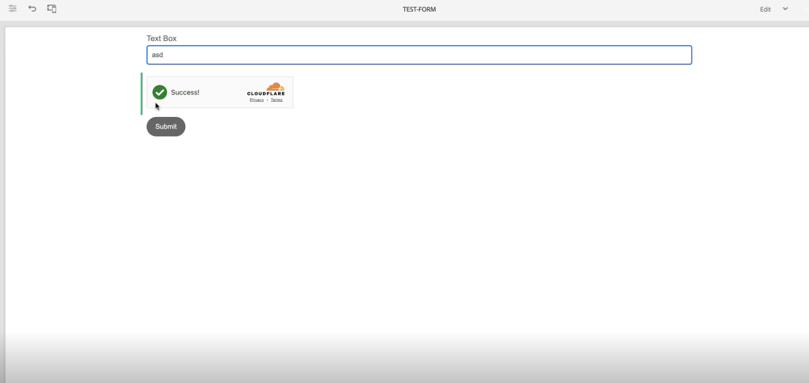

# Conecte su entorno de AEM Forms con Turnstile {#connect-your-forms-environment-with-turnstile-service}

 Esta función se encuentra en el programa para primeros usuarios. Puede escribir a aem-forms-ea@adobe.com desde su ID de correo electrónico oficial para unirse al programa de primeros usuarios y solicitar acceso a esta funcionalidad. 

CAPTCHA (prueba de Turing completamente automática y pública para diferenciar ordenadores de humanos) es un programa que se utiliza comúnmente en transacciones en línea para distinguir entre humanos y programas o bots automatizados. Plantea un desafío y evalúa la respuesta del usuario para determinar si es un humano o un bot que interactúa con el sitio. Evita que el usuario continúe si la prueba falla y ayuda a que las transacciones en línea sean seguras al impedir que los bots publiquen contenido no deseado o con fines malintencionados.

AEM Forms as a Cloud Service es compatible con las siguientes soluciones CAPTCHA:

* [Turnstile](/help/forms/integrate-adaptive-forms-turnstile-core-components.md)
* [Google reCAPTCHA](/help/forms/captcha-adaptive-forms-core-components.md)
* [hCaptcha](/help/forms/integrate-adaptive-forms-hcaptcha-core-components.md)

<!-- -->

## Integración del entorno de AEM Forms con Turnstile Captcha

El Turnstile Captcha de Cloudflare es una medida de seguridad que tiene como objetivo proteger los formularios y sitios de bots automatizados, ataques maliciosos, spam y tráfico automatizado no deseado. Presenta una casilla de verificación en el envío del formulario para verificar que son humanos, antes de permitirles enviar el formulario. AEM Forms as a Cloud Service es compatible con Turnstile Captcha en los componentes principales de Forms adaptable.

### Requisitos previos para integrar el entorno de AEM Forms con Turnstile Captcha {#prerequisite}

Para configurar Turnstile para los componentes principales de AEM Forms, necesita obtener la clave del sitio [Turnstile y la clave secreta](https://developers.cloudflare.com/turnstile/get-started/) del sitio web de Turnstile.

### Configurar torniquete {#steps-to-configure-hcaptcha}

Para integrar AEM Forms con el servicio de torniquete, realice los siguientes pasos:

1. Cree un contenedor de configuración en el entorno de AEM Forms as a Cloud Service. Un contenedor de configuración contiene las configuraciones en la nube utilizadas para conectar a AEM a los servicios externos. Para crear y configurar un contenedor de configuración para conectar su entorno de AEM Forms con Turnstile, siga los pasos a continuación:
   1. Abra la instancia AEM Forms as a Cloud Service.
   1. Vaya a **[!UICONTROL Herramientas > General > Explorador de configuración]**.
   1. En el Explorador de configuración, cree una carpeta nueva y habilite Configuraciones de nube para ella o habilite Configuraciones de nube para una carpeta existente, como se explica a continuación:

      * Para crear una **carpeta nueva** y habilitar las configuraciones de nube para ella, siga los pasos:
         1. En el Explorador de configuración, pulse **[!UICONTROL Crear]**.
         1. En el cuadro de diálogo Crear configuración, especifique un nombre, un título y seleccione la opción **[!UICONTROL Configuraciones de nube]**.
         1. Haga clic en **[!UICONTROL Crear]**.
      * Para habilitar la opción Configuraciones de nube para una **carpeta existente**:
         1. En el Explorador de configuración, seleccione la carpeta existente y haga clic en **[!UICONTROL Propiedades]**.
         1. En el cuadro de diálogo Propiedades de configuración, habilite **[!UICONTROL Configuraciones de nube]**.
         1. Haga clic en **[!UICONTROL Guardar y cerrar]** para guardar la configuración y salir.

1. Configure Cloud Service:
   1. En la instancia de autor de AEM, vaya a  > **[!UICONTROL Cloud Services]** y haga clic en **[!UICONTROL Torniquete]**.

      
   1. Seleccione un contenedor de configuración, creado o actualizado, como se describe en la sección anterior. Seleccione **[!UICONTROL Crear]**.

      
   1. Especifique **[!UICONTROL Tipo de widget]** como administrado, no interactivo o invisible. Para obtener más información sobre el tipo de widget, visita [Widget del torniquete](https://developers.cloudflare.com/turnstile/concepts/widget/).
   1. Especifique **[!UICONTROL Título]**, **[!UICONTROL Nombre]**, **[!UICONTROL Clave del sitio]** y **[!UICONTROL Clave secreta]** para el servicio de torniquete [obtenido en el requisito previo](#prerequisite).
   1. Haga clic en **[!UICONTROL Crear]**.

      

   >[!NOTE]
   >
   > Los usuarios no tienen que modificar la URL de validación de JavaScript del lado del cliente y la URL de validación del lado del servidor, ya que ya están rellenadas previamente para la validación de Turnstile.

   Una vez configurado el servicio Turnstile Captcha, estará disponible para usar en [formularios adaptables basados en componentes principales](https://experienceleague.adobe.com/en/docs/experience-manager-core-components/using/adaptive-forms/introduction).

## Utilice Turnstile en un formulario adaptable {#using-turnstile-core-components}

1. Abra la instancia AEM Forms as a Cloud Service.
1. Vaya a **[!UICONTROL Formularios]** > **[!UICONTROL Formularios y documentos]**.
1. Seleccione su formulario adaptable y haga clic en **[!UICONTROL Propiedades]**. En la sección **[!UICONTROL Contenedor de configuración]**, seleccione el Contenedor de configuración que contiene la Configuración de nube que conecta AEM Forms con Turnstile.
1. Haga clic en **[!UICONTROL Guardar y cerrar]**.

   Si no tiene un contenedor de configuración, consulte la sección [Configurar torniquete](#steps-to-configure-hcaptcha) para obtener información sobre cómo crear un contenedor de configuración.

   

1. Seleccione un formulario adaptable y haga clic en **[!UICONTROL Editar]** para abrir un formulario en el editor.
1. Desde el explorador de componentes, arrastre y suelte o agregue el componente **[!UICONTROL Torniquete de formulario adaptable]** al formulario adaptable.
   
1. Seleccione el componente **[!UICONTROL Torniquete de formulario adaptable]** y haga clic en las propiedades . Abre el cuadro de diálogo de propiedades. Especifique las siguientes propiedades:

   

   * **[!UICONTROL Nombre]:** Especifique el nombre para el componente Captcha, puede identificar fácilmente un componente de formulario con su nombre único tanto en el formulario como en el editor de reglas.
   * **[!UICONTROL Título]:** Especifique el título del componente Captcha. puede permitir texto enriquecido para el título y también puede ocultar el título, marcando las casillas de verificación.
   * **[!UICONTROL Ajustes de configuración]:** Seleccione una configuración de nube configurada para el servicio Captcha de torniquete.

     >[!NOTE]
     >
     >* Puede tener varias configuraciones en la nube en su entorno para un propósito similar. Por lo tanto, elija el servicio con cuidado. Si no aparece ningún servicio, consulte la sección [Configuración del torniquete](#steps-to-configure-hcaptcha) para obtener información sobre cómo crear un contenedor de configuración para conectar su entorno de AEM Forms con el servicio de torniquete.

   * **[!UICONTROL Validación]:** Proporcione la validación de Captcha en forma de mensaje de error:

      * **Mensaje de error:** Proporcione el mensaje de error que se mostrará al usuario cuando falle el envío del Captcha.

        >[!NOTE]
        >
        >* Solo aparece un mensaje de error si el CAPTCHA está relleno en el lado del cliente.

1. Haga clic en **[!UICONTROL Listo]**.

Ahora, solo se permiten para el envío del formulario los formularios legítimos, en los que el usuario que rellena el formulario borra correctamente el desafío planteado por el servicio Turnstile.

## Preguntas frecuentes

* **Q: ¿Puedo usar más de un componente Captcha en un formulario adaptable?**
* **R:** No se admite el uso de más de un componente Captcha en un formulario adaptable. Además, no se recomienda utilizar un componente Captcha en un fragmento o panel marcado para la carga diferida.

## Consulte también {#see-also}

{{see-also}}
