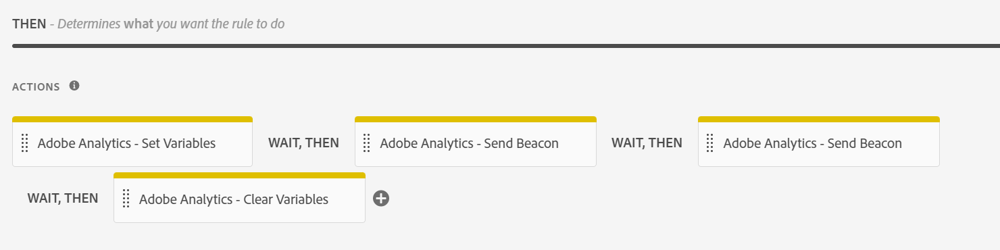

# Form Analytics con Adobe Analytics y AEM Forms: Guía completa {#integrate-aem-forms-with-adobe-analytics}

## ¿Qué es Form Analytics?

El análisis de formularios es el proceso de recopilar, medir y analizar datos sobre cómo los usuarios interactúan con los formularios. Proporciona información sobre el comportamiento del usuario, identifica cuellos de botella en el proceso de finalización de formularios y ayuda a optimizar los formularios para obtener mejores tasas de conversión.

El análisis de formularios va más allá del seguimiento simple del envío para proporcionar una perspectiva completa de cada aspecto de la experiencia del usuario. Al analizar cómo interactúan los usuarios con los campos de formulario individuales, los patrones de navegación y los comportamientos de finalización, las organizaciones pueden realizar mejoras basadas en datos que afectan significativamente a los resultados empresariales.

### Conceptos básicos de Form Analytics

**Seguimiento de interacción de usuario**
El análisis de formularios captura información detallada sobre cómo los usuarios interactúan con los formularios, incluido el tiempo empleado en cada campo, los movimientos del ratón, el comportamiento de desplazamiento y los patrones de interacción. Estos datos granulares ayudan a identificar problemas de uso y oportunidades de optimización.

**Análisis del patrón de comportamiento**
Al analizar los patrones de comportamiento del usuario en varias sesiones de formulario, las organizaciones pueden identificar recorridos de usuario comunes, puntos de abandono típicos y rutas de finalización exitosas. Este análisis permite realizar mejoras específicas que satisfacen las necesidades reales del usuario.

**Medida de rendimiento**
El análisis de formularios proporciona métricas cuantitativas que miden la eficacia del formulario, incluidas tasas de conversión, tiempos de finalización, frecuencias de error e indicadores de satisfacción del usuario. Estas métricas permiten una evaluación objetiva del rendimiento del formulario y del impacto en la optimización.

### Por qué el análisis de formularios es importante para la empresa

El análisis de formularios transforma los datos de interacción del usuario sin procesar en perspectivas comerciales procesables que impulsan mejoras mensurables en métricas comerciales clave:

**Optimización de tasa de conversión**
El abandono de formularios es un desafío empresarial fundamental que afecta directamente a los ingresos y a la generación de posibles clientes. Los estudios muestran que el 68 % de los usuarios abandonan los formularios antes de completarlos, lo que hace que el análisis de formularios sea esencial para identificar los puntos de entrega. El análisis de formularios permite estrategias de optimización de conversión dirigidas que pueden aumentar significativamente el rendimiento del formulario. La optimización efectiva de la conversión a través del análisis de formularios ofrece mejoras mensurables en la generación de posibles clientes y la adquisición de clientes.

**Mejora de la experiencia del usuario**
Entender las luchas de los usuarios y los puntos problemáticos permite a las organizaciones crear experiencias de formulario más fluidas e intuitivas. Esto aumenta la satisfacción del cliente, reduce los costes de asistencia y mejora la percepción de la marca.

**Toma de decisiones basada en datos**
En lugar de depender de suposiciones o prácticas recomendadas, el análisis de formularios proporciona datos concretos sobre el análisis del comportamiento del usuario. Esto permite una optimización de la conversión basada en la evidencia que ofrece resultados significativamente mejores que los cambios basados en la intuición. El análisis del comportamiento del usuario mediante el seguimiento del rendimiento del formulario garantiza que los esfuerzos de optimización se centren en las necesidades reales del usuario en lugar de en las suposiciones.

**Medición y justificación del retorno de la inversión**
El análisis de formularios cuantifica el impacto de los esfuerzos de optimización y proporciona métricas claras que demuestran el valor comercial. Las organizaciones pueden medir la correlación directa entre las mejoras de los formularios y los resultados empresariales, como la generación de posibles clientes, la conversión de ventas y los costes de adquisición de clientes.

**Ventaja competitiva**
Las experiencias de formulario superiores se convierten en un diferenciador competitivo en la adquisición de clientes. Las organizaciones que utilizan el análisis de formularios pueden crear experiencias de usuario de primer nivel que superen a la competencia e impulsen el crecimiento de la cuota de mercado.

### Métricas clave de Analytics de formulario

El análisis de formulario efectivo se centra en métricas que afectan directamente a los resultados empresariales y proporcionan perspectivas procesables para la optimización:

**Métricas principales de éxito**

- **Tasa de conversión de formularios**: porcentaje de vistas de formularios que resultan en envíos correctos; la medida definitiva de la eficacia del formulario
- **Tasa de abandono de formularios**: dónde y por qué los usuarios abandonan, lo que proporciona insight directo sobre los problemas de la experiencia del usuario
- **Hora de finalización**: Cuánto tiempo tardan los usuarios en completar los formularios, lo que indica la complejidad y la calidad de la experiencia del usuario

**Indicadores de rendimiento detallados**

- **Análisis de nivel de campo**: Qué campos específicos causan problemas, lo que habilita los esfuerzos de optimización dirigidos
- **Análisis de tasa de error**: Problemas de validación y errores de usuario que impiden que se complete correctamente el formulario
- **Patrones de uso de la ayuda**: cuándo y dónde los usuarios necesitan ayuda, lo que indica áreas para mejorar

**Métricas de comportamiento avanzadas**

- **Análisis del canal de conversión**: el recorrido del usuario a través de formularios de varios pasos muestra patrones de progresión y entrega
- **Rendimiento del dispositivo y el explorador**: factores técnicos que afectan a la finalización en diferentes entornos de usuario
- **Profundidad de participación del usuario**: tiempo empleado en formularios, patrones de interacción de campos e indicadores de atención del usuario

**Métricas de impacto empresarial**

- **Correlación de calidad del posible cliente**: Cómo se relaciona el comportamiento de finalización del formulario con la conversión del posible cliente y el valor para el cliente
- **Rendimiento de Source de tráfico**: Qué canales de marketing generan los envíos de formularios de mayor calidad
- **Impacto estacional y de campaña**: Cómo varía el rendimiento del formulario con las actividades de marketing y los factores externos

## Ventajas comerciales de Form Analytics

La implementación del análisis de formularios ofrece un valor empresarial cuantificable en varias dimensiones. Las organizaciones que aprovechan los análisis de formulario suelen ver mejoras significativas en las tasas de conversión, la satisfacción del usuario y la eficiencia operativa.

### &#x200B;1. Reducir el abandono de formularios y aumentar las conversiones

El abandono de formularios es un desafío empresarial fundamental que afecta directamente a los ingresos y a la generación de posibles clientes:

- **Identificar puntos de entrega**: rastree exactamente dónde abandonan los usuarios los formularios para identificar campos o secciones problemáticos
- **Optimizar flujo de formulario**: reorganice, simplifique o elimine los campos que produzcan las tasas de abandono más altas
- **Mejoras en la prueba A/B**: Pruebe diferentes variaciones de formularios y mida su impacto en las tasas de finalización
- **Optimización móvil**: Identifique los problemas específicos de dispositivos móviles que impiden la finalización del formulario
- **Supervisión en tiempo real**: obtenga alertas inmediatas cuando se degrade el rendimiento del formulario

**Impacto empresarial**: Las empresas suelen ver mejoras significativas en las tasas de conversión de formularios después de implementar optimizaciones impulsadas por análisis.

### &#x200B;2. Mejorar la experiencia del usuario y la satisfacción

El análisis de formularios proporciona una perspectiva profunda del comportamiento del usuario y los puntos problemáticos:

- **Reducir el tiempo de finalización**: identifique los campos que tardan demasiado en completarse y optimice el proceso
- **Minimizar la frustración del usuario**: haga un seguimiento de los patrones de error y los problemas de validación para mejorar el uso del formulario
- **Optimizar orden de campos**: organice los campos en la secuencia más lógica y fácil de usar
- **Mejorar la ayuda y las directrices**: Identifique dónde necesitan asistencia los usuarios y proporcione ayuda específica
- **Experiencia entre dispositivos**: Garantice un rendimiento consistente en equipos de escritorio, tabletas y dispositivos móviles

**Impacto empresarial**: La experiencia mejorada del usuario conduce a puntuaciones de satisfacción del cliente más altas y a una mayor lealtad a la marca.

### &#x200B;3. Realice Mejoras En Los Formularios Basadas En Datos

Reemplace las conjeturas por datos concretos al optimizar formularios:

- **Decisiones basadas en evidencia**: use datos reales del comportamiento del usuario en lugar de suposiciones para guiar las mejoras
- **Impacto de optimización de medidas**: Cuantifique los resultados de los cambios de formulario con análisis antes o después
- **Mejoras de prioridad**: Céntrese en los cambios que tendrán un mayor impacto en las métricas empresariales
- **Optimización continua**: establezca ciclos de mejora continua basados en datos de rendimiento
- **Informes de partes interesadas**: Proporcione métricas concretas para demostrar el rendimiento y el retorno de la inversión del formulario

**Impacto en la empresa**: La optimización basada en datos suele ofrecer resultados significativamente mejores que los cambios basados en la intuición.

### &#x200B;4. Aumentar la calidad del plomo y la eficiencia de ventas

El análisis de formularios ayuda a optimizar no solo la cantidad, sino también la calidad de los envíos de formularios:

- **Integración de puntuación de posibles clientes**: correlacione el comportamiento de los formularios con la calidad del posible cliente y el potencial de conversión
- **Atribución de Source**: Comprenda qué fuentes de tráfico generan los envíos de formularios de mayor calidad
- **Perfil progresivo**: optimice los formularios de varios pasos para recopilar posibles clientes más calificados
- **Perspectivas de segmentación**: identifique patrones en el comportamiento de formularios de clientes de alto valor
- **Optimización de transferencia de ventas**: proporcione a los equipos de ventas contexto sobre las interacciones del formulario de posibles clientes

**Impacto en la empresa**: los posibles clientes de mayor calidad mejoran las tasas de conversión de ventas y reducen los costos de adquisición de clientes.

### &#x200B;5. Eficiencia operativa y reducción de costes

El análisis de formularios mejora las operaciones en toda la organización:

- **Reducir tickets de asistencia**: identifique y corrija problemas comunes de formularios que generan llamadas de servicio al cliente
- **Optimización automatizada**: configure alertas automatizadas y reglas de optimización basadas en umbrales de rendimiento
- **Asignación de recursos**: centre los recursos de desarrollo en formularios y campos con el mayor impacto comercial
- **Supervisión del cumplimiento**: haga un seguimiento del rendimiento del formulario para comprobar el cumplimiento normativo y de accesibilidad
- **Eficiencia de la integración**: optimice las integraciones de formulario a sistema en función de los patrones de envío

**Impacto en la empresa**: las mejoras operativas pueden reducir significativamente los costos de soporte relacionados con el formulario.

### &#x200B;6. Ventaja competitiva a través de Forms superior

El análisis de formularios permite a las organizaciones crear las mejores experiencias de formulario de su clase:

- **Rendimiento de referencia**: Compare el rendimiento del formulario con los estándares del sector y la competencia
- **Oportunidades de innovación**: identifique las oportunidades de optimización únicas que la competencia puede perder
- **Retención de clientes**: Las experiencias de formulario superiores contribuyen a la satisfacción y retención generales del cliente
- **Diferenciación de mercado**: use las perspectivas de análisis de formulario para crear ventajas competitivas en la experiencia del usuario
- **Optimización escalable**: aplique patrones de formulario correctos en varios productos y campañas

**Impacto empresarial**: Las experiencias de formulario superiores pueden convertirse en un diferenciador competitivo significativo en la adquisición de clientes.

## Casos de uso y ejemplos de Form Analytics

Comprender cómo se aplica el análisis de formularios a escenarios reales ayuda a las organizaciones a identificar oportunidades de optimización e implementar estrategias de medición efectivas. Estos son casos de uso comunes en diferentes industrias y tipos de formularios.

### Comercio electrónico y Retail Forms

**Pago y envío Forms**

- **Desafío**: el abandono elevado del carro de compras durante el proceso de cierre de compra afecta directamente a los ingresos
- **Solución de análisis de formularios**: rastree las tasas de finalización campo por campo y el rendimiento del formulario para identificar los puntos de fricción
- **Conclusiones comunes**: Los campos de tarjeta de crédito, la validación de la dirección de envío y los pasos de creación de cuenta suelen causar el abandono del formulario
- **Resultados de optimización de conversión**: los minoristas suelen ver una mejora significativa en la finalización del cierre de compra después de la optimización del rendimiento del formulario impulsada por análisis
- **Análisis del comportamiento del usuario**: haga un seguimiento de los patrones de abandono del carro de compras para comprender cuándo y por qué los clientes se van durante el cierre de compra
- **Impacto en la empresa**: la reducción en el abandono de formularios se traduce directamente en un aumento de ingresos y en costos de adquisición de clientes mejorados

**Registro y garantía del producto Forms**

- **Desafío**: Las bajas tasas de registro de productos afectan la atención al cliente y el marketing
- **Solución de Analytics**: supervise las tasas de finalización e identifique el impacto de campo opcional frente al requerido
- **Estrategia de optimización**: reduzca los campos obligatorios y mejore la experiencia móvil
- **Impacto en la empresa**: las tasas de registro más altas mejoran el valor de duración del cliente y la eficiencia de la asistencia

### Generación de posibles clientes y Forms B2B

**Solicitud de contacto y demostración en Forms**

- **Desafío**: equilibrar la calidad del posible cliente con las tasas de finalización de formularios y minimizar el abandono de formularios
- **Solución de análisis de formularios**: efectúe el seguimiento de la correlación entre el rendimiento del formulario, la longitud del formulario y la calidad de la conversión de posibles clientes
- **Información clave**: El perfil progresivo a menudo supera a los formularios largos de una sola página para la optimización de la conversión
- **Análisis del comportamiento del usuario**: supervise cómo afecta la longitud del formulario a las tasas de finalización y a las puntuaciones de calidad de los posibles clientes
- **Resultados de optimización de conversión**: las empresas B2B ven mejoras significativas en la generación de posibles clientes calificada mediante la optimización del rendimiento de los formularios
- **Impacto en la empresa**: Un mejor análisis de formularios genera posibles clientes de mayor calidad y mejores tasas de conversión de ventas

**Registro de eventos y seminarios web**

- **Desafío**: maximizar la asistencia al evento mientras se recopila la información necesaria
- **Solución de Analytics**: supervise la finalización del registro frente a las tasas de asistencia reales
- **Patrones comunes**: los formularios más cortos aumentan los registros, pero pueden reducir la calidad de la asistencia
- **Práctica recomendada**: Use Analytics para encontrar el equilibrio óptimo entre la longitud del formulario y la calidad de los asistentes

### Forms de Servicios Financieros

**Solicitudes de préstamo y crédito**

- **Desafío**: aplicaciones complejas de varios pasos con altas tasas de abandono
- **Solución de Analytics**: rastree las tasas de finalización en cada paso e identifique los puntos de entrega
- **Información crítica**: Los pasos de carga de documentos y verificación de ingresos suelen causar abandono
- **Estrategia de optimización**: proporcione indicadores de progreso claros y funcionalidad de guardar y reanudar
- **Consideraciones regulatorias**: Analytics debe cumplir con los requisitos de privacidad de datos financieros

**Oferta de seguro y reclamaciones Forms**

- **Desafío**: Recopilar información detallada mientras se mantiene la participación del usuario
- **Solución de Analytics**: supervise el tiempo de finalización y la participación a nivel de campo
- **Conclusiones clave**: El relleno automático y los valores predeterminados inteligentes mejoran significativamente las tasas de finalización
- **Impacto en la empresa**: La finalización de formularios mejorada se correlaciona directamente con las tasas de conversión de directivas

### Forms médico y de atención sanitaria

**Registro y admisión de pacientes en Forms**

- **Desafío**: Recopilar información médica completa de manera eficiente
- **Solución de Analytics**: haga un seguimiento de las tasas de finalización en los diferentes grupos demográficos de los pacientes
- **Enfoque de accesibilidad**: supervise el rendimiento en diferentes dispositivos y herramientas de accesibilidad
- **Prioridad de optimización**: la optimización móvil es crítica para la satisfacción del paciente
- **Requisitos de cumplimiento**: el cumplimiento de HIPAA es esencial para todas las implementaciones de Analytics

**Programación de cita en Forms**

- **Desafío**: reducir la no presentación y simplificar el proceso de reserva
- **Solución de Analytics**: correlacione el comportamiento de finalización de formularios con la asistencia a citas
- **Información clave**: las preferencias de confirmación y recordatorio afectan significativamente la asistencia
- **Oportunidad de integración**: conéctese desde Analytics con los sistemas de administración de citas

### Institución educativa Forms

**Forms de solicitud y registro**

- **Desafío**: administrar aplicaciones complejas de varios pasos con requisitos de documentos
- **Solución de Analytics**: Rastree las tasas de finalización en diferentes etapas de la aplicación
- **Métricas críticas**: patrones de uso de tiempo para finalizar y guardar y reanudar
- **Enfoque de optimización**: la experiencia móvil es cada vez más importante para las aplicaciones de los estudiantes
- **Consideraciones estacionales**: El rendimiento varía significativamente durante los períodos de aplicación

**Registro y comentarios del curso Forms**

- **Desafío**: Maximizar la participación de los alumnos con los procesos administrativos
- **Solución de Analytics**: supervise las tasas de finalización e identifique los problemas de experiencia del usuario
- **Información clave**: la integración con los portales de estudiantes mejora las tasas de finalización
- **Mejora continua**: La revisión regular de análisis es esencial para la optimización de semestre a semestre

### Escenarios comunes de Form Analytics

**Optimización de formularios de varios pasos**

Los formularios de varios pasos suelen lograr tasas de conversión un 86 % más altas que los formularios de una sola página cuando se optimizan correctamente:

- **Análisis paso a paso**: Rastree las tasas de finalización en cada paso del formulario
- **Impacto del indicador de progreso**: mida cómo afectan las barras de progreso a las tasas de finalización
- **Uso de guardar y reanudar**: supervise cómo afecta el guardado del borrador a la finalización
- **Rendimiento de equipos móviles frente a equipos de escritorio**: compare las tasas de finalización entre dispositivos

**Análisis de rendimiento de nivel de campo**

- **Campos obligatorios frente a campos opcionales**: Analice el impacto de los requisitos de campo en la finalización
- **Optimización de orden de campos**: pruebe secuencias de campos diferentes para obtener un flujo óptimo
- **Patrones de error de validación**: identifique errores comunes del usuario y mejore la validación
- **Eficacia del texto de ayuda**: mida el impacto de las instrucciones de campo en las tasas de finalización

**Rendimiento estacional y de campaña**

- **Análisis de tráfico de Source**: compare el rendimiento de los formularios en los canales de marketing
- **Variaciones estacionales**: haga un seguimiento de cómo cambia el rendimiento del formulario a lo largo del año
- **Integración de campañas**: correlacione el análisis de formularios con el rendimiento de las campañas de marketing
- **Integración de pruebas A/B**: use Analytics para medir las variaciones de las pruebas y optimizar continuamente

## Escenarios de implementación de Forms Analytics en el mundo real

Comprender los escenarios de implementación específicos ayuda a las organizaciones a aplicar el análisis de formulario de forma eficaz en diferentes contextos comerciales. Estos ejemplos reales demuestran cómo el seguimiento del rendimiento del formulario y la optimización de la conversión ofrecen resultados empresariales cuantificables.

### Optimización del cierre de compra de comercio electrónico

**Escenario**: retailer en línea experimenta un abandono del carro de compras alto durante el cierre de compra

- **Implementación de Form Analytics**: haga un seguimiento del abandono del carro de compras en el nivel de formulario con análisis campo a campo
- **Conclusiones clave**: la finalización del formulario de pago disminuyó considerablemente en el paso de verificación de la tarjeta de crédito
- **Estrategia de optimización de conversión**: formulario de pago simplificado, indicadores de progreso agregados y experiencia móvil optimizada
- **Resultados**: se redujo sustancialmente el abandono de formularios y se aumentaron los ingresos
- **Análisis del comportamiento del usuario**: Los usuarios móviles identificados tuvieron tasas de abandono más altas, lo que llevó a un rediseño con prioridad móvil

### Optimización del formulario de generación de posibles clientes

**Escenario**: una empresa de software B2B tiene problemas con posibles clientes de baja calidad de los formularios de contacto

- **Desafío de rendimiento de formularios**: altas tasas de finalización de formularios, pero baja conversión de cliente potencial
- **Solución de Analytics**: correlacione el comportamiento de finalización de formularios con la calidad de los posibles clientes y los resultados de ventas
- **Enfoque de optimización**: se implementó la integración de perfiles progresivos y puntuación de posibles clientes
- **Impacto comercial**: mejora significativa en la calidad del plomo y aumento en los posibles clientes calificados para ventas
- **Optimización de conversión**: se ha reducido el abandono de formularios al mejorar la calificación de posibles clientes

### Optimización de registro e incorporación

**Escenario**: plataforma SaaS con alto abandono de suscripción durante el proceso de incorporación

- **Análisis del comportamiento del usuario**: efectúe el seguimiento de las tasas de finalización de la suscripción e identifique los cuellos de botella de incorporación
- **Perspectivas de Form Analytics**: Se produjo un abandono de usuario significativo durante el paso de verificación de la cuenta
- **Estrategia de optimización**: Proceso de verificación optimizado, funcionalidad agregada de guardar y reanudar
- **Resultados**: se ha aumentado considerablemente la finalización de suscripciones y se han mejorado las tasas de activación de los usuarios
- **Impacto a largo plazo**: una mejor finalización de la incorporación se correlaciona con un mayor valor de duración del cliente

## Funciones de Form Analytics en Adobe Analytics

Adobe Analytics proporciona funciones de seguimiento de formularios de nivel empresarial que permiten a las organizaciones capturar información detallada sobre las interacciones del usuario con sus formularios. La integración perfecta con AEM Forms ofrece potentes análisis listos para usar y sofisticadas opciones de personalización que se adaptan a las necesidades de la empresa.

### Por qué elegir Adobe Analytics para Form Analytics

**Rendimiento a escala empresarial**
Adobe Analytics administra millones de interacciones de formularios sin una degradación del rendimiento, lo que lo convierte en la solución ideal para sitios web de alto tráfico y entornos empresariales complejos. La robusta infraestructura de la plataforma garantiza una recopilación de datos fiable incluso durante los períodos de mayor uso.

**Funciones de segmentación avanzada**
A diferencia de las herramientas básicas de análisis de formularios, Adobe Analytics permite una segmentación de usuarios sofisticada basada en el comportamiento, la demografía, las fuentes de tráfico y los criterios empresariales personalizados. Esto permite estrategias de optimización específicas que se dirigen a grupos de usuarios y escenarios específicos.

**Información y alertas en tiempo real**
Supervise el rendimiento del formulario a medida que sucede con los paneles en tiempo real y las alertas automatizadas. Identificar los problemas y responder a ellos inmediatamente, lo que evita posibles pérdidas de ingresos derivadas de problemas de formularios o degradación del rendimiento.

### Funciones de seguimiento listas para usar

AEM Forms se integra a la perfección con [Adobe Analytics](https://experienceleague.adobe.com/docs/analytics-learn/tutorials/overview.html?lang=es) para capturar y rastrear automáticamente las métricas de rendimiento de sus formularios publicados. Puede supervisar el comportamiento de los usuarios autenticados y anónimos sin necesidad de ninguna configuración adicional.

Antes de implementar Form Analytics, asegúrese de que su [entorno de AEM Forms está configurado correctamente](/help/forms/setup-forms-cloud-service.md) y de que ha [creado sus formularios adaptables](/help/forms/creating-adaptive-form-core-components.md) mediante los componentes principales o los [componentes de base](/help/forms/creating-adaptive-form.md).

**Seguimiento completo de eventos de formulario:**

Adobe Analytics captura automáticamente una imagen completa de las interacciones del formulario del usuario:

- **Procesamientos de formularios**: realice un seguimiento de las impresiones y vistas de los formularios para comprender el alcance y la participación inicial
- **Envíos de formularios**: supervise las finalizaciones correctas con datos detallados del contexto de envío y el recorrido del usuario
- **Análisis de abandono de formularios**: capture puntos de abandono precisos con granularidad de nivel de campo y contexto de sesión de usuario
- **Seguimiento de errores de validación**: registre los tipos de error, la frecuencia y los patrones de resolución para identificar los problemas de uso
- **Uso del contenido de ayuda**: supervise cuándo los usuarios acceden a los recursos de ayuda, lo que indica áreas de confusión o complejidad
- **Interacciones a nivel de campo**: haga un seguimiento de la participación de los campos individuales, el tiempo empleado y los patrones de interacción
- **Comportamiento al guardar borrador**: Comprenda la intención del usuario y la complejidad del formulario mediante patrones de uso de guardar y reanudar
- **Seguimiento entre sesiones**: siga a los usuarios en varias sesiones de formulario para comprender los recorridos de finalización

**Información de comportamiento avanzada:**

- **Análisis de tiempo en el campo**: mida el tiempo que los usuarios emplean en cada campo de formulario para identificar los problemas de complejidad
- **Patrones de movimiento del ratón**: Rastree las dudas y la participación del usuario mediante el análisis del comportamiento del cursor
- **Seguimiento de profundidad de desplazamiento**: comprenda cómo navegan los usuarios por los formularios largos e identifican la longitud óptima del formulario
- **Patrones de recuperación de errores**: Analice cómo responden los usuarios a los errores de validación y cómo se recuperan de ellos

### Seguimiento de eventos personalizados

Más allá de los eventos de formulario estándar, Adobe Analytics permite un seguimiento personalizado sofisticado:

- **Métricas específicas de la empresa**: defina eventos personalizados usando el editor de reglas para rastrear interacciones de formularios específicas de la organización
- **Asignación de Recorrido de usuario**: cree eventos personalizados para realizar el seguimiento de rutas de usuario complejas en formularios de varios pasos
- **Análisis del canal de conversión**: configure eventos personalizados para medir puntos de conversión específicos y etapas de entrega
- **Eventos de integración**: Rastree las interacciones de formularios con sistemas y API externos

### Funciones de informes avanzadas

Adobe Analytics proporciona funciones de creación de informes de nivel empresarial para el rendimiento del formulario:

- **Paneles en tiempo real**: supervise el rendimiento del formulario y las interacciones del usuario a medida que ocurran
- **Análisis de segmentación**: Analice el rendimiento del formulario en diferentes grupos de usuarios, fuentes de tráfico y zonas demográficas
- **Visualización de canal**: Visualice la progresión del usuario a través de formularios de varios pasos e identifique oportunidades de optimización
- **Análisis de cohorte**: efectúe el seguimiento de las mejoras de rendimiento de los formularios a lo largo del tiempo y mida el impacto en la optimización
- **Seguimiento entre dispositivos**: Descubra cómo los usuarios interactúan con los formularios en diferentes dispositivos y sesiones

### Ventajas de integración

La integración de Adobe Analytics y AEM Forms ofrece ventajas únicas:

- **Plataforma de datos unificada**: combine análisis de formulario con análisis de marketing y sitios web más amplios
- **Integración de Adobe Experience Cloud**: aproveche las conexiones con Adobe Target, Campaign y otras soluciones de Experience Cloud
- **Seguridad empresarial**: Cumplimiento integrado de las regulaciones de privacidad de datos y los requisitos de seguridad empresarial
- **Arquitectura escalable**: Controle interacciones de formularios de gran volumen sin afectar al rendimiento
- **Soporte profesional**: acceso a los servicios de optimización y soporte empresarial de Adobe

Después de implementar los pasos de integración descritos en este artículo, puede configurar y ver informes completos en [!DNL Adobe Analytics], como se muestra en el siguiente vídeo:

>[!VIDEO](https://video.tv.adobe.com/v/337262)

## Métricas clave de Analytics de formulario que rastrear

La implementación exitosa de Forms Analytics requiere centrarse en métricas que afectan directamente los resultados comerciales. Comprender qué métricas priorizar ayuda a las organizaciones a tomar decisiones basadas en datos y optimizar el rendimiento del formulario de forma eficaz.

### Métricas de rendimiento principales

**Tasa de conversión de formularios**

- **Definición**: porcentaje de vistas de formulario que resultan en envíos correctos
- **Cálculo**: (Envíos de formularios/Vistas de formularios) × 100
- **Impacto en la empresa**: se correlaciona directamente con la generación de posibles clientes y los objetivos de ingresos
- **Objetivo de optimización**: varía según el sector y la complejidad del formulario

**Tasa de abandono de formularios**

- **Definición**: porcentaje de usuarios que comienzan pero no completan formularios
- **Cálculo**: (Comienza el formulario - Finalizaciones del formulario) / Comienza el formulario × 100
- **Perspectivas críticas**: Identifica problemas de experiencia del usuario y oportunidades de optimización
- **Referencia**: Las altas tasas de abandono suelen indicar problemas de uso significativos

**Tiempo promedio de finalización**

- **Definición**: tiempo medio que los usuarios invierten en completar formularios desde el inicio hasta el envío
- **Analysis Focus**: identifique formularios que tardan demasiado tiempo y pueden frustrar a los usuarios
- **Objetivo de optimización**: equilibrar la minuciosidad con la eficiencia de la experiencia del usuario
- **Segmentación**: compare los tiempos de finalización entre dispositivos, tipos de usuarios y fuentes de tráfico

### Análisis de nivel de campo

**Tasas de abandono de campo**

- **Medición**: porcentaje de usuarios que abandonan formularios en campos específicos
- **Valor de optimización**: identifica los campos problemáticos que necesitan simplificación o eliminación
- **Problemas comunes**: requisitos de validación complejos, instrucciones poco claras o problemas técnicos
- **Elementos de acción**: Priorice los esfuerzos de optimización en los campos con tasas de abandono más altas

**Patrones de interacción de campo**

- **Tasas de clics**: porcentaje de usuarios que se relacionan con campos de formulario específicos
- **Tiempo en el campo**: Tiempo promedio que los usuarios pasan en los campos individuales
- **Tasas de error**: Frecuencia de errores de validación para campos específicos
- **Uso de ayuda**: La frecuencia con la que los usuarios acceden al contenido de ayuda de campos concretos

**Tasas de finalización de campo**

- **Análisis progresivo**: efectúe el seguimiento de las tasas de finalización a medida que los usuarios se desplazan por los campos de formulario
- **Identificación de entrega**: identifique las ubicaciones exactas en las que los usuarios abandonan los formularios
- **Prioridad de optimización**: Mejoras de enfoque en campos con descensos más pronunciados en la tasa de finalización

### Métricas de experiencia del usuario

**Análisis de tasa de error**

- **Errores de validación**: errores de frecuencia y tipos de validación de formulario
- **Errores técnicos**: problemas de nivel de sistema que afectan la funcionalidad del formulario
- **Patrones de error de usuario**: errores comunes que los usuarios cometen al completar formularios
- **Seguimiento de resolución**: supervise cómo afectan las mejoras de tasa de error a la conversión general

**Rendimiento de equipos móviles frente a equipos de escritorio**

Los formularios móviles suelen experimentar tasas de abandono un 30 % más altas en comparación con las versiones de escritorio, lo que hace que la optimización específica del dispositivo sea crucial:

- **Tasas de conversión específicas del dispositivo**: compare el rendimiento del formulario entre tipos de dispositivos
- **Impacto de diseño interactivo**: mida cómo la optimización móvil afecta a las tasas de finalización
- **Uso de la interfaz táctil**: Analice patrones de interacción específicos de dispositivos móviles
- **Recorrido entre dispositivos**: Rastree a los usuarios que inician formularios en un dispositivo y los completan en otro

**Métricas de carga y rendimiento de página**

Las Forms que se cargan en menos de 3 segundos tienen tasas de finalización un 70 % más altas que los formularios más lentos:

- **Tiempo de carga del formulario**: tiempo necesario para que los formularios se procesen por completo y se vuelvan interactivos
- **Tiempo de respuesta de campo**: Latencia entre la entrada del usuario y la respuesta del sistema
- **Tiempo de procesamiento del envío**: duración desde el envío del formulario hasta la confirmación
- **Impacto en el rendimiento**: Correlación entre los tiempos de carga y las tasas de abandono

### Métricas avanzadas de Analytics

**Análisis de segmentación de usuarios**

- **Rendimiento de Source de tráfico**: compare las tasas de conversión de los formularios en los canales de marketing
- **Rendimiento geográfico**: Analice las tasas de finalización de los formularios por ubicación e idioma
- **Análisis de tipo de usuario**: compare el rendimiento entre usuarios nuevos y recurrentes
- **Información demográfica**: comprenda cómo los distintos grupos de usuarios interactúan con los formularios

**Análisis de canal de conversión**

- **Progresión de formulario de varios pasos**: haga un seguimiento del avance del usuario a través de formularios complejos
- **Conversión paso a paso**: mida las tasas de finalización en cada paso del formulario
- **Optimización de canal**: identifique y solucione cuellos de botella en la progresión del formulario
- **Integración de pruebas A/B**: compare el rendimiento del canal en las variaciones del formulario.

**Métricas de impacto empresarial**

- **Puntuación de calidad de posibles clientes**: correlacione el comportamiento de finalización de formularios con las tasas de conversión de posibles clientes
- **Atribución de ingresos**: conecte los envíos de formularios con los resultados comerciales reales
- **Valor de duración del cliente**: Analice el valor a largo plazo de los usuarios adquiridos mediante diferentes formularios
- **Costo por adquisición**: calcule la eficiencia de marketing en función de los datos de rendimiento del formulario

La siguiente imagen ilustra las acciones que debe realizar antes de ver los informes en [!DNL Adobe Analytics]:


## Configuración de Form Analytics para AEM Forms

La implementación del análisis de formularios con Adobe Analytics y AEM Forms requiere una configuración sistemática en varios componentes. Esta sección proporciona instrucciones de configuración completas, requisitos previos y prácticas recomendadas para una implementación correcta.

### Requisitos y requisitos previos

Antes de comenzar la implementación de Forms Analytics, asegúrese de que su entorno cumpla los siguientes requisitos:

>[!NOTE]
>
>Si tiene problemas durante la instalación, consulte nuestra [guía de solución de problemas de AEM Forms](/help/forms/troubleshooting-installation-and-configuration.md) para obtener información sobre problemas de instalación y configuración.

**Acceso a Adobe Experience Cloud**

- Organización de Adobe Experience Cloud válida con licencias de Adobe Analytics
- Acceso administrativo a entornos de Adobe Analytics y AEM Forms
- Acceso a Adobe Launch (recopilación de datos) para la administración y configuración de etiquetas

**Entorno AEM Forms**

- [AEM Forms as a Cloud Service](/help/forms/setup-forms-cloud-service.md) o AEM Forms 6.5 o posterior (instalaciones locales/AMS)
- Funciones de creación y publicación de Forms habilitadas
- Asegúrese de que la opción [Forms esté disponible](/help/forms/troubleshooting-installation-and-configuration.md#forms-option-is-unavailable) en su entorno de AEM.
- [Componentes principales de Forms adaptable](/help/forms/creating-adaptive-form-core-components.md) o [Componentes de base](/help/forms/creating-adaptive-form.md) disponibles

**Requisitos técnicos**

- Navegadores web modernos con JavaScript habilitado para el seguimiento del análisis de formularios
- Implementación del protocolo HTTPS para la transmisión segura de datos
- Configuraciones de red y cortafuegos adecuadas para la recopilación de datos de Adobe Analytics

**Permisos y acceso**

- Función de administrador de Adobe Analytics para la configuración del grupo de informes
- Permisos de autor de AEM Forms para la configuración y publicación de formularios
- Acceso de desarrollador de Adobe Launch para la implementación de etiquetas y la creación de reglas

### Guía de implementación paso a paso

#### &#x200B;1. Configuración de Adobe Analytics {#Configure-adobe-analytics}

Antes de configurar [!DNL Adobe Analytics], cree lo siguiente:

- Un Adobe ID para iniciar sesión en [Adobe Experience Cloud](https://experience.adobe.com/#/home).
- Un [grupo de informes](https://experienceleague.adobe.com/docs/analytics/admin/manage-report-suites/new-report-suite/t-create-a-report-suite.html?lang=es).


### Instalar AEM Forms y extensiones de [!DNL Adobe Analytics] {#install-extensions}

Siga estos pasos para configurar AEM Forms y las extensiones de [Adobe Analytics](https://experienceleague.adobe.com/docs/experience-platform/tags/extensions/adobe/analytics/overview.html?lang=es):

1. Inicie sesión en Adobe Experience Cloud y seleccione un nombre adecuado para la empresa.

1. Seleccione **[!UICONTROL Launch/Recopilación de datos]** y seleccione **[!UICONTROL Ir a Launch/Recopilación de datos]**.

1. Seleccione **[!UICONTROL Nueva propiedad]** y especifique un nombre para la configuración.

1. Especifique un nombre de dominio y seleccione **[!UICONTROL Guardar]** para guardar la propiedad.

1. Seleccione el nombre de configuración disponible en la lista de Propiedades de la etiqueta.

1. En la sección **[!UICONTROL Creación]**, seleccione **[!UICONTROL Extensiones]**.

1. Seleccione **[!UICONTROL Catálogo]** y seleccione **[!UICONTROL Instalar]** para la extensión **[!UICONTROL Adobe Experience Manager Forms]**. **[!UICONTROL Adobe Experience Manager Forms]** se muestra en la lista de extensiones instaladas disponibles en la pestaña **Instalado**.

1. Seleccione **[!UICONTROL Instalar]** para la extensión **[!UICONTROL Adobe Analytics]**.
1. Seleccione el nombre del grupo de informes en las listas desplegables **[!UICONTROL Grupos de informes de desarrollo]**, **[!UICONTROL Grupos de informes de pruebas]** y **[!UICONTROL Grupos de informes de producto]** y seleccione **[!UICONTROL Guardar]** para guardar la extensión.

### Configurar elementos de datos {#configure-data-elements}

Puede seleccionar cualquiera de los elementos de datos configurados en una regla creada para un evento. Cuando se produce un evento en un formulario adaptable, AEM Forms envía estos elementos de datos a [!DNL Adobe Analytics].

Tras instalar la extensión **[!UICONTROL Adobe Experience Manager Forms]**, puede crear los siguientes elementos de datos:

<table>
 <tbody>
  <tr>
   <td>FieldName</th>
   <td>FieldTitle</th>
   <td>FormInstance</th>
  </tr>
  <tr>
   <td>FormName<br /> </td>
   <td>FormTitle<br /> </td>
   <td>PageName</td>
  </tr>
  <tr>
   <td>PageURL<br /> </td>
   <td>PanelTitle<br /> </td>
   <td>TimeSpent</td>
  </tr>
 </tbody>
</table>

Realice los siguientes pasos para configurar los elementos de datos:

1. En la sección **[!UICONTROL Creación]**, seleccione **[!UICONTROL Elementos de datos]**.

1. Seleccione **[!UICONTROL Crear nuevo elemento de datos]**.

1. Especifique un nombre para el elemento de datos. Por ejemplo, título de formulario para el tipo de elemento de datos FormTitle.

1. Especifique **[!UICONTROL Adobe Experience Manager Forms]** como el nombre de la extensión.

1. Seleccione el **[!UICONTROL Tipo de elemento de datos]**.

1. Seleccione **[!UICONTROL Guardar]** para guardar el elemento de datos.

>[!VIDEO](https://video.tv.adobe.com/v/337472)

### Configurar reglas {#configure-rules}

Realice los siguientes pasos para crear reglas basadas en la extensión **[!UICONTROL Adobe Experience Manager Forms]**:

1. En la sección **[!UICONTROL Creación]**, seleccione **[!UICONTROL Reglas]**.

1. Seleccione **[!UICONTROL Crear nueva regla]**.

1. Especifique un nombre para la regla. Por ejemplo, Envío del formulario para registrar los envíos de formularios.

1. En la sección **[!UICONTROL Eventos]**, seleccione **[!UICONTROL Añadir]**.

1. Especifique **[!UICONTROL Adobe Experience Manager Forms]** como el nombre de la extensión.

1. Seleccione el tipo de evento. La entrada para el campo **[!UICONTROL Nombre]** se rellena automáticamente en función del tipo de evento seleccionado.

1. Seleccione **[!UICONTROL Conservar cambios]** para guardar el evento.

1. En la sección **[!UICONTROL Acciones]**, seleccione **[!UICONTROL Añadir]**.

1. Especifique **[!UICONTROL Adobe Analytics]** como el nombre de la extensión.

1. Seleccione **[!UICONTROL Establecer variables]** como tipo de acción. Las opciones disponibles en la lista desplegable incluyen las siguientes:

   - **[!UICONTROL Establecer variables]**: Utilice este tipo de acción para definir el tipo de evento para el que se envían los elementos de datos seleccionados de AEM Forms a [!DNL Adobe Analytics].

   - **[!UICONTROL Enviar señalización]**: Utilice este tipo de acción para enviar datos de AEM Forms a [!DNL Adobe Analytics].

   - **[!UICONTROL Borrar variables]**: Utilice este tipo de acción para borrar la pista de datos de modo que el evento se registre solo una vez en [!DNL Adobe Analytics].

     El método recomendado es usar la acción **[!UICONTROL Establecer variables]** para configurar el evento y los elementos de datos y, a continuación, utilizar **[!UICONTROL Enviar señalización]** para enviar datos y, luego, usar **[!UICONTROL Borrar variables]** para borrar la pista de datos.

1. En la sección **[!UICONTROL Props]**, asigne las opciones del grupo de informes disponibles en la lista desplegable con los elementos de datos definidos mediante [Configurar elementos de datos](#configure-data-elements).

   Por ejemplo, para enviar el elemento de datos **FormTitle** de AEM Forms a [!DNL Adobe Analytics] al enviar un formulario:
   1. En la sección **[!UICONTROL Props]**, seleccione una propiedad para el título de formulario disponible en el grupo de informes y, a continuación, seleccione  para asignarlo al título del formulario creado en [Configurar elementos de datos](#configure-data-elements).

      

   1. Seleccione **[!UICONTROL Agregar otro]** para agregar más elementos de datos a la lista.

1. En la sección **[!UICONTROL Eventos]**, seleccione un evento de las opciones disponibles en el grupo de informes y seleccione **[!UICONTROL Conservar cambios]**.

1. En la sección **[!UICONTROL Acciones]**, seleccione + y especifique **[!UICONTROL Adobe Analytics]** como el nombre de la extensión.

1. Seleccione **[!UICONTROL Enviar señalización]** como tipo de acción. En el panel derecho, seleccione **[!UICONTROL s.t()]** para enviar datos a [!DNL Adobe Analytics] y tratarla como una vista de página o **[!UICONTROL s.tl()]** para enviar datos a [!DNL Adobe Analytics] y que no lo trate como una vista de página. Seleccione **[!UICONTROL Conservar cambios]**.

1. En la sección **[!UICONTROL Acciones]**, seleccione + y especifique **[!UICONTROL Adobe Analytics]** como el nombre de la extensión.

1. Seleccione **[!UICONTROL Borrar variables]** como tipo de acción. Seleccione **[!UICONTROL Conservar cambios]**.  Después de realizar estos pasos, la sección **[!UICONTROL Acciones]** se muestra de la siguiente forma:
   

   Personalice la sección **[!UICONTROL Acciones]** según sus necesidades. Por ejemplo, puede definir dos pasos **Enviar señalización** en un flujo de acciones para enviar datos a [!DNL Adobe Analytics] y que se trate como una vista de página en un paso y enviar datos a [!DNL Adobe Analytics] y que no se trate como una vista de página en el segundo paso.

   

1. Seleccione **[!UICONTROL Guardar]** para guardar la regla.

   Puede crear reglas para todos los tipos de eventos, como Abandonar, Error, Visita de campo, Ayuda, Procesar, Guardar y Enviar.

>[!VIDEO](https://video.tv.adobe.com/v/337425)


### Flujos de publicación {#publish-flow}

Tras crear los elementos de datos y utilizarlos en las reglas, publique la configuración para recopilar datos de formulario en [!DNL Adobe Analytics].

Siga estos pasos para publicar la configuración:

1. En la sección **[!UICONTROL Publicación]**, seleccione **[!UICONTROL Flujo de publicación]**.

1. Seleccione **[!UICONTROL Añadir biblioteca]**, especifique un nombre y seleccione el entorno de la biblioteca.

1. Seleccione **[!UICONTROL Añadir todos los recursos modificados]** y, a continuación, seleccione **[!UICONTROL Guardar y generar en desarrollo]**.

1. En la sección **[!UICONTROL Desarrollo]**, seleccione  y, luego, **[!UICONTROL Aprobar y publicar en producción]**.

1. Confirme los cambios y el flujo de publicación se muestra en la sección **[!UICONTROL Publicado]** 


## &#x200B;2. Configurar AEM Forms {#configure-aem-forms}

Antes de crear la configuración de Adobe Launch, crea una [Configuración de Adobe IMS utilizando Adobe Launch como solución de nube](https://experienceleague.adobe.com/docs/experience-manager-learn/sites/integrations/experience-platform-launch/connect-aem-launch-adobe-io.html?lang=es).

### Crear configuración de Adobe Launch {#create-adobe-launch-configuration}

Realice los siguientes pasos para crear una configuración de Adobe Launch:

1. En la instancia de autor de AEM Forms, vaya a **[!UICONTROL Herramientas]** > **[!UICONTROL Cloud Services]** > **[!UICONTROL Configuraciones de Adobe Launch]**.

1. Seleccione una carpeta para crear la configuración y seleccione **[!UICONTROL Crear]**.

1. Especifique un título para la configuración en el campo **[!UICONTROL Título]**.

1. Seleccione la [configuración de Adobe IMS asociada](https://experienceleague.adobe.com/docs/experience-manager-learn/sites/integrations/experience-platform-launch/connect-aem-launch-adobe-io.html?lang=es).

1. Seleccione el nombre de la empresa utilizada mientras [configura Adobe Analytics](#Configure-adobe-analytics).

1. Seleccione el nombre de la propiedad creada mientras [configura Adobe Analytics](#install-extensions).

1. Seleccione **[!UICONTROL Guardar y cerrar]**.

1. Publique la configuración.

### Habilitar [!DNL Adobe Analytics] para un formulario adaptable {#enable-analytics-adaptive-form}

Para usar la configuración [!DNL Adobe Launch] en un formulario adaptable existente:

1. En la instancia de autor de AEM Forms, vaya a **[!UICONTROL Adobe Experience Manager]** > **[!UICONTROL Formularios]** > **[!UICONTROL Formularios y documentos]**.
1. Seleccione el formulario adaptable y seleccione **[!UICONTROL Propiedades]**.
1. En la pestaña **[!UICONTROL Básico]**, seleccione el [contenedor de configuración](#create-adobe-launch-configuration) utilizado al crear la configuración de Adobe Launch.
1. Seleccione **[!UICONTROL Guardar y cerrar]**.  El formulario adaptable está habilitado para [!DNL Adobe Analytics].
1. Publicar el formulario.

Tras habilitar [!DNL Adobe Analytics] para un formulario adaptable, puede [validar](https://experienceleague.adobe.com/docs/launch-learn/implementing-in-websites-with-launch/implement-solutions/analytics.html?lang=es#validate-the-page-view-beacon) si hay un flujo de eventos de datos adecuado entre AEM Forms y [!DNL Adobe Analytics]. La integración de AEM Forms con Adobe Analytics ha finalizado. Ahora puede [configurar y ver informes en Adobe Analytics](#view-reports-adobe-analytics).

### Crear reglas para capturar eventos personalizados (opcional) {#capture-custom-events}

Crea reglas sobre campos específicos de un formulario adaptable mediante el editor de reglas para enviar datos de Analytics de un formulario adaptable a [!DNL Adobe Analytics].

En un proceso de dos fases, usted define una regla en un campo de un formulario adaptable. La regla envía un evento. El nombre del evento se asigna a un evento de captura personalizado en Adobe Launch.

Para crear reglas utilizando el editor de reglas en un formulario adaptable:

1. Seleccione el campo y seleccione  para abrir la página del editor de reglas.
1. Defina una condición en la sección [!UICONTROL Cuándo] de la regla.
1. En la sección [!UICONTROL Entonces] de la regla, seleccione **[!UICONTROL Evento de envío]** de la lista desplegable **[!UICONTROL Seleccionar acción]**.
1. Especifique el nombre del evento en el campo **[!UICONTROL Nombre del tipo de evento]**.

Por ejemplo, si la fecha de nacimiento es anterior a una fecha determinada, AEM Forms envía el evento **Seguridad**.


Para asignar el evento a un evento de captura personalizado en [!DNL Adobe Analytics]:

1. [Cree una regla](#configure-rules).

1. En la sección **[!UICONTROL Eventos]**, seleccione **[!UICONTROL Añadir]**.

1. Especifique **[!UICONTROL Adobe Experience Manager Forms]** como el nombre de la extensión.

1. Seleccione **[!UICONTROL Capturar evento personalizado]** de la lista desplegable **[!UICONTROL Tipo de evento]**.

1. Especifique el nombre del evento que indicaste en el paso 4 al crear una regla con el editor de reglas.

1. Seleccione **Conservar cambios** y realice el resto de las acciones especificadas en [Configurar reglas](#configure-rules).

## &#x200B;3. Configurar y ver informes en [!DNL Adobe Analytics] {#view-reports-adobe-analytics}

Después de configurar un formulario adaptable para enviar datos de evento a [!DNL Adobe Analytics], puede comenzar a ver los informes en [!DNL Adobe Analytics]:

1. Seleccione  y seleccione **[!UICONTROL Analytics]**.

1. Seleccione **[!UICONTROL Crear proyecto]** y seleccione **[!UICONTROL Proyecto en blanco]**.

1. Seleccione el nombre del grupo de informes en la lista desplegable de la parte superior derecha de la forma libre.

1. Especifique **Título del formulario** en el texto **[!UICONTROL Buscar elementos de dimensión]** para ver todos los títulos de los formularios.

1. Coloque el título del formulario adaptable en el cuadro de texto **[!UICONTROL Colocar un segmento aquí (o cualquier otro componente)]**.

1. En la sección **[!UICONTROL Métricas]**, suelte los eventos que desea rastrear en el cuadro de texto **[!UICONTROL Colocar una métrica aquí (o cualquier otro componente)]**.

1. Seleccione  y suelte un tipo de gráfico en la sección de la forma libre. Del mismo modo, puede agregar varios tipos de gráficos a la sección de la forma libre.

1. Seleccione las teclas Ctrl + S y especifique un nombre para guardar el proyecto.

<!--

## Add AEM Forms and Adobe Analytics integration specific rules to Dispatcher {#forms-specific-rules-to-dispatcher}

Add AEM Forms and Adobe Analytics integration specific rules to filter the data traffic that is sent to the backend.

Perform the following steps to add AEM Forms and Adobe Analytics integration specific rules to Dispatcher for Experience Manager Forms as a Cloud Service:

1. Open your AEM Project and navigate to `\src\conf.dispatcher.d\filters`.
1. Open `filters.any` file for editing and add the following rule at the end of the file:

     ```json
     /00XX { /type "allow" /path "/content/forms/af/*" /method "POST" /selectors '(analyticsconfigparser)' /extension '(jsp|json)' }
     ```

1. Save and close the file.
1. Compile and deploy the project to your [!DNL AEM Forms] as a Cloud Service environment.


## Limitations {#limitations}

* Adobe Analytics can track form metrics only for authenticated users.

-->

## Configuración avanzada de análisis de formularios

Más allá de la configuración básica, Adobe Analytics ofrece opciones de configuración avanzadas que permiten funcionalidades sofisticadas de seguimiento y análisis de formularios. Estas funciones avanzadas ayudan a las organizaciones a obtener perspectivas más profundas e implementar escenarios de análisis complejos.

### Eventos personalizados y seguimiento

**Creando eventos de formulario personalizado**

Los eventos personalizados permiten el seguimiento de interacciones específicas de la empresa que van más allá del análisis de formulario estándar:

- **Eventos de procesos empresariales**: efectúe el seguimiento de interacciones de formularios que se alinean con flujos de trabajo empresariales específicos
- **Eventos de participación del usuario**: mida los comportamientos avanzados del usuario, como la vista previa del formulario, el uso de la ayuda de campo o la finalización de la sección
- **Eventos de integración**: supervise las interacciones de formularios con sistemas externos, API o servicios de terceros
- **Eventos de rendimiento**: Rastree métricas de rendimiento personalizadas como tiempos de carga de formularios o tasas de respuesta de campos

**Enfoque de implementación**

1. **Definir requisitos empresariales**: identifique interacciones de formularios específicas que proporcionen valor empresarial
2. **Crear variables personalizadas**: configure eVars y props personalizadas en Adobe Analytics para datos específicos de la empresa
3. **Configurar editor de reglas**: use el editor de reglas de AEM Forms para almacenar en déclencheur los eventos personalizados basados en las interacciones del formulario
4. **Asignar a eventos de Analytics**: conecte los eventos de formulario personalizados al seguimiento de eventos de Adobe Analytics
5. **Validar implementación**: pruebe eventos personalizados para garantizar una recopilación de datos y un sistema de informes precisos

### Configuración avanzada de informes

**Configuración de análisis multidimensional**

- **Análisis entre formularios**: compare el rendimiento en diferentes tipos de formularios y procesos empresariales
- **Asignación de Recorrido de usuario**: haga un seguimiento de las interacciones de usuario en varios formularios y puntos de contacto
- **Modelado de atribución**: Descubra cómo los diferentes canales de marketing contribuyen a las finalizaciones de los formularios
- **Análisis de cohorte**: Analice las mejoras de rendimiento del formulario con el paso del tiempo y los segmentos de usuario

**Configuración de informes en tiempo real**

- **Configuración del tablero en directo**: configure la supervisión del rendimiento del formulario en tiempo real
- **Configuración de alertas**: configure alertas automatizadas para problemas o anomalías de rendimiento de formularios
- **Umbrales de rendimiento**: Defina intervalos de rendimiento y déclencheur de supervisión aceptables
- **Informes de partes interesadas**: Cree informes automatizados para diferentes funciones y responsabilidades de la organización

### Integración con otras herramientas de Adobe

**Integración de Adobe Target**

- **Prueba A/B de formulario**: Pruebe diferentes variaciones de formulario y mida el impacto en el rendimiento
- **Personalization**: proporcione experiencias de formulario personalizadas basadas en el comportamiento del usuario y los datos de análisis
- **Optimización**: use las perspectivas de análisis para informar las estrategias de optimización de Target
- **Optimización de conversión**: combine el análisis de formulario con esfuerzos de optimización de conversión más amplios

**Integración de Adobe Campaign**

- **Nutrición de clientes potenciales**: use datos de análisis de formulario para informar campañas de marketing por correo electrónico y de nutrición de clientes potenciales
- **Segmentación**: cree segmentos de usuario basados en patrones de participación y comportamiento de finalización de formularios
- **Atribución de campaña**: haga un seguimiento de cómo las campañas de marketing influyen en el rendimiento del formulario y en las tasas de finalización
- **Marketing durante el ciclo vital**: integre análisis de formulario con estrategias de marketing durante el ciclo vital de clientes más amplias

## Informes e información de Form Analytics

Es crucial comprender cómo interpretar y actuar sobre los datos de análisis de formulario para una optimización correcta. Esta sección abarca los informes clave, la configuración del panel y la extracción de perspectivas procesables.

### Explicación del panel de Analytics

**Panel de indicadores clave de rendimiento (KPI)**

- **Canal de conversión de formularios**: Visualice la progresión del usuario a través del proceso de finalización del formulario
- **Análisis de abandono**: identifique puntos específicos en los que los usuarios dejan formularios incompletos
- **Tendencias de rendimiento**: efectúe el seguimiento de los cambios de rendimiento de los formularios a lo largo del tiempo e identifique los patrones
- **Análisis comparativo**: compare el rendimiento en diferentes formularios, períodos de tiempo y segmentos de usuarios

**Panel de métricas operativas**

- **Actividad de formularios en tiempo real**: supervise el uso actual del formulario y las tasas de finalización
- **Supervisión de tasa de errores**: efectúe el seguimiento de errores de validación y problemas técnicos que afectan el rendimiento del formulario
- **Rendimiento del dispositivo y el explorador**: Analice el rendimiento del formulario en diferentes entornos técnicos
- **Rendimiento geográfico**: comprenda cómo varía el rendimiento del formulario según la ubicación y el idioma

### Informes clave que supervisar

**Informes de rendimiento diarios**

- **Resumen de finalización de formulario**: Información general diaria de los envíos de formularios, las tasas de abandono y las métricas de conversión
- **Análisis de errores**: Seguimiento diario de errores de formulario, problemas de validación y problemas técnicos
- **Rendimiento de Source de tráfico**: Análisis de cómo los distintos canales de marketing impulsan las finalizaciones de formularios
- **Rendimiento móvil frente a escritorio**: Análisis comparativo del rendimiento del formulario entre tipos de dispositivos

**Análisis de tendencias semanal**

- **Identificación de tendencias de rendimiento**: análisis semana tras semana de las mejoras o disminuciones en el rendimiento del formulario
- **Patrones de comportamiento del usuario**: análisis semanal de patrones de interacción del usuario y tendencias de participación
- **Medida de impacto de optimización**: evaluación de cómo afectan los cambios de formulario a las métricas de rendimiento
- **Referencia competitiva**: Comparación del rendimiento de los formularios con los estándares y los puntos de referencia del sector

**Informes estratégicos mensuales**

- **Análisis de retorno de la inversión**: Evaluación mensual del impacto del análisis de formulario en los resultados e ingresos empresariales
- **Perspectivas de la experiencia del usuario**: Análisis completo de las mejoras de la experiencia del usuario y las oportunidades de optimización
- **Rendimiento de la integración**: análisis de cómo la integración de análisis de formularios afecta los procesos empresariales y de marketing más amplios
- **Recomendaciones estratégicas**: Recomendaciones basadas en datos para la optimización de formularios y mejoras en los procesos empresariales

### Extracción de perspectivas procesables

**Perspectivas de optimización de rendimiento**

- **Optimización a nivel de campo**: identifique los campos de formulario específicos que deben mejorarse o eliminarse
- **Mejora de la experiencia del usuario**: Descubra los problemas de experiencia del usuario e implemente mejoras segmentadas
- **Optimización de tasa de conversión**: use datos de análisis para implementar cambios que mejoren las tasas de finalización de los formularios
- **Optimización del rendimiento técnico**: solucione los problemas técnicos que afectan al rendimiento de carga y envío de los formularios

**Perspectivas de procesos empresariales**

- **Análisis de la calidad del posible cliente**: comprenda cómo se correlaciona el comportamiento de finalización del formulario con la calidad y la conversión del posible cliente
- **Atribución de marketing**: identifique qué canales y campañas de marketing generan los envíos de formularios de mayor calidad
- **Optimización del Recorrido del cliente**: use el análisis de formularios para mejorar los procesos de adquisición y retención de clientes más amplios
- **Asignación de recursos**: tome decisiones basadas en datos sobre dónde invertir los recursos de optimización de formularios

## Solución de problemas de Form Analytics

Incluso con una implementación cuidadosa, las configuraciones de análisis de formulario pueden encontrar problemas que afectan a la recopilación de datos y a la precisión de los informes. En esta sección se proporcionan instrucciones sistemáticas para la resolución de problemas comunes.

### Problemas comunes de configuración

**Problemas de recopilación de datos**

- **Faltan datos de formulario**: compruebe la configuración de Adobe Launch y asegúrese de que la implementación de etiquetas sea correcta
- **Seguimiento de eventos incompleto**: compruebe la configuración de reglas y asegúrese de que todos los eventos de formulario estén asignados correctamente
- **Latencia de datos**: Comprenda los retrasos normales en el procesamiento de datos e identifique los retrasos anormales en los informes
- **Seguimiento entre dominios**: resuelva problemas con el análisis de formularios en diferentes dominios o subdominios

>[!TIP]
>
>Para obtener instrucciones adicionales sobre solución de problemas, consulte nuestras [recopilación de solución de problemas de AEM Forms](/help/forms/troubleshooting-installation-and-configuration.md) y las guías de [solución de problemas para la creación de formularios](/help/forms/form-creation-failing.md).

**Problemas De Configuración**

- **Asignación de grupos de informes**: Asegúrese de que los formularios envíen datos al grupo de informes de Adobe Analytics correcto
- **Configuración de variables**: compruebe que las variables personalizadas (eVars, props) estén configuradas y asignadas correctamente
- **Problemas de lógica de regla**: Depurar las reglas de Adobe Launch que pueden no activarse correctamente
- **Problemas con los permisos**: Resuelva los problemas de acceso que impiden una configuración adecuada o la visualización de datos

### Resolución de discrepancias de datos

**Discrepancias entre Analytics y el sistema de formularios**

- **Diferencias de recuento de envío**: Concilie las diferencias entre los recuentos de envío de Adobe Analytics y AEM Forms
- **Seguimiento del comportamiento del usuario**: Solucione las discrepancias en el seguimiento de la interacción del usuario entre sistemas
- **Problemas de zona horaria y fecha**: resuelva las discrepancias de informes causadas por las diferencias de configuración de la zona horaria
- **Muestreo de datos**: Comprenda cuándo y cómo el muestreo de datos de Adobe Analytics afecta la precisión de análisis de formulario

**Coherencia de datos entre plataformas**

- **Seguimiento móvil frente a escritorio**: Garantice una recopilación de datos coherente en diferentes tipos de dispositivos y plataformas
- **Compatibilidad del explorador**: solucione los problemas de seguimiento de direcciones específicos de ciertos exploradores o versiones de exploradores
- **Integración de terceros**: Resuelva los problemas de coherencia de datos con sistemas e integraciones externos
- **Datos históricos vs. en tiempo real**: Comprenda y solucione las diferencias entre los datos históricos procesados y en tiempo real

### Optimización de rendimiento

**Impacto en el rendimiento de Analytics**

- **Rendimiento de carga de página**: Minimice el impacto del seguimiento de Analytics en los tiempos de carga de los formularios
- **Eficiencia de la recopilación de datos**: optimice la recopilación de datos para reducir el uso del ancho de banda y mejorar la experiencia del usuario
- **Procesamiento en tiempo real**: configure el procesamiento de análisis en tiempo real para satisfacer las necesidades de análisis de formularios con distinción de tiempo
- **Consideraciones sobre la escalabilidad**: Asegúrese de que la configuración de Analytics pueda gestionar el uso de formularios de gran volumen sin que se resienta el rendimiento

**Rendimiento de integración del sistema**

- **Rendimiento de la API**: optimice las integraciones entre AEM Forms y Adobe Analytics para obtener un mejor rendimiento
- **Eficiencia del procesamiento de datos**: mejore los flujos de trabajo de procesamiento de datos para reducir la latencia y mejorar la puntualidad de los informes
- **Utilización de recursos**: supervise y optimice el uso de recursos del sistema para la recopilación y el procesamiento de datos de análisis
- **Optimización de la red**: configure las opciones de red para optimizar la transmisión de datos entre sistemas

## Prácticas recomendadas de Form Analytics

La implementación correcta del análisis de formularios requiere seguir las prácticas recomendadas establecidas que garantizan una recopilación de datos precisa, perspectivas significativas y procesos de optimización sostenibles.

>[!TIP]
>
>Antes de implementar Analytics, asegúrese de que los formularios estén correctamente configurados usando [prácticas recomendadas de AEM Forms](/help/forms/introduction-forms-authoring.md) y [acciones de envío](/help/forms/configuring-submit-actions.md) apropiadas.

### Directrices de implementación

**Planificación estratégica**

- **Alineación de objetivos empresariales**: Asegúrese de que la implementación del análisis de formulario se ajuste a los KPI y los objetivos empresariales específicos
- **Participación de las partes interesadas**: involucre a las partes interesadas clave en la planificación para garantizar que el análisis satisfaga las necesidades de la organización
- **Implementación por fases**: Implemente análisis de formularios por fases para administrar la complejidad y garantizar una implementación exitosa
- **Definición de métricas de éxito**: defina claramente el aspecto del éxito y cómo se medirá

**Implementación técnica**

- **Documentación de configuración**: mantenga la documentación completa de la configuración de Analytics para futuras consultas y soluciones de problemas
- **Protocolos de prueba**: implemente procedimientos de prueba exhaustivos para garantizar una recopilación de datos precisa antes de la implementación de producción
- **Control de versiones**: use el control de versiones para los cambios de configuración de Analytics con el fin de habilitar la reversión si surgen problemas
- **Supervisión del rendimiento**: Supervise continuamente el rendimiento de la implementación de Analytics y el impacto en la funcionalidad del formulario

### Consideraciones de privacidad

**Cumplimiento de la privacidad de datos**

- **Cumplimiento del RGPD**: Asegúrese de que la implementación del análisis de formulario cumpla con las regulaciones europeas de protección de datos
- **Cumplimiento de la CCPA**: Implemente los requisitos de la Ley de privacidad del consumidor de California para la recopilación de datos de formulario y los derechos de usuario
- **Regulaciones específicas del sector**: Aborde los requisitos de atención médica (HIPAA), financieros (PCI DSS) y otros requisitos de privacidad específicos del sector
- **Administración del consentimiento del usuario**: Implemente los mecanismos de consentimiento adecuados para la recopilación y el procesamiento de datos de Analytics

**Seguridad de datos**

- **Cifrado de datos**: Asegúrese de que todos los datos de análisis de formulario estén cifrados en tránsito y en reposo
- **Controles de acceso**: Implemente controles de acceso adecuados para los datos de análisis y los informes
- **Retención de datos**: establezca y aplique directivas de retención de datos apropiadas para la información de análisis de formulario
- **Pistas de auditoría**: mantenga las pistas de auditoría para los cambios de acceso y configuración de los datos de Analytics

### Estrategias de optimización

**Proceso de mejora continua**

- **Revisión de rendimiento regular**: establezca ciclos de revisión regulares para evaluar el rendimiento de los análisis de formulario e identificar oportunidades de optimización
- **Integración de pruebas A/B**: use datos de análisis de formulario para informar las estrategias de pruebas A/B y medir el impacto en la optimización
- **Integración de comentarios del usuario**: Combine datos de análisis cuantitativos con comentarios cualitativos del usuario para obtener información de optimización completa
- **Collaboration multifuncional**: fomente la colaboración entre los equipos de marketing, experiencia de usuario, desarrollo y análisis para lograr una optimización integral

**Utilización avanzada de Analytics**

- **Análisis predictivo**: use datos históricos de análisis de formularios para predecir el comportamiento del usuario y optimizar las experiencias de los formularios de forma proactiva
- **Integración de aprendizaje automático**: aproveche las capacidades de aprendizaje automático para identificar patrones y oportunidades de optimización en los datos de análisis de formularios
- **Optimización en tiempo real**: Implemente la optimización de formularios en tiempo real en función del rendimiento actual del análisis y del comportamiento del usuario
- **Integración en canales múltiples**: integre análisis de formulario con análisis de recorrido del cliente más amplios para optimizar la experiencia del usuario

## Preguntas frecuentes

Esta sección completa de preguntas frecuentes aborda preguntas comunes sobre la implementación, la resolución de problemas y la optimización de Forms Analytics para ayudar a los usuarios en todos los niveles de experiencia.

### Preguntas de introducción

**Q: ¿Cuál es la diferencia entre el análisis de formularios y el análisis general de sitios web?**

R: El análisis de formularios se centra específicamente en las interacciones de los usuarios dentro de los formularios, y proporciona información detallada sobre el comportamiento a nivel de campo, los patrones de finalización y los puntos de abandono. Mientras que el análisis general de sitios web realiza un seguimiento de las vistas de página y los recorridos generales del usuario, el análisis de formularios ofrece datos granulares sobre las experiencias de usuario específicas del formulario, los errores de validación, los tiempos de finalización de los campos y el análisis del canal de conversión dentro de los propios formularios.

**Q: ¿Necesito experiencia técnica para implementar el análisis de formularios con Adobe Analytics?**

R: La implementación básica se puede lograr con un conocimiento técnico moderado, pero las configuraciones avanzadas se benefician de la experiencia técnica. Adobe proporciona opciones de configuración automatizadas a través de la automatización de la configuración de Experience Cloud para implementaciones más sencillas. Para implementaciones empresariales complejas con eventos personalizados e informes avanzados, se recomienda la colaboración con desarrolladores o consultores de Adobe.

**Q: ¿Cuánto tiempo se tarda en ver datos significativos del análisis de formularios?**

R: Los datos iniciales aparecen entre 24 y 48 horas después de la implementación, pero las perspectivas significativas generalmente requieren entre 2 y 4 semanas de recopilación de datos para identificar patrones y tendencias. Para obtener relevancia estadística en las decisiones de optimización y pruebas A/B, espere de 4 a 6 semanas de recopilación de datos, según el volumen de tráfico del formulario.

**Q: ¿Cuál es el volumen de tráfico mínimo necesario para un análisis de formulario eficaz?**

R: El análisis de formularios puede proporcionar valor en cualquier nivel de tráfico, pero la relevancia estadística para las decisiones de optimización suele requerir al menos 100 envíos de formularios por semana. Para pruebas A/B y análisis avanzado, más de 500 envíos semanales proporcionan perspectivas más fiables. Los formularios de menor tráfico aún pueden beneficiarse de perspectivas cualitativas acerca de los patrones de comportamiento del usuario y la identificación de errores.

### Preguntas sobre implementación y configuración

**Q: ¿Puedo rastrear formularios en varios dominios o subdominios?**

R: Sí, Adobe Analytics admite el seguimiento de formularios entre dominios mediante la configuración adecuada del código de seguimiento de Adobe Analytics y la implementación de Adobe Launch. Garantice una configuración coherente del grupo de informes y la configuración del seguimiento entre dominios para mantener la integridad de los datos en los distintos dominios.

**Q: ¿Cómo administro el análisis de formularios para formularios de varios pasos o de estilo asistente?**

R: Los formularios de varios pasos requieren una configuración especial para realizar un seguimiento de la progresión en cada paso. Implemente eventos personalizados para la finalización de pasos, configure el análisis de embudo para visualizar puntos de entrega entre pasos y utilice variables personalizadas para rastrear las rutas del usuario a través del asistente de formularios. Adobe Analytics proporciona directrices específicas para el seguimiento de formularios de varias páginas.

**Q: ¿Qué sucede con los datos de Analytics si un usuario completa un formulario sin conexión o con JavaScript deshabilitado?**

R: Adobe Analytics requiere JavaScript para la recopilación de datos, por lo que no se rastreará a los usuarios con JavaScript deshabilitado. En el caso de escenarios sin conexión, implemente mecanismos de seguimiento de reserva para la recopilación de análisis del lado del servidor. Considere el impacto en la integridad de los datos e implemente métodos de seguimiento alternativos para los procesos empresariales críticos.

**Q: ¿Cómo realizo un seguimiento del rendimiento del formulario en diferentes dispositivos y exploradores?**

R: Adobe Analytics captura automáticamente la información del dispositivo y del explorador con los datos de análisis del formulario. Configure informes personalizados para analizar el rendimiento del formulario por tipo de dispositivo, explorador, sistema operativo y resolución de pantalla. Utilice estos datos para identificar oportunidades de optimización específicas del dispositivo y garantizar experiencias de formulario coherentes en todas las plataformas.

### Preguntas sobre análisis de datos y optimización

**Q: ¿Qué tasa de abandono de formulario debo considerar problemática?**

R: Las tasas de abandono de formularios varían significativamente según el sector y la complejidad del formulario. Los formularios de contacto simples suelen tener tasas de abandono más bajas, mientras que los formularios complejos de varios pasos y los procesos de cierre de compra de comercio electrónico tienden a tener tasas más altas. Las tasas de abandono inusualmente altas para el tipo de formulario específico y el sector indican oportunidades de optimización.

**Q: ¿Cómo identifico qué campos de formulario causan la mayor cantidad de abandono?**

R: Utilice el seguimiento a nivel de campo de Adobe Analytics para analizar las tasas de finalización de cada campo de formulario. Busque bajas significativas en campos específicos, tiempo empleado más largo que el promedio en campos específicos y tasas de error altas para determinados tipos de campo. La asignación de calor y las grabaciones de sesión del usuario pueden proporcionar un contexto adicional para la optimización de nivel de campo.

**Q: ¿Debo optimizar la velocidad o la minuciosidad de finalización del formulario?**

R: El equilibrio depende de sus objetivos empresariales. Para la generación de posibles clientes, optimice la finalización mientras mantiene la calidad del posible cliente. Para obtener una recopilación detallada de los datos (encuestas, aplicaciones), céntrese en las mejoras en la experiencia del usuario que reducen la fricción sin sacrificar la calidad de los datos. Utilice las pruebas A/B para encontrar el equilibrio óptimo para su caso de uso específico.

**Q: ¿Cómo puedo medir el retorno de la inversión de la implementación de análisis de formulario?**

R: Calcule el retorno de la inversión midiendo las mejoras en las tasas de conversión, la calidad del plomo y la eficiencia operativa. Realizar un seguimiento de métricas como: mayores tasas de finalización de formularios, menos tickets de asistencia relacionados con problemas de formularios, mejores tasas de conversión de cliente potencial a cliente y menores costes de adquisición de clientes. Cuantifique estas mejoras con el coste de la implementación de Analytics y los esfuerzos de optimización en curso.

### Preguntas técnicas y de resolución de problemas

**Q: ¿Por qué veo discrepancias entre los recuentos de envío del sistema de formularios de Adobe Analytics y?**

R: Entre las causas comunes se incluyen: errores de JavaScript que impiden el seguimiento de Analytics, usuarios que envían formularios varias veces, tráfico de bots que afecta a un sistema pero no al otro, diferencias de zona horaria en la creación de informes y retrasos en el procesamiento de datos. Implemente reglas de validación, filtre bots y garantice una configuración de zona horaria coherente en todos los sistemas.

**Q: ¿Cómo administro el análisis de formulario para aplicaciones de una sola página (SPA)?**

R: Las SPA requieren una configuración especial para el análisis de formularios porque no se producen eventos tradicionales de carga de páginas. Implemente el seguimiento de eventos personalizado para las interacciones de formularios, utilice las funcionalidades de seguimiento de la SPA de Adobe Analytics, configure las vistas de página virtual para los pasos del formulario y garantice la activación de eventos adecuada para los elementos del formulario dinámico.

**Q: ¿Qué debo hacer si el análisis de formularios está afectando el rendimiento de carga de la página?**

R: Optimice la implementación de Analytics cargando scripts de Analytics de forma asíncrona, implementando la carga diferida para el seguimiento no crítico, reduciendo el número de variables y eventos personalizados, utilizando configuraciones de reglas eficientes en Adobe Launch y monitorizando los elementos vitales web principales para garantizar que Analytics no afecte negativamente a la experiencia del usuario.

**Q: ¿Cómo puedo asegurar el cumplimiento de las regulaciones de privacidad por parte de Forms Analytics?**

R: Implementar el cumplimiento de la privacidad mediante: la obtención del consentimiento del usuario adecuado para el seguimiento de análisis, la anonimización o seudónimo de datos personales, la implementación de políticas de retención de datos, el suministro de mecanismos de exclusión, la garantía del cumplimiento del RGPD/CCPA en la recopilación y el procesamiento de datos y el trabajo con equipos legales para garantizar el cumplimiento de la normativa.

### Preguntas de implementación avanzadas

**Q: ¿Puedo integrar Form Analytics con otras soluciones de Adobe Experience Cloud?**

R: Sí, Adobe Analytics se integra perfectamente con otras soluciones de Experience Cloud. Conéctese con Adobe Target para la prueba y personalización de formularios A/B, integre con Adobe Campaign para la formación de posibles clientes basada en el comportamiento del formulario, utilice Adobe Audience Manager para la segmentación avanzada y aproveche Adobe Experience Platform para un análisis exhaustivo del recorrido de los clientes.

**Q: ¿Cómo configuro predictive analytics para el abandono de formularios?**

R: Implemente análisis predictivos mediante la recopilación de datos de comportamiento de usuario completos, el uso de funciones de aprendizaje automático de Adobe Analytics, la implementación de modelos de puntuación en tiempo real, la configuración de intervenciones automatizadas para escenarios de abandono de alto riesgo y el refinamiento continuo de modelos basados en datos de rendimiento.

**Q: ¿Cuál es el mejor enfoque para rastrear el análisis de formularios en una aplicación móvil?**

R: El análisis de formularios de aplicaciones móviles requiere la implementación de Adobe Analytics Mobile SDK. Configure eventos y variables específicos de dispositivos móviles, implemente la recopilación y sincronización de datos sin conexión, realice un seguimiento de interacciones específicas de dispositivos móviles (eventos táctiles, orientación del dispositivo) y garantice una atribución adecuada entre sesiones de aplicaciones e interacciones web.

**Q: ¿Cómo creo paneles personalizados para diferentes partes interesadas?**

R: Cree paneles específicos de funciones mediante la identificación de métricas clave para cada grupo de partes interesadas (ejecutivos, especialistas en marketing y desarrolladores), el uso de Adobe Analytics Workspace para crear visualizaciones personalizadas, la implementación de programaciones de informes automatizadas, la creación de funciones de desglose para análisis detallados y la impartición de formación sobre cómo interpretar y utilizar los paneles.

### Solución de problemas de correcciones rápidas

**Problemas y soluciones comunes:**

| Problema | Corrección rápida | Solución detallada |
|-------|-----------|-------------------|
| No aparecen datos | Compruebe la implementación de Adobe Launch | Verificar la implementación de etiquetas y la configuración de reglas |
| Recuentos de envío incorrectos | Validar la activación de eventos | Revisar la lógica de regla y la asignación de elementos de datos |
| Faltan datos de nivel de campo | Configuración del seguimiento de campos | Configuración de variables personalizadas para interacciones de campo |
| Problemas entre dominios | Actualizar configuración de seguimiento | Implemente la configuración adecuada de seguimiento entre dominios |
| Problemas de seguimiento móvil | Comprobación de la implementación móvil | Verificar el diseño interactivo y los eventos específicos de dispositivos móviles |
| Impacto en el rendimiento | Optimizar estrategia de carga | Implementación de carga asíncrona y reglas eficientes |

>[!MORELIKETHIS]
>
>*[Habilitar Adobe Analytics en un formulario adaptable](/help/forms/enable-adobe-analytics-adaptive-form-using-experience-cloud-setup-automation.md)
