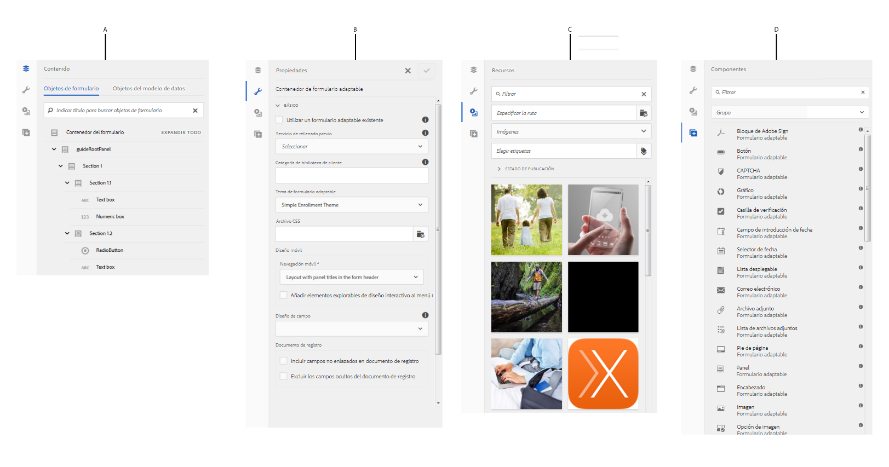

# Editor de Forms adaptable {#introduction-to-authoring-adaptive-forms}

## Información general {#overview}

Forms adaptable le permite crear formularios atractivos, interactivos, dinámicos y adaptables. [!DNL AEM Forms] proporciona una interfaz de usuario intuitiva y componentes integrados para crear y trabajar con Forms adaptable. Puede elegir crear un formulario adaptable basado en un modelo o esquema de formulario o sin un modelo de formulario. Es importante elegir cuidadosamente el modelo de formulario que no solo se adapte a sus necesidades, sino que amplíe sus inversiones y recursos de infraestructura existentes. Puede elegir entre las siguientes opciones para crear un formulario adaptable:

<!-- * **Using a form data model**
  [Data integration](data-integration.md) lets you integrate entities and services from disparate data sources in to a Form Data Model that you can use to create Adaptive Forms. Choose Form Data Model if the Adaptive Form you are creating involves fetching and write data from and to multiple data source. -->

* **Uso de una plantilla de formulario XDP**
Es un modelo de formulario ideal si tiene inversiones en formularios XFA o XDP. Proporciona una forma directa de convertir los formularios basados en XFA en Forms adaptable. Cualquier regla XFA existente se conserva en el Forms adaptable asociado. El Forms adaptable resultante admite construcciones XFA, como validaciones, eventos, propiedades y patrones.

* **Uso de una definición de esquema XML (XSD) o un esquema JSON**
Los esquemas XML y JSON representan la estructura en la que el sistema back-end de su organización produce o consume los datos. Puede asociar el esquema a un formulario adaptable y utilizar sus elementos para agregar contenido dinámico al formulario adaptable. Los elementos del esquema estarán disponibles para su uso en la pestaña Objetos del modelo de datos del navegador de contenido al crear Forms adaptable.

* **Uso de ninguno o sin un modelo de formulario**
Forms adaptable creado con esta opción no utiliza ningún modelo de formulario. El XML de datos generado a partir de estos formularios tiene una estructura plana con campos y valores correspondientes.

<!--  For more information about creating an Adaptive Form, see [Creating an Adaptive Form](creating-adaptive-form.md). -->

## IU de creación de formularios adaptables {#adaptive-form-authoring-ui}

La IU táctil para crear Forms adaptable es intuitiva y proporciona:

* Funcionalidad de arrastrar y soltar
* Componentes de formulario estándar
* Repositorio integrado para recursos

Cuando crea un formulario adaptable nuevo o edita uno existente, utiliza los siguientes elementos de la interfaz de usuario:

* [Barra lateral](#sidebar)
* [Barra de herramientas de página](#page-toolbar)
* [Barra de herramientas de componentes](#component-toolbar)
* [Página Formulario adaptable](#af-page)

<!-- 

**A.** Sidebar **B.** Page toolbar **C.** Adaptive Form page -->

### Barra lateral {#sidebar}

La barra lateral le permite

* Busque, vea y utilice recursos en su repositorio AEM de Digital Asset Management (DAM).
* Consulte el contenido del formulario, como paneles, componentes, campos y presentación.
* Añada componentes al formulario.
* Edite las propiedades del componente.

**A.** Navegador de contenido **B.** Explorador de propiedades **C.** Navegador de recursos **D.** Navegador de componentes

<!--Click to enlarge

](assets/sidebar-comps-1.png) -->

La barra lateral consta de los siguientes navegadores:

* **Navegador de contenido**
En el navegador de contenido, puede ver:

   * **Objetos de formulario**
Muestra la jerarquía de objetos del formulario. El autor puede desplazarse a un componente de formulario específico tocando ese elemento en el árbol de objetos del formulario. El autor puede buscar objetos y reorganizarlos desde este árbol.

   * **Objetos del modelo de datos**
Permite ver la jerarquía del modelo de formulario.
Permite arrastrar y soltar elementos de modelo de formulario en el formulario adaptable. Los elementos añadidos se convierten automáticamente en componentes de formulario conservando sus propiedades originales. Puede ver objetos del modelo de datos cuando el formulario utiliza un esquema XML, un esquema JSON o una plantilla XDP.

* **Explorador de propiedades**

   Permite editar las propiedades de un componente. Las propiedades cambian según un componente. Para ver las propiedades del contenedor de formulario adaptable:

   Seleccione un componente y, a continuación, pulse  > **[!UICONTROL Contenedor de formulario adaptable]** y, a continuación, toque .

* **Navegador de recursos**

   Segmenta contenido de distintos tipos, como imágenes, documentos, páginas, películas, etc.

* **Navegador de componentes**

   Incluye componentes que se pueden utilizar para crear un formulario adaptable. Puede arrastrar componentes desde al formulario adaptable para agregar elementos de formulario y configurar elementos agregados según los requisitos. En la tabla siguiente se describen los componentes enumerados en el navegador de componentes.

<table>
 <tbody>
  <tr>
   <th><strong>Componente</strong></th>
   <th><strong>Funcionalidad</strong></th>
  </tr>
  <tr>
   <td>Bloque de Adobe Sign</td>
   <td>Agrega un bloque de texto con marcadores de posición para que los campos se rellenen al firmar con Adobe Sign.</td>
  </tr>
  <tr>
   <td>Botón</td>
   <td>Agrega un botón, que puede configurar para realizar acciones como guardar, restablecer, ir a continuación, ir anterior, etc.</td>
  </tr>
  <tr>
   <td>Captcha</td>
   <td>Agrega la validación de CAPTCHA mediante el servicio reCAPTCHA de Google.</td>
  </tr>
  <tr>
   <td>Gráfico</td>
   <td>Agrega un gráfico que puede usar en Forms adaptable y documentos para la representación visual de datos bidimensionales en paneles repetibles y filas de tabla.</td>
  </tr>
  <tr>
   <td>Casilla de verificación</td>
   <td>Agrega una casilla de verificación.</td>
  </tr>
  <tr>
   <td>Campo de introducción de fecha</td>
   <td>Utilice el componente Campo de entrada de fecha en el formulario para permitir a los clientes rellenar los campos de día, mes y año por separado en tres cuadros. Puede personalizar el aspecto del componente y cambiar el formato de fecha. Por ejemplo, puede permitir que sus clientes introduzcan fechas en formato MM/DD/AAAA o DD/MM/AAAA .</td>
  </tr>
  <tr>
   <td>Selector de fecha</td>
   <td>Agrega un campo de calendario para elegir una fecha.</td>
  </tr>
  <tr>
   <td>Fragmento de documento</td>
   <td>Permite añadir componentes reutilizables de una correspondencia.</td>
  </tr>
  <tr>
   <td>Grupo de fragmentos de documento</td>
   <td>Permite agregar un grupo de fragmentos de documento relacionados que se pueden usar en una plantilla de carta como una sola unidad.</td>
  </tr>
  <tr>
   <td>Lista desplegable</td>
   <td>Añade una lista desplegable: selección única o múltiple</td>
  </tr>
  <tr>
   <td>Correo electrónico</td>
   <td>
Agrega un campo para capturar la dirección de correo electrónico. El componente Correo electrónico, de forma predeterminada, valida las direcciones de correo electrónico con la siguiente expresión regular.
 
<code>^[a-zA-Z0-9.!#$%&amp;’*+/=?^_`{|}~-]+@[a-zA-Z0-9-]+(?:.[a-zA-Z0-9-]+)*$</code>
 </td>
  </tr>
  <tr>
   <td>Adjuntar archivo</td>
   <td>
Agrega un botón que permite a los usuarios examinar y adjuntar documentos de apoyo a un formulario.
 
<strong>Nota: </strong>El componente Archivo adjunto es compatible con un conjunto predefinido de formatos de archivo en Forms adaptable habilitado para Adobe Sign. Para obtener más información, consulte <a href="https://helpx.adobe.com/document-cloud/help/supported-file-formats-fill-sign.html#main-pars_text">Formatos de archivo compatibles</a>.
 </td>
  </tr>
  <tr>
   <td>Lista de archivos adjuntos</td>
   <td>Agrega un campo que enumera todos los archivos adjuntos cargados mediante el componente Archivo adjunto.</td>
  </tr>
  <tr>
   <td>Pie de página  </td>
   <td>Agrega el encabezado de página que generalmente incluye el logotipo de una corporación, el título del formulario y el resumen.  </td>
  </tr>
  <tr>
   <td>Encabezado</td>
   <td>Agrega el pie de página que generalmente incluye información de copyright y vínculos a otras páginas. </td>
  </tr>
  <tr>
   <td>Imagen</td>
   <td>Permite insertar una imagen.</td>
  </tr>
  <tr>
   <td>Opción de imagen</td>
   <td>Permite a los clientes seleccionar una imagen para proporcionar información. Puede utilizar la información para proporcionar servicios personalizados a sus clientes.</td>
  </tr>
  <tr>
   <td>Botón Siguiente</td>
   <td>Agrega un botón para desplazarse al panel siguiente de un formulario.</td>
  </tr>
  <tr>
   <td>Cuadro numérico</td>
   <td>Añade un campo para capturar valores numéricos</td>
  </tr>
  <tr>
   <td>Stepper numérico</td>
   <td>Utilice Numeric Stepper en el formulario para permitir que los clientes introduzcan un valor numérico, que puede aumentar o disminuir en función de un paso predefinido.</td>
  </tr>
  <tr>
   <td>Panel</td>
   <td>
Agrega un panel o subpanel.
 
También puede añadir un componente de panel desde la barra de herramientas del panel principal mediante el Agregar panel secundario</code> botón. Del mismo modo, puede agregar una barra de herramientas específica de un panel mediante el Agregar barra de herramientas del panel</code> botón. Puede configurar la posición de la barra de herramientas del panel mediante el cuadro de diálogo Editar panel.</code></code>
 </td>
  </tr>
  <tr>
   <td>Cuadro de contraseña</td>
   <td>Agrega un campo para capturar una contraseña.</td>
  </tr>
  <tr>
   <td>Botón Anterior</td>
   <td>Agrega un botón que los usuarios necesitan para volver a la página o panel anterior.</td>
  </tr>
  <tr>
   <td>Botón de opción</td>
   <td>Agrega botones de opción.</td>
  </tr>
  <tr>
   <td>Botón Restablecer</td>
   <td>Agrega un botón para restablecer los campos del formulario.</td>
  </tr>
  <tr>
   <td>Botón Guardar</td>
   <td>Agrega un botón para guardar los datos del formulario.</td>
  </tr>
  <tr>
   <td>Firma manuscrita</td>
   <td>Agrega un campo para capturar firmas de garabatos.</td>
  </tr>
  <tr>
   <td>Separador</td>
   <td>Permite la segregación visual de paneles en el formulario.</td>
  </tr>
  <tr>
   <td>Paso de firma</td>
   <td>Muestra la información proporcionada en el formulario y los campos de firma para que el usuario verifique y firme el formulario.</td>
  </tr>
  <tr>
   <td>Texto</td>
   <td>Permite especificar texto estático.</td>
  </tr>
  <tr>
   <td>Botón de envío</td>
   <td>Agrega un botón de envío para enviar el formulario a la acción de envío configurada.</td>
  </tr>
  <tr>
   <td>Paso de resumen</td>
   <td>Envía el formulario y muestra el texto de resumen que especifican los autores tras enviarlo. </td>
  </tr>
  <tr>
   <td>Cambiar</td>
   <td>Agrega un conmutador que realiza una acción de alternancia o de activación/desactivación. No se pueden agregar más de dos opciones en el componente Conmutar. Dado que un conmutador solo puede tener dos valores: On o Off, obligatorio no es aplicable. Se guarda al menos un valor independientemente de la entrada del usuario.   </td>
  </tr>
  <tr>
   <td>Tabla</td>
   <td>Agrega una tabla que le permite organizar los datos en filas y columnas. </td>
  </tr>
  <tr>
   <td>Teléfono</td>
   <td>
Agrega un campo para capturar el número de teléfono. El componente Teléfono permite a los autores configurar uno de los siguientes tipos de números de teléfono. Cada tipo está asociado con una expresión regular predeterminada para la validación.

    <ul>
     <li>La validación de Tipo Internacional la realiza <code>^[+][0-9]{0,14}$</code>.</li>
     <li>El tipo USPhoneNumber está validado por <code>{'+1 ('999') '999-9999}</code>.</li>
     <li>El tipo UKPhoneNumber está validado por <code>text{'+'99 999 999 9999}</code>.</li>
     <li>Tipo Personalizado no proporciona un patrón de validación predeterminado. Toma el valor del último tipo de número de teléfono seleccionado. También puede especificar su propio patrón de validación personalizado.</li>
    </ul> </td>
  </tr>
  <tr>
   <td>Términos y condiciones  </td>
   <td>Agrega un campo que los autores pueden utilizar para especificar los términos y condiciones que deben revisar los usuarios antes de rellenar el formulario.</td>
  </tr>
  <tr>
   <td>Cuadro de texto </td>
   <td>
Agrega un cuadro de texto en el que un usuario puede especificar la información necesaria. 
 
De forma predeterminada, el componente Cuadro de texto solo acepta texto sin formato. Puede habilitar un componente Cuadro de texto para que acepte Texto enriquecido. Un componente de texto Texto enriquecido habilitado proporciona opciones para agregar encabezados, cambiar estilos de caracteres (negrita, cursiva, subrayado de caracteres), crear listas ordenadas y sin ordenar, cambiar el fondo del texto y el color del texto y agregar hipervínculos. Para habilitar el texto enriquecido para un cuadro de texto, active la variable<strong> Permitir texto enriquecido</strong> en las propiedades del componente.
 </td>
  </tr>
  <tr>
   <td>Título</td>
   <td>Especifica un título para el formulario adaptable.</td>
  </tr>
  <tr>
   <td>Paso de verificación</td>
   <td>
Agrega un marcador de posición para mostrar el formulario rellenado para que el usuario lo compruebe.
 
<strong>Nota</strong>: El formulario adaptable que contiene el componente Verificar no admite usuarios anónimos. Además, no se recomienda utilizar el componente Verificar en un fragmento de formulario adaptable.
 </td>
  </tr>
 </tbody>
</table>

### Barra de herramientas de página {#page-toolbar}

La barra de herramientas de la página de la parte superior ofrece opciones que permiten obtener una vista previa del formulario, cambiar las propiedades del formulario y editar la presentación del formulario. Puede obtener una vista previa del formulario cuando lo crea y realizar los cambios correspondientes. En la barra de herramientas de la página, verá:

* **Alternar panel lateral** : Permite mostrar u ocultar la barra lateral.

* **Información de la página** : Permite ver las propiedades de página, publicar o cancelar la publicación de un formulario, iniciar un flujo de trabajo de formulario y abrir el formulario en la IU clásica.

* **Emulador** : Permite emular el aspecto del formulario para diferentes tamaños de visualización, como tabletas y teléfonos.

* **Editar**: Permite seleccionar otros modos, como: **[!UICONTROL Editar]**, **[!UICONTROL Estilo]**, **[!UICONTROL Desarrollador]** y **[!UICONTROL Diseño]**.

   * **Editar**: Permite editar las propiedades del formulario y sus componentes. Por ejemplo, añadir un componente, soltar una imagen y especificar campos obligatorios.
   * **Estilo**: Permite aplicar estilo al aspecto de los componentes del formulario. Por ejemplo, en el modo de estilo, puede seleccionar un panel y especificar su color de fondo.

   * **Desarrollador**: Permite a un desarrollador:

      * Descubra de qué formularios se componen.
      * Depurar lo que está sucediendo donde y cuando, lo que a su vez ayuda a resolver problemas.

      * **Design**. Permite habilitar o deshabilitar componentes personalizados o componentes integrados que no aparecen en la barra lateral.

* **Vista previa**: Permite obtener una vista previa del aspecto del formulario cuando se publica.

### Barra de herramientas de componentes {#component-toolbar}

Al seleccionar un componente, aparece una barra de herramientas que le permite trabajar con él. Puede obtener opciones para cortar, pegar, mover y especificar propiedades de los componentes. Las opciones son:

A.**Configurar**: Al tocar **[!UICONTROL Configurar]**, las propiedades de los componentes se pueden ver en la barra lateral. La configuración de estas propiedades permite personalizar la experiencia de captura de datos. Puede cambiar el nombre del elemento del componente, especificar el texto de la etiqueta en el campo Título del componente. El nombre del elemento permite capturar los valores que introducen los usuarios mediante el componente. En las propiedades del componente, se especifica el comportamiento del componente y se administran los datos introducidos por el usuario. Configure las propiedades en la barra lateral para capturar los datos de usuario y utilizarlos para un procesamiento posterior. Las propiedades del contenedor de formulario adaptable permiten especificar la configuración de bibliotecas de cliente, diseños, temas, documento de registro, configuración de guardado, configuración de envío y metadatos.

B.**Copiar**: Puede utilizar la opción de copia para copiar un componente y pegarlo en otros lugares del formulario. Al pegar un componente, el componente pegado obtiene un nuevo nombre de elemento, pero conserva las propiedades del componente copiado.

C.**Cortar**: Puede utilizar la opción de corte para mover un componente de un lugar a otro en el formulario adaptable.

D. **Eliminar**: Permite eliminar el componente del formulario.

E. **Insertar**: Permite insertar un componente sobre el componente seleccionado.

F. **Pegar**: Permite pegar el componente cortado o copiado mediante las opciones descritas anteriormente.

G. **Editar reglas**: Permite abrir el editor de reglas. Para obtener más información, <!-- see [Rule Editor](rule-editor.md). -->

H. **Grupo**: Permite seleccionar varios componentes si desea cortar, copiar o pegar más de un componente juntos.

I. **Principal**: Permite seleccionar el elemento principal de un componente. Por ejemplo, un campo de texto se encuentra dentro de una subsección, que reside en una sección. La sección se encuentra en el panel raíz de la guía y el contenedor del formulario adaptable es el principal de un panel raíz de guía. Para un componente, puede ver todas las opciones con la jerarquía ordenada en la parte inferior.

Por ejemplo, si toca **[!UICONTROL Principal]** para un cuadro de texto, puede ver:

* Subsección
* Sección
* guideRootPanel
* Contenedor de formulario adaptable

J. **Otros**: Proporciona más opciones para trabajar con el componente seleccionado.

* Ver expresión SOM
* Guardar un panel como fragmento (solo para paneles)
* Agregar panel secundario (solo para paneles)
* Agregar barra de herramientas del panel (solo para paneles)
* Reemplazar (no para paneles)

### Página Formulario adaptable {#af-page}

La página Formulario adaptable es el formulario real. Es como cualquier otra página WCM modelada como WCM `cq:Page` componente. La imagen siguiente muestra la estructura de contenido de un formulario adaptable típico.

La estructura de contenido suele contener los siguientes componentes principales:

* **guideContainer**: La raíz de un formulario adaptable, que se marca como **[!UICONTROL Inicio de formulario adaptable]** en la interfaz de usuario del formulario adaptable. En este componente, puede especificar:

   * *Diseño móvil del formulario adaptable*: Define el aspecto del formulario en los dispositivos móviles.
   * *Página de agradecimiento*: Define la página a la que se redirige al usuario después de enviar el formulario.
   * *Enviar acción*: Define cómo se procesa el formulario en el servidor una vez que el usuario lo envía.
   * *Estilo*: Especifica la ruta al archivo CSS utilizado para personalizar el aspecto del formulario.

* **rootPanel:** Panel raíz de un formulario adaptable. Puede contener subpaneles bajo el nodo elementos . Cada panel, incluido el panel raíz, puede tener un diseño asociado. La presentación del panel dicta cómo se coloca el formulario. Por ejemplo, en la presentación Acordeón, sus elementos se muestran como pasos de Acordeón.

* **barra de herramientas:** Un contenedor de formulario adaptable tiene asociada una barra de herramientas global, que es global para el formulario. Esta barra de herramientas se puede agregar utilizando la variable **[!UICONTROL Agregar barra de herramientas]** en la barra de edición, que permite a los autores agregar acciones, como Enviar, Guardar, Restablecer, etc.

* **activos:** Este nodo contiene información adicional utilizada para la creación de formularios. Por ejemplo, detalles del modelo de formulario, detalles de localización, etc.
