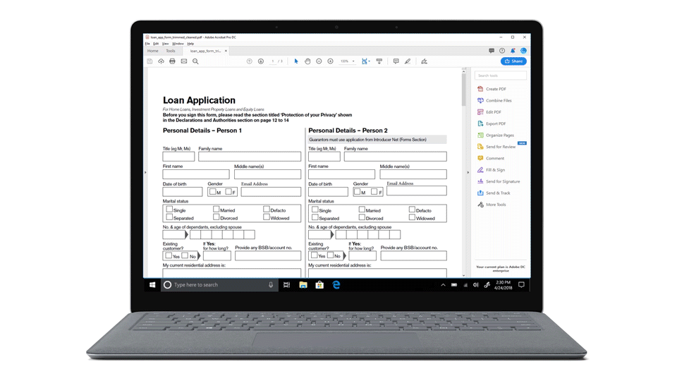
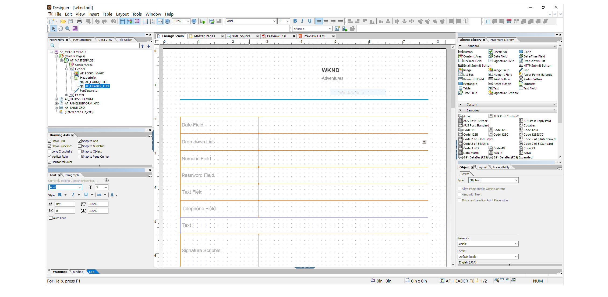

<!-- # Introduction to [!DNL AEM Forms] as a Cloud Service {#overview}

Adobe Experience Manager Forms as a Cloud Service offers a cloud-native, Platform as a Service (PaaS) solution for businesses to create, manage, publish, and update complex digital forms while integrating submitted data with back-end processes, business rules, and saving data in an external data store. The service is always current, always available, and always learning.

You can use the service to create and rollout  interactive and engaging digital forms. For example, an organization is looking to digitize their customer enrollment journey. They have multiple data sources with existing customer data, they are looking to pre-populate forms, add e-sign their forms, and archive filled forms as PDF files. Besides, the organization has multiple print forms (PDF forms), they are also looking to convert all of their print forms to digital forms.

The organization can use [!DNL AEM Forms] as a Cloud Service to create digital forms, connect forms to existing data sources, integrate forms with [!DNL Adobe Sign] to add e-signatures to forms, and generate Document of Record (DoR) to archive filled forms as PDF files. The organization can also use the service to convert their existing PDF forms to digital forms. 

An organization can sign up for [!DNL AEM Forms] as a Cloud Service and start using all these features without waiting to buy and set up a local infrastructure. The service also frees the organizations from the cycle of upgrades as it is always up to date and always offers the latest feature.  -->

# Últimas innovaciones {#latest-innovations}

Algunas de las últimas innovaciones de AEM Forms as a Cloud Service son:

| Función | Detalles |
|---|---|
| Forms adaptable sin objetivos | Crear y administrar [Forms adaptable sin objetivos](https://experienceleague.corp.adobe.com/docs/experience-manager-headless-adaptive-forms/using/overview.html) en la plataforma de Adobe Experience Manager. Permita que los desarrolladores creen, publiquen y gestionen formularios interactivos a los que se puede acceder e interactuar mediante API, en lugar de a través de una interfaz gráfica de usuario tradicional.     Estos formularios están diseñados para enviarse sin necesidad de una interfaz de formulario HTML tradicional. En otras palabras, le permiten enviar datos de formulario mediante programación a través de una API o código back-end con o sin elementos de formulario visibles en el front-end.     Los formularios sin encabezado son útiles en varios casos, como cuando se crean aplicaciones de una sola página, aplicaciones web progresivas o aplicaciones móviles, en los que una interfaz de formulario de HTML tradicional puede no ser necesaria o práctica. Al permitir a los desarrolladores enviar datos de formulario directamente a través de API o código back-end, los formularios sin encabezado ayudan a optimizar los flujos de trabajo y mejorar el rendimiento general de las aplicaciones web. |
| Componentes principales  | La variable [Componentes principales adaptables de Forms](https://experienceleague.adobe.com/docs/experience-manager-core-components/using/adaptive-forms/introduction.html#features) son un conjunto de 24 componentes de código abierto compatibles con BEM que se basan en los componentes principales de WCM de Adobe Experience Manager. Están diseñadas específicamente para utilizarse en la creación de Forms adaptable, que son formularios que se adaptan al dispositivo, navegador y tamaño de pantalla del usuario.     Estos componentes se pueden utilizar para crear experiencias de inscripción y captura de datos excepcionales proporcionando una amplia gama de opciones de campo de formulario, incluidos campos de texto, casillas de verificación, menús desplegables y mucho más. También incluyen funciones como validación, lógica condicional y diseño interactivo, que pueden utilizarse para crear formularios fáciles de usar y fáciles de usar.      Además, como estos componentes son de código abierto, los desarrolladores pueden personalizar y ampliar fácilmente los componentes para adaptarlos a las necesidades específicas de su organización. Además, estos componentes se basan en la metodología de BEM, que garantiza que sean escalables y mantenibles. |
| Conector PowerAutomate de Microsoft | El conector AEM Forms Power Automate le permite integrar Adobe Experience Manager (AEM) Forms con Microsoft Power Automate (anteriormente conocido como Microsoft Flow). Power Automate es un servicio basado en la nube que le permite crear flujos de trabajo automatizados entre diferentes aplicaciones y servicios.      Con AEM conector de automatización de Form Power, puede crear flujos de trabajo que se déclencheur automáticamente en función del envío de un formulario adaptable. Por ejemplo, puede crear un flujo de trabajo que envíe automáticamente una notificación por correo electrónico a una persona específica cuando un usuario envíe un formulario o cree una tarea en Microsoft Planner cuando un usuario complete un formulario.       AEM Forms Power Automate Connector es una potente herramienta que le permite automatizar e integrar su Forms adaptable con otras aplicaciones y servicios que se conectan con Microsoft Power Automate, lo que le permite trabajar con una gama más amplia de herramientas. Puede crear flujos de trabajo adaptados a sus necesidades específicas, con la capacidad de agregar acciones, condiciones y déclencheur personalizados. Además, Power Automate proporciona análisis e informes detallados que le permiten supervisar y optimizar los flujos de trabajo a lo largo del tiempo. |
| Conectores de almacenamiento de Microsoft | Conectores de almacenamiento de AEM Forms Microsoft para <a href="https://experienceleague.corp.adobe.com/docs/experience-manager-cloud-service/content/forms/adaptive-forms-authoring/authoring-adaptive-forms-foundation-components/configure-submit-actions-and-metadata-submission/configuring-submit-actions.html#submit-to-sharedrive">OneDrive</a>, <a href="https://experienceleague.corp.adobe.com/docs/experience-manager-cloud-service/content/forms/adaptive-forms-authoring/authoring-adaptive-forms-foundation-components/configure-submit-actions-and-metadata-submission/configuring-submit-actions.html?#submit-to-sharedrive"> SharePoint, </a> y <a href="https://experienceleague.corp.adobe.com/docs/experience-manager-cloud-service/content/forms/adaptive-forms-authoring/authoring-adaptive-forms-foundation-components/configure-submit-actions-and-metadata-submission/configuring-submit-actions.html?#submit-to-azure-blob-storage"> Almacenamiento de Azure Blob </a> son conectores que le permiten integrar Adobe Experience Manager (AEM) Forms con Microsoft OneDrive y SharePoint. Con este conector, puede cargar archivos de datos y archivos adjuntos en OneDrive y SharePoint directamente desde Adaptive Forms.     OneDrive y SharePoint se pueden integrar con otras aplicaciones empresariales, como sistemas CRM, software de contabilidad y herramientas de administración de proyectos. Esto le permite optimizar los procesos de su negocio, reducir la entrada manual de datos y mejorar la eficiencia general. |
| IU del asistente | La interfaz de usuario del Asistente para Forms adaptable es una potente herramienta para crear formularios adaptables de forma rápida y sencilla. Su interfaz fácil de usar y sus opciones de personalización hacen que sea accesible para todos los usuarios, independientemente de su nivel de experiencia técnica.     La interfaz de usuario del asistente simplifica el proceso de creación de formularios adaptables guiando a los usuarios paso a paso a través del proceso de creación de formularios. La interfaz de usuario del asistente se divide en varias fichas, cada una de las cuales ofrece claramente opciones para configurar un formulario adaptable. Un creador de formularios avanza por las fichas de forma lineal para seleccionar opciones como plantillas, enviar acciones y fuentes de datos para los componentes de formulario.     La interfaz del asistente optimiza el proceso de descubrir todas las opciones esenciales de un formulario adaptable y facilita la creación de formularios, incluso para los usuarios que no están familiarizados con la tecnología. |
| Análisis de seguimiento rápido | Form analytics puede proporcionar perspectivas valiosas sobre el rendimiento de los formularios mediante la medición de la participación del usuario, la optimización de las tasas de conversión, la supervisión del rendimiento del formulario y la mejora de la experiencia del usuario.  Al rastrear el comportamiento del usuario y los comentarios, analytics puede identificar las áreas del formulario que están causando frustración o confusión, lo que guía las mejoras en el diseño y la funcionalidad del formulario.     Con Fast Track Analytics, puede habilitar Forms Analytics con un solo botón. El análisis de seguimiento rápido permite conectar AEM Forms as a Cloud Service con etiquetas de Experience Platform y Adobe Analytics para capturar y rastrear las métricas de rendimiento de los formularios publicados.         Forms as a Cloud Service proporciona un informe de Adobe Analytics OOTB. Le ayuda a comprender fácilmente el rendimiento de sus formularios. Las métricas de nivel de formulario proporcionan una perspectiva del rendimiento del formulario en varios indicadores clave de rendimiento (KPI) como, representaciones, visitantes, envíos o Tiempo medio de rellenado.     También proporciona detalles sobre la cantidad promedio de veces que los usuarios accedieron a la ayuda en contexto para los campos del panel para ayudarle a seguir los campos que hacen que los usuarios detengan y busquen información antes de proporcionar información. Puede simplificar aún más dichos campos o ayudar al contenido a mejorar las conversiones. |

<!-- 

# Key features and capabilities {#key-features}

[!DNL AEM Forms] as a Cloud Service provides several cloud-native capabilities such as a cloud-native architecture, auto-scaling, zero downtime for upgrades, a CDN (Content Delivery Network), cloud-native development environment, and ability to self-Service the environments via Cloud Manager. You can use the service to: 

* [Create Adaptive Forms](creating-adaptive-form.md#strong-create-an-adaptive-form-strong) that automatically render for a user's device and browser.

    

* [Create pixel-perfect PDF forms](use-forms-designer.md#create-an-adaptive-form) that look almost like paper.

* Use [Automated Forms Conversion service](https://experienceleague.adobe.com/docs/aem-forms-automated-conversion-service/using/introduction.html) to convert a PDF Form to an Adaptive Form. It helps you accelerate digitization and modernization of data capture experiences of your organization.

    

* [Create business processes](aem-forms-workflow-step-reference.md#create-form-centric-workflows). For example, You can create and trigger an approval and rejection workflow on submission of an Adaptive Form.

In addition to above [!DNL AEM Forms] as a Cloud Service offers the following features and capabilities:

* An easy-to-use graphical user interface to let business users easily import, manage, preview, and publish forms
* A responsive forms directory with powerful search features using keywords, tags, and metadata
* Dynamic detection of a user's device and location to render the form appropriately across web and mobile channels
* [Integration with Adobe Sign](adobe-sign-integration-adaptive-forms.md) services or Scribble to electronically sign documents containing confidential information
* Ability to [connect the service to various types of data sources](data-integration.md#create-an-adaptive-form) to send and retrieve data. The service supports sending and retrieving data from RESTful web services, SOAP-based web services, and OData enabled services.
* Integration with AEM Sites. It allows to embed an adaptive form in an AEM Sites page. You can also integrate an adaptive form to any webpage. 
* Ability to create a Document of Record (DoR) to keep a record of the information that you provide and submit in an Adaptive Form so that you can refer to it later. A DoR is a PDF version of a form. It includes both a template and data. The service provides a default DoR template and tools to develop a custom template.
* Ability to create Adaptive Forms to produce schema-compliant data. It helps you submit captured data to existing processes and data sources without any or minimal modifications.
* Ability to create a prefill service to fill a form with existing customer data based on a criteria. It helps fasten the form filling process and reduce the abandon rate.

<!-- 

## Enterprise-class forms {#enterprise-class-forms}

You can create enterprise class forms (Adaptive Forms) and deliver beautiful, interactive, responsive, and personalized experiences to your customers. These forms change behavior and appearance based on the underlying device. You can also use themes and templates with Adaptive Forms to mandate a uniform structure and appearance for all the forms of an organization or a department.

## Automatic conversion of PDF forms to Adaptive Forms {#automatic-conversion-of-pdf-forms-to-adaptive-forms}

You can use Automated Forms Conversion service to convert a PDF Form to an Adaptive Form. It helps you accelerate digitization and modernization of data capture experiences of your organization.

## Data Integration {#data-integration}

You can connect the service to various types of data sources to send and retrieve data. The service supports sending and retrieving data from RESTful web services, SOAP-based web services, and OData enabled services.

## Integration with [!DNL Adobe Sign] {#integration-with-adobe-sign}

 You can integrate the service with [!DNL Adobe Sign] and add [!DNL Adobe Sign] fields to an Adaptive Form. It allows your users to e-sign an Adaptive Form and use [!DNL Adobe Sign] with AEM Workflows. You can use AEM Workflows to develop a business logic and send forms and documents to recipients for signatures based on the business logic.

## Integration with [!DNL AEM Sites] {#integration-with-aem-sites}

You can embed an adaptive form in an AEM Sites or an external webpage. The service provides a component out of the box to integrate an adaptive forms to an AEM Sites page.

## Business Processes Automation {#bpa}

You can use AEM Workflows to create business processes and automate operations. For example, You can create and trigger an approval and rejection workflow on submission of an Adaptive Form. 

## Document of Record {#dor}

You can create a Document of Record (DoR) to keep a record of the information that you provide and submit in an Adaptive Form so that you can refer to it later. A DoR is a PDF version of a form. It includes both a template and data. The service provides a default DoR template and tools to develop a custom template.

## Rule editor {#rule-editor}

Rule editor empowers you to build dynamism and interactivity to Adaptive Forms. These rules define actions to trigger on form objects based on preset conditions, user inputs, and user actions on the form. It helps  streamline the form filling experience while ensuring accuracy and speed.
  

## WYSIWYG editors {#wysiwyg-editor} 

The service provides several WYSIWYG editors: Adaptive Forms editor, Theme editor, and Template editor. These help you create and edit forms and related assets in WYSIWYG manner. The editors also provide out-of-the-box options to simulate views for popular mobile devices, tablets, and desktop screen configurations.

## Schema-compliant data {#schema-complaint-data}

You can create Adaptive Forms to produce schema-compliant data. It helps you submit captured data to existing processes and data sources without any or minimal modifications.

## Prefill a form

You can create a prefill service to fill a form with existing customer data based on a criteria. It helps fasten the form filling process and reduce the abandon rate.

## Submit Actions

A Submit Action allows you to persist and process captured data. The service provides several Submit Actions out-of-the-box. You can use these Submit Actions to send submitted data to a REST endpoint, database, or an AEM Workflow. You can also email submitted data along with attachments and Document of Record(DoR). You can also develop a custom Submit Action to perform an action specific to your business.

* **Emulators:** You can view an Adaptive Form in an in-built emulator. It helps you simulate how an Adaptive Form appears on different devices to an end user. It provides out-of-the-box options to simulate views for popular mobile devices, tablets, and desktop screen configurations. 

In addition to standard [!DNL AEM Forms] features, [!DNL AEM Forms] as a Cloud Service provides several cloud-native capabilities such as a cloud-native architecture, auto-scaling, zero downtime for upgrades, a CDN (Content Delivery Network), cloud-native development environment, and ability to self-Service the environments via Cloud Manager. -->
