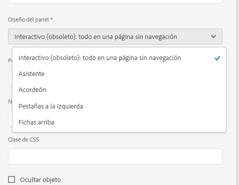
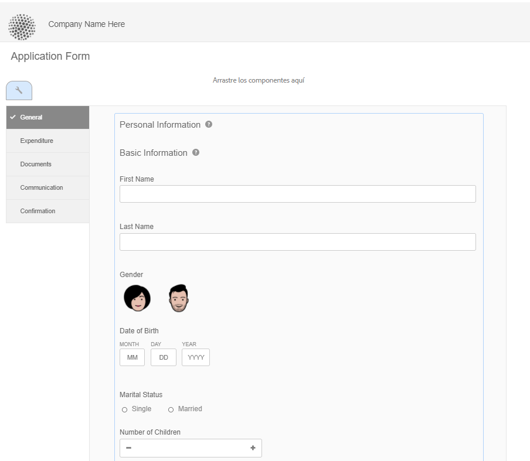
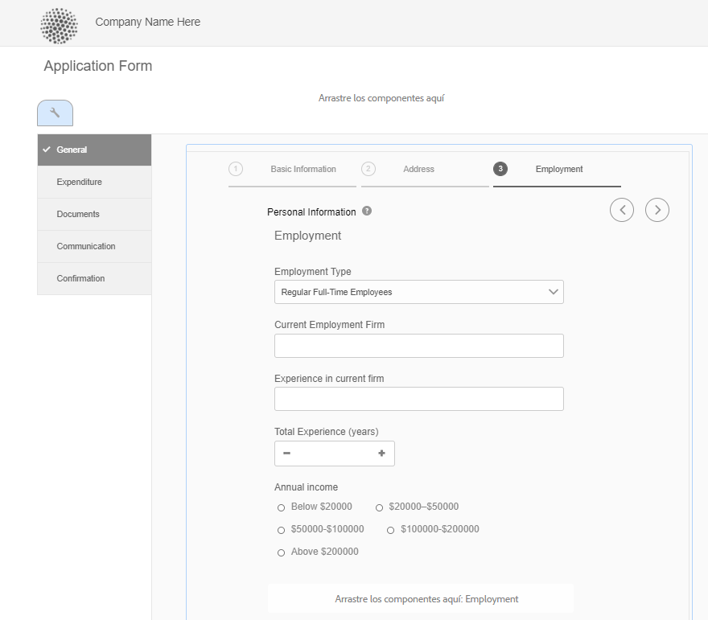
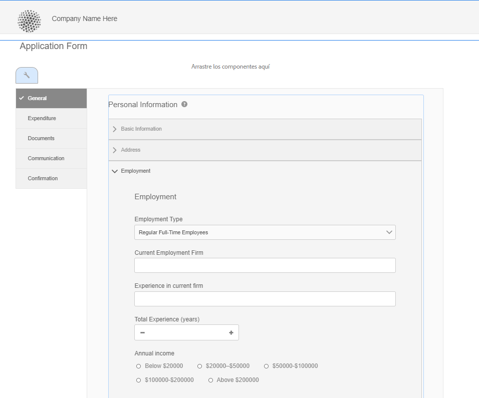
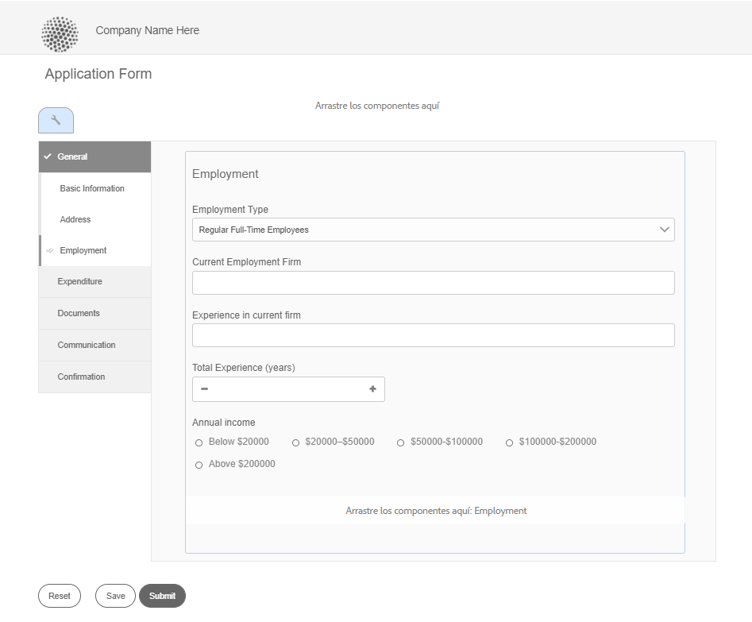
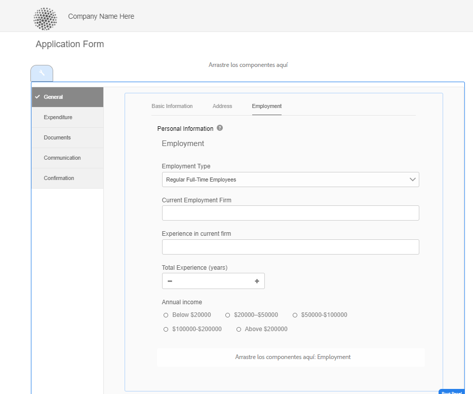
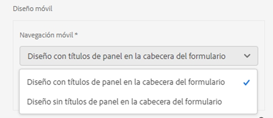
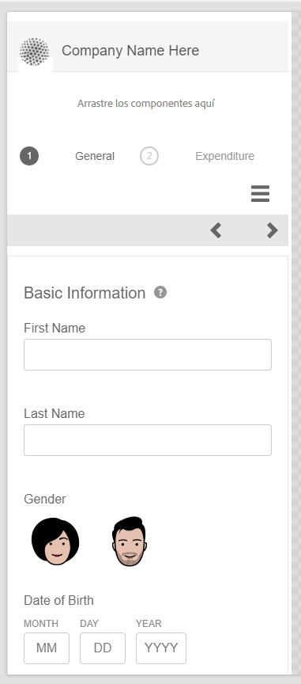
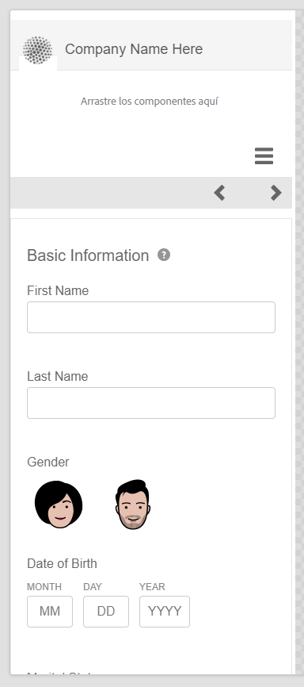
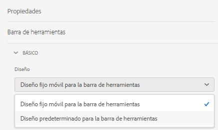

# Funciones de diseño de los formularios adaptables {#layout-capabilities-of-adaptive-forms}

<span class="preview"> Adobe recomienda utilizar la captura de datos moderna y ampliable [Componentes principales](https://experienceleague.adobe.com/docs/experience-manager-core-components/using/adaptive-forms/introduction.html?lang=es) para [crear un nuevo formulario adaptable](/help/forms/creating-adaptive-form-core-components.md) o [añadir formularios adaptables a páginas de AEM Sites](/help/forms/create-or-add-an-adaptive-form-to-aem-sites-page.md). Estos componentes representan un avance significativo en la creación de formularios adaptables, lo que garantiza experiencias de usuario impresionantes. Este artículo describe un enfoque más antiguo para crear Formularios adaptables con componentes de base. </span>


| Versión | Vínculo del artículo |
| -------- | ---------------------------- |
| AEM 6.5 | [Haga clic aquí](https://experienceleague.adobe.com/docs/experience-manager-65/forms/adaptive-forms-basic-authoring/layout-capabilities-adaptive-forms.html?lang=es) |
| AEM as a Cloud Service | Este artículo |

[!DNL Adobe Experience Manager] permite crear formularios adaptables fáciles de usar que ofrecen experiencias dinámicas a los usuarios finales. El diseño del formulario controla cómo se muestran los elementos o los componentes de un formulario adaptable.

<!-- ## Prerequisite knowledge {#prerequisite-knowledge}

Before learning about the different layout capabilities of Adaptive Forms, read [Introduction to authoring forms](introduction-forms-authoring.md) to know more about Adaptive Forms. -->

## Tipos de diseños {#types-of-layouts}

Un formulario adaptable proporciona los siguientes tipos de diseños:

**[!UICONTROL Diseño de panel]**: controla cómo se muestran los elementos o componentes de un panel en un dispositivo.

**[!UICONTROL Diseño móvil]**: controla la navegación de un formulario en un dispositivo móvil. Si el ancho del dispositivo es de 768 píxeles o más, el diseño se considera un diseño para móviles y se optimiza para un dispositivo móvil.

**[!UICONTROL Diseño de barra de herramientas]**: controla la ubicación de los botones de acción en la barra de herramientas o la barra de herramientas del panel de un formulario.

Todos estos diseños de panel se definen en la ubicación `/libs/fd/af/layouts`.

Para cambiar el diseño de un formulario adaptable, utilice el modo Autor de [!DNL Experience Manager].

## [!UICONTROL Diseño de panel] {#panel-layout}

Un autor de formularios puede asociar un diseño a cada uno de los paneles de un formulario adaptable, incluido el panel raíz.

Los diseños de panel están disponibles en la ubicación `/libs/fd/af/layouts/panel`. Pulse el panel y seleccione  para ver sus propiedades.



### [!UICONTROL Adaptable: todo en una página sin navegación] {#responsive-everything-on-one-page-without-navigation-br}

Utilice este diseño de panel para crear un diseño adaptable que se ajuste al tamaño de pantalla del dispositivo sin necesidad de utilizar ningún tipo de navegación especializada.

Con este diseño, puede colocar varios componentes **[!UICONTROL Formulario adaptable con panel]** uno tras otro en el panel.



### [!UICONTROL Asistente] {#wizard}

Utilice este diseño de panel para proporcionar navegación guiada dentro de un formulario. Por ejemplo, utilice este diseño cuando desee capturar información obligatoria en un formulario y guiar a los usuarios paso a paso.

Utilice el componente **[!UICONTROL Formulario adaptable con panel]** para proporcionar navegación paso a paso dentro de un panel. Cuando se utiliza este diseño, el usuario solo puede pasar al siguiente paso una vez que ha completado el paso actual.

```javascript
window.guideBridge.validate([], this.panel.navigationContext.currentItem.somExpression)
```



### [!UICONTROL Acordeón] {#layout-for-accordion-design}

Con este diseño, puede colocar el componente **[!UICONTROL Formulario adaptable con panel]** en un panel con navegación de estilo acordeón. Este diseño también permite crear paneles repetibles. Los paneles repetibles permiten agregar o quitar paneles de forma dinámica según sea necesario. Puede definir el número mínimo y máximo de veces que se repite un panel. Además, el título del panel se puede determinar dinámicamente en función de la información proporcionada en los elementos del panel.

La expresión de resumen se puede utilizar para mostrar los valores proporcionados por el usuario en el título del panel minimizado.



### [!UICONTROL Diseño con pestañas: las pestañas aparecen a la izquierda]{#tabbed-layout-tabs-appear-on-the-left}

Con este diseño, puede colocar el componente **[!UICONTROL Formulario adaptable con panel]** en un panel con navegación entre pestañas. Las pestañas se colocan a la izquierda del contenido del panel.



Las pestañas aparecen a la izquierda del panel

### [!UICONTROL Diseño con pestañas: las pestañas aparecen en la parte superior] {#tabbed-layout-tabs-appear-on-the-top}

Con este diseño, puede colocar el componente **[!UICONTROL Formulario adaptable con panel]** en un panel con navegación entre pestañas. Las pestañas se colocan sobre el contenido del panel.



## Diseños móviles {#mobile-layouts}

Los diseños móviles proporcionan una navegación fácil de usar en los dispositivos móviles con pantallas relativamente más pequeñas. Los diseños móviles utilizan estilos con pestañas o de asistente para la navegación del formulario. La aplicación de un diseño para móvil proporciona un diseño único para todo el formulario.

Este diseño controla la navegación mediante una barra y un menú de navegación. La barra de navegación muestra los iconos **&lt;** y **>** para indicar los pasos de navegación **[!UICONTROL Siguiente]** y **[!UICONTROL Anterior]** en el formulario.

Los diseños móviles están disponibles en la ubicación `/libs/fd/af/layouts/mobile/`. Los siguientes diseños móviles están disponibles en los formularios adaptables de forma predeterminada.



Seleccione la opción **[!UICONTROL Agregar elementos navegables de diseño adaptable al menú móvil]** para ver las opciones navegables disponibles en un panel con el diseño móvil. Las opciones navegables solo están visibles si selecciona el diseño **[!UICONTROL Adaptable]** para un panel.

Cuando se utiliza un diseño móvil, el menú del formulario está disponible para acceder a los diferentes paneles del formulario pulsando el icono .

### [!UICONTROL Diseño con títulos de panel en el encabezado del formulario] {#layout-with-panel-titles-in-the-form-header}

Este diseño, como su nombre indica, muestra los títulos de los paneles junto con el menú y la barra de navegación. También incluye los iconos Siguiente y Anterior para la navegación.



### [!UICONTROL Diseño sin títulos de panel en el encabezado del formulario]{#layout-without-panel-titles-in-the-form-header}

Este diseño, como su nombre indica, muestra únicamente el menú y la barra de navegación, sin títulos de panel. También incluye los iconos Siguiente y Anterior para la navegación.



## Consulte también {#see-also}

{{see-also}}


<!-- ## Toolbar layouts {#toolbar-layouts}

A Toolbar Layout controls positioning and display of any action buttons that you add to your Adaptive Forms. The layout can be added at a form level or at a panel level.



A list of Toolbar Layouts in Adaptive Forms

Toolbar layouts are available at `/libs/fd/af/layouts/toolbar` location. Adaptive Forms provide the following Toolbar Layouts, by default.

### [!UICONTROL Default layout for toolbar] {#default-layout-for-toolbar}

This layout is selected as the default layout when you add any action buttons in an Adaptive Form. Selecting this layout displays the same layout for both, desktop and mobile devices.

Also, you can add multiple toolbars containing action buttons configured with this layout. An action button is associated with a form control. You can configure the toolbars to be before or after a panel.


Default view for toolbar

### [!UICONTROL Mobile fixed layout for toolbar] {#mobile-fixed-layout-for-toolbar}

Select this layout to provide alternate layouts for desktop and mobile devices.

For the desktop layout, you can add Action buttons using some specific labels. Only one toolbar can be configured with this layout. If more than one toolbar is configured with this layout, there is an overlap for mobile devices and only one toolbar is visible. For example, you can have a toolbar at the bottom or the top of the form, or, after or before panels in the form.

For the Mobile layout, you can add action buttons using icons.


Mobile fixed layout for toolbar-->


