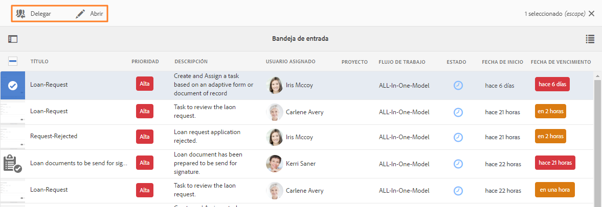

# Administrar aplicaciones y tareas de Forms en Bandeja de entrada de AEM{#manage-forms-applications-and-tasks-in-aem-inbox}

Una de las muchas formas de iniciar o activar un flujo de trabajo centrado en Forms es mediante las aplicaciones en Bandeja de entrada de AEM. Debe crear una aplicación de flujo de trabajo para que un flujo de trabajo de Forms esté disponible como aplicación en la bandeja de entrada. Para obtener más información sobre la aplicación de flujo de trabajo y otras formas de iniciar flujos de trabajo de Forms, consulte [Iniciar un flujo de trabajo centrado en Forms en OSGi](aem-forms-workflow.md#launch).

Además, Bandeja de entrada de AEM consolida las notificaciones y tareas de varios componentes de AEM, incluidos los flujos de trabajo de Forms. Cuando se activa un flujo de trabajo de Forms que contiene una Etapa de tarea de asignación, la aplicación asociada aparece como una tarea en la bandeja de entrada del usuario asignado. Si el usuario asignado es un grupo, la tarea aparece en la bandeja de entrada de todos los miembros del grupo hasta que un individuo solicite o delegue la tarea.

La interfaz de usuario de la bandeja de entrada ofrece vistas de lista y calendario para ver las tareas. También puede configurar la configuración de vista. Puede filtrar las tareas en función de varios parámetros. Para obtener más información sobre las vistas y los filtros, consulte [Su bandeja de entrada](https://experienceleague.adobe.com/docs/experience-manager-cloud-service/sites/authoring/getting-started/inbox.html?lang=es#inbox-in-the-header).

En resumen, la bandeja de entrada le permite crear una nueva aplicación y administrar las tareas asignadas.

## Aplicabilidad y casos de uso

### Seguro

## ¿Puede AEM Forms rastrear el estado de las reclamaciones o solicitudes de seguros?

Sí. Los flujos de trabajo de AEM Forms permiten a las aseguradoras rastrear el envío de formularios y el estado de procesamiento en diferentes etapas del proceso empresarial.

## ¿AEM Forms admite los seguimientos de auditoría para los procesos de seguro?

Sí. AEM Forms admite la auditabilidad a través del historial del flujo de trabajo, los controles de acceso y los registros del sistema, lo que ayuda a las aseguradoras a satisfacer las necesidades de auditoría interna y externa.

## ¿Pueden los agentes enviar formularios de seguro en nombre de los clientes?

Sí. AEM Forms admite la cumplimentación asistida y dirigida por agentes de formularios, lo que permite a los usuarios autorizados enviar formularios en nombre de los clientes sin perder la auditabilidad.

>[!NOTE]
>
>Debe ser miembro del grupo [!DNL workflow-users] para poder utilizar Bandeja de entrada AEM.

## Crear aplicación {#create-application}

1. Vaya a Bandeja de entrada de AEM, en https://&#39;[server]:[port]&#39;/aem/inbox.
1. En la interfaz de usuario de la bandeja de entrada, seleccione **[!UICONTROL Crear > Aplicación]**. Aparece la página Seleccionar aplicación.
1. Seleccione una aplicación y haga clic en **[!UICONTROL Crear]**. Se abre el formulario adaptable asociado a la aplicación. Rellene la información del formulario adaptable y seleccione **[!UICONTROL Enviar]**. Inicia el flujo de trabajo asociado y crea una tarea en la bandeja de entrada del usuario asignado.

## Administrar tareas {#manage-tasks}

Cuando se activa un flujo de trabajo de Forms y usted es un usuario asignado o parte del grupo de usuarios asignados, aparece una tarea en su bandeja de entrada. Puede ver los detalles de las tareas y realizar las acciones disponibles en la tarea desde la bandeja de entrada.

### Reclamar o delegar tareas {#claim-or-delegate-tasks}

Las tareas asignadas a un grupo aparecen en la bandeja de entrada de todos los miembros del grupo. Cualquier miembro del grupo puede reclamar esa tarea o delegarla a otro miembro del grupo. Para ello:

1. Seleccione para seleccionar la miniatura de la tarea. Las opciones para abrir o delegar la tarea aparecen en la parte superior.

   

1. Realice una de las siguientes acciones:

   * Para delegar la tarea, seleccione **[!UICONTROL Delegar]**. Se abre el cuadro de diálogo Delegar elemento. Seleccione un usuario, tiene la opción de añadir un comentario, y seleccione **[!UICONTROL OK]**.

   

   * Para reclamar la tarea, seleccione **[!UICONTROL Abrir]**. Se abrirá el cuadro de diálogo Asignar a sí mismo. Seleccione **[!UICONTROL Continuar]** para reclamar la tarea. La tarea reclamada aparece con usted como el usuario asignado en su bandeja de entrada.

   

### Ver detalles y realizar acciones en tareas {#view-details-and-perform-actions-on-tasks}

Al abrir una tarea, puede ver los detalles de la tarea y realizar las acciones disponibles. Las acciones disponibles para una tarea se definen en la Etapa de tarea de asignación del flujo de trabajo del formulario asociado.

1. Seleccione para seleccionar la miniatura de la tarea. Las opciones para abrir o delegar la tarea seleccionada aparecen en la parte superior.
1. Pulse **Abrir** para ver los detalles de la tarea y las acciones disponibles. Se abre la vista de tareas detallada. En esta vista, puede ver los detalles de la tarea y realizar acciones respecto a ella.

   >[!NOTE]
   >
   >Si una tarea está asignada a un grupo, debe reclamarla para poder abrirla en vista detallada.


La vista de tareas detallada consta de las siguientes secciones:

* Detalles de la tarea
* Formulario
* Detalles del flujo de trabajo
* Barra de herramientas Acciones

#### Detalles de la tarea {#task-details}

La sección Detalles de la tarea muestra información sobre la tarea. La información mostrada depende de los ajustes de configuración de la [Etapa de tarea de asignación](https://experienceleague.adobe.com/docs/experience-manager-65/developing/extending-aem/extending-workflows/workflows-step-ref.html?lang=es#extending-aem) en el flujo de trabajo. El ejemplo anterior muestra la descripción, el estado, la fecha de inicio y el flujo de trabajo utilizado para la tarea. También permite adjuntar un archivo a la tarea.

#### Formulario {#form}

La pestaña Formulario del área de contenido principal muestra los archivos adjuntos de formulario y de nivel de campo enviados, de haber.

#### Detalles del flujo de trabajo {#workflow-details}

La pestaña Detalles del flujo de trabajo de la parte superior muestra el progreso de la tarea mediante varias fases del flujo de trabajo. Muestra las fases completadas, actuales y pendientes de la tarea. Las fases para un flujo de trabajo se definen en la [Etapa de tarea de asignación](https://experienceleague.adobe.com/docs/experience-manager-65/developing/extending-aem/extending-workflows/workflows-step-ref.html?lang=es#extending-aem) del flujo de trabajo asociado.

Además, la pestaña muestra el historial de tareas para cada fase completada en el flujo de trabajo. Puede seleccione **[!UICONTROL Ver detalles]** en una fase completada para conocer los detalles de dicha fase. Muestra comentarios, archivos adjuntos de formularios y tareas, estado, fechas de inicio y finalización, etc., sobre la tarea.


#### Barra de herramientas Acciones {#actions-toolbar}

La barra de herramientas Acciones muestra todas las opciones disponibles para la tarea. Mientras que Guardar, Restablecer y Delegar son acciones predeterminadas, otras acciones disponibles se configuran en la [Etapa de tarea de asignación](https://experienceleague.adobe.com/docs/experience-manager-65/developing/extending-aem/extending-workflows/workflows-step-ref.html?lang=es#extending-aem). En el ejemplo anterior, se configura Aprobar y Rechazar en el flujo de trabajo.

A medida que realiza una acción sobre la tarea, esta continúa en el flujo de trabajo.

### Ver tareas completadas {#view-completed-tasks}

La Bandeja de entrada de AEM solo muestra las tareas activas. Las tareas completadas no aparecen en la lista. Con todo, puede utilizar los filtros de la bandeja de entrada para filtrar las tareas según varios parámetros, como el tipo de tarea, el estado, las fechas de inicio y finalización. Para ver las tareas completadas:

1. En Bandeja de entrada AEM, seleccione  para abrir el selector de filtros.
1. Seleccione el acordeón **[!UICONTROL Estado de la tarea]** y seleccione **[!UICONTROL Completar]**. Se mostrarán todas las tareas completadas.

   

1. Seleccione para seleccionar una tarea y haga clic en **[!UICONTROL Abrir]**.

La tarea se abre para mostrar el documento o el formulario adaptable asociado a la tarea. En el caso del formulario adaptable, la tarea muestra el formulario adaptable de solo lectura o su documento de registro PDF, tal y como se ha configurado en la pestaña Formulario/documento del [paso Asignar flujo de trabajo de tarea](https://experienceleague.adobe.com/docs/experience-manager-65/developing/extending-aem/extending-workflows/workflows-step-ref.html?lang=es#extending-aem).

La sección de detalles de la tarea muestra información como la acción realizada, el estado de la tarea, la fecha de inicio y la fecha de finalización.


La pestaña **[!UICONTROL Detalles del flujo de trabajo]** muestra cada paso del flujo de trabajo. Seleccione **[!UICONTROL Ver detalles]** en un paso para obtener información detallada.


## Solución de problemas {#troubleshooting-workflows}

### No se pueden ver los elementos relacionados con el flujo de trabajo de AEM en la Bandeja de entrada AEM {#unable-to-see-aem-worklow-items}

El propietario de un modelo de flujo de trabajo no puede ver los elementos relacionados con el flujo de trabajo de AEM en Bandeja de entrada AEM. Para resolver el problema, añada los siguientes índices a su repositorio de AEM y reconstruya el índice.

1. Utilice uno de los siguientes métodos para añadir índices:

   * Cree los siguientes nodos en CRX DE en `/oak:index/workflowDataLucene/indexRules/granite:InboxItem/properties` con las propiedades respectivas especificadas en la siguiente tabla:

     | Nodo | Propiedad | Tipo |
     |---|---|---|
     | sharedWith | sharedWith | CADENA |
     | bloqueado | bloqueado | BOOLEANO |
     | devuelto | devuelto | BOOLEANO |
     | allowInboxSharing | allowInboxSharing | BOOLEANO |
     | allowExplicitSharing | allowExplicitSharing | BOOLEANO |


   * Implemente los índices mediante un paquete de AEM. Puede usar un proyecto de [Tipo de archivo de AEM](https://experienceleague.adobe.com/docs/experience-manager-core-components/using/developing/archetype/overview.html?lang=es) para crear un paquete de AEM implementable. Utilice el siguiente código de ejemplo para añadir índices a un proyecto de tipo de archivo AEM:

   ```Java
      .property("sharedWith", "sharedWith").type(TYPENAME_STRING).propertyIndex()
      .property("locked", "locked").type(TYPENAME_BOOLEAN).propertyIndex()
      .property("returned", "returned").type(TYPENAME_BOOLEAN).propertyIndex()
      .property("allowInboxSharing", "allowInboxSharing").type(TYPENAME_BOOLEAN).propertyIndex()
      .property("allowExplicitSharing", "allowExplicitSharing").type(TYPENAME_BOOLEAN).propertyIndex()
   ```

1. [Cree un índice de propiedades y establézcalo en true](https://experienceleague.adobe.com/docs/experience-manager-65/deploying/deploying/queries-and-indexing.html?lang=es#the-property-index).

1. Después de configurar los índices en CRX DE o implementar mediante un paquete, vuelva a indexar el repositorio.
