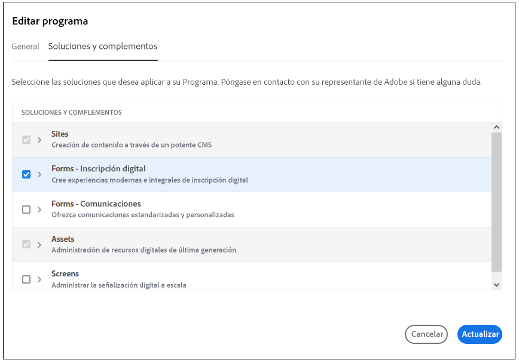

# Migración a [!DNL AEM Forms] as a Cloud Service  {#Harden-your-AEM-Forms-as-a-Cloud-Service-environment}

Puede migrar su Forms adaptable, temas, plantillas y configuraciones de nube desde <!-- AEM 6.3 Forms--> AEM 6.4 Forms en OSGi y AEM 6.5 Forms en OSGi a [!DNL AEM] as a Cloud Service. Antes de migrar estos recursos, utilice Migration Utility para convertir el formato utilizado en las versiones anteriores al formato utilizado en [!DNL AEM] as a Cloud Service. Al ejecutar la utilidad de migración, se actualizan los siguientes recursos:

* Componentes personalizados para Forms adaptable
* Plantillas y temas de Forms adaptables
* Configuraciones de nube
* Los scripts del editor de código se convierten en funciones reutilizables y se aplican a reglas visuales.

## Consideraciones {#consideration}

* El servicio solo ayuda a migrar contenido de [!DNL AEM Forms] en entornos OSGi. Migración de contenido desde [!DNL AEM Forms] no se admite JEE en un entorno de Cloud Service.

* (Solo para AEM 6.3 Forms o un entorno de versión anterior actualizado a AEM 6.4 Forms o AEM 6.5 Forms) La Forms adaptable basada en plantillas y temas integrados disponibles en AEM 6.3 Forms o en versiones anteriores no es compatible con [!DNL AEM Forms] as a Cloud Service.

## Requisitos previos {#prerequisites}

* [Habilitar Forms: inscripción digital](https://experienceleague.adobe.com/docs/experience-manager-cloud-manager/using/getting-started/setting-up-program.html?#editing-program) para su programa de Cloud Service de Forms y [ejecutar la canalización](https://experienceleague.adobe.com/docs/experience-manager-cloud-manager/using/how-to-use/deploying-code.html).

   

* En un entorno de Cloud Service, la utilidad de migración funciona junto con la herramienta de asignación de usuarios y la herramienta de transferencia de contenido. La utilidad de migración hace [!DNL AEM Forms] recursos compatibles con Cloud Service y la herramienta de transferencia de contenido migra el contenido de su [!DNL AEM Forms] entorno a un [!DNL AEM] Entorno as a Cloud Service. Antes de usar la utilidad de migración, conozca el proceso de [desplazamiento a AEM as a Cloud Service](https://experienceleague.adobe.com/docs/experience-manager-cloud-service/moving/home.html). El proceso tiene dos herramientas:
   * [Herramienta de asignación de usuarios](https://experienceleague.adobe.com/docs/experience-manager-cloud-service/moving/cloud-migration/content-transfer-tool/using-user-mapping-tool.html?lang=en#cloud-migration): La herramienta de asignación de usuarios le ayuda a asignar sus usuarios con las cuentas de usuario de IMS de Adobe correspondientes.
   * [Herramienta de transferencia de contenido](https://experienceleague.adobe.com/docs/experience-manager-cloud-service/moving/cloud-migration/content-transfer-tool/overview-content-transfer-tool.html?#cloud-migration): La herramienta de transferencia de contenido le ayuda a preparar y transferir contenido de un entorno existente a un entorno de Cloud Service.
* Cuentas con privilegios de administrador en [!DNL AEM Forms] as a Cloud Service y local [!DNL AEM Forms] entorno.
* Descargue e instale el Analizador de prácticas recomendadas, la herramienta de transferencia de contenido y [!DNL AEM Forms] Utilidad de migración de [Portal de distribución de software](https://experience.adobe.com/#/downloads/content/software-distribution/es-es/aemcloud.html)

* Ejecute el [Analizador de prácticas recomendadas](https://experienceleague.adobe.com/docs/experience-manager-cloud-service/moving/cloud-migration/best-practices-analyzer/overview-best-practices-analyzer.html?lang=en#cloud-migration) y corrija el problema reportado.

<!-- * Download the latest [compatibility package](https://experienceleague.adobe.com/docs/experience-manager-release-information/aem-release-updates/forms-updates/aem-forms-releases.html?lang=en#aem-65-forms-releases) for your [!DNL AEM Forms] version. -->

## Migrar [!DNL AEM Forms] activos  {#use-the-migration-utility}

Realice los siguientes pasos para realizar [!DNL AEM Forms] recursos compatibles con Cloud Service y transferirlos a un [!DNL AEM] Entorno as a Cloud Service.

1. Cree un [clone](https://experienceleaguecommunities.adobe.com/t5/adobe-experience-manager/correct-method-to-clone-the-aem-environment/qaq-p/363487) de su [!DNL AEM Forms] entorno.

   Utilice siempre el entorno clonado para ejecutar la herramienta de transferencia de contenido y la utilidad de migración. Content Transfer Tool y Migration Utility realizan algunos cambios en el contenido y los recursos. Por lo tanto, no ejecute la herramienta de transferencia de contenido ni la utilidad de migración en un entorno de producción.

1. Inicie sesión en el entorno clonado con privilegios administrativos.

1. Ejecute el [Herramienta de asignación de usuarios](https://experienceleague.adobe.com/docs/experience-manager-cloud-service/moving/cloud-migration/content-transfer-tool/using-user-mapping-tool.html?lang=en#cloud-migration) para asignar los usuarios con las cuentas de usuario de IMS de Adobe correspondientes. Es necesario que las cuentas de usuario de Adobe IMS inicien sesión en un [!DNL AEM Forms] instancia as a Cloud Service.

1. Descargue e instale el [Herramienta de transferencia de contenido](https://experienceleague.adobe.com/docs/experience-manager-cloud-service/moving/cloud-migration/content-transfer-tool/overview-content-transfer-tool.html?#cloud-migration) y [!DNL AEM Forms] Utilidad de migración as a Cloud Service desde [Portal de distribución de software](https://experience.adobe.com/#/downloads/content/software-distribution/en/aemcloud.html) en el entorno clonado. Puede utilizar AEM Administrador de paquetes para instalar la herramienta y la utilidad.

1. Vaya a **[!UICONTROL Herramientas]** > **[!UICONTROL Operaciones]** > **[!UICONTROL Migración de contenido]**.

1. Abra el **[!UICONTROL Preparación de Forms para la migración]** tarjeta. El explorador muestra cinco opciones:
   * **[!UICONTROL Migración de recursos de AEM Forms]**
   * **[!UICONTROL Migración de componentes personalizados de Forms adaptable]**
   * **[!UICONTROL Migración de plantillas adaptables de Forms]**
   * **[!UICONTROL Migración de configuraciones en la nube de AEM Forms]**
   * **[!UICONTROL Migración de secuencias de comandos del Editor de código]**

1. Utilice la opción una tras otra para realizar la [!DNL AEM Forms] recursos compatibles con [!DNL AEM] as a Cloud Service:

   1. Toque **[!UICONTROL Migración de recursos de AEM Forms]** y en la siguiente pantalla, pulse **[!UICONTROL Iniciar migración]**. Crea Forms adaptable y temas en tu [!DNL AEM Forms] compatible con [!DNL AEM] as a Cloud Service .

   1. Toque **[!UICONTROL Migración de componentes personalizados de Forms adaptable]** y en la página Migración de componentes personalizados , pulse **[!UICONTROL Iniciar migración]**. Crea cualquier componente personalizado desarrollado para Forms adaptable y superposiciones de componentes en sus [!DNL AEM Forms] compatible con [!DNL AEM] as a Cloud Service .

   1. Toque **[!UICONTROL Migración de plantillas de Forms adaptable]** y en la página Migración de componentes personalizados , pulse **[!UICONTROL Iniciar migración]**. Hace compatibles las plantillas de formulario adaptable en /apps o /conf y se crean con AEM Editor de plantillas [!DNL AEM] as a Cloud Service .

   1. Toque **[!UICONTROL Migración de configuraciones de AEM Forms Cloud]** y, a continuación, en la página Migración de configuración , pulse **[!UICONTROL Iniciar migración]**. Actualiza y mueve los siguientes Cloud Services a una nueva ubicación:

      * Cloud Service del modelo de datos de formulario
      * Cloud Service de Google reCAPTCHA
      * [!DNL Adobe Sign] Servicio de nube
      * Cloud Service de Adobe Fonts
   1. Toque **[!UICONTROL Migración de secuencias de comandos del Editor de código]**, especifique una ubicación para guardar funciones reutilizables y pulse **[!UICONTROL Iniciar migración].

   El Cloud Service no admite scripts del editor de reglas. La variable **[!UICONTROL Migración de scripts del editor de código]** la herramienta convierte todos los scripts de regla en su entorno a funciones reutilizables y aplica las funciones reutilizables al editor visual en la ubicación apropiada. Estas funciones reutilizables se guardan en forma de bibliotecas de cliente y le ayudan a mantener intacta la funcionalidad existente. La herramienta aplica automáticamente las funciones reutilizables generadas a la Forms adaptable correspondiente.

   Utilice la variable [Administrador de paquetes](https://experienceleague.adobe.com/docs/experience-manager-65/administering/contentmanagement/package-manager.html?lang=en#contentmanagement) para exportar las funciones reutilizables (bibliotecas de cliente) a un paquete.

1. [Implementación](https://experienceleague.adobe.com/docs/experience-manager-cloud-service/implementing/deploying/overview.html?lang=en#deploying-content-packages-via-cloud-manager-and-package-manager) el paquete de funciones reutilizables (bibliotecas de cliente), [código personalizado, componentes y configuraciones](https://experienceleague.adobe.com/docs/experience-manager-learn/cloud-service/cloud-manager/devops/deploy-code.html#cloud-manager), bibliotecas personalizadas específicas de configuración regional para su [!DNL AEM] Entorno as a Cloud Service.

   <!-- 1. Install the latest [Compatibility Package](https://experienceleague.adobe.com/docs/experience-manager-cloud-service/moving/cloud-migration/content-transfer-tool/overview-content-transfer-tool.html?#cloud-migration) to your cloned [!DNL AEM Forms] environment. -->

1. Ejecute el [Herramienta de transferencia de contenido](https://experienceleague.adobe.com/docs/experience-manager-cloud-service/moving/cloud-migration/content-transfer-tool/overview-content-transfer-tool.html?#cloud-migration). Al especificar parámetros en la variable **[!UICONTROL Crear conjunto de migración]** especifique la ruta de Forms adaptable, los temas, las plantillas, los modelos de datos de formulario, los Cloud Services, los componentes personalizados y otros recursos específicos de AEM Forms a la **[!UICONTROL Rutas a incluir]** . Agrega el especificado [!DNL AEM Forms] recursos al conjunto de migración.

## Rutas de varios recursos específicos de AEM Forms

* **Forms adaptable**: Puede encontrar formularios adaptables en `/content/dam/formsanddocuments/`y /content/forms/af. Por ejemplo, para un formulario adaptable denominado WKND Registro añadir rutas `/content/dam/formsanddocuments/wknd-registration` y `/content/forms/af/wknd-registration`.
* **Modo de datos de formulario**: Puede encontrar todos los modelos de datos de formulario en `/content/dam/formsanddocuments-fdm`. Por ejemplo, `/content/dam/formsanddocuments-fdm/ms-dynamics-fdm`.

* **Bibliotecas de cliente**: La ruta predeterminada de las bibliotecas de cliente es `/etc/clientlibs/fd/theme`.

* **Plantillas de formulario adaptables**: La ruta predeterminada de las plantillas es `/conf/<template folder>`. Por ejemplo, para una plantilla titulada ruta de adición básica `/conf/ReferenceEditableTemplates/settings/wcm/templates/basic`.

* **Temas de formularios adaptables y bibliotecas de cliente**: La ruta predeterminada de los temas es ` /content/dam/formsanddocuments-themes/` y la ruta predeterminada de las bibliotecas de cliente es `/etc/clientlibs/fd/theme`. Por ejemplo, para una plantilla titulada WKND Theme add path ` /content/dam/formsanddocuments-themes/wkndtheme` y bibliotecas de cliente para el tema en `/etc/clientlibs/reference-themes/wkndtheme-3-0`. También puede tener temas y bibliotecas de cliente en otras rutas personalizadas.

* **Configuraciones de nube**: Puede encontrar Configuraciones de nube en `/conf/`. Por ejemplo, la configuración de nube del Modelo de datos de formulario se encuentra en `/conf/global/settings/cloudconfigs/fdm`.

* **Modelo de flujo de trabajo**: Puede encontrar AEM modelos de flujo de trabajo en `/conf/global/settings/workflow/models/`. Por ejemplo, para un modelo de flujo de trabajo llamado WKND Registration add path `/conf/global/settings/workflow/models/wknd-registration`

Puede agregar las rutas de carpeta de nivel superior que se enumeran a continuación o las rutas de carpeta específicas, tal como se describe a continuación. Permite migrar ciertos recursos y todos los recursos y formularios a la vez.

* /content/dam/formsanddocuments-fdm
* /content/dam/formsanddocuments/themes
* /content/forms/af
* /etc/clientlibs/fd/theme

Para migrar AEM modelos de flujo de trabajo, especifique las siguientes rutas:

* /conf/global/settings/workflow/models/
* /conf/global/settings/workflow/launcher
* /var/workflow/models
