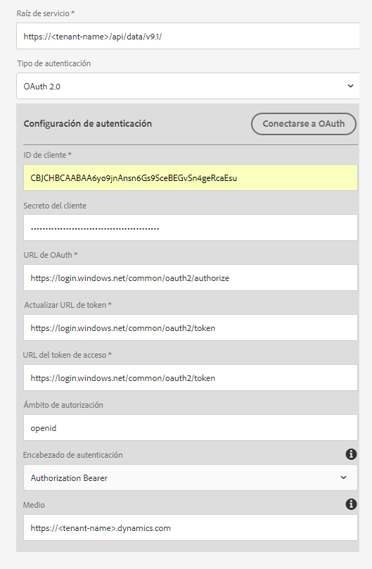

# Configuración de [!DNL Microsoft Dynamics] OData {#microsoft-dynamics-odata-configuration}

| Versión | Vínculo del artículo |
| -------- | ---------------------------- |
| AEM 6.5 | [Haga clic aquí](https://experienceleague.adobe.com/docs/experience-manager-65/forms/form-data-model/ms-dynamics-odata-configuration.html?lang=es) |
| AEM as a Cloud Service | Este artículo |


[!DNL Microsoft Dynamics] es un software de administración de la relación con los clientes (CRM) y planificación de recursos empresariales (ERP) que proporciona soluciones empresariales para crear y administrar cuentas de clientes, contactos, posibles clientes, oportunidades y casos. La integración de datos de [[!DNL Experience Manager Forms] ](data-integration.md) proporciona una configuración de servicio en la nube de OData para integrar Forms con servidores de [!DNL Microsoft Dynamics] en línea y locales. Esto permite crear el modelo de datos de formulario en función de las entidades, atributos y servicios definidos en el servicio de [!DNL Microsoft Dynamics]. El modelo de datos de formulario se puede utilizar para crear formularios adaptables que interactúen con el servidor [!DNL Microsoft Dynamics] para habilitar los flujos de trabajo empresariales. Por ejemplo:

* consultar datos en el servidor de [!DNL Microsoft Dynamics] y rellenar automáticamente formularios adaptables;
* escribir datos en [!DNL Microsoft Dynamics] sobre el envío de formularios adaptables;
* Escribir datos en [!DNL Microsoft Dynamics] a través de entidades personalizadas definidas en el modelo de datos de formulario y viceversa

<!--[!DNL Experience Manager Forms] add-on package also includes reference OData configuration that you can use to quickly integrate [!DNL Microsoft Dynamics] with [!DNL Experience Manager Forms].-->

<!--When the package is installed, the following entities and services are available on your [!DNL Experience Manager Forms] instance:

* MS Dynamics OData Cloud Service (OData Service)-->
<!--* Form Data Model with preconfigured [!DNL Microsoft Dynamics] entities and services.-->

<!-- Preconfigured [!DNL Microsoft Dynamics] entities and services in a Form Data Model are available on your [!DNL Experience Manager Forms] instance only if the run mode for the [!DNL Experience Manager] instance is set as `samplecontent` (default). -->  El servicio en la nube de OData de MS Dynamics (servicio OData) también está disponible con otros modos de ejecución. Para obtener más información sobre la configuración de los modos de ejecución de una  [!DNL Experience Manager] instancia, consulte [Modos de ejecución](https://experienceleague.adobe.com/docs/experience-manager-cloud-service/implementing/deploying/overview.html?lang=es#runmodes).

## Requisitos previos {#prerequisites}

Antes de comenzar a configurar [!DNL Microsoft Dynamics], asegúrese de lo siguiente:

<!--* Installed the [[!DNL Experience Manager Forms] add-on package](installing-configuring-aem-forms-osgi.md) -->
* Ha configurado [!DNL Microsoft Dynamics] 365 en línea o ha instalado una instancia de una de las siguientes versiones de [!DNL Microsoft Dynamics]:

   * [!DNL Microsoft Dynamics] 365 local
   * [!DNL Microsoft Dynamics] 2016 local

* [Ha registrado la aplicación del servicio en línea de  [!DNL Microsoft Dynamics]  con  [!DNL Microsoft Azure]  Active Directory](https://docs.microsoft.com/es-es/dynamics365/customer-engagement/developer/walkthrough-register-dynamics-365-app-azure-active-directory). Tome nota de los valores del ID de cliente (también denominado ID de aplicación) y del secreto de cliente del servicio registrado. Estos valores se utilizan para [configurar Cloud Service para el servicio de  [!DNL Microsoft Dynamics] ](#configure-cloud-service-for-your-microsoft-dynamics-service).

## Establecer la URL de respuesta para la aplicación de [!DNL Microsoft Dynamics] registrada {#set-reply-url-for-registered-microsoft-dynamics-application}

Haga lo siguiente para establecer la URL de respuesta para la aplicación de [!DNL Microsoft Dynamics] registrada:

>[!NOTE]
>
>Utilice este procedimiento solo mientras integra [!DNL Experience Manager Forms] con el servidor en línea de [!DNL Microsoft Dynamics].

1. Vaya a su cuenta de [!DNL Microsoft Azure] Active Directory y agregue la siguiente URL de configuración del servicio en la nube en la opción **[!UICONTROL URL de respuesta]** de la aplicación registrada:

   `https://[server]:[port]/libs/fd/fdm/gui/components/admin/fdmcloudservice/createcloudconfigwizard/cloudservices.html`

   

1. Guarde la configuración.

## Configurar [!DNL Microsoft Dynamics] para IFD {#configure-microsoft-dynamics-for-ifd}

[!DNL Microsoft Dynamics] utiliza la autenticación basada en notificaciones para proporcionar acceso a los datos del servidor de [!DNL Microsoft Dynamics] CRM a los usuarios externos. Para habilitar esta función, haga lo siguiente para configurar [!DNL Microsoft Dynamics] para la implementación con conexión a Internet (IFD) y configurar opciones de notificación.

>[!NOTE]
>
>Utilice este procedimiento solo mientras integra [!DNL Experience Manager Forms] con el servidor local de [!DNL Microsoft Dynamics].

1. Configure la instancia local de [!DNL Microsoft Dynamics] para IFD, tal como se describe en [Configuración de IFD para  [!DNL Microsoft Dynamics]](https://technet.microsoft.com/es-es/library/dn609803.aspx).
1. Ejecute los siguientes comandos utilizando Windows PowerShell para configurar las opciones de notificación en [!DNL Microsoft Dynamics] para IFD:

   ```shell
   Add-PSSnapin Microsoft.Crm.PowerShell
    $ClaimsSettings = Get-CrmSetting -SettingType OAuthClaimsSettings
    $ClaimsSettings.Enabled = $true
    Set-CrmSetting -Setting $ClaimsSettings
   ```

   Consulte [Registro de aplicaciones para CRM local (IFD)](https://msdn.microsoft.com/sl-si/library/dn531010(v=crm.7).aspx#bkmk_ifd) para obtener más información.

## Configurar el cliente OAuth en el equipo AD FS {#configure-oauth-client-on-ad-fs-machine}

Haga lo siguiente para registrar un cliente de OAuth en el equipo de los Servicios de federación de Active Directory (AD FS) y conceder acceso desde él:

>[!NOTE]
>
>Utilice este procedimiento solo mientras integra [!DNL Experience Manager Forms] con el servidor local de [!DNL Microsoft Dynamics].

1. Ejecute el siguiente comando:

   `Add-AdfsClient -ClientId “<Client-ID>” -Name "<name>" -RedirectUri "<redirect-uri>" -GenerateClientSecret`

   Donde:

   * `Client-ID` es un ID de cliente que puede generar con cualquier generador GUID.
   * `redirect-uri` es la dirección URL del servicio en la nube de OData de [!DNL Microsoft Dynamics] en [!DNL Experience Manager Forms]. El servicio en la nube predeterminado instalado con [!DNL Experience Manager Forms] se implementa en la siguiente URL:
     `https://'[server]:[port]'/libs/fd/fdm/gui/components/admin/fdmcloudservice/createcloudconfigwizard/cloudservices.html`

1. Ejecute el siguiente comando para conceder acceso desde el equipo AD FS:

   `Grant-AdfsApplicationPermission -ClientRoleIdentifier “<Client-ID>” -ServerRoleIdentifier <resource> -ScopeNames openid`

   donde:

   * `resource` es la URL de la organización de [!DNL Microsoft Dynamics].

1. [!DNL Microsoft Dynamics] utiliza el protocolo HTTPS. Para invocar extremos de AD FS desde el servidor de [!DNL Forms], instale el certificado del sitio de [!DNL Microsoft Dynamics] en el almacén de certificados de Java mediante el comando `keytool` en el equipo en el que se ejecuta [!DNL Experience Manager Forms].

## Configurar el servicio en la nube para el servicio de [!DNL Microsoft Dynamics] {#configure-cloud-service-for-your-microsoft-dynamics-service}

Un servicio OData se identifica mediante su URL raíz de servicio. Para configurar un servicio OData en [!DNL Experience Manager] as a Cloud Service, asegúrese de que tiene una URL raíz de servicio para el servicio y haga lo siguiente:

<!--The **MS Dynamics OData Cloud Service (OData Service)** configuration comes with default OData configuration. To configure it to connect with your [!DNL Microsoft Dynamics] service, do the following.-->

>[!NOTE]
>
>Para obtener una guía paso a paso sobre la configuración de [!DNL Microsoft Dynamics 365], en línea o de forma local, consulte [[!DNL Microsoft Dynamics] Configuración de OData](ms-dynamics-odata-configuration.md).

1. Vaya a **[!UICONTROL Herramientas > Cloud Services > Fuentes de datos]**. Seleccione para seleccionar la carpeta en la que desea crear una configuración de nube.

   Consulte [Configurar carpetas para configuraciones de servicios en la nube](#cloud-folder) para obtener información sobre la creación y configuración de una carpeta para configuraciones de servicios en la nube.

1. Seleccionar **[!UICONTROL Crear]** para abrir **[!UICONTROL Asistente de configuración de creación de fuentes de datos]**. Especifique un nombre y, opcionalmente, un título para la configuración, seleccione **[!UICONTROL Servicio OData]** desde el **[!UICONTROL Tipo de servicio]** , si lo desea, busque y seleccione una imagen en miniatura para la configuración y seleccione **[!UICONTROL Siguiente]**.
En la pestaña **[!UICONTROL Configuración de autenticación]**:

   1. Introduzca el valor del campo **[!UICONTROL Raíz del servicio]**. Vaya a la instancia de Dynamics y luego a **[!UICONTROL Recursos para desarrolladores]** para ver el valor del campo Raíz del servicio. por ejemplo, https://&lt;tenant-name>/api/data/v9.1/

   1. Seleccione **[!UICONTROL OAuth 2.0]** como el tipo de autenticación.

   1. Reemplace los valores predeterminados en los campos **[!UICONTROL ID de cliente]** (también denominado **ID de aplicación**), **[!UICONTROL Secreto de cliente]**, **[!UICONTROL URL de OAuth]**, **[!UICONTROL Actualizar URL del token]**, **[!UICONTROL URL del token de acceso]** y **[!UICONTROL Recurso]** con los valores de su configuración del servicio de [!DNL Microsoft Dynamics]. Es obligatorio especificar la URL de la instancia de Dynamics en el campo **[!UICONTROL Recurso]** para configurar [!DNL Microsoft Dynamics] con un modelo de datos de formulario. Utilice la URL raíz del servicio para derivar la URL de la instancia de Dynamics. Por ejemplo, [https://org.crm.dynamics.com](https://org.crm.dynamics.com/).

   1. Especifique **[!UICONTROL openid]** en el campo **[!UICONTROL Ámbito de autorización]** para el proceso de autorización de [!DNL Microsoft Dynamics].

      
Modelo de datos de formulario
1. Haga clic en **[!UICONTROL Conectarse a OAuth]**. Se le redirigirá a la página de inicio de sesión de [!DNL Microsoft Dynamics].
1. Inicie sesión con sus credenciales de [!DNL Microsoft Dynamics] y haga clic en Aceptar para permitir que la configuración del servicio en la nube se conecte al servicio de [!DNL Microsoft Dynamics]. Solo es necesario establecer el modelo de datos de formulario entre el servicio y el servicio una vez.

   Este es el modelo de datos de formulario de la página de configuración del servicio en la nube, la cual muestra un mensaje que indica que la configuración de OData se ha guardado correctamente.

El servicio en la nube MS Dynamics OData Cloud Service (servicio OData) está configurado y conectado con el servicio de Dynamics. Modelo de datos de formulario - Modelo de datos de formulario

## Crear modelo de datos de formulario {#create-form-data-model}

<!--When you install the [!DNL Experience Manager Forms] package, a form data model, **[!DNL Microsoft Dynamics] FDM**, is deployed on your [!DNL Experience Manager] instance. By default, the Form Data Model uses [!DNL Microsoft Dynamics] service configured in the MS Dynamics OData Cloud Service (OData Service) as its data source.

On opening the Form Data Model for the first time, it connects to the configured [!DNL Microsoft Dynamics] service and fetches entities from your [!DNL Microsoft Dynamics] instance. The "contact" and "lead" entities from [!DNL Microsoft Dynamics] are already added in the form data model.

To review the form data model, go to **[!UICONTROL Form Data Model egrations]**. Select **[!DNL Microsoft Dynamics] FDM** and click **[!UICONTROL Edit]** to open the Form Data Model in edit mode. Alternatively, you can open the Form Data Model directly from the following URL:

`https://'[server]:[port]'/aem/fdm/editor.html/content/dam/formsanddocuments-fdm/ms-dynamics-fdm`
 Form Data Model 
-->

Después de configurar el modelo de datos del servicio en la nube de OData de MS Dynamics, puede utilizar el servicio al crear modelos de datos de formulario. Para obtener más información, consulte [Creación del modelo de datos de formulario](create-form-data-models.md).

A continuación, puede crear un formulario adaptable basado en el modelo de datos de formulario y utilizarlo en varios casos de uso de formularios adaptables, como los siguientes:

* prerrellenar formularios adaptables consultando la información de las entidades y servicios de [!DNL Microsoft Dynamics];
* invocar operaciones del servidor de [!DNL Microsoft Dynamics] definidas en un modelo de datos de formulario que utiliza reglas de formularios adaptables;
* escribir datos de formularios enviados en entidades de [!DNL Microsoft Dynamics].

<!--It is recommended to create a copy of the Form Data Model provided with the [!DNL Experience Manager Forms] package and configure data models and services to suit your requirements. It will ensure that any future updates to the package do not override your form data model.-->

Para obtener más información sobre la creación y el uso de modelos de datos de formulario en flujos de trabajo empresariales, consulte [Integración de datos](data-integration.md).
