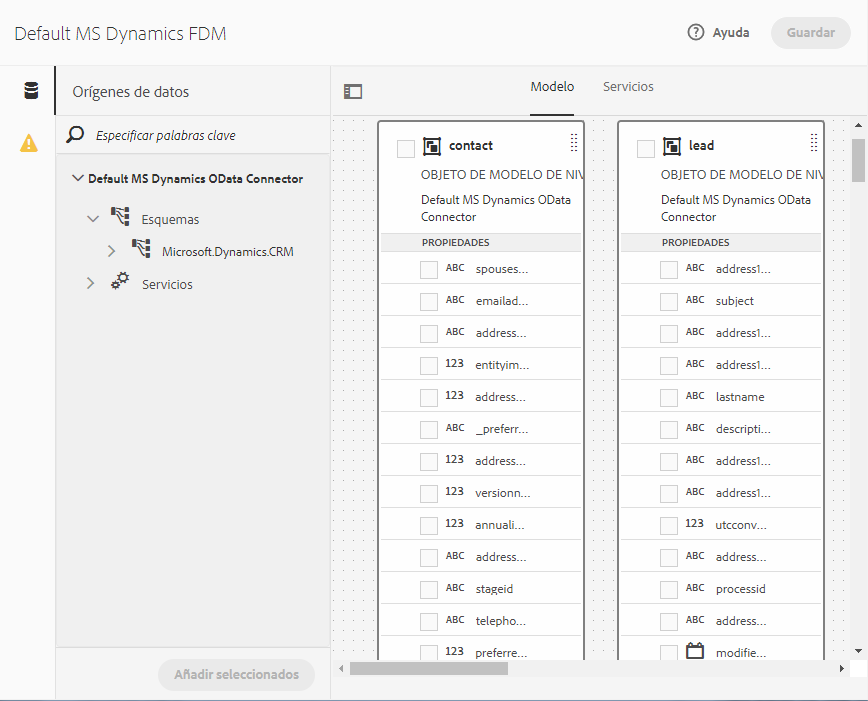

# [!DNL Microsoft Dynamics] Configuración de OData {#microsoft-dynamics-odata-configuration}


[!DNL Microsoft Dynamics] es un software de administración de la relación con los clientes (CRM) y planificación de recursos empresariales (ERP) que proporciona soluciones empresariales para crear y administrar cuentas de clientes, contactos, posibles clientes, oportunidades y casos. [[!DNL Experience Manager Forms] Integración de datos](data-integration.md) proporciona una configuración de servicio en la nube OData para integrar Forms tanto en línea como in situ [!DNL Microsoft Dynamics] servidor. Permite crear el Modelo de datos de formulario en función de las entidades, atributos y servicios definidos en [!DNL Microsoft Dynamics] servicio. El Modelo de datos de formulario se puede utilizar para crear un Forms adaptable que interactúe con [!DNL Microsoft Dynamics] para habilitar los flujos de trabajo empresariales. Por ejemplo:

* Consulta [!DNL Microsoft Dynamics] servidor para datos y rellenado previo de Forms adaptable
* Escribir datos en [!DNL Microsoft Dynamics] sobre la presentación de formularios adaptables
* Escribir datos en [!DNL Microsoft Dynamics] a través de entidades personalizadas definidas en el Modelo de datos de formulario y viceversa

<!--[!DNL Experience Manager Forms] add-on package also includes reference OData configuration that you can use to quickly integrate [!DNL Microsoft Dynamics] with [!DNL Experience Manager Forms].-->

<!--When the package is installed, the following entities and services are available on your [!DNL Experience Manager Forms] instance:

* MS Dynamics OData Cloud Service (OData Service)-->
<!--* Form Data Model with preconfigured [!DNL Microsoft Dynamics] entities and services.-->

<!-- Preconfigured [!DNL Microsoft Dynamics] entities and services in a Form Data Model are available on your [!DNL Experience Manager Forms] instance only if the run mode for the [!DNL Experience Manager] instance is set as `samplecontent` (default). -->  MS Dynamics OData Cloud Service (OData Service) is available with all run modes. For more information on configuring run modes for an [!DNL Experience Manager] instance, see [Run Modes](https://experienceleague.adobe.com/docs/experience-manager-cloud-service/implementing/deploying/overview.html#runmodes).

## Requisitos previos {#prerequisites}

Antes de comenzar a configurar [!DNL Microsoft Dynamics], asegúrese de que:

<!--* Installed the [[!DNL Experience Manager Forms] add-on package](installing-configuring-aem-forms-osgi.md) -->
* Configurado [!DNL Microsoft Dynamics] 365 en línea o instalado una instancia de una de las siguientes [!DNL Microsoft Dynamics] versiones:

   * [!DNL Microsoft Dynamics] 365 locales
   * [!DNL Microsoft Dynamics] 2016 in situ

* [Se registró la solicitud de [!DNL Microsoft Dynamics] servicio en línea con [!DNL Microsoft Azure] Active Directory](https://docs.microsoft.com/en-us/dynamics365/customer-engagement/developer/walkthrough-register-dynamics-365-app-azure-active-directory). Tome nota de los valores del ID de cliente (también denominado ID de aplicación) y del secreto de cliente para el servicio registrado. Estos valores se utilizan al [configuración del servicio en la nube para [!DNL Microsoft Dynamics] service](#configure-cloud-service-for-your-microsoft-dynamics-service).

## Establecer URL de respuesta para registrado [!DNL Microsoft Dynamics] aplicación {#set-reply-url-for-registered-microsoft-dynamics-application}

Haga lo siguiente para establecer la URL de respuesta para registrado [!DNL Microsoft Dynamics] aplicación:

>[!NOTE]
>
>Utilice este procedimiento solo mientras integre [!DNL Experience Manager Forms] con conexión [!DNL Microsoft Dynamics] servidor.

1. Vaya a [!DNL Microsoft Azure] Cuenta de Active Directory y agregue la siguiente URL de configuración del servicio en la nube en **[!UICONTROL URL de respuesta]** configuración de la aplicación registrada:

   `https://[server]:[port]/libs/fd/fdm/gui/components/admin/fdmcloudservice/createcloudconfigwizard/cloudservices.html`

   

1. Guarde la configuración.

## Configurar [!DNL Microsoft Dynamics] para IFD {#configure-microsoft-dynamics-for-ifd}

[!DNL Microsoft Dynamics] utiliza la autenticación basada en reclamaciones para proporcionar acceso a los datos en [!DNL Microsoft Dynamics] Servidor CRM para usuarios externos. Para habilitar esto, haga lo siguiente para configurar [!DNL Microsoft Dynamics] para la implementación de cara a Internet (IFD) y configure los ajustes de la reclamación.

>[!NOTE]
>
>Utilice este procedimiento solo mientras integre [!DNL Experience Manager Forms] con [!DNL Microsoft Dynamics] servidor.

1. Configurar [!DNL Microsoft Dynamics] instancia local para IFD, tal como se describe en [Configurar IFD para [!DNL Microsoft Dynamics]](https://technet.microsoft.com/en-us/library/dn609803.aspx).
1. Ejecute los siguientes comandos utilizando Windows PowerShell para configurar los parámetros de reclamación en IFD-enabled [!DNL Microsoft Dynamics]:

   ```shell
   Add-PSSnapin Microsoft.Crm.PowerShell
    $ClaimsSettings = Get-CrmSetting -SettingType OAuthClaimsSettings
    $ClaimsSettings.Enabled = $true
    Set-CrmSetting -Setting $ClaimsSettings
   ```

   Consulte [Registro de aplicaciones para CRM local (IFD)](https://msdn.microsoft.com/sl-si/library/dn531010(v=crm.7).aspx#bkmk_ifd) para obtener más información.

## Configurar el cliente OAuth en el equipo AD FS {#configure-oauth-client-on-ad-fs-machine}

Haga lo siguiente para registrar un cliente de OAuth en el equipo de Servicios de federación de Active Directory (AD FS) y conceder acceso en el equipo de AD FS:

>[!NOTE]
>
>Utilice este procedimiento solo mientras integre [!DNL Experience Manager Forms] con [!DNL Microsoft Dynamics] servidor.

1. Ejecute el siguiente comando:

   `Add-AdfsClient -ClientId “<Client-ID>” -Name "<name>" -RedirectUri "<redirect-uri>" -GenerateClientSecret`

   Donde:

   * `Client-ID` es un ID de cliente que puede generar con cualquier generador GUID.
   * `redirect-uri` es la dirección URL de [!DNL Microsoft Dynamics] Servicio de nube OData en [!DNL Experience Manager Forms]. El servicio de nube predeterminado instalado con la variable [!DNL Experience Manager Forms] se implementa en la siguiente dirección URL:
      `https://'[server]:[port]'/libs/fd/fdm/gui/components/admin/fdmcloudservice/createcloudconfigwizard/cloudservices.html`

1. Ejecute el siguiente comando para conceder acceso en el equipo AD FS:

   `Grant-AdfsApplicationPermission -ClientRoleIdentifier “<Client-ID>” -ServerRoleIdentifier <resource> -ScopeNames openid`

   Donde:

   * `resource` es la variable [!DNL Microsoft Dynamics] URL de organización.

1. [!DNL Microsoft Dynamics] utiliza el protocolo HTTPS. Para invocar extremos de AD FS desde [!DNL Forms] servidor, instalar [!DNL Microsoft Dynamics] certificado de sitio al almacén de certificados de Java mediante la función `keytool` en el equipo en ejecución [!DNL Experience Manager Forms].

## Configure el servicio en la nube para [!DNL Microsoft Dynamics] service {#configure-cloud-service-for-your-microsoft-dynamics-service}

Un servicio OData se identifica mediante su URL raíz de servicio. Para configurar un servicio OData en [!DNL Experience Manager] as a Cloud Service, asegúrese de que tiene una URL raíz de servicio para el servicio y haga lo siguiente:

<!--The **MS Dynamics OData Cloud Service (OData Service)** configuration comes with default OData configuration. To configure it to connect with your [!DNL Microsoft Dynamics] service, do the following.-->

>[!NOTE]
>
>Para obtener una guía paso a paso sobre la configuración [!DNL Microsoft Dynamics 365], en línea o in situ, consulte [[!DNL Microsoft Dynamics] Configuración de OData](ms-dynamics-odata-configuration.md).

1. Vaya a **[!UICONTROL Herramientas > Cloud Services > Fuentes de datos]**. Pulse para seleccionar la carpeta en la que desea crear una configuración de nube.

   Consulte [Configuración de la carpeta para configuraciones de servicios en la nube](#cloud-folder) para obtener información sobre la creación y configuración de una carpeta para configuraciones de servicios en la nube.

1. Toque **[!UICONTROL Crear]** para abrir el **[!UICONTROL Asistente para la creación de la configuración de fuentes de datos]**. Especifique un nombre y, opcionalmente, un título para la configuración, seleccione **[!UICONTROL Servicio OData]** de la variable **[!UICONTROL Tipo de servicio]** lista desplegable, opcionalmente puede examinar y seleccionar una imagen en miniatura para la configuración, y pulsar **[!UICONTROL Siguiente]**.
En el **[!UICONTROL Configuración de autenticación]** pestaña:

   1. Introduzca el valor de la variable **[!UICONTROL Raíz del servicio]** campo . Vaya a la instancia de Dynamics y vaya a **[!UICONTROL Recursos para desarrolladores]** para ver el valor del campo Raíz del servicio . Por ejemplo, https://&lt;tenant-name>/api/data/v9.1/

   1. Select **[!UICONTROL OAuth 2.0]** como tipo de autenticación.

   1. Reemplace los valores predeterminados en la variable **[!UICONTROL ID de cliente]** (también denominado **ID de aplicación**), **[!UICONTROL Secreto del cliente]**, **[!UICONTROL URL de OAuth]**, **[!UICONTROL Actualizar URL del token]**, **[!UICONTROL Dirección URL del token de acceso]** y **[!UICONTROL Recurso]** campos con valores de su [!DNL Microsoft Dynamics] configuración del servicio. Es obligatorio especificar la dirección URL de la instancia de dinámica en la variable **[!UICONTROL Recurso]** campo a configurar [!DNL Microsoft Dynamics] con un modelo de datos de formulario. Utilice la URL raíz del servicio para derivar la URL de la instancia de dinámica. Por ejemplo, [https://org.crm.dynamics.com](https://org.crm.dynamics.com/).

   1. Especifique **[!UICONTROL openid]** en el **[!UICONTROL Ámbito de autorización]** campo para el proceso de autorización en [!DNL Microsoft Dynamics].

      
Modelo de datos de formulario
1. Haga clic en **[!UICONTROL Conectarse a OAuth]**. Se le redirige a [!DNL Microsoft Dynamics] página de inicio de sesión.
1. Inicie sesión con su [!DNL Microsoft Dynamics] credenciales y aceptar para permitir que la configuración del servicio de nube se conecte a [!DNL Microsoft Dynamics] servicio. Es una tarea única establecer el Modelo de datos de formulario entre el servicio en la nube y el servicio.

   Usted es el Modelo de datos de formulario en la página de configuración del servicio en la nube, que muestra un mensaje que indica que la configuración de OData se ha guardado correctamente.

El servicio en la nube MS Dynamics OData Cloud Service (servicio OData) está configurado y conectado con el servicio Dynamics. Modelo de datos de formulario de modelo de datos de formulario

## Crear modelo de datos de formulario {#create-form-data-model}

<!--When you install the [!DNL Experience Manager Forms] package, a form data model, **[!DNL Microsoft Dynamics] FDM**, is deployed on your [!DNL Experience Manager] instance. By default, the Form Data Model uses [!DNL Microsoft Dynamics] service configured in the MS Dynamics OData Cloud Service (OData Service) as its data source.

On opening the Form Data Model for the first time, it connects to the configured [!DNL Microsoft Dynamics] service and fetches entities from your [!DNL Microsoft Dynamics] instance. The "contact" and "lead" entities from [!DNL Microsoft Dynamics] are already added in the form data model.

To review the form data model, go to **[!UICONTROL Form Data Model egrations]**. Select **[!DNL Microsoft Dynamics] FDM** and click **[!UICONTROL Edit]** to open the Form Data Model in edit mode. Alternatively, you can open the Form Data Model directly from the following URL:

`https://'[server]:[port]'/aem/fdm/editor.html/content/dam/formsanddocuments-fdm/ms-dynamics-fdm`
 Form Data Model 
-->

Después de configurar el servicio en la nube MS Dynamics OData Cloud Ser Data Model ce), puede utilizar el servicio al crear modelos de datos de formulario. Para obtener más información, consulte [Crear modelo de datos de formulario](create-form-data-models.md).

A continuación, puede crear un formulario adaptable basado en el modelo de datos de formulario y utilizarlo en varios casos de uso de formulario adaptable, como:

* Rellene previamente el formulario adaptable consultando la información de [!DNL Microsoft Dynamics] entidades y servicios
* Invocar [!DNL Microsoft Dynamics] operaciones del servidor definidas en un Modelo de datos de formulario que utiliza reglas de formulario adaptable
* Escribir datos de formulario enviados en [!DNL Microsoft Dynamics] entities

<!--It is recommended to create a copy of the Form Data Model provided with the [!DNL Experience Manager Forms] package and configure data models and services to suit your requirements. It will ensure that any future updates to the package do not override your form data model.-->

Para obtener más información sobre la creación y el uso del Modelo de datos de formulario en flujos de trabajo empresariales, consulte [Integración de datos](data-integration.md).
