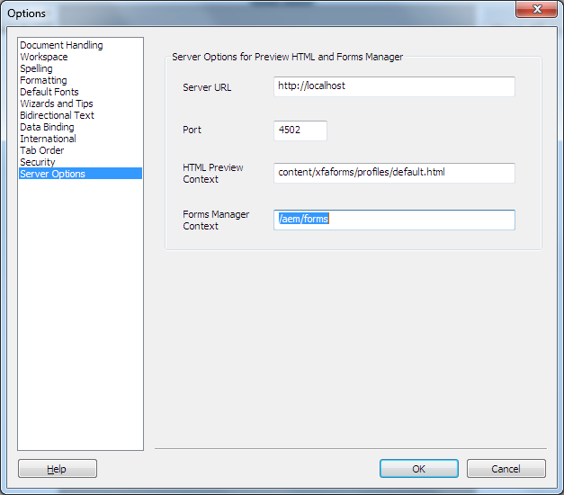

# Generar previsualización HTML5 de un formulario XDP{#generate-html-preview-of-an-xdp-form}

: la funcionalidad HTML5 Forms se ofrece como parte del programa de acceso anticipado. Para solicitar acceso, envíe un correo electrónico con el ID de correo electrónico oficial (de trabajo) a aem-forms-ea@adobe.com.

Al diseñar un formulario en AEM Forms Designer, además de obtener una vista previa de la representación de un formulario en PDF, también se puede obtener una vista previa de la representación de un formulario en HTML5. Puede usar la pestaña **Vista previa de HTML** para obtener una vista previa del formulario tal como aparecería en un explorador.

## Habilitar la vista previa HTML para formularios XDP en Designer {#html-preview-of-forms-in-forms-designer}

Para permitir que Designer genere una vista previa HTML de los formularios XDP, realice las siguientes configuraciones:

* Configure el servicio de autenticación de Apache Sling
* Desactive el modo protegido.
* Proporcionar los detalles del servidor de AEM Forms

### Configure el servicio de autenticación de Apache Sling {#configure-apache-sling-authentication-service}

1. Vaya a `https://'[server]:[port]'/system/console/configMgr` si ejecuta AEM Forms en OSGi, o
   a `https://'[server]:[port]'/lc/system/console/configMgr` si ejecuta AEM Forms en JEE.
1. Busque y haga clic en **Servicio de autenticación de Apache Sling** para abrirlo en el modo de edición.

1. Dependiendo de si está ejecutando AEM Forms en OSGi o JEE, agregue lo siguiente en el campo **Requisitos de autenticación**:

   * AEM Forms en JEE

      * -/content/xfaforms
      * -/etc/clientlibs

   * AEM Forms en OSGi

      * -/content/xfaforms
      * -/etc/clientlibs/fd/xfaforms

   >[!NOTE]
   >
   >No copie y pegue el valor especificado en el campo Requisitos de autenticación, ya que podría corromper los caracteres especiales del valor. En su lugar, escriba el valor especificado en el campo.

1. Especifique un nombre de usuario y una contraseña en los campos **[!UICONTROL Nombre de usuario anónimo]** y **[!UICONTROL Contraseña de usuario anónimo]**, respectivamente. Las credenciales especificadas se utilizan para gestionar la autenticación anónima y permitir el acceso a usuarios anónimos.
1. Haga clic en **Guardar** para guardar la configuración.

### Desactivación del modo protegido {#disable-protected-mode}

El **modo protegido** está activado de forma predeterminada. Manténgalo activado para los entornos de producción. Puede desactivarlo para un entorno de desarrollo para previsualizar formularios HTML5 en Designer. Siga los siguientes pasos para desactivarlo:

1. Inicie sesión en la consola web de AEM como administrador.

   * La URL de AEM Forms en OSGi es `https://'[server]:[port]'/system/console/configMgr`
   * La URL de AEM Forms en JEE es `https://'[server]:[port]'/lc/system/console/configMgr`

1. Abra **[!UICONTROL Configuraciones de Mobile Forms]** para editarlas.
1. Anule la selección de la opción **[!UICONTROL Modo protegido]** y haga clic en **[!UICONTROL Guardar]**.

### Proporcionar los detalles del servidor de AEM Forms {#provide-details-of-aem-forms-server}

1. En Designer, vaya a **Herramientas** > **Opciones**.
1. En la ventana Opciones, seleccione **Opciones del servidor**, proporcione los siguientes detalles y haga clic en **Aceptar**.

   * **URL del servidor**: la URL del servidor de AEM Forms.

   * **Número de puerto HTTP**: el puerto del servidor de AEM. El valor predeterminado es 4502.
   * **Contexto de la vista previa HTML:** la ruta del perfil para procesar formularios XFA. Los siguientes perfiles predeterminados se utilizan para obtener una vista previa del formulario en Designer. Sin embargo, también puede especificar la ruta a un perfil personalizado.

      * `/content/xfaforms/profiles/default.html` (AEM Forms en OSGi)

      * `/lc/content/xfaforms/profiles/default.html` (AEM Forms en JEE)

   * **Contexto de Forms Manager:** la ruta del contexto en el que se implementa la interfaz de usuario de Forms Manager. Los valores predeterminados son:

      * `/aem/forms` (AEM Forms en OSGi)
      * `/lc/forms` (AEM Forms en JEE)

   >[!NOTE]
   >
   >Asegúrese de que el servidor de AEM Forms esté operativo. La vista previa HTML conecta con el servidor CRX para *generar* una vista previa.

   

   Opciones de AEM Forms Designer

1. Para obtener una vista previa de un formulario en HTML, haga clic en a pestaña **Vista previa HTML**.

   >[!NOTE]
   >
   >
   >
   >
   >    * Si la pestaña Vista previa HTML está cerrada, pulse F4 para abrirla. También puede seleccionar la opción Vista previa HTML en el menú Ver para abrir la pestaña Vista previa HTML.
   >    * La vista previa HTML no admite documentos PDF; únicamente permite visualizar documentos XDP.
   >
   >

   >[!CAUTION]
   >
   >Para probar la experiencia real del usuario final, visualice una vista previa de los formularios en exploradores externos (Google Chrome, Microsoft Edge, Mozilla Firefox, etc.). Cada explorador utiliza un motor independiente para procesar HTML, por lo que puede haber algunas diferencias entre la vista previa de un formulario en Designer y en el explorador externo.

## Obtener una vista previa de un formulario mediante datos de muestra {#to-preview-a-form-using-sample-data}

Designer permite obtener una vista previa y probar el formulario con datos XML de ejemplo. Se recomienda probar el formulario con frecuencia con datos de ejemplo para asegurarse de que el formulario se procesa correctamente.

Si no tiene datos de ejemplo, Designer puede crearlos o puede crearlos usted mismo. (Ver [Para generar automáticamente datos de ejemplo y obtener una vista previa del formulario](https://help.adobe.com/en_US/AEMForms/6.1/DesignerHelp/WS107c29ade9134a2c136ae6f212a1f379c94-8000.2.html#WS92d06802c76abadb-728f46ac129b395660c-7efe.2) y [Para crear datos de ejemplo y obtener una vista previa del formulario](https://help.adobe.com/en_US/AEMForms/6.1/DesignerHelp/WS107c29ade9134a2c136ae6f212a1f379c94-8000.2.html#WS92d06802c76abadb-728f46ac129b395660c-7eff.2).)

La prueba del formulario mediante una fuente de datos de ejemplo garantiza que los datos y los campos se asignen y que los subformularios repetibles se repitan como se esperaba. Puede crear un diseño de formulario equilibrado que proporcione el espacio adecuado para que cada objeto muestre los datos combinados.

1. Seleccione **Archivo > Propiedades del formulario**.

1. Haga clic en la pestaña **Vista previa** y, en el cuadro Archivo de datos, escriba la ruta completa del archivo de datos de prueba. También puede utilizar el botón Examinar para desplazarse hasta el archivo.

1. Haga clic en **Aceptar**. La próxima vez que obtenga una vista previa del formulario mediante la pestaña **Vista previa HTML**, aparecerán los valores de datos del archivo XML de ejemplo en los objetos correspondientes.

## Vista previa de formularios en un repositorio {#html-preview-of-forms-in-forms-manager}

En AEM Forms, puede obtener una vista previa de los formularios y documentos de un repositorio. La vista previa permite saber exactamente qué aspecto tienen los formularios y cómo se comportan cuando los utilizan los usuarios finales.
