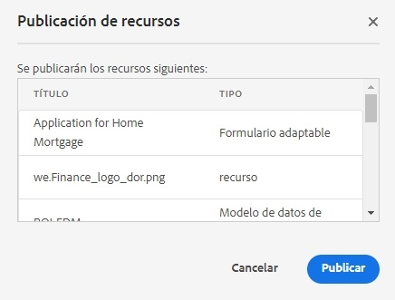
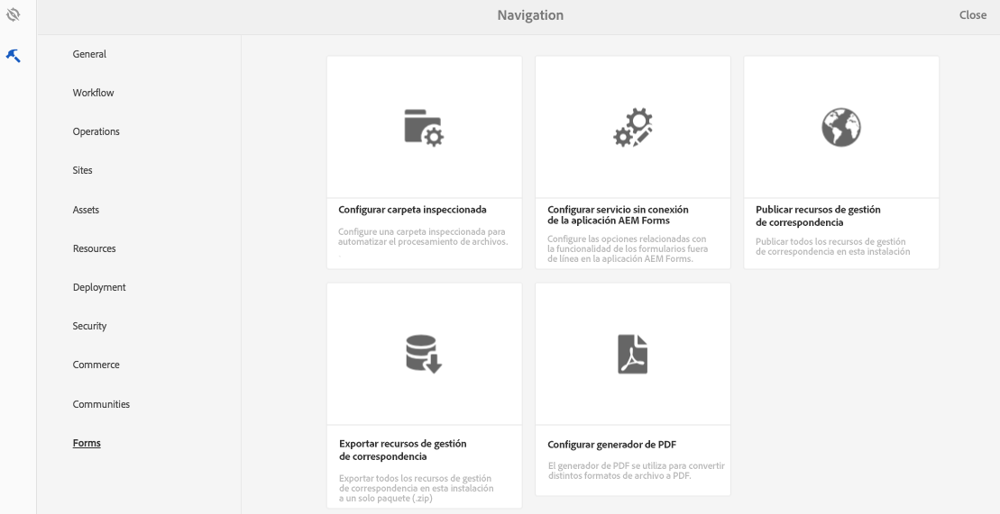
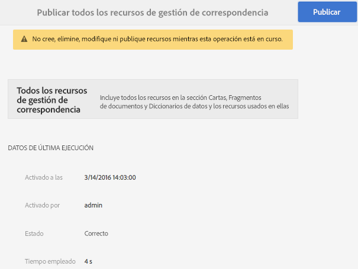

# Publicar y cancelar la publicación de formularios y documentos{#publishing-and-unpublishing-forms-and-documents}

[!DNL AEM Forms] le permite crear, publicar y cancelar la publicación de formularios fácilmente. El servidor de [!DNL AEM Forms] ofrece dos instancias: Autor y Publicar. La instancia de autor se utiliza para crear y administrar recursos y recursos de formulario. La instancia Publicar sirve para mantener los recursos y recursos relacionados disponibles para los usuarios finales.

## Recursos compatibles {#supported-assets-nbsp}

[!DNL AEM Forms] es compatible con los siguientes tipos de recursos:

* Formularios adaptables
* Documentos adaptables
* Fragmentos de formulario adaptable
* Temáticas
* Plantillas de formulario <!-- (XFA forms) -->
* PDF forms
* Documento (documentos PDF planos)
* Conjuntos de formularios
* Recurso (imágenes, esquemas y hojas de estilo)

Inicialmente, todos los recursos están disponibles solo en la instancia de autor. Un administrador o un autor de formularios pueden publicar todos los recursos excepto los recursos.

Al seleccionar un formulario y publicarlo, también se publican sus recursos y recursos relacionados. Con todo, los recursos dependientes no se publican. En este contexto, los recursos y recursos relacionados son recursos que un recursos publicado utiliza o a los que hace referencia. Los recursos dependientes son recursos que hacen referencia a un recurso publicado.

Sus formularios adaptables pueden utilizar algunas configuraciones, ajustes y personalizaciones que no se publican automáticamente. Se recomienda publicar o activar estos recursos antes de publicar un formulario adaptable.

* Plantillas de formulario adaptable editables
* Configuraciones del Cloud Service para Adobe Sign, Typekit, reCAPTCHA y el modelo de datos de formulario (FDM)
* Otras configuraciones de Cloud Services solo se activan si el usuario tiene permisos de administrador.
* Personalizaciones. Entre ellas se incluyen, entre otras:

   * Diseños personalizados
   * Aspectos personalizados
   * Archivo CSS: Tomado como entrada en el cuadro de diálogo Propiedades del contenedor del formulario adaptable
   * Categoría de biblioteca de cliente: Tomado como entrada en el cuadro de diálogo Propiedades del contenedor del formulario adaptable
   * Cualquier otra biblioteca de cliente que se pueda incluir como parte de la plantilla del formulario adaptable.
   * Rutas de diseño

## Estados de los recursos {#asset-states}

Un recurso puede tener los siguientes estados:

* **Publicación cancelada:** Un recurso que nunca se ha publicado (el estado Publicación cancelada solo es aplicable a los recursos de Forms. Los recursos de Administración de correspondencia no tienen un estado Publicación cancelada).
* **Publicado**: Un recurso que se ha publicado y está disponible en la instancia Publicar
* **Modificado**: Un recurso que se modifica después de publicarse

## Publicar un recurso {#publish-an-asset}

1. Inicie sesión en el servidor de [!DNL AEM Forms].
1. Utilice una de las siguientes opciones para seleccionar y publicar un recurso.

   1. Mueve el puntero sobre un recurso y selecciona **[!UICONTROL Publicar]** .
   1. Realiza una de las siguientes acciones y, a continuación, selecciona Publicar:

      * Si está en la vista de tarjeta, selecciona **[!UICONTROL Introducir selección]**  y selecciona el recurso. Se selecciona el recurso.
      * Si está en la vista de lista, seleccione la casilla de verificación de un recurso. Se selecciona el recurso.
      * Seleccione un recurso para mostrar sus detalles.
      * Muestre las propiedades de un recurso al pulsar Ver propiedades .

      >[!NOTE]
      >
      >No seleccione varios recursos. No se pueden publicar varios recursos a la vez.

1. Cuando se inicia el proceso Publicar, aparece un cuadro de diálogo de confirmación con todos los recursos y recursos relacionados. En el cuadro de diálogo que contiene los recursos relacionados, selecciona **[!UICONTROL Publicar]**. El recurso se publica y aparece el cuadro de diálogo Éxito al publicar recursos.

   >[!NOTE]
   >
   >Para los formularios adaptables, junto con los recursos relacionados, también se muestra el nombre de la página del formulario adaptable.

   

   Un cuadro de diálogo de confirmación con todos los recursos y recursos relacionados.

   >[!NOTE]
   >
   >En Forms Manager, si el usuario no tiene permiso para publicar los recursos de la lista, la acción Publicar está desactivada. Un recurso que requiere permisos adicionales se muestra en rojo.

   Una vez publicado un recurso, las propiedades de metadatos del recurso se copian en la instancia Publicar y el estado del recurso se cambia a Publicado. El estado de los recursos dependientes publicados también se cambia a Publicado.

   <!-- After publishing an asset, you can use the Forms Portal to display all the assets on a web page. For more information, see [Introduction to publishing forms on a portal](introduction-publishing-forms.md).-->

## Publicar todos los recursos de administración de correspondencia {#publish-all-the-correspondence-management-assets}

[!DNL AEM Forms] le permite publicar todos los recursos de administración de correspondencia en un servidor de una sola vez. Los recursos publicados incluyen todos los recursos de administración de correspondencia y las dependencias relacionadas.

Complete los siguientes pasos para publicar todos los recursos de administración de correspondencia en un servidor:

1. Inicie sesión en el servidor de [!DNL AEM Forms].
1. Selecciona **Adobe Experience Manager** en la barra de navegación global.
1. Selecciona  y luego **Formularios**.
1. Selecciona **Publicar los recursos de administración de correspondencia**.

   

   Aparecerá la página Publicar todos los recursos de administración de correspondencia y se mostrará la información sobre la última vez que se intentó el proceso de Publicar recursos de administración de correspondencia.

   

1. Selecciona **Publicar** y, en el mensaje de confirmación, selecciona **OK**.

   Una vez completado un proceso por lotes, puede ver los detalles de la última ejecución. Incluye información como el inicio de sesión del administrador y si el lote se ejecuta correctamente o no.

   >[!NOTE]
   >
   >El proceso de publicación no se puede cancelar una vez iniciado. Además, mientras la operación Publicar está en curso, no cree, elimine, modifique ni publique ningún recurso ni inicie la operación Exportar todos los recursos de administración de correspondencia.

## Automatizar la publicación y cancelación de publicación para formularios y documentos {#automate-publishing-and-unpublishing-for-forms-amp-documents}

[!DNL AEM Forms] le permite programar la publicación y cancelación de publicación de recursos para formularios y documentos. Puede especificar la programación en el Editor de metadatos. Para obtener más información sobre la administración de metadatos de formularios, consulte [Administrar metadatos de formulario.](manage-form-metadata.md)

Siga estos pasos para programar la fecha y la hora de publicación y cancelación de la publicación de recursos de formularios y documentos:

1. Selecciona un recurso y selecciona **[!UICONTROL Ver propiedades]**. Se abre la página Propiedades de metadatos.
1. En la página Propiedades de metadatos, selecciona **[!UICONTROL Avanzado]** y, a continuación, selecciona **[!UICONTROL Editar]** .
1. En los campos **[!UICONTROL Tiempo de actividad de publicación]** y **[!UICONTROL Tiempo de inactividad de la publicación]** seleccione la fecha y la hora.\
   Selecciona **[!UICONTROL Listo]** .

## Cancelar la publicación de un recurso {#unpublish-an-asset}

1. Selecciona un recurso publicado y selecciona **[!UICONTROL Cancelar la publicación]** .
1. Utilice una de las siguientes opciones para seleccionar y cancelar la publicación de un recurso.

   1. Mueve el puntero sobre un recurso y selecciona **[!UICONTROL Cancelar la publicación]** .
   1. Realiza una de las siguientes acciones y, a continuación, selecciona Cancelar la publicación:

      * Si estás en la vista de tarjeta, selecciona **[!UICONTROL Introducir selección]**  y selecciona el recurso. Se selecciona el recurso.

      * Si está en la vista de lista, pasa el puntero sobre un recurso y selecciona . Se selecciona el recurso.

      * Seleccione un recurso para mostrar sus detalles.
      * Muestre las propiedades de un recurso al pulsar Ver propiedades .

1. Cuando se inicia el proceso Cancelar la publicación, aparece un cuadro de diálogo de confirmación. Seleccione **[!UICONTROL Cancelar la publicación]**.

   >[!NOTE]
   >
   >Solo se cancela la publicación del recurso seleccionado, y respecto a sus recursos secundarios y referenciados, de haber, no se cancela su publicación.

## Revertir un recurso o una carta a la versión publicada anteriormente {#revert-an-asset-or-letter-to-the-previously-published-version}

Cada vez que publica un recurso o una carta después de su edición, se crea una versión del recurso o la carta. Puede revertir un recurso o una carta a la versión publicada anteriormente. Puede que tenga que hacerlo si algo sale mal con la versión actual del recurso o documento.

>[!NOTE]
>
>No revierta una carta a un estado de última publicación si se elimina del sistema cualquier recurso dependiente utilizado en esa carta publicada.

1. Selecciona un recurso y selecciona **[!UICONTROL Revertir a la versión publicada anteriormente]** .
1. Antes de revertir el recurso, aparece un cuadro de diálogo de confirmación. Selecciona **[!UICONTROL Revertir]**.

   El recurso o la carta vuelven a su versión publicada anteriormente.

## Eliminar un recurso {#delete-an-asset}

>[!NOTE]
>
>Al eliminar un recurso, se elimina de la instancia de publicación. Al eliminar un recurso, también se elimina su historial de versiones, excepto la versión base.

1. Selecciona un recurso y seleccione **[!UICONTROL Eliminar]** .

   >[!NOTE]
   >
   >La opción Eliminar también está disponible cuando muestra los detalles del recurso al pulsar en un recurso o mostrando las propiedades de un recurso al pulsar Ver propiedades .

1. Antes de eliminar el recurso, aparece un cuadro de diálogo de confirmación. Seleccione **[!UICONTROL Eliminar]**.

   >[!NOTE]
   >
   >Solo se elimina el recurso seleccionado, y los recursos dependientes no se eliminan. Para comprobar las referencias de un recurso, selecciona  y, a continuación, selecciona un recurso.
   >
   >
   >Si el recurso que trata de eliminar es un recurso secundario de otro recurso, no se elimina. Para eliminar un recurso de este tipo, quite las referencias de este recurso de otros recursos y reinténtelo.

## Formularios adaptables protegidos {#protected-adaptive-forms}

Puede habilitar la autenticación para los formularios a los que desea que accedan determinados usuarios. Cuando habilita la autenticación en sus formularios, los usuarios ven una pantalla de inicio de sesión antes de acceder a ellos. Solo los usuarios con credenciales autorizadas pueden acceder a los formularios.

Para habilitar la autenticación para sus formularios:

1. En su explorador, abra configMgr en la instancia de publicación.\
   URL: `https://<hostname>:<PublishPort>/system/console/configMgr`

1. En la configuración de la consola web de Adobe Experience Manager, haga clic en **Servicio de autenticación de Apache Sling** para configurarlo.
1. En el cuadro de diálogo Servicio de autenticación de Apache Sling que aparece, utilice el botón **+** para agregar rutas.\
   Cuando se añade una ruta, el servicio de autenticación se habilita para los formularios de esa ruta.
