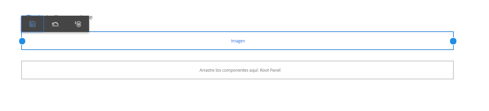
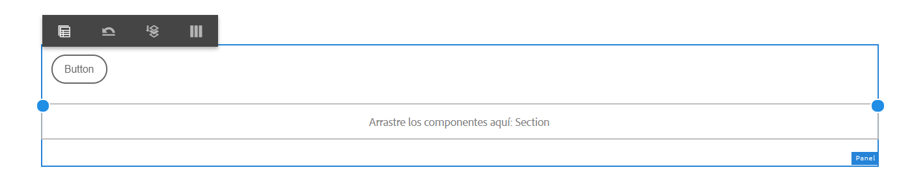
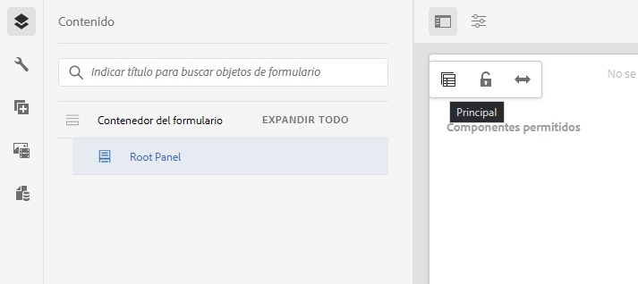

# Usar el modo Diseño para cambiar el tamaño de los componentes para Forms adaptable {#use-layout-mode-to-resize-components}

 Adobe recomienda utilizar la captura de datos moderna y ampliable [Componentes principales](https://experienceleague.adobe.com/docs/experience-manager-core-components/using/adaptive-forms/introduction.html?lang=es) para [crear un nuevo Forms adaptable](/help/forms/creating-adaptive-form-core-components.md) o [adición de Forms adaptable a páginas de AEM Sites](/help/forms/create-or-add-an-adaptive-form-to-aem-sites-page.md). Estos componentes representan un avance significativo en la creación de Forms adaptable, lo que garantiza experiencias de usuario impresionantes. Este artículo describe un enfoque más antiguo para crear Forms adaptable mediante componentes de base. 

| Versión | Vínculo del artículo |
| -------- | ---------------------------- |
| AEM 6.5 | [Haga clic aquí](https://experienceleague.adobe.com/docs/experience-manager-65/forms/adaptive-forms-basic-authoring/resize-using-layout-mode.html) |
| AEM as a Cloud Service | Este artículo |

La interfaz de creación de formularios adaptables le permite cambiar el tamaño de los componentes mediante el modo Diseño. Arrastre los puntos azules dentro de las columnas para definir los puntos iniciales y finales para colocar los componentes. Aparecen puntos azules tras pulsar el componente en la cuadrícula adaptable. La cuadrícula adaptable consta de 12 columnas iguales. El sombreado de color blanco y azul en las columnas alternativas diferencia una columna de la otra.

Puede utilizar el modo Diseño para cambiar el tamaño de los componentes de todos los tipos de dispositivos, como escritorio, tableta, teléfono y otros dispositivos más pequeños. La tableta deriva automáticamente la configuración del diseño de la versión de escritorio y los dispositivos más pequeños derivan la configuración del diseño del teléfono. Con todo, puede anular las configuraciones derivadas automáticamente para definir una configuración diferente para cada tipo de dispositivo.

## Acceder al modo Diseño {#access-layout-mode}

Seleccione **[!UICONTROL Diseño]** en la lista desplegable que aparece en la parte superior de la interfaz de creación de formularios adaptables junto a la opción **[!UICONTROL Vista previa]**. El formulario se muestra en el modo Diseño.

1. Inicie sesión en la instancia de autor de [!DNL Adobe Experience Manager], vaya a **[!UICONTROL Adobe Experience Manager]** > **[!UICONTROL Formularios]** > **[!UICONTROL Formularios y documentos]**.
1. Cree un nuevo [formulario adaptable](creating-adaptive-form.md) o abra uno existente.
1. Seleccione **[!UICONTROL Diseño]** en la lista desplegable que aparece en la parte superior junto a la opción **[!UICONTROL Vista previa]**. El formulario se muestra en el modo Diseño.

   

## Cambiar el tamaño de los componentes {#resize-components}

1. En el modo Diseño, pulse en el componente para cambiar su tamaño. Los puntos azules se muestran al principio y al final de la cuadrícula adaptable.
1. Arrastre y suelte los puntos azules para definir la posición del componente en la cuadrícula adaptable.

   

   La barra de herramientas que se muestra después de pulsar los componentes consta de las siguientes opciones:

   * **[!UICONTROL Principal]**: Seleccione el elemento principal de un componente.
   * **[!UICONTROL Revertir diseño de punto de interrupción]**: Deshacer todos los cambios de tamaño y aplicar el diseño predeterminado al componente.
   * **[!UICONTROL Flotar a una línea nueva]**: Mover el componente a la línea siguiente si hay varios componentes dentro de la misma línea.

   También puede usar la opción **[!UICONTROL Revertir diseño de punto de interrupción]** () en el nivel de panel para deshacer todos los cambios de tamaño.

   >[!NOTE]
   >
   >No puede cambiar el tamaño de los componentes de la columna de tabla, barra de herramientas, botón de barra de herramientas y área de destino con el modo Diseño. Utilice el modo Estilo para cambiar el tamaño de estos componentes.

### Ejemplo {#example}

**Objetivo:** Desea insertar un componente de tabla y un componente de imagen y colocarlos en paralelo en un formulario adaptable.

1. Inserte los componentes de tabla e imagen con el modo [!UICONTROL Editar] en el formulario adaptable. El componente de imagen se muestra después del componente de tabla.
1. Cambie al modo [!UICONTROL Diseño] y pulse el componente [!UICONTROL Tabla]. Los puntos azules para cambiar el tamaño del componente se muestran en las columnas 1 y 12.
1. Arrastre el punto azul en la columna 12 a la columna 6 de la cuadrícula adaptable.

   

1. De forma similar, seleccione el componente [!UICONTROL Imagen] y arrastre el punto azul en la columna 1 a la columna 7 de la cuadrícula adaptable. Los componentes de tabla e imagen se muestran paralelos entre sí.

   

   Puede seleccionar el componente Imagen y pulsar la opción **[!UICONTROL Flotar a una línea nueva]**, disponible en la barra de herramientas para cambiar el componente Imagen a la línea siguiente.

## Cambiar el tamaño de los paneles {#resize-panels-layout-mode}

Ejecute los siguientes pasos si desea cambiar el tamaño de todo el panel en lugar de componentes individuales:

1. Pulse cualquiera de los componentes del panel cuyo tamaño desee cambiar, elija  y seleccione la primera opción de la lista desplegable, si el panel es el elemento principal inmediato del componente.

   Los puntos azules se muestran al principio y al final de la cuadrícula adaptable.

1. Arrastre y suelte los puntos azules para definir la posición del panel en la cuadrícula adaptable. Puede repetir los pasos 1 y 2 y seleccionar  para desplazar el panel cuyo tamaño se ha cambiado a la línea siguiente.

## Definir el diseño de varias columnas para un panel

Ejecute los siguientes pasos para definir el número de columnas para un panel:

1. En el modo **[!UICONTROL Editar]**, pulse el panel, seleccione  luego la opción **[!UICONTROL Adaptable: Todo lo que hay en la página sin navegación]** de la lista desplegable **[!UICONTROL Diseño del panel]**.

1. Pulse  para guardar las propiedades.

1. En el modo **[!UICONTROL Diseño]**, pulse cualquiera de los componentes del panel y elija  y seleccione el panel.

1. Pulse  y seleccione el número de columnas de la lista desplegable. El número de columnas puede oscilar entre 1 y 12. El panel se divide en un diseño de varias columnas.

## Habilitar la nueva cuadrícula adaptable para los diseños adaptables antiguos {#enableresponsivegrid}

Habilite la nueva cuadrícula adaptable para los formularios que cree mediante [!DNL Adobe Experience Manager] Forms 6.4 o una versión inferior para cambiar el tamaño de los componentes.

>[!NOTE]
>
>Al cambiar a la nueva cuadrícula adaptable, se descartarán las propiedades de diseño ya definidas para los componentes utilizados en el formulario.

Realice los siguientes pasos para habilitar la nueva cuadrícula adaptable:

1. Seleccione **[!UICONTROL Diseño]** en la lista desplegable que aparece en la parte superior junto a la opción **[!UICONTROL Vista previa]**. Aparece una confirmación para habilitar el modo Diseño.
1. Pulse **[!UICONTROL Sí]** para habilitar el modo **[!UICONTROL Diseño]** para el formulario.

### Integrar un fragmento antiguo en un formulario adaptable con un nuevo diseño adaptable {#embed-an-old-fragment-in-an-adaptive-form-with-new-responsive-layout}

El nuevo diseño adaptable del formulario adaptable le permite agregar un fragmento de formulario adaptable con el diseño antiguo al formulario. Con todo, el nuevo diseño descarta las propiedades de diseño ya definidas para los componentes utilizados en el fragmento. Puede cambiar al modo Diseño para definir las propiedades de diseño de los componentes utilizados en el fragmento.

### Integrar un fragmento con un nuevo diseño adaptable en un antiguo formulario adaptable {#embed-a-fragment-with-new-responsive-layout-in-an-old-adaptive-form}

Si integra un fragmento con el nuevo diseño adaptable en un formulario adaptable con un diseño adaptable antiguo, el sistema le indicará que habilite el modo Diseño para el formulario y vuelva a integrar el fragmento.

Para habilitar el modo Diseño, seleccione **[!UICONTROL Diseño]** en la lista desplegable que aparece en la parte superior junto a la opción **[!UICONTROL Vista previa]** y pulse **[!UICONTROL Sí]** para confirmar. Seleccione el modo **[!UICONTROL Editar]** para volver a integrar el fragmento.

## Desactivar el modo Diseño para formularios con un diseño adaptable antiguo {#disable-layout-mode-for-forms-with-old-responsive-layout}

Puede desactivar el modo Diseño para formularios con un diseño adaptable antiguo editando las propiedades de la plantilla utilizada en el formulario.

Siga estos pasos para desactivar el modo Diseño:

1. Seleccione **[!UICONTROL Herramientas]** > **[!UICONTROL General]** > **[!UICONTROL Plantillas]** y abra la plantilla utilizada en el formulario en el modo **[!UICONTROL Editar]**.
1. Seleccione el contenedor del formulario en el panel izquierdo y pulse **[!UICONTROL Directiva]**.

   

1. Pulse la pestaña **[!UICONTROL Configuración de diseño]** y seleccione **[!UICONTROL Desactivar el modo Diseño]**.
1. Pulse  para guardar las propiedades de la plantilla.
