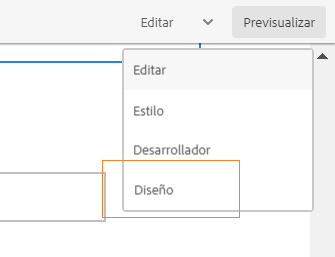

# Uso del modo Diseño para cambiar el tamaño de los componentes {#use-layout-mode-to-resize-components}

La interfaz de creación de formularios adaptables permite cambiar el tamaño de los componentes mediante el modo Diseño . Arrastre los puntos azules dentro de las columnas para definir los puntos iniciales y finales para colocar los componentes. Los puntos azules se muestran después de pulsar el componente en la cuadrícula interactiva. La cuadrícula interactiva consta de 12 columnas iguales. El sombreado de color blanco y azul en las columnas alternativas diferencia una columna de la otra.

Puede utilizar el modo Diseño para cambiar el tamaño de los componentes de todos los tipos de dispositivos, como escritorio, tableta, teléfono y otros dispositivos más pequeños. La tableta deriva automáticamente la configuración del diseño de la versión de escritorio y los dispositivos más pequeños derivan la configuración del diseño del teléfono. Sin embargo, puede anular las configuraciones derivadas automáticamente para definir una configuración diferente para cada tipo de dispositivo.

## Acceso al modo Diseño {#access-layout-mode}

Select **[!UICONTROL Diseño]** en la lista desplegable que aparece en la parte superior de la interfaz de creación de formularios adaptables junto a la **[!UICONTROL Vista previa]** . El formulario se muestra en el modo Diseño.

1. Inicie sesión en la [!DNL Adobe Experience Manager] instancia de autor y vaya a **[!UICONTROL Adobe Experience Manager]** > **[!UICONTROL Forms]** > **[!UICONTROL Forms y documentos]**.
1. Crear una nueva o abrir una [Formulario adaptable](creating-adaptive-form.md).
1. Select **[!UICONTROL Diseño]** en la lista desplegable que aparece en la parte superior junto a la **[!UICONTROL Vista previa]** . El formulario se muestra en el modo Diseño.

   

## Cambiar el tamaño de los componentes {#resize-components}

1. En el modo Diseño , pulse el componente para cambiar su tamaño. Los puntos azules se muestran al principio y al final de la cuadrícula interactiva.
1. Arrastre y suelte los puntos azules para definir la posición del componente en la cuadrícula interactiva.

   

   La barra de herramientas que se muestra después de pulsar los componentes consta de las siguientes opciones:

   * **[!UICONTROL Principal]**: Seleccione el elemento principal de un componente.
   * **[!UICONTROL Revertir diseño de punto de interrupción]**: Deshacer todos los cambios de tamaño y aplicar el diseño predeterminado al componente.
   * **[!UICONTROL Flotar a una línea nueva]**: Mueva el componente a la línea siguiente si hay varios componentes dentro de la misma línea.

   También puede usar la variable **[!UICONTROL Revertir diseño de punto de interrupción]** ( ) en el nivel de panel para deshacer todos los cambios de cambio de tamaño.

   >[!NOTE]
   >
   >No se puede cambiar el tamaño de los componentes de columna de tabla, barra de herramientas, botón de barra de herramientas y área de destino mediante el modo Diseño . Utilice el modo Estilo para cambiar el tamaño de estos componentes.

### Ejemplo {#example}

**Objetivo:** Desea insertar un componente de tabla y un componente de imagen y colocarlos en paralelo en un formulario adaptable.

1. Insertar los componentes de tabla e imagen mediante [!UICONTROL Editar] en el formulario adaptable. El componente de imagen se muestra después del componente de tabla.
1. Cambie a [!UICONTROL Diseño] y toque el [!UICONTROL Tabla] componente. Los puntos azules para cambiar el tamaño de la visualización del componente en las columnas 1 y 12.
1. Arrastre el punto azul en la columna 12 a la columna 6 de la cuadrícula interactiva.

   

1. Del mismo modo, seleccione la [!UICONTROL Imagen] y arrastre el punto azul en la columna 1 a la columna 7 de la cuadrícula interactiva. Los componentes de tabla e imagen se muestran paralelos entre sí.

   

   Puede seleccionar el componente Imagen y pulsar el botón **[!UICONTROL Flotar a una línea nueva]** disponible en la barra de herramientas para cambiar el componente Imagen a la línea siguiente.

## Cambiar el tamaño de los paneles {#resize-panels-layout-mode}

Ejecute los siguientes pasos si desea cambiar el tamaño de todo el panel en lugar de componentes individuales:

1. Pulse cualquiera de los componentes del panel cuyo tamaño desee cambiar. y seleccione la primera opción de la lista desplegable, si el panel es el elemento principal inmediato del componente.

   Los puntos azules se muestran al principio y al final de la cuadrícula interactiva.

1. Arrastre y suelte los puntos azules para definir la posición del panel en la cuadrícula interactiva.
Puede repetir los pasos 1 y 2 y seleccionar  para desplazar el panel cambiado a la línea siguiente.

## Definición del diseño de varias columnas para un panel

Ejecute los siguientes pasos para definir el número de columnas para un panel:

1. En **[!UICONTROL Editar]** , pulse el panel y seleccione y seleccione **[!UICONTROL Responsable: todo lo que hay en la página sin navegación]** de la **[!UICONTROL Diseño de panel]** lista desplegable.

1. Toque  para guardar las propiedades.

1. En el **[!UICONTROL Diseño]** , pulse cualquiera de los componentes del panel y seleccione y seleccione el panel .

1. Toque  y seleccione el número de columnas de la lista desplegable. El número de columnas puede oscilar entre 1 y 12. El panel se divide en un diseño de varias columnas.

## Habilitar la nueva cuadrícula adaptable para los diseños interactivos antiguos {#enableresponsivegrid}

Habilite la nueva cuadrícula adaptable para los formularios que cree mediante [!DNL Adobe Experience Manager] Forms 6.4 o versión inferior para cambiar el tamaño de los componentes.

>[!NOTE]
>
>Si se cambia a la nueva cuadrícula adaptable, se descartarán las propiedades de diseño ya definidas para los componentes utilizados en el formulario.

Realice los siguientes pasos para habilitar la nueva cuadrícula adaptable:

1. Select **[!UICONTROL Diseño]** en la lista desplegable que aparece en la parte superior junto a la **[!UICONTROL Vista previa]** . Aparece una confirmación para habilitar el modo Diseño .
1. Toque **[!UICONTROL Sí]** para habilitar la variable **[!UICONTROL Diseño]** para el formulario.

### Incrustar un fragmento antiguo en un formulario adaptable con una nueva presentación adaptable {#embed-an-old-fragment-in-an-adaptive-form-with-new-responsive-layout}

El nuevo diseño interactivo del formulario adaptable le permite agregar un fragmento de formulario adaptable con el antiguo diseño interactivo al formulario. Sin embargo, el nuevo diseño descarta las propiedades de diseño ya definidas para los componentes utilizados en el fragmento. Puede cambiar al modo Diseño para definir las propiedades de diseño de los componentes utilizados en el fragmento.

### Incrustar un fragmento con un nuevo diseño interactivo en un antiguo formulario adaptable {#embed-a-fragment-with-new-responsive-layout-in-an-old-adaptive-form}

Si incrusta un fragmento con la nueva presentación adaptable en un formulario adaptable con una presentación interactiva antigua, el sistema le indicará que habilite el modo Diseño para el formulario y vuelva a incrustar el fragmento.

Para activar el modo Diseño, seleccione **[!UICONTROL Diseño]** en la lista desplegable que aparece en la parte superior junto a la **[!UICONTROL Vista previa]** pulsar y seleccionar **[!UICONTROL Sí]** para confirmar. Select **[!UICONTROL Editar]** para volver a incrustar el fragmento.

## Desactivar el modo Diseño para formularios con presentación interactiva antigua {#disable-layout-mode-for-forms-with-old-responsive-layout}

Puede deshabilitar el modo Diseño para formularios con presentación interactiva antigua editando las propiedades de la plantilla utilizada en el formulario.

Siga estos pasos para desactivar el modo Diseño :

1. Select **[!UICONTROL Herramientas]** > **[!UICONTROL General]** > **[!UICONTROL Plantillas]** y abra la plantilla utilizada en el formulario en **[!UICONTROL Editar]** en el menú contextual.
1. Seleccione el contenedor de formulario en el panel izquierdo y pulse **[!UICONTROL Política.]**

   

1. Toque . **[!UICONTROL Configuración de diseño]** y seleccione **[!UICONTROL Deshabilitar modo de diseño]**.
1. Toque  para guardar las propiedades de la plantilla.
