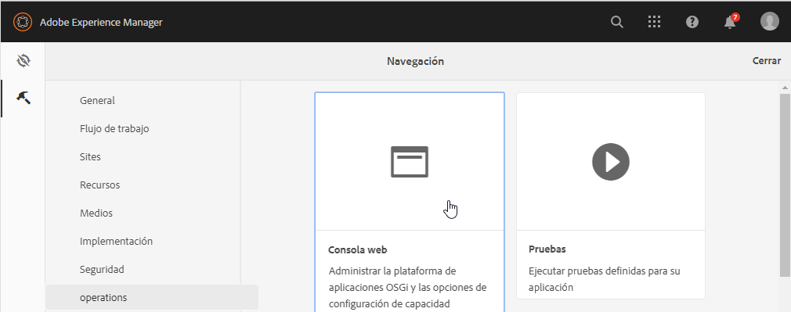
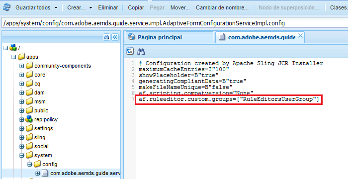

# Conceder acceso al Editor de reglas a determinados grupos de usuarios {#grant-rule-editor-access-to-select-user-groups}

## Información general {#overview}

Existen diferentes tipos de usuarios con diversas habilidades que trabajan con formularios adaptables. Aunque es posible que los usuarios expertos tengan los conocimientos necesarios para trabajar con scripts y reglas complejas, puede haber usuarios de nivel básico que únicamente necesiten trabajar con el diseño y las propiedades básicas de los formularios adaptables.

[!DNL Experience Manager Forms] permite limitar el acceso de los usuarios al Editor de reglas en función de su rol o función. En los ajustes del servicio de configuración de los formularios adaptables, puede especificar los [grupos de usuarios](forms-groups-privileges-tasks.md) que pueden ver y acceder al Editor de reglas.

## Especificar qué grupos de usuarios pueden acceder al Editor de reglas {#specify-user-groups-that-can-access-rule-editor}

1. Inicie sesión en [!DNL Experience Manager Forms] como administrador.
1. En la instancia de autor, haga clic en  Adobe Experience Manager > Herramientas  > **[!UICONTROL Operaciones]** > **[!UICONTROL Consola web]**. La consola web se abre en una nueva ventana.

   

1. En la ventana [!UICONTROL Consola web], localice y haga clic en **[!UICONTROL Servicio de configuración de formularios adaptables]**. Se abre el cuadro de diálogo **[!UICONTROL Servicio de configuración de formularios adaptables]**. No cambie ningún valor y haga clic en **[!UICONTROL Guardar]**.

   Esto crea un archivo `/apps/system/config/com.adobe.aemds.guide.service.impl.AdaptiveFormConfigurationServiceImpl.config` en el repositorio CRX.

1. Inicie sesión en CRXDE como administrador. Abra el archivo `/apps/system/config/com.adobe.aemds.guide.service.impl.AdaptiveFormConfigurationServiceImpl.config` para editarlo.
1. Utilice la siguiente propiedad para especificar el nombre de un grupo que puede acceder al Editor de reglas (por ejemplo, RuleEditorsUserGroup) y haga clic en **[!UICONTROL Guardar todo]**.

   `af.ruleeditor.custom.groups=["RuleEditorsUserGroup"]`

   Para habilitar el acceso para varios grupos, especifique una lista de valores separados por comas:

   `af.ruleeditor.custom.groups=["RuleEditorsUserGroup", "PermittedUserGroup"]`

   

   Ahora, cuando un usuario que no forma parte del grupo de usuarios especificado (aquí    `RuleEditorsUserGroup`) pulsa un campo, el icono Editar regla ( ) no está disponible en la barra de herramientas Componentes:

   

   Barra de herramientas de componentes visible para un usuario con acceso al Editor de reglas:

   

   Barra de herramientas de componentes visible para un usuario sin acceso al Editor de reglas

   Para obtener instrucciones sobre cómo agregar usuarios a grupos, consulte [Administración de usuarios y seguridad](https://experienceleague.adobe.com/docs/experience-manager-65/administering/security/security.html?lang=es).

