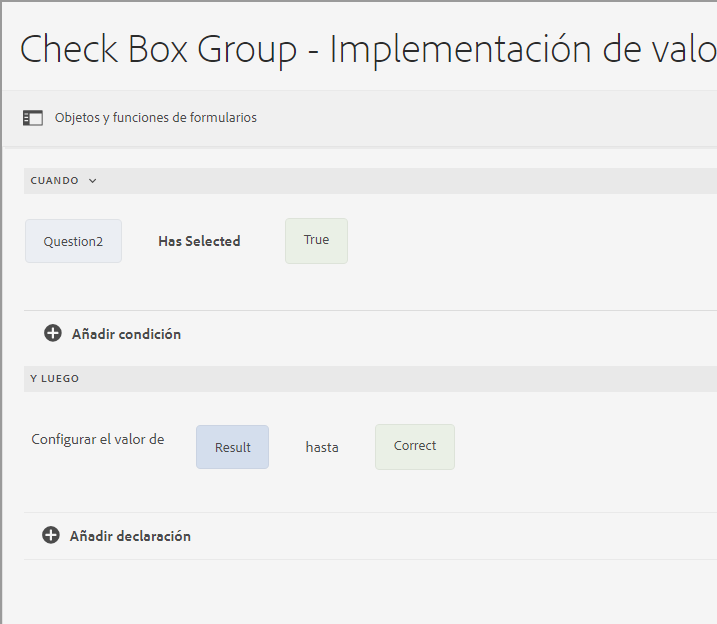

# Tipos de operadores y eventos en el editor de reglas de un formulario adaptable basado en componentes principales

En AEM Forms as a Cloud, el editor de reglas incluye varios tipos de operadores y eventos que le permiten definir y ejecutar condiciones y acciones complejas con facilidad.

Los tipos de operadores disponibles en el editor de reglas de un formulario adaptable proporcionan un marco sólido para construir condiciones precisas. Permiten manipular datos, realizar cálculos y combinar varias condiciones de una manera lógica y coherente. Tanto si compara valores como si realiza operaciones aritméticas o manipula cadenas, estos operadores garantizan que las reglas sean flexibles y eficaces.

Los eventos del editor de reglas sirven como déclencheur que activan las reglas. Definen las acciones específicas que se producen cuando se cumplen determinadas condiciones. Al aprovechar diferentes tipos de eventos, puede automatizar las respuestas a una amplia gama de escenarios, por ejemplo, interacciones de usuarios, horas programadas, cambios en los datos y estados del sistema. Con la capacidad de especificar estos déclencheur, puede crear reglas dinámicas y adaptables que se adapten a sus necesidades específicas.

Al comprender y utilizar los tipos de operadores y eventos disponibles, puede desbloquear todo el potencial del editor de reglas, lo que le permite crear reglas eficientes y efectivas que satisfagan sus necesidades únicas y mejoren la funcionalidad general del sistema.

## Tipos de operadores y eventos disponibles en el editor de reglas {#available-operator-types-and-events-in-rule-editor}

El editor de reglas proporciona los siguientes operadores lógicos y eventos mediante los cuales puede crear reglas.

* **Es igual a**: Comprueba si el objeto de formulario coincide con un valor especificado.
* **No es igual a**: comprueba si un objeto de formulario no coincide con un valor especificado.
* **Comienza con**: Comprueba si el objeto de formulario comienza con una cadena especificada.
* **Termina con**: comprueba si un objeto de formulario termina con una cadena especificada.
* **Contiene**: comprueba si un objeto de formulario incluye una subcadena especificada.
* **No contiene**: comprueba si un objeto de formulario no incluye una subcadena especificada.
* **Está vacío**: comprueba si el objeto de formulario está vacío o no se proporcionó.
* **No está vacío** - Comprueba si el objeto de formulario está presente y no está vacío.
* **Ha seleccionado**: devuelve el valor &quot;True&quot; cuando un usuario selecciona una casilla de verificación, una lista desplegable o una opción de botón de radio específicos.
* **Se ha inicializado (evento)** - Devuelve el valor verdadero cuando se procesa un objeto de formulario en el explorador.
* **Is Changed (event)**: devuelve el valor True cuando un usuario modifica el valor o la selección de un objeto de formulario.
* **Se hizo clic (evento)** - Devuelve el valor verdadero cuando un usuario hace clic en un objeto de formulario, por ejemplo, un botón. Un usuario puede [agregar varias condiciones al botón y hacer clic](/help/forms/rule-editor-core-components-usecases.md#set-focus-to-another-panel-on-button-click-if-the-first-panel-is-valid).
* **Es válido**: comprueba si un objeto de formulario cumple los criterios de validación.
* **No es válido** - Comprueba si un objeto de formulario falla en los criterios de validación.

<!--
* **Navigation(event):** Returns true when the user clicks a navigation object. Navigation objects are used to move between panels. 
* **Step Completion(event):** Returns true when a step of a rule completes.
* **Successful Submission(event):** Returns true on successful submission of data to a form data model.
* **Error in Submission(event):**  Returns true on unsuccessful submission of data to a form data model. -->

### Tipos de reglas disponibles en el editor de reglas {#available-rule-types-in-rule-editor}

El editor de reglas proporciona un conjunto de tipos de reglas predefinidas que puede utilizar para escribir reglas. Veamos en detalle cada tipo de regla. Para obtener más información sobre cómo escribir reglas en el editor de reglas, consulte [Escribir reglas](/help/forms/rule-editor-core-components-user-interface.md#write-rules).

#### [!UICONTROL When] {#whenruletype}

El tipo de regla **[!UICONTROL When]** sigue a la construcción de regla **condición-acción-acción alternativa** o, a veces, solo a la construcción **condición-acción**. En este tipo de regla, primero debe especificar una condición para la evaluación seguida de una acción que se activará si se cumple la condición (`True`). Al usar el tipo de regla When, puede usar varios operadores AND y OR para crear [expresiones anidadas](/help/forms/rule-editor-core-components-usecases.md#nested-expressions).

Con el tipo de regla When, se puede evaluar una condición en un objeto de formulario y realizar acciones en uno o varios objetos.

En palabras simples, una regla When típica está estructurada de la siguiente manera:

`When on Object A:`

`(Condition 1 AND Condition 2 OR Condition 3) is TRUE;`

`Then, do the following:`

`Action 2 on Object B;`
`AND`
`Action 3 on Object C;`

`Else, do the following:`

`Action 2 on Object C;`

Cuando tiene un componente de varios valores, como botones de opción o lista, mientras crea una regla para ese componente, las opciones se recuperan automáticamente y se ponen a disposición del creador de reglas. No es necesario volver a escribir los valores de las opciones.

Por ejemplo, una lista tiene cuatro opciones: rojo, azul, verde y amarillo. Al crear la regla, las opciones (botones de opción) se recuperan automáticamente y se ponen a disposición del creador de reglas de la siguiente manera:

Al escribir una regla When, puede activar la acción Clear Value Of. La acción Clear Value Of borra el valor del objeto especificado. Contar con Clear Value Of como opción en la instrucción When permite crear condiciones complejas con varios campos. Puede agregar la instrucción Else para agregar más condiciones

>[!NOTE]
>
> Cuando el tipo de regla solo admite instrucciones de un solo nivel then-else.

##### Varios campos permitidos en [!UICONTROL When] {#allowed-multiple-fields}

En la condición **When**, tiene la opción de agregar otros campos aparte del campo al que se aplica la regla.

Por ejemplo, con el tipo de regla When, puede evaluar una condición en diferentes objetos de formulario y realizar la acción:

Cuándo:

(Objeto A, condición 1)

Y/O

(Objeto B Condición 2)

A continuación, haga lo siguiente:

Acción 1 en el objeto A

_

**Consideraciones al usar campos múltiples permitidos en la función de condición When**

* Asegúrese de que el componente principal [está configurado en la versión 3.0.14 o posterior](https://github.com/adobe/aem-core-forms-components) para usar esta característica en el editor de reglas.
* Si las reglas se aplican a diferentes campos dentro de la condición When, la regla entra en déclencheur aunque solo se cambie uno de esos campos.
* Solo puede agregar los campos múltiples en la condición **When** para una regla **AND**. No es posible para una regla **OR**.

>[!NOTE]
>
> Para agregar varias condiciones que incluyan un clic en un botón, asegúrese de que el evento de clic en el botón se coloque como primera condición. Por ejemplo, `When button is clicked AND text input equals '5'` es válido, mientras que `When text input equals '5' AND button is clicked` no es compatible.

<!--
* It is not possible to add multiple fields in the When condition while applying rules to a button.

##### To enable Allowed Multiple fields in When condition feature

Allowed Multiple fields in When condition feature is disabled by default. To enable this feature, add a custom property at the template policy:

1. Open the corresponding template associated with an Adaptive Form in the template editor.
1. Select the existing policy as **formcontainer-policy**.
1. Navigate to the **[!UICONTROL Structure]**  view and, from the **[!UICONTROL Allowed Components]** list, open the **[!UICONTROL Adaptive Forms Container]** policy.
1. Go to the **[!UICONTROL Custom Properties]** tab and to add a custom property, click **[!UICONTROL Add]**.
1. Specify the **Group Name** of your choice. For example, in our case, we added the group name as **allowedfeature**.
1. Add the **key** and **value** pair as follows:
   * key: fd:changeEventBehaviour
   * value: deps
1. Click **[!UICONTROL Done]**. -->

Si los campos múltiples permitidos en la función de condición When encuentran algún problema, siga los pasos de solución de problemas como:

1. Abra el formulario en modo de edición. 
1. Abra el Explorador de contenido y seleccione el componente **[!UICONTROL Contenedor de guía]** de su formulario adaptable.
1. Haga clic en el icono de propiedades del contenedor de guía . Se abre el cuadro de diálogo Contenedor de formulario adaptable.
1. Haga clic en Listo y vuelva a guardar el cuadro de diálogo.

**[!UICONTROL Hide]**. Oculta el objeto especificado.

**[!UICONTROL Show]**. Muestra el objeto especificado.

**[!UICONTROL Enable]**. Habilita el objeto especificado.

**[!UICONTROL Disable]**. Deshabilita el objeto especificado.

**[!UICONTROL Invoke service]**. Invoca un servicio configurado en un modelo de datos de formulario (FDM). Al elegir la operación Invocar un servicio, aparece un campo. Al pulsar el campo, se muestran todos los servicios configurados en todos los modelos de datos de formulario de la instancia de [!DNL Experience Manager]. Al elegir un servicio del Modelo de datos de formulario, aparecen más campos en los que se pueden asignar objetos de formulario con parámetros de entrada para el servicio especificado. Puede asignar los parámetros de salida a través de la opción de carga útil de evento para el servicio especificado. También puede crear reglas para gestionar las respuestas de éxito y error de la operación Invocar servicio con el editor de reglas.

>[!NOTE]
>
> Para obtener más información acerca del servicio Invocar, [haga clic aquí](/help/forms/invoke-service-enhancements-rule-editor.md).

Consulte la regla de ejemplo para invocar los servicios del Modelo de datos de formulario (FDM).

Además del servicio de modelo de datos de formulario, puede especificar una URL de WSDL directa para invocar un servicio web. Sin embargo, un servicio de modelo de datos de formulario tiene muchas ventajas y es el método recomendado para invocar un servicio.

Para obtener más información sobre la configuración de servicios en el modelo de datos de formulario (FDM), consulte integración de datos de [[!DNL Experience Manager Forms] &#x200B;](data-integration.md).

**[!UICONTROL Establecer valor de]** Calcula y establece el valor del objeto especificado. Puede establecer el valor del objeto en una cadena, el valor de otro objeto, el valor calculado mediante una expresión o función matemática, el valor de una propiedad de un objeto o el valor de salida de un servicio configurado de modelo de datos de formulario. Al elegir la opción de servicio web, se muestran todos los servicios configurados en todos los modelos de datos de formulario de la instancia de [!DNL Experience Manager]. Al elegir un servicio del modelo de datos de formulario, aparecen más campos en los que se pueden asignar objetos de formulario con parámetros de entrada y salida para el servicio especificado.

Para obtener más información sobre la configuración de servicios en el modelo de datos de formulario (FDM), consulte integración de datos de [[!DNL Experience Manager Forms] &#x200B;](data-integration.md).

El tipo de regla **[!UICONTROL Establecer propiedad]** permite establecer el valor de una propiedad del objeto especificado en función de una acción de condición. Puede establecer la propiedad en una de las siguientes opciones:

* visible (booleano)
* label.value (String)
* label.visible (booleano)
* description (cadena)
* habilitado (booleano)
* readOnly (booleano)
* obligatorio (booleano)
* screenReaderText (String)
* válido (booleano)
* errorMessage (Cadena)
* predeterminado (número, cadena, fecha)
* enumNames (String[])
* chartType (Cadena)

Por ejemplo, permite definir reglas para mostrar el cuadro de texto cuando se hace clic en un botón. Puede utilizar una función personalizada, un objeto de formulario, una propiedad de objeto o una salida de servicio para definir una regla.

Para definir una regla basada en una función personalizada, seleccione **[!UICONTROL Salida de función]** en la lista desplegable y arrastre y suelte una función personalizada desde la pestaña **[!UICONTROL Funciones]**. Si se cumple la acción de condición, el cuadro de entrada de texto se vuelve visible.

Para definir una regla basada en un objeto de formulario, seleccione **[!UICONTROL Objeto de formulario]** en la lista desplegable y arrastre y suelte un objeto de formulario desde la pestaña **[!UICONTROL Objetos de formulario]**. Si se cumple la acción de condición, el cuadro de entrada de texto se vuelve visible en el formulario adaptable.

La regla Set Property basada en una propiedad de objeto permite hacer visible el cuadro de entrada de texto en un formulario adaptable basándose en otra propiedad de objeto incluida en el formulario adaptable.

En la siguiente figura se muestra un ejemplo de cómo habilitar dinámicamente la casilla de verificación en función de cómo se oculta o se muestra un cuadro de texto en un formulario adaptable:

**[!UICONTROL Clear Value Of]**. Borra el valor del objeto especificado.

**[!UICONTROL Set Focus]**. Define el enfoque del objeto especificado.

**[!UICONTROL Enviar formulario]** Envía el formulario.

**[!UICONTROL Restablecer]** Restablece el formulario o el objeto especificado.

**[!UICONTROL Validar]** Valida el formulario o el objeto especificado.

**[!UICONTROL Add Instance]**. Agrega una instancia del panel repetible o fila de tabla especificados.

**[!UICONTROL Remove Instance]**. Quita una instancia del panel repetible o fila de tabla especificados.

**[!UICONTROL Salida de función]** Define una regla basada en funciones predefinidas o personalizadas.

**[!UICONTROL Navegar a]** Navegar a otros Forms adaptables, otros recursos como imágenes o fragmentos de documento o una URL externa. <!-- For more information, see [Add button to the Interactive Communication](create-interactive-communication.md#addbuttontothewebchannel). -->

**[!UICONTROL Evento de envío]** almacena en Déclencheur las acciones o comportamientos específicos en función de condiciones o eventos predefinidos.

#### [!UICONTROL Set Value Of] {#set-value-of}

El tipo de regla **[!UICONTROL Fijar valor de]** le permite definir el valor de un objeto de formulario en función de si la condición especificada se cumple o no. El valor puede establecerse en un valor de otro objeto, una cadena literal, un valor derivado de una expresión matemática o una función, un valor de una propiedad de otro objeto o el resultado de un servicio de modelo de datos de formulario. Del mismo modo, se puede comprobar la existencia de una condición en un componente, una cadena, una propiedad o valores derivados de una función o expresión matemática.

El tipo de regla **Set Value Of** no está disponible para todos los objetos de formulario, como paneles y botones de la barra de herramientas. Una regla de valor definido estándar tiene la siguiente estructura:

Establezca el valor del objeto A en:

(Cadena ABC) O
(propiedad de objeto X del objeto C) O
(valor de una función) O
(valor de una expresión matemática) O
(valor de salida de un servicio del modelo de datos);

When (opcional):

(Condición 1 AND Condición 2 AND Condición 3) is TRUE;

El ejemplo siguiente selecciona el valor de `Question2` como `True` y establece el valor de `Result` como `correct`.

Ejemplo de la regla Set Value usando el servicio del modelo de datos de formulario.

#### [!UICONTROL Show] {#show}

Al usar el tipo de regla **[!UICONTROL Show]**, puede escribir una regla para mostrar u ocultar un objeto de formulario en función de si una condición se cumple o no. El tipo de regla Show también activa la acción Hide (ocultar) en caso de que la condición no se cumpla o devuelva un valor `False`.

Una regla Show típica se estructura de la siguiente manera:

`Show Object A;`

`When:`

`(Condition 1 OR Condition 2 OR Condition 3) is TRUE;`

`Else:`

`Hide Object A;`

#### [!UICONTROL Hide] {#hide}

Al igual que el tipo de regla Show, puede usar el tipo de regla **[!UICONTROL Hide]** para mostrar u ocultar un objeto de formulario en función de si se cumple o no una condición. El tipo de regla Hide también activa la acción Show (mostrar) en caso de que la condición no se cumpla o devuelva un valor `False`.

Una regla Hide típica se estructura de la siguiente manera:

`Hide Object A;`

`When:`

`(Condition 1 AND Condition 2 AND Condition 3) is TRUE;`

`Else:`

`Show Object A;`

#### [!UICONTROL Enable] {#enable}

El tipo de regla **[!UICONTROL Enable]** permite activar o desactivar un objeto de formulario en función de si se cumple o no una condición. El tipo de regla Enable también activa la acción Disable en caso de que la condición no se cumpla o devuelva un valor `False`.

Una regla Enable típica se estructura de la siguiente manera:

`Enable Object A;`

`When:`

`(Condition 1 AND Condition 2 AND Condition 3) is TRUE;`

`Else:`

`Disable Object A;`

#### [!UICONTROL Disable] {#disable}

Similar al tipo de regla Habilitar, el tipo de regla **[!UICONTROL Deshabilitar]** permite habilitar o deshabilitar un objeto de formulario en función de si se cumple o no una condición. El tipo de regla Disable también activa la acción Enable (habilitar) en caso de que la condición no se cumpla o devuelva un valor `False`.

Una regla Disable típica se estructura de la siguiente manera:

`Disable Object A;`

`When:`

`(Condition 1 OR Condition 2 OR Condition 3) is TRUE;`

`Else:`

`Enable Object A;`

#### [!UICONTROL Validate] {#validate}

El tipo de regla **[!UICONTROL Validate]** valida el valor de un campo mediante una expresión. Por ejemplo, puede escribir una expresión para comprobar que el cuadro de texto para especificar un nombre no contenga caracteres especiales ni números.

Una regla Validar típica se estructura de la siguiente manera:

`Validate Object A;`

`Using:`

`(Expression 1 AND Expression 2 AND Expression 3) is TRUE;`

>[!NOTE]
>
>Si el valor especificado no cumple la regla Validar, puede mostrar un mensaje de validación al usuario. Puede especificar la notificación en el **[!UICONTROL mensaje de validación del script]** en las propiedades del componente, en la barra lateral.

#### [!UICONTROL Desplazarse entre los paneles]

El tipo de regla **[!UICONTROL Desplazarse entre los paneles]** permite cambiar el enfoque entre los diferentes paneles de un formulario. Por ejemplo, puede crear una expresión para desplazar el enfoque al siguiente panel.

Una regla típica de **navegar entre los paneles** para cambiar el enfoque al siguiente panel se estructura de la siguiente manera:

`Navigate among the panels`

`Shift focus to the next item Object A;`

`When:`

`(Condition 1 OR Condition 2 OR Condition 3) is TRUE;`

Del mismo modo, puede escribir la regla **Desplazarse entre los paneles** para cambiar el enfoque al panel anterior:

`Navigate among the panels`

`Shift focus to the previous item Object A;`

`When:`

`(Condition 1 OR Condition 2 OR Condition 3) is TRUE;`

Para obtener más información sobre cómo crear una regla para navegar en un panel, [haga clic aquí](/help/forms/rule-editor-core-components-usecases.md#navigating-between-panels-using-buttons).

#### [!UICONTROL Llamada de función asincrónica]

 Esta es una función de versión preliminar y se puede acceder en el [canal de versión preliminar](https://experienceleague.adobe.com/docs/experience-manager-cloud-service/content/release-notes/prerelease.html?lang=es#new-features). 

El tipo de regla **[!UICONTROL Llamada de función asincrónica]** le permite ejecutar funciones asincrónicas. Permite iniciar una llamada a una función que funciona independientemente del subproceso de ejecución principal, lo que permite que otros procesos sigan ejecutándose sin esperar a que se complete la función asincrónica.

Una regla de llamada de función asincrónica típica para ejecutar una función asincrónica se estructura de la siguiente manera:

`When:`

`(Condition 1 OR Condition 2 OR Condition 3) is TRUE;`

`Async Function call`

`[Callback Function];`

Para obtener más información sobre cómo utilizar la llamada a la función asincrónica en el Editor de reglas visuales, consulte el artículo [Uso de llamadas a funciones asincrónicas en el editor de reglas](/help/forms/using-async-funct-in-rule-editor.md).

<!--
### [!UICONTROL Set Options Of] {#setoptionsof}

The **[!UICONTROL Set Options Of]** rule type enables you to define rules to add check boxes dynamically to the Adaptive Form. You can use a Form Data Model or a custom function to define the rule.

To define a rule based on a custom function, select **[!UICONTROL Function Output]** from the drop-down list, and drag-and-drop a custom function from the **[!UICONTROL Functions]** tab. The number of checkboxes defined in the custom function are added to the Adaptive Form.

To create a custom function, see [custom functions in rule editor](#custom-functions).

To define a rule based on a form data model:

1. Select **[!UICONTROL Service Output]** from the drop-down list.
1. Select the data model object.
1. Select a data model object property from the **[!UICONTROL Display Value]** drop-down list. The number of checkboxes in the Adaptive Form is derived from the number of instances defined for that property in the database.
1. Select a data model object property from the **[!UICONTROL Save Value]** drop-down list.

 -->

## Siguiente paso

Ahora vamos a entender varios [ejemplos de un editor de reglas para un formulario adaptable basado en componentes principales](/help/forms/rule-editor-core-components-usecases.md).

## Ver también

{{see-also-rule-editor}}
